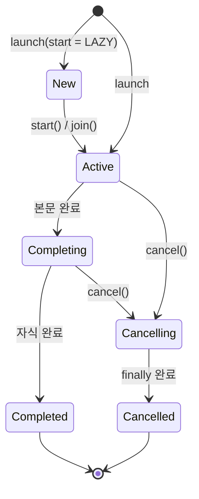
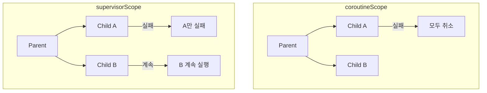

## Coroutine Builder

- **coroutine builder**는 새로운 coroutine을 생성하고 시작하는 함수입니다.
    - 일반 함수에서 `suspend` 함수를 호출할 수 있는 진입점 역할을 합니다.
    - 모든 coroutine은 builder를 통해 시작됩니다.

- Kotlin의 대표적인 coroutine builder는 `launch`, `async`, `runBlocking`입니다.
    - `launch` : 결과를 반환하지 않는 coroutine을 시작하고 `Job`을 반환합니다.
    - `async` : 결과를 반환하는 coroutine을 시작하고 `Deferred<T>`를 반환합니다.
    - `runBlocking` : 현재 thread를 blocking하며 coroutine을 실행합니다.

```kotlin
fun main() = runBlocking {
    val job = launch {
        delay(1000)
        println("launch completed")
    }

    val deferred = async {
        delay(500)
        "async result"
    }

    println(deferred.await())
    job.join()
}
```


### Coroutine Builder 선택 Guide

- 작업의 특성에 따라 적절한 builder를 선택합니다.

| Builder | 반환 type | 용도 | Thread Blocking |
| --- | --- | --- | --- |
| `launch` | `Job` | 결과가 필요 없는 작업 | No |
| `async` | `Deferred<T>` | 결과가 필요한 작업 | No |
| `runBlocking` | `T` | test, `main` 함수 진입점 | Yes |


---


## launch

- **`launch`**는 결과를 반환하지 않는 coroutine을 시작합니다.
    - "fire and forget" 패턴에 적합합니다.
    - `Job` 객체를 반환하여 coroutine의 lifecycle을 제어합니다.

```kotlin
fun main() = runBlocking {
    val job = launch {
        println("Coroutine started")
        delay(1000)
        println("Coroutine completed")
    }

    println("Main continues")
    job.join()  // coroutine 완료 대기
}
```


### Job

- **`Job`**은 coroutine의 lifecycle을 나타내는 객체입니다.
    - coroutine의 상태 확인, 취소, 완료 대기가 가능합니다.

```kotlin
val job: Job = launch {
    // coroutine 본문
}

// 상태 확인
job.isActive     // 실행 중인지
job.isCompleted  // 완료되었는지
job.isCancelled  // 취소되었는지

// 제어
job.join()       // 완료 대기
job.cancel()     // 취소
job.cancelAndJoin()  // 취소 후 완료 대기
```


### Job의 상태

- `Job`은 생성부터 완료까지 여러 상태를 거칩니다.
    - `New`, `Active`, `Completing`, `Completed`, `Cancelling`, `Cancelled` 상태가 있습니다.



| 상태 | `isActive` | `isCompleted` | `isCancelled` |
| --- | --- | --- | --- |
| `New` | `false` | `false` | `false` |
| `Active` | `true` | `false` | `false` |
| `Completing` | `true` | `false` | `false` |
| `Completed` | `false` | `true` | `false` |
| `Cancelling` | `false` | `false` | `true` |
| `Cancelled` | `false` | `true` | `true` |


### launch의 Start Option

- `CoroutineStart` parameter로 시작 동작을 제어합니다.

```kotlin
// 즉시 시작 (기본값)
launch(start = CoroutineStart.DEFAULT) { }

// 지연 시작 (명시적으로 start() 호출 필요)
val lazyJob = launch(start = CoroutineStart.LAZY) {
    println("Started lazily")
}
lazyJob.start()  // 또는 lazyJob.join()

// 원자적 시작 (취소 불가 상태로 시작)
launch(start = CoroutineStart.ATOMIC) { }

// 현재 thread에서 즉시 시작
launch(start = CoroutineStart.UNDISPATCHED) { }
```

| Option | 동작 |
| --- | --- |
| `DEFAULT` | 즉시 scheduling, 취소 가능 |
| `LAZY` | `start()` 또는 `join()` 호출 시 시작 |
| `ATOMIC` | 즉시 시작, 첫 suspension point까지 취소 불가 |
| `UNDISPATCHED` | 현재 thread에서 첫 suspension point까지 즉시 실행 |


---


## async

- **`async`**는 결과를 반환하는 coroutine을 시작합니다.
    - `Deferred<T>` 객체를 반환합니다.
    - `await()`를 호출하여 결과를 받습니다.

```kotlin
fun main() = runBlocking {
    val deferred: Deferred<String> = async {
        delay(1000)
        "Hello, Async!"
    }

    println("Waiting for result...")
    val result = deferred.await()  // 결과 대기
    println(result)
}
```


### Deferred

- **`Deferred<T>`**는 `Job`을 확장한 interface로, 미래의 결과값을 나타냅니다.
    - `Job`의 모든 기능을 포함합니다.
    - 추가로 `await()`로 결과를 받을 수 있습니다.

```kotlin
val deferred: Deferred<Int> = async {
    calculateValue()
}

// Job의 기능 사용 가능
deferred.isActive
deferred.cancel()
deferred.join()

// 결과 획득
val result: Int = deferred.await()

// 결과 확인 (완료된 경우에만)
val completed: Int? = deferred.getCompleted()
val completionException: Throwable? = deferred.getCompletionExceptionOrNull()
```


### async로 병렬 처리

- 여러 `async`를 동시에 시작하여 병렬 처리를 구현합니다.

```kotlin
suspend fun loadDashboard(userId: Long): Dashboard = coroutineScope {
    // 세 작업이 동시에 시작
    val userDeferred = async { fetchUser(userId) }
    val ordersDeferred = async { fetchOrders(userId) }
    val settingsDeferred = async { fetchSettings(userId) }

    // 모든 결과를 조합
    Dashboard(
        user = userDeferred.await(),
        orders = ordersDeferred.await(),
        settings = settingsDeferred.await()
    )
}
```



```mermaid
gantt
    title 병렬 실행 Timeline
    dateFormat X
    axisFormat %s

    section 순차 실행
    fetchUser     : 0, 1
    fetchOrders   : 2
    fetchSettings : 3

    section 병렬 실행
    fetchUser     : 0, 1
    fetchOrders   : 0, 1
    fetchSettings : 0, 1
```

- 순차 실행은 3초, 병렬 실행은 1초가 소요됩니다.


### async의 Lazy Start

- `start = CoroutineStart.LAZY` option으로 lazy start(지연 시작)가 가능합니다.

```kotlin
val deferred = async(start = CoroutineStart.LAZY) {
    println("Computing...")
    calculateExpensiveValue()
}

// 필요할 때 시작
if (needValue) {
    val result = deferred.await()  // 여기서 시작됨
}
```


### async 사용 시 주의 사항

- `async`를 사용하고 `await()`를 호출하지 않으면 `exception`이 무시됩니다.

```kotlin
// 나쁜 예 : exception이 무시됨
fun main() = runBlocking {
    val deferred = async {
        throw RuntimeException("Error!")
    }
    delay(1000)
    println("Main completed")  // exception 발생 안 함
}

// 좋은 예 : exception 처리
fun main() = runBlocking {
    val deferred = async {
        throw RuntimeException("Error!")
    }
    try {
        deferred.await()  // 여기서 exception throw
    } catch (e: RuntimeException) {
        println("Caught: ${e.message}")
    }
}
```


---


## runBlocking

- **`runBlocking`**은 현재 thread를 blocking하면서 coroutine을 실행합니다.
    - 일반 함수와 coroutine 세계를 연결하는 bridge 역할을 합니다.
    - coroutine이 완료될 때까지 현재 thread가 대기합니다.

```kotlin
fun main() = runBlocking {
    // 여기서부터 coroutine 세계
    launch {
        delay(1000)
        println("World!")
    }
    println("Hello,")
}
```


### runBlocking의 용도

- **`main` 함수 진입점** : application 시작 시 coroutine 환경 구성에 사용합니다.

```kotlin
fun main() = runBlocking {
    val result = async { fetchData() }
    println(result.await())
}
```

- **test code** : test에서 `suspend` 함수를 호출할 때 사용합니다.

```kotlin
@Test
fun testFetchUser() = runBlocking {
    val user = fetchUser(1L)
    assertEquals("John", user.name)
}
```

- **legacy code 통합** : `callback` 기반 API에서 coroutine을 사용할 때 bridge로 사용합니다.

```kotlin
fun legacyCallback(callback: (String) -> Unit) {
    val result = runBlocking {
        fetchDataSuspend()
    }
    callback(result)
}
```


### runBlocking 사용 시 주의 사항

- **production code에서 사용을 지양**합니다.
    - thread를 blocking하므로 성능 저하를 유발합니다.
    - main thread에서 사용 시 UI freeze가 발생합니다.

```kotlin
// 나쁜 예 : Android main thread에서 사용
fun onButtonClick() {
    runBlocking {  // UI freeze!
        val data = fetchData()
        updateUI(data)
    }
}

// 좋은 예 : CoroutineScope 사용
fun onButtonClick() {
    viewModelScope.launch {
        val data = fetchData()
        updateUI(data)
    }
}
```

- **중첩 사용 금지** : `runBlocking` 내부에서 다시 `runBlocking`을 호출하면 deadlock 위험이 있습니다.

```kotlin
// 위험 : deadlock 가능
fun main() = runBlocking {
    runBlocking {  // 중첩 사용 금지
        delay(1000)
    }
}
```


---


## coroutineScope

- **`coroutineScope`**는 새로운 `CoroutineScope`를 생성하는 `suspend` 함수입니다.
    - builder가 아니라 `suspend` 함수이지만, scope 생성 용도로 함께 사용됩니다.
    - 모든 자식 coroutine이 완료될 때까지 대기합니다.

```kotlin
suspend fun loadUserData(userId: Long): UserData = coroutineScope {
    val user = async { fetchUser(userId) }
    val friends = async { fetchFriends(userId) }

    UserData(user.await(), friends.await())
}
```


### coroutineScope vs runBlocking

- 두 함수는 모두 coroutine을 실행하지만, thread blocking 여부와 호출 가능 위치가 다릅니다.

| 항목 | `coroutineScope` | `runBlocking` |
| --- | --- | --- |
| 함수 type | `suspend` 함수 | 일반 함수 |
| Thread blocking | No | Yes |
| 호출 위치 | coroutine 내부 | 어디서나 |
| 용도 | 병렬 작업 grouping | coroutine 진입점 |

```kotlin
// coroutineScope : thread를 blocking하지 않음
suspend fun parallelSum(): Int = coroutineScope {
    val one = async { computeOne() }
    val two = async { computeTwo() }
    one.await() + two.await()
}

// runBlocking : thread를 blocking함
fun blockingSum(): Int = runBlocking {
    val one = async { computeOne() }
    val two = async { computeTwo() }
    one.await() + two.await()
}
```


### Structured Concurrency

- `coroutineScope`는 structured concurrency를 보장합니다.
    - 자식 coroutine이 실패하면 다른 자식도 취소됩니다.
    - 모든 자식이 완료되어야 scope가 종료됩니다.

```kotlin
suspend fun fetchData() = coroutineScope {
    val data1 = async { fetchFromSource1() }  // 실패 시
    val data2 = async { fetchFromSource2() }  // 자동 취소

    Pair(data1.await(), data2.await())
}
```


---


## supervisorScope

- **`supervisorScope`**는 자식의 실패가 다른 자식에게 전파되지 않는 scope입니다.
    - 독립적인 작업들을 병렬로 실행할 때 사용합니다.
    - 하나의 실패가 전체 작업을 취소하지 않습니다.

```kotlin
suspend fun fetchMultipleData() = supervisorScope {
    val data1 = async { fetchFromSource1() }  // 실패해도
    val data2 = async { fetchFromSource2() }  // 계속 실행

    val result1 = runCatching { data1.await() }
    val result2 = runCatching { data2.await() }

    Pair(result1, result2)
}
```


### coroutineScope vs supervisorScope

- 두 scope는 자식 coroutine 실패 시 동작이 다릅니다.



| 항목 | `coroutineScope` | `supervisorScope` |
| --- | --- | --- |
| 자식 실패 시 | 모든 자식 취소 | 실패한 자식만 종료 |
| 용도 | 의존적인 작업 | 독립적인 작업 |
| Exception 전파 | 즉시 전파 | 개별 처리 필요 |


---


## withContext

- **`withContext`**는 coroutine의 context를 전환하는 `suspend` 함수입니다.
    - 주로 dispatcher 전환에 사용됩니다.
    - block의 결과를 반환합니다.

```kotlin
suspend fun fetchAndProcess(): Result {
    // I/O dispatcher에서 data fetch
    val data = withContext(Dispatchers.IO) {
        api.fetchData()
    }

    // Default dispatcher에서 data 처리
    val processed = withContext(Dispatchers.Default) {
        processData(data)
    }

    return processed
}
```


### withContext vs launch

- `withContext`는 순차적으로 실행되고 결과를 반환합니다.
- `launch`는 병렬로 실행되고 `Job`을 반환합니다.

```kotlin
suspend fun example() = coroutineScope {
    // 순차 실행 : 2초 소요
    val result1 = withContext(Dispatchers.IO) {
        delay(1000)
        "Result 1"
    }
    val result2 = withContext(Dispatchers.IO) {
        delay(1000)
        "Result 2"
    }

    // 병렬 실행 : 1초 소요
    val deferred1 = async(Dispatchers.IO) { delay(1000); "Result 1" }
    val deferred2 = async(Dispatchers.IO) { delay(1000); "Result 2" }
    val parallel1 = deferred1.await()
    val parallel2 = deferred2.await()
}
```


---


## 실전 예제

- 실무에서는 병렬 처리, 부분 실패 허용, 순차와 병렬 조합 등 다양한 pattern을 사용합니다.
    - 각 상황에 맞는 builder와 scope를 선택하여 효율적인 비동기 처리를 구현합니다.


### 병렬 API 호출 후 조합

- 여러 API를 동시에 호출하고 모든 결과를 조합합니다.

```kotlin
suspend fun loadDashboard(userId: Long): Dashboard = coroutineScope {
    val userDeferred = async(Dispatchers.IO) { userApi.getUser(userId) }
    val ordersDeferred = async(Dispatchers.IO) { orderApi.getOrders(userId) }
    val notificationsDeferred = async(Dispatchers.IO) { notificationApi.getUnread(userId) }

    Dashboard(
        user = userDeferred.await(),
        orders = ordersDeferred.await(),
        notifications = notificationsDeferred.await()
    )
}
```


### 일부 실패를 허용하는 병렬 처리

- `supervisorScope`와 `runCatching`을 조합하여 일부 실패를 허용합니다.

```kotlin
suspend fun fetchAllSources(): List<Result<Data>> = supervisorScope {
    val sources = listOf(source1, source2, source3)

    sources.map { source ->
        async {
            runCatching { source.fetch() }
        }
    }.awaitAll()
}
```


### 순차 실행과 병렬 실행 조합

- 의존 관계가 있는 작업은 순차로, 독립적인 작업은 병렬로 실행합니다.

```kotlin
suspend fun processOrder(orderId: Long): OrderResult = coroutineScope {
    // 1. 순차 : 주문 정보 조회
    val order = withContext(Dispatchers.IO) {
        orderRepository.findById(orderId)
    }

    // 2. 병렬 : 재고 확인과 결제 정보 조회
    val stockDeferred = async(Dispatchers.IO) { stockService.check(order) }
    val paymentDeferred = async(Dispatchers.IO) { paymentService.getInfo(order) }

    val stock = stockDeferred.await()
    val payment = paymentDeferred.await()

    // 3. 순차 : 결제 처리
    val paymentResult = withContext(Dispatchers.IO) {
        paymentService.process(payment, order)
    }

    OrderResult(order, stock, paymentResult)
}
```


---


## Reference

- <https://kotlinlang.org/docs/coroutines-basics.html>
- <https://kotlinlang.org/docs/composing-suspending-functions.html>
- <https://kotlinlang.org/docs/coroutine-context-and-dispatchers.html>

