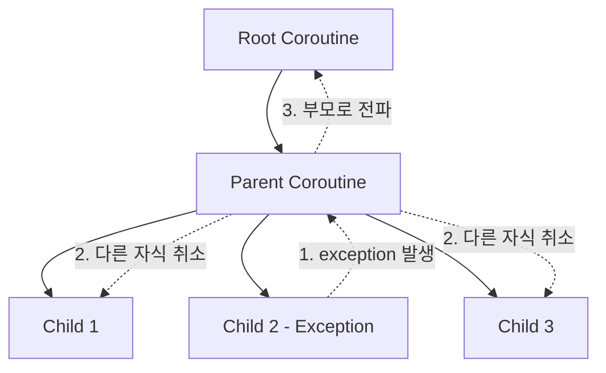
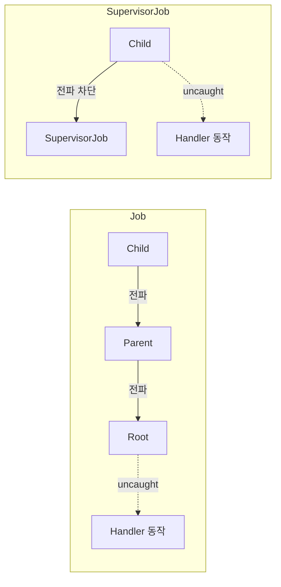
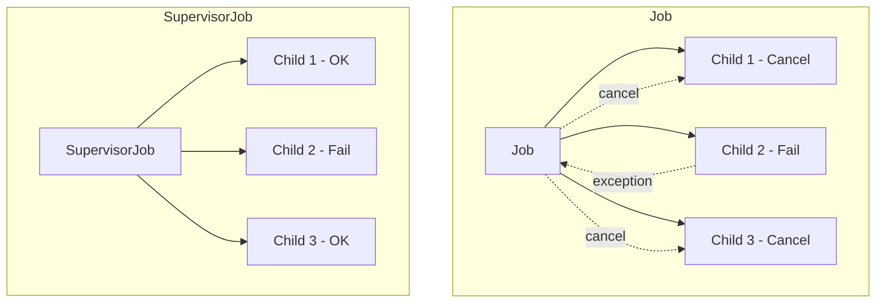

## Exception 전파

- coroutine의 exception은 **structured concurrency** 원칙에 따라 전파됩니다.
    - 자식 coroutine의 exception은 부모로 전파됩니다.
    - 부모는 다른 자식들을 취소한 후 자신도 취소됩니다.
    - 최상위까지 전파되면 uncaught exception으로 처리됩니다.

```kotlin
fun main() = runBlocking {
    launch {
        launch {
            throw RuntimeException("Error!")
            // 이 exception은 부모로 전파됨
        }
        delay(1000)
        println("This won't be printed")
    }
    delay(2000)
    println("This also won't be printed")
}
```


### Exception 전파 흐름

- exception이 발생하면 계층 구조를 따라 전파됩니다.




### launch vs async의 Exception 처리

- **`launch`**의 exception은 즉시 전파됩니다.
- **`async`**의 exception은 `await()` 호출 시 발생합니다.

```kotlin
fun main() = runBlocking {
    // launch : 즉시 전파
    val job = launch {
        throw RuntimeException("launch exception")
    }

    // async : await()에서 발생
    val deferred = async {
        throw RuntimeException("async exception")
    }

    try {
        deferred.await()  // 여기서 exception 발생
    } catch (e: RuntimeException) {
        println("Caught: ${e.message}")
    }
}
```


---


## CoroutineExceptionHandler

- **CoroutineExceptionHandler**는 uncaught exception을 처리하는 context element입니다.
    - exception을 복구하는 것이 아니라 logging이나 알림 용도로 사용합니다.

```kotlin
val handler = CoroutineExceptionHandler { _, exception ->
    println("Caught: ${exception.message}")
}

fun main() = runBlocking {
    val scope = CoroutineScope(Job() + handler)

    scope.launch {
        throw RuntimeException("Error!")
    }

    delay(1000)
}
// 출력 : Caught: Error!
```


### Handler 동작 원칙

- handler는 **uncaught exception에서만 동작**합니다.
    - exception이 부모로 전파되면, 자식 입장에서는 exception이 "처리된" 것으로 간주됩니다.
    - 더 이상 전파할 부모가 없을 때, exception이 uncaught 상태가 됩니다.

- uncaught 상태가 되는 위치는 coroutine 계층 구조에 따라 달라집니다.
    - 일반 `Job` : exception이 root까지 전파되므로, root coroutine에서 uncaught 상태가 됩니다.
    - `SupervisorJob` : exception이 부모로 전파되지 않으므로, 해당 coroutine에서 uncaught 상태가 됩니다.

- handler는 uncaught 상태가 되는 위치에 설치해야 동작합니다.




### Handler 설치 위치

- handler는 uncaught 상태가 되는 coroutine에 설치해야 동작합니다.
    - 일반 `Job` 계층에서는 root coroutine에 설치합니다.
    - `SupervisorJob`에서 `launch`한 coroutine에는 개별적으로 설치합니다.

```kotlin
val handler = CoroutineExceptionHandler { _, e ->
    println("Handled: ${e.message}")
}

fun main() = runBlocking {
    // 효과 없음 : 자식에 설치
    launch {
        launch(handler) {  // handler 무시됨
            throw RuntimeException("Error")
        }
    }
}
```

```kotlin
val handler = CoroutineExceptionHandler { _, e ->
    println("Handled: ${e.message}")
}

fun main() = runBlocking {
    val scope = CoroutineScope(SupervisorJob() + handler)

    // 효과 있음 : root coroutine에 설치
    scope.launch {
        throw RuntimeException("Error")
    }

    delay(1000)
}
// 출력 : Handled: Error
```


### Handler와 runBlocking

- `runBlocking`은 handler를 무시합니다.
    - `runBlocking`은 exception을 직접 rethrow합니다.

```kotlin
val handler = CoroutineExceptionHandler { _, e ->
    println("Handled: ${e.message}")
}

fun main() {
    try {
        runBlocking(handler) {
            throw RuntimeException("Error")
        }
    } catch (e: RuntimeException) {
        println("Caught in main: ${e.message}")
    }
}
// 출력 : Caught in main: Error (handler는 호출되지 않음)
```


---


## SupervisorJob

- **SupervisorJob**은 자식의 실패가 다른 자식에게 전파되지 않는 Job입니다.
    - 일반 Job은 자식 실패 시 모든 자식을 취소합니다.
    - `SupervisorJob`은 실패한 자식만 취소됩니다.

```kotlin
fun main() = runBlocking {
    val supervisor = SupervisorJob()
    val scope = CoroutineScope(coroutineContext + supervisor)

    val child1 = scope.launch {
        println("Child 1 started")
        delay(1000)
        println("Child 1 completed")
    }

    val child2 = scope.launch {
        println("Child 2 started")
        throw RuntimeException("Child 2 failed")
    }

    delay(2000)
    println("Child 1 active: ${child1.isActive}")  // true
}
// 출력 : Child 1 started, Child 2 started, Child 1 completed, Child 1 active: false
```


### Job vs SupervisorJob

- 두 Job의 exception 전파 방식이 다릅니다.

| 항목 | Job | SupervisorJob |
| --- | --- | --- |
| 자식 실패 시 | 모든 자식 취소 | 해당 자식만 취소 |
| Exception 전파 | 부모로 전파 | 부모로 전파되지 않음 |
| 사용 사례 | 전체 성공/실패 | 부분 실패 허용 |




---


## supervisorScope

- **`supervisorScope`**는 `SupervisorJob`을 가진 scope를 생성합니다.
    - 자식의 실패가 다른 자식에게 영향을 주지 않습니다.
    - `coroutineScope`와 달리 부분 실패를 허용합니다.

```kotlin
suspend fun fetchAllData(): List<Result<Data>> = supervisorScope {
    val results = listOf(
        async { api.fetchData1() },
        async { api.fetchData2() },  // 실패해도
        async { api.fetchData3() }   // 계속 실행
    )

    results.map { deferred ->
        runCatching { deferred.await() }
    }
}
```


### coroutineScope vs supervisorScope

- 두 함수의 exception 처리 방식이 다릅니다.

```kotlin
// coroutineScope : 하나 실패하면 전체 취소
suspend fun fetchWithCoroutineScope() = coroutineScope {
    val a = async { fetchA() }
    val b = async { throw RuntimeException() }  // 실패
    val c = async { fetchC() }  // 취소됨

    // RuntimeException이 rethrow됨
    Triple(a.await(), b.await(), c.await())
}

// supervisorScope : 실패한 것만 처리
suspend fun fetchWithSupervisorScope() = supervisorScope {
    val a = async { fetchA() }
    val b = async { throw RuntimeException() }
    val c = async { fetchC() }  // 계속 실행

    Triple(
        runCatching { a.await() },
        runCatching { b.await() },  // failure
        runCatching { c.await() }
    )
}
```


### supervisorScope의 Exception 처리

- `supervisorScope` 내에서 exception은 handler로 처리하거나 개별 catch해야 합니다.

```kotlin
val handler = CoroutineExceptionHandler { _, e ->
    println("Handled: ${e.message}")
}

suspend fun example() = supervisorScope {
    // handler는 launch에서만 동작
    launch(handler) {
        throw RuntimeException("Error in launch")
    }

    // async는 await()에서 catch
    val deferred = async {
        throw RuntimeException("Error in async")
    }

    try {
        deferred.await()
    } catch (e: RuntimeException) {
        println("Caught async: ${e.message}")
    }
}
```


---


## try-catch

- 일반 code와 동일하게 `try-catch`를 사용합니다.


### Suspend 함수에서 try-catch

- `suspend` 함수 내부에서 exception을 catch합니다.

```kotlin
suspend fun fetchUser(id: Long): User? {
    return try {
        api.getUser(id)
    } catch (e: IOException) {
        null
    }
}
```


### Coroutine Builder에서 try-catch

- `launch` 내부에서 직접 catch합니다.

```kotlin
launch {
    try {
        riskyOperation()
    } catch (e: Exception) {
        println("Caught: ${e.message}")
    }
}
```


### async에서 try-catch

- `async`는 `await()` 호출 시 exception을 catch합니다.

```kotlin
val deferred = async {
    throw RuntimeException("Error!")
}

try {
    deferred.await()
} catch (e: RuntimeException) {
    println("Caught: ${e.message}")
}
```


### 주의 사항 : launch 외부의 try-catch

- `launch` 외부에서 try-catch는 exception을 잡지 못합니다.
    - `launch`는 coroutine을 시작만 하고 즉시 반환합니다.

```kotlin
// 잘못된 예 : exception을 잡지 못함
try {
    launch {
        throw RuntimeException("Error!")
    }
} catch (e: RuntimeException) {
    println("This won't be printed")
}

// 올바른 예 : launch 내부에서 catch
launch {
    try {
        throw RuntimeException("Error!")
    } catch (e: RuntimeException) {
        println("Caught: ${e.message}")
    }
}
```


---


## Cancellation과 Exception

- **CancellationException**은 특별하게 처리됩니다.
    - 취소는 정상적인 종료로 간주됩니다.
    - `CancellationException`은 부모로 전파되지 않습니다.


### CancellationException

- coroutine이 취소되면 `CancellationException`이 발생합니다.

```kotlin
val job = launch {
    try {
        repeat(1000) { i ->
            println("Working $i")
            delay(100)
        }
    } catch (e: CancellationException) {
        println("Cancelled!")
        throw e  // 반드시 rethrow
    }
}

delay(350)
job.cancel()
// 출력 : Working 0, Working 1, Working 2, Cancelled!
```


### CancellationException을 삼키지 않기

- `CancellationException`을 catch하면 반드시 rethrow해야 합니다.
    - 삼키면 cancellation이 전파되지 않습니다.

```kotlin
// 잘못된 예 : cancellation 삼킴
launch {
    try {
        delay(1000)
    } catch (e: Exception) {
        // CancellationException도 여기서 잡힘
        println("Caught: $e")
        // rethrow 안 하면 취소되지 않음
    }
    println("Still running!")  // 실행됨
}

// 올바른 예
launch {
    try {
        delay(1000)
    } catch (e: CancellationException) {
        println("Cancelled")
        throw e
    } catch (e: Exception) {
        println("Other error: $e")
    }
}
```


### Exception vs Cancellation

- 일반 exception과 cancellation을 구분해야 합니다.

| 항목 | Exception | CancellationException |
| --- | --- | --- |
| 의미 | 오류 발생 | 정상 취소 |
| 부모 전파 | 전파됨 | 전파되지 않음 |
| 형제 영향 | 형제 취소 | 형제 영향 없음 |


---


## 여러 Exception 처리

- 여러 coroutine에서 동시에 exception이 발생할 수 있습니다.


### Exception Aggregation

- 첫 번째 exception만 rethrow되고, 나머지는 `suppressed`로 첨부됩니다.

```kotlin
fun main() = runBlocking {
    val handler = CoroutineExceptionHandler { _, e ->
        println("Caught: ${e.message}")
        e.suppressed.forEach {
            println("Suppressed: ${it.message}")
        }
    }

    val scope = CoroutineScope(SupervisorJob() + handler)

    scope.launch {
        launch {
            delay(100)
            throw RuntimeException("First")
        }
        launch {
            delay(200)
            throw RuntimeException("Second")
        }
    }

    delay(1000)
}
// Caught: First
// Suppressed: Second
```


### finally와 Resource 정리

- `finally` block에서 resource를 정리합니다.
    - exception이나 cancellation 상관없이 실행됩니다.

```kotlin
suspend fun processFile(path: String) {
    val file = openFile(path)
    try {
        processContent(file)
    } finally {
        file.close()  // 항상 실행
    }
}
```


### NonCancellable에서 정리

- 취소된 coroutine의 `finally`에서 suspend 함수를 호출하려면 `NonCancellable`을 사용합니다.

```kotlin
val job = launch {
    try {
        repeat(1000) {
            delay(100)
            println("Working $it")
        }
    } finally {
        // 취소된 상태에서도 suspend 함수 호출 가능
        withContext(NonCancellable) {
            delay(100)
            println("Cleanup completed")
        }
    }
}

delay(350)
job.cancelAndJoin()
```


---


## 실전 예제

- retry, `Result` type 활용, 병렬 작업의 부분 실패 처리 등 실무에서 자주 사용하는 exception 처리 pattern입니다.


### Retry 구현

- 실패 시 재시도하는 pattern입니다.

```kotlin
suspend fun <T> retry(
    times: Int = 3,
    initialDelay: Long = 100,
    factor: Double = 2.0,
    block: suspend () -> T
): T {
    var currentDelay = initialDelay
    repeat(times - 1) { attempt ->
        try {
            return block()
        } catch (e: Exception) {
            println("Attempt ${attempt + 1} failed: ${e.message}")
        }
        delay(currentDelay)
        currentDelay = (currentDelay * factor).toLong()
    }
    return block()  // 마지막 시도 (실패 시 exception 전파)
}

// 사용
suspend fun fetchData(): Data = retry(times = 3) {
    api.fetchData()
}
```


### Result Type 활용

- `runCatching`으로 exception을 `Result`로 감싸서, `onSuccess`와 `onFailure`로 분기 처리합니다.

```kotlin
suspend fun fetchUserSafely(id: Long): Result<User> {
    return runCatching {
        api.getUser(id)
    }
}

// 사용
val result = fetchUserSafely(123)
result.onSuccess { user ->
    updateUI(user)
}.onFailure { error ->
    showError(error.message)
}
```


### 병렬 작업의 부분 실패 처리

- 일부 작업 실패를 허용하면서 결과를 수집합니다.

```kotlin
suspend fun fetchAllUsers(ids: List<Long>): Map<Long, Result<User>> = supervisorScope {
    ids.map { id ->
        id to async {
            runCatching { api.getUser(id) }
        }
    }.associate { (id, deferred) ->
        id to deferred.await()
    }
}

// 사용
val results = fetchAllUsers(listOf(1, 2, 3))
results.forEach { (id, result) ->
    result.onSuccess { println("User $id: $it") }
          .onFailure { println("User $id failed: ${it.message}") }
}
```


### Global Exception Handler

- application 전역 exception handler를 설정합니다.

```kotlin
class MyApplication : Application() {
    private val exceptionHandler = CoroutineExceptionHandler { _, throwable ->
        Log.e("CoroutineError", "Uncaught exception", throwable)
        crashReporter.report(throwable)
    }

    val applicationScope = CoroutineScope(
        SupervisorJob() + Dispatchers.Default + exceptionHandler
    )
}

// 사용
applicationScope.launch {
    // uncaught exception은 handler에서 처리
    performBackgroundTask()
}
```


### Flow Exception 처리

- `Flow`에서 exception을 처리하는 pattern입니다.

```kotlin
fun userFlow(): Flow<User> = flow {
    emit(api.getUser())
}
.retry(3) { cause ->
    cause is IOException
}
.catch { e ->
    emit(User.DEFAULT)  // fallback
}
.onCompletion { cause ->
    if (cause != null) {
        analytics.logError(cause)
    }
}
```


---


## Reference

- <https://kotlinlang.org/docs/exception-handling.html>
- <https://kotlinlang.org/docs/cancellation-and-timeouts.html>

