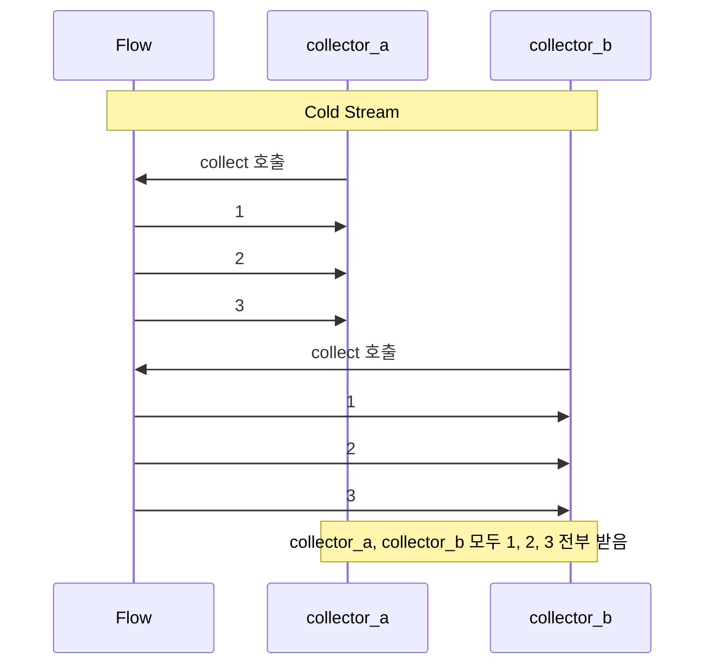
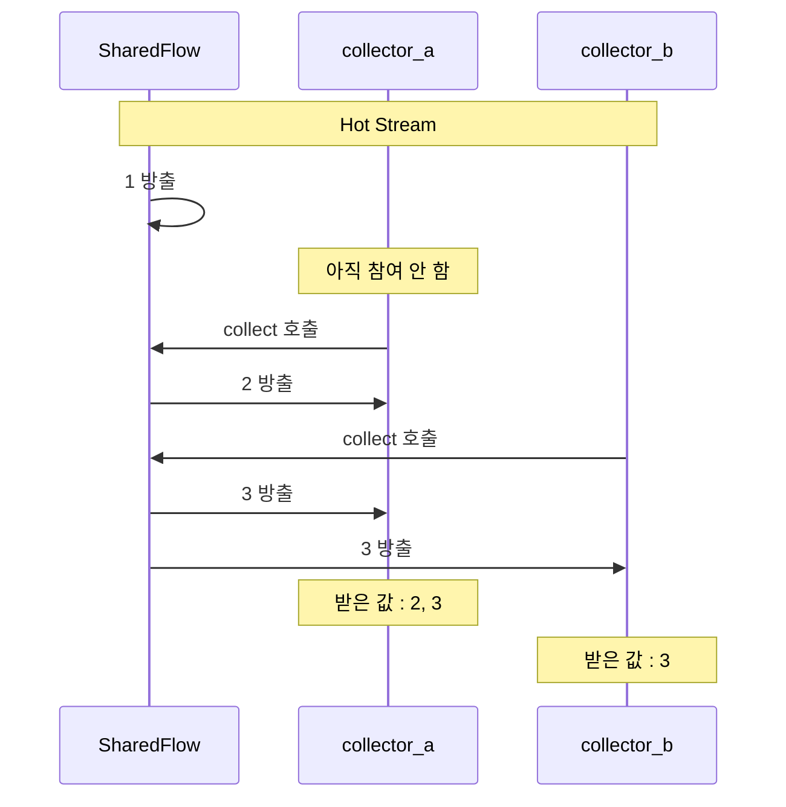
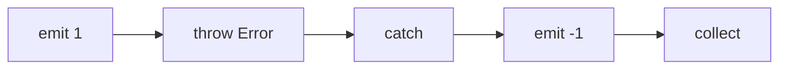

## Flow

- **flow**는 비동기적으로 계산되는 **data stream**입니다.
    - `suspend` 함수가 단일 값을 반환한다면, Flow는 여러 값을 순차적으로 방출합니다.
    - **cold stream**으로, collector가 있을 때만 값을 방출합니다.
        - collector는 `collect`를 호출하여 flow의 값을 수집하는 coroutine입니다.
    - reactive streams와 유사하지만 coroutine 기반으로 더 간단합니다.

```kotlin
fun numbersFlow(): Flow<Int> = flow {
    for (i in 1..3) {
        delay(100)
        emit(i)  // 값 방출
    }
}

suspend fun main() {
    numbersFlow().collect { value ->
        println(value)  // 1, 2, 3
    }
}
```


### Flow의 특성

- **cold stream** : collect가 호출될 때마다 flow block이 처음부터 실행됩니다.
- **sequential** : 값이 순차적으로 방출되고 처리됩니다.
- **cancellable** : collector가 취소되면 flow도 취소됩니다.

```kotlin
val coldFlow = flow {
    println("Flow started")
    emit(1)
    emit(2)
}

// 첫 번째 collect
coldFlow.collect { println(it) }
// 출력 : Flow started, 1, 2

// 두 번째 collect (다시 시작)
coldFlow.collect { println(it) }
// 출력 : Flow started, 1, 2
```


### Cold Stream vs Hot Stream

- **cold stream**은 collector가 collect를 호출할 때 값 생성을 시작합니다.
    - 각 collector가 독립적으로 모든 값을 처음부터 받습니다.
    - `flow { }`, `flowOf()`, `asFlow()`로 생성한 flow가 cold stream입니다.
- **hot stream**은 collector 유무와 관계없이 값을 방출합니다.
    - 여러 collector가 같은 stream을 공유하고, 참여한 시점부터 값을 받습니다.
    - `StateFlow`, `SharedFlow`가 hot stream입니다.






---


## Flow vs Sequence

- `Sequence`와 `Flow`는 모두 lazy하게 값을 생성하지만 **동기/비동기** 차이가 있습니다.

| 항목 | Sequence | Flow |
| --- | --- | --- |
| 실행 방식 | 동기 (blocking) | 비동기 (suspending) |
| 사용 context | 일반 함수 | suspend 함수/coroutine |
| 중단 | 불가능 | 가능 (suspend) |
| thread | 호출 thread | dispatcher에 따라 다름 |

```kotlin
// sequence : 동기, blocking
fun numbersSequence(): Sequence<Int> = sequence {
    for (i in 1..3) {
        Thread.sleep(100)  // blocking
        yield(i)
    }
}

// flow : 비동기, non-blocking
fun numbersFlow(): Flow<Int> = flow {
    for (i in 1..3) {
        delay(100)  // suspending
        emit(i)
    }
}
```


---


## Flow Builder

- `flow { }`, `flowOf()`, `asFlow()`, `callbackFlow { }`로 flow를 생성합니다.


### flow { }

- **`flow`** builder는 가장 기본적인 flow 생성 방법입니다.
    - `emit()`으로 값을 방출합니다.
    - block 내부에서 `suspend` 함수를 호출할 수 있습니다.

```kotlin
fun userFlow(ids: List<Long>): Flow<User> = flow {
    for (id in ids) {
        val user = userApi.fetchUser(id)  // suspend 함수
        emit(user)
    }
}
```


### flowOf

- **`flowOf`**는 고정된 값들로 flow를 생성합니다.

```kotlin
val numbersFlow = flowOf(1, 2, 3, 4, 5)

numbersFlow.collect { println(it) }  // 1, 2, 3, 4, 5
```


### asFlow

- **`asFlow`**는 collection이나 sequence를 flow로 변환합니다.

```kotlin
// List를 Flow로
listOf(1, 2, 3).asFlow()
    .collect { println(it) }

// Range를 Flow로
(1..5).asFlow()
    .collect { println(it) }

// Sequence를 Flow로
sequenceOf("a", "b", "c").asFlow()
    .collect { println(it) }
```


### callbackFlow

- **`callbackFlow`**는 callback 기반 API를 flow로 변환합니다.
    - `trySend()`로 값을 방출합니다.
    - `awaitClose`로 cleanup logic을 정의합니다.

```kotlin
fun locationUpdates(): Flow<Location> = callbackFlow {
    val callback = object : LocationCallback() {
        override fun onLocationResult(result: LocationResult) {
            trySend(result.lastLocation)
        }
    }

    locationClient.requestLocationUpdates(request, callback, Looper.getMainLooper())

    awaitClose {
        locationClient.removeLocationUpdates(callback)
    }
}
```


---


## Intermediate Operator

- **intermediate operator**는 flow를 변환하여 새로운 flow를 반환합니다.
    - `map`, `filter`, `transform`, `take`, `drop` 등이 intermediate operator입니다.
    - operator 자체는 suspend 함수가 아니므로 즉시 반환됩니다.
    - 실제 처리는 terminal operator가 호출될 때 수행됩니다.


### map

- **`map`**은 각 값을 변환합니다.

```kotlin
(1..5).asFlow()
    .map { it * 2 }
    .collect { println(it) }  // 2, 4, 6, 8, 10
```


### filter

- **`filter`**는 조건에 맞는 값만 통과시킵니다.

```kotlin
(1..10).asFlow()
    .filter { it % 2 == 0 }
    .collect { println(it) }  // 2, 4, 6, 8, 10
```


### transform

- **`transform`**은 각 값에 대해 임의의 변환을 수행합니다.
    - `emit()`을 여러 번 호출하거나 호출하지 않을 수 있습니다.

```kotlin
(1..3).asFlow()
    .transform { value ->
        emit("Processing $value")
        emit(value * 10)
    }
    .collect { println(it) }
// 출력 : Processing 1, 10, Processing 2, 20, Processing 3, 30
```


### take

- **`take`**는 처음 N개의 값만 취합니다.
    - N개 수집 후 flow가 취소됩니다.

```kotlin
(1..100).asFlow()
    .take(3)
    .collect { println(it) }  // 1, 2, 3
```


### drop

- **`drop`**은 처음 N개의 값을 건너뜁니다.

```kotlin
(1..5).asFlow()
    .drop(2)
    .collect { println(it) }  // 3, 4, 5
```


### distinctUntilChanged

- **`distinctUntilChanged`**는 연속으로 중복되는 값을 제거합니다.

```kotlin
flowOf(1, 1, 2, 2, 2, 3, 1)
    .distinctUntilChanged()
    .collect { println(it) }  // 1, 2, 3, 1
```


---


## Terminal Operator

- **terminal operator**는 flow의 수집을 시작하는 suspend 함수입니다.
    - `collect`, `toList`, `first`, `reduce`, `fold` 등이 terminal operator입니다.
    - flow는 terminal operator가 호출되어야 실제로 실행됩니다.


### collect

- **`collect`**는 가장 기본적인 terminal operator입니다.
    - 모든 값을 수집하여 lambda에서 처리합니다.

```kotlin
flowOf(1, 2, 3)
    .collect { value ->
        println("Received: $value")
    }
```


### toList / toSet

- **`toList`**, **`toSet`**은 모든 값을 collection으로 수집합니다.

```kotlin
val list = flowOf(1, 2, 3).toList()  // [1, 2, 3]
val set = flowOf(1, 2, 2, 3).toSet()  // [1, 2, 3]
```


### first / firstOrNull

- **`first`**는 첫 번째 값을 반환합니다.
    - flow가 비어있으면 `NoSuchElementException`이 발생합니다.
    - **`firstOrNull`**은 비어있으면 `null`을 반환합니다.

```kotlin
val first = flowOf(1, 2, 3).first()  // 1
val firstEven = flowOf(1, 2, 3).first { it % 2 == 0 }  // 2

val empty = emptyFlow<Int>().firstOrNull()  // null
```


### single / singleOrNull

- **`single`**은 정확히 하나의 값이 있을 때 반환합니다.
    - 비어있거나 두 개 이상이면 exception이 발생합니다.

```kotlin
val single = flowOf(42).single()  // 42
// flowOf(1, 2).single()  // IllegalArgumentException
```


### reduce / fold

- **`reduce`**는 값들을 누적하여 단일 결과를 생성합니다.
- **`fold`**는 초기값을 지정하여 누적합니다.

```kotlin
val sum = (1..5).asFlow()
    .reduce { acc, value -> acc + value }  // 15

val sumWithInitial = (1..5).asFlow()
    .fold(100) { acc, value -> acc + value }  // 115
```


### count

- **`count`**는 값의 개수를 반환합니다.

```kotlin
val count = (1..10).asFlow()
    .filter { it % 2 == 0 }
    .count()  // 5
```


---


## Flow Context

- flow는 **context preservation** 원칙을 따릅니다.
    - 한국어로는 "맥락 보존" 또는 "실행 환경 보존" 등으로 번역할 수 있습니다.
    - flow builder 내부 code는 collector의 context에서 실행됩니다.
    - `flowOn`으로 upstream의 context를 변경합니다.


### flowOn

- **`flowOn`**은 upstream flow의 실행 context를 변경합니다.
    - `flowOn` 위의 operator들이 지정된 dispatcher에서 실행됩니다.

```kotlin
fun dataFlow(): Flow<Data> = flow {
    // Dispatchers.IO에서 실행
    val data = api.fetchData()
    emit(data)
}.flowOn(Dispatchers.IO)

// collector는 원래 context에서 실행
viewModelScope.launch {
    dataFlow()
        .map { transform(it) }  // Main에서 실행
        .collect { updateUI(it) }  // Main에서 실행
}
```


### Context Preservation

- context preservation는 "맥락 보존" 또는 "실행 환경 보존" 등으로 번역할 수 있습니다.

- flow block 내부에서 직접 context를 변경하면 exception이 발생합니다.
    - 반드시 `flowOn`을 사용해야 합니다.

```kotlin
// 잘못된 예
flow {
    withContext(Dispatchers.IO) {  // IllegalStateException
        emit(fetchData())
    }
}

// 올바른 예
flow {
    emit(fetchData())
}.flowOn(Dispatchers.IO)
```


---


## Buffer와 Conflation

- producer가 값을 방출하는 속도가 consumer가 처리하는 속도보다 빠르면 **backpressure**가 발생합니다.
    - `buffer`와 `conflate`는 이 속도 차이를 처리하는 operator입니다.


### buffer

- **`buffer`**는 emission과 collection을 별도 coroutine에서 실행합니다.
    - emission이 빠르고 collection이 느릴 때 처리량을 높입니다.

```kotlin
flow {
    for (i in 1..3) {
        delay(100)  // 100ms마다 emit
        emit(i)
    }
}
.buffer()  // buffer 추가
.collect { value ->
    delay(300)  // 300ms 처리 시간
    println(value)
}
// buffer 없이 : 약 1200ms (100+300)*3
// buffer 사용 : 약 1000ms (병렬 처리)
```


### conflate

- **`conflate`**는 중간 값을 건너뛰고 최신 값만 처리합니다.
    - collector가 느릴 때 오래된 값을 skip합니다.

```kotlin
flow {
    for (i in 1..5) {
        delay(100)
        emit(i)
    }
}
.conflate()
.collect { value ->
    delay(300)
    println(value)
}
// 출력 : 1, 3, 5 (2, 4는 skip)
```


### collectLatest

- **`collectLatest`**는 새 값이 오면 이전 처리를 취소합니다.
    - 항상 최신 값만 처리해야 할 때 사용합니다.

```kotlin
flow {
    emit("a")
    delay(100)
    emit("b")
    delay(100)
    emit("c")
}
.collectLatest { value ->
    println("Processing $value")
    delay(200)  // 처리 중 새 값이 오면 취소
    println("Done $value")
}
// 출력 : Processing a, Processing b, Processing c, Done c
```


---


## 여러 Flow 결합

- 두 개 이상의 flow를 하나로 합치거나, 각 값에서 새로운 flow를 생성하여 병합합니다.
    - `zip`, `combine`은 두 flow를 결합하고, `flatMap` 계열은 값마다 flow를 생성합니다.


### zip

- **`zip`**은 두 flow의 값을 쌍으로 결합합니다.
    - 짧은 flow가 끝나면 종료됩니다.

```kotlin
val nums = flowOf(1, 2, 3)
val strs = flowOf("a", "b", "c")

nums.zip(strs) { num, str -> "$num$str" }
    .collect { println(it) }  // 1a, 2b, 3c
```


### combine

- **`combine`**은 두 flow의 최신 값을 결합합니다.
    - 어느 flow든 새 값이 오면 결합이 발생합니다.

```kotlin
val flow1 = flowOf(1, 2).onEach { delay(100) }
val flow2 = flowOf("a", "b", "c").onEach { delay(150) }

flow1.combine(flow2) { num, str -> "$num$str" }
    .collect { println(it) }
// 출력 순서는 timing에 따라 다름
// 예 : 1a, 2a, 2b, 2c
```


### flatMapConcat

- **`flatMapConcat`**은 각 값에 대해 새 flow를 생성하고 순차적으로 수집합니다.

```kotlin
(1..3).asFlow()
    .flatMapConcat { value ->
        flow {
            emit("$value: First")
            delay(100)
            emit("$value: Second")
        }
    }
    .collect { println(it) }
// 1: First, 1: Second, 2: First, 2: Second, 3: First, 3: Second
```


### flatMapMerge

- **`flatMapMerge`**는 여러 flow를 동시에 수집합니다.
    - `concurrency` parameter로 동시 수집 수를 제한합니다.

```kotlin
(1..3).asFlow()
    .flatMapMerge { value ->
        flow {
            emit("$value: First")
            delay(100)
            emit("$value: Second")
        }
    }
    .collect { println(it) }
// 1: First, 2: First, 3: First, 1: Second, 2: Second, 3: Second
```


### flatMapLatest

- **`flatMapLatest`**는 새 값이 오면 이전 flow를 취소합니다.

```kotlin
(1..3).asFlow()
    .onEach { delay(100) }
    .flatMapLatest { value ->
        flow {
            emit("$value: First")
            delay(150)
            emit("$value: Second")  // 이전 값은 여기 도달 전 취소
        }
    }
    .collect { println(it) }
// 1: First, 2: First, 3: First, 3: Second
```


---


## Flow Exception 처리

- flow의 emission이나 collection 과정에서 exception이 발생할 수 있습니다.
    - `try-catch`, `catch` operator, `onCompletion`으로 처리합니다.


### try-catch

- collector에서 `try-catch`로 exception을 처리합니다.

```kotlin
try {
    flow {
        emit(1)
        throw RuntimeException("Error")
    }.collect { println(it) }
} catch (e: RuntimeException) {
    println("Caught: $e")
}
```


### catch operator

- **`catch`** operator는 upstream의 exception을 처리합니다.
    - `catch` 이전의 operator에서 발생한 exception만 처리합니다.

```kotlin
flow {
    emit(1)
    throw RuntimeException("Error")
}
.catch { e -> emit(-1) }  // error 시 -1 방출
.collect { println(it) }  // 1, -1
```




### onCompletion

- **`onCompletion`**은 flow가 완료될 때 실행됩니다.
    - 정상 완료와 exception 완료 모두에서 호출됩니다.

```kotlin
flowOf(1, 2, 3)
    .onCompletion { cause ->
        if (cause != null) {
            println("Flow failed: $cause")
        } else {
            println("Flow completed")
        }
    }
    .collect { println(it) }
// 1, 2, 3, Flow completed
```


---


## StateFlow와 SharedFlow

- **`StateFlow`**와 **`SharedFlow`**는 **hot stream**입니다.
    - collector 유무와 관계없이 값을 유지하거나 방출합니다.


### StateFlow

- **`StateFlow`**는 현재 상태를 유지하는 observable holder입니다.
    - 항상 현재 값을 가지고 있습니다.
    - 새 collector는 즉시 현재 값을 받습니다.

```kotlin
class CounterViewModel : ViewModel() {
    private val _count = MutableStateFlow(0)
    val count: StateFlow<Int> = _count.asStateFlow()

    fun increment() {
        _count.value++
    }
}

// UI에서 수집
viewModel.count.collect { count ->
    textView.text = count.toString()
}
```


### SharedFlow

- **`SharedFlow`**는 여러 collector에게 값을 broadcast합니다.
    - 초기값이 없으며 replay 설정이 가능합니다.

```kotlin
class EventBus {
    private val _events = MutableSharedFlow<Event>()
    val events: SharedFlow<Event> = _events.asSharedFlow()

    suspend fun emit(event: Event) {
        _events.emit(event)
    }
}
```


### Flow vs StateFlow vs SharedFlow

| 항목 | Flow | StateFlow | SharedFlow |
| --- | --- | --- | --- |
| Type | Cold | Hot | Hot |
| 초기값 | 없음 | 필수 | 없음 (replay 설정) |
| 상태 유지 | 없음 | 현재 값 | 설정에 따름 |
| 여러 collector | 각각 독립 | 공유 | 공유 |


---


## 실전 예제

- flow는 repository layer에서 cache와 network를 결합하거나, 검색에 debounce를 적용하는 등, **비동기적으로 발생하는 data의 stream을 처리할 때 자주 사용**됩니다.
    - data가 한 번에 끝나는 것이 아니라 **시간차를 두고 연속적으로 들어오는 상황**에 최적화되어 있습니다.


### Repository Layer

- cache를 먼저 방출하고, network에서 최신 data를 가져와 다시 방출하는 cache-then-network pattern입니다.

```kotlin
class UserRepository(
    private val api: UserApi,
    private val dao: UserDao
) {
    fun getUsers(): Flow<List<User>> = flow {
        // 1. cache 먼저 방출
        val cached = dao.getAll()
        emit(cached)

        // 2. network에서 fetch
        val fresh = api.getUsers()
        dao.insertAll(fresh)

        // 3. update된 data 방출
        emit(fresh)
    }.catch { e ->
        // network 실패 시 cache만 사용
        emit(dao.getAll())
    }
}
```


### Search with Debounce

- 사용자 입력이 멈춘 후 일정 시간이 지나면 검색을 실행하여 불필요한 API 호출을 방지합니다.

```kotlin
class SearchViewModel : ViewModel() {
    private val _query = MutableStateFlow("")

    val searchResults: Flow<List<Result>> = _query
        .debounce(300)  // 300ms 대기
        .filter { it.length >= 2 }  // 최소 2글자
        .distinctUntilChanged()
        .flatMapLatest { query ->
            repository.search(query)
        }
        .catch { emit(emptyList()) }

    fun onQueryChanged(query: String) {
        _query.value = query
    }
}
```


### Retry with Exponential Backoff

- 실패할 때마다 대기 시간을 2배로 늘려가며 재시도하여 server 부하를 줄입니다.

```kotlin
fun <T> Flow<T>.retryWithBackoff(
    maxRetries: Int = 3,
    initialDelay: Long = 100,
    factor: Double = 2.0
): Flow<T> = retryWhen { cause, attempt ->
    if (attempt < maxRetries && cause is IOException) {
        delay((initialDelay * factor.pow(attempt.toDouble())).toLong())
        true
    } else {
        false
    }
}

// 사용
api.fetchData()
    .retryWithBackoff(maxRetries = 3)
    .collect { data -> updateUI(data) }
```


---


## Reference

- <https://kotlinlang.org/docs/flow.html>
- <https://kotlinlang.org/api/kotlinx.coroutines/kotlinx-coroutines-core/kotlinx.coroutines.flow/-flow/>
- <https://developer.android.com/kotlin/flow>

