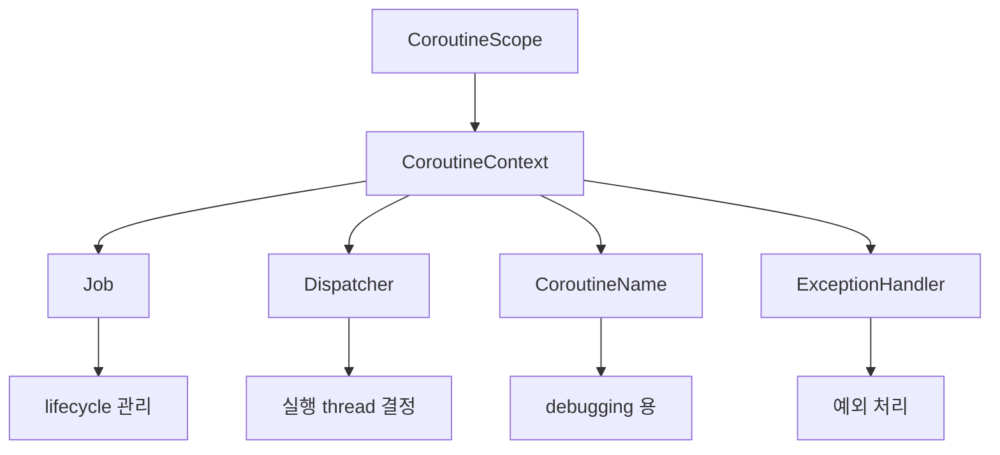
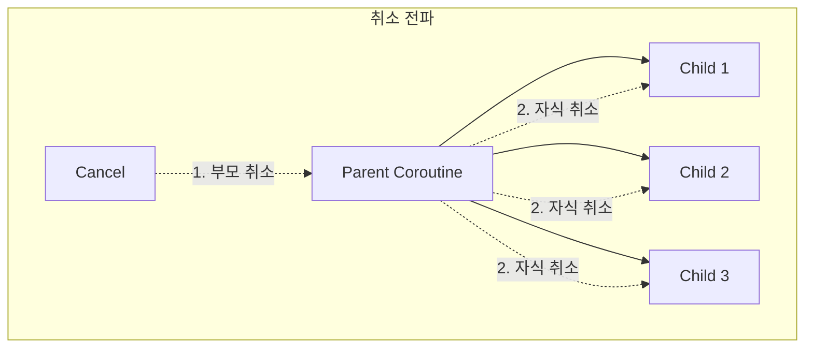
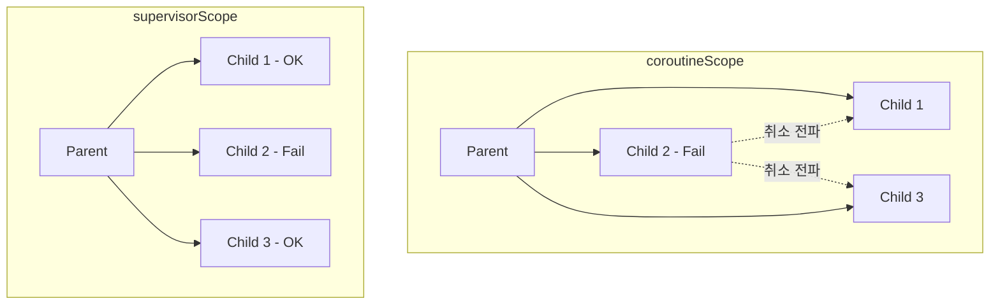
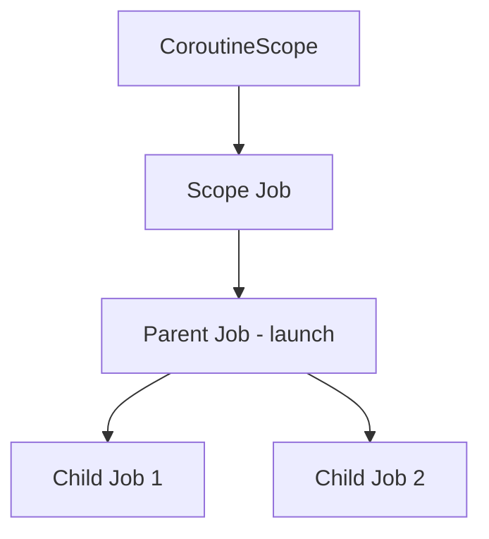

## CoroutineScope

- **CoroutineScope**는 coroutine의 lifecycle을 관리하는 범위입니다.
    - 모든 coroutine은 특정 scope 내에서 실행됩니다.
    - scope가 취소되면 내부의 모든 coroutine도 취소됩니다.
    - scope는 `CoroutineContext`를 보유하여 자식 coroutine에게 전파합니다.

```kotlin
val scope = CoroutineScope(Dispatchers.IO + Job())

scope.launch {
    // 이 coroutine은 scope에 종속됨
    val data = fetchData()
    processData(data)
}

// scope 취소 시 내부 coroutine도 모두 취소
scope.cancel()
```


### CoroutineScope의 구성 요소

- `CoroutineScope`는 `CoroutineContext`를 property로 가집니다.
    - `Job` : coroutine의 lifecycle을 관리합니다.
    - `Dispatcher` : coroutine이 실행될 thread를 결정합니다.
    - `CoroutineName` : debugging용 이름입니다.
    - `CoroutineExceptionHandler` : 예외 처리를 담당합니다.

```kotlin
val scope = CoroutineScope(
    Job() +
    Dispatchers.Default +
    CoroutineName("MyScope") +
    CoroutineExceptionHandler { _, e -> println("Error: $e") }
)
```




---


## Structured Concurrency

- **Structured Concurrency**는 coroutine의 lifecycle을 계층적으로 관리하는 원칙입니다.
    - 부모 coroutine은 모든 자식의 완료를 기다립니다.
    - 자식이 실패하면 부모와 형제도 취소됩니다.
    - 부모가 취소되면 모든 자식도 취소됩니다.

```kotlin
suspend fun fetchAllData() = coroutineScope {
    val users = async { fetchUsers() }      // 자식 1
    val products = async { fetchProducts() } // 자식 2

    // coroutineScope는 모든 자식이 완료될 때까지 대기
    Result(users.await(), products.await())
}
```


### Structured Concurrency의 장점

- **Memory leak 방지** : 부모가 취소되면 자식도 취소되어 누수가 없습니다.
- **예외 전파** : 자식의 실패가 부모에게 전파되어 전체 작업이 취소됩니다.
- **명확한 lifecycle** : coroutine의 시작과 종료가 scope 내에서 명확합니다.




### 비구조적 동시성과 비교

- **비구조적 동시성**(unstructured concurrency)은 coroutine이 독립적으로 실행됩니다.
    - `GlobalScope`나 독립적인 `CoroutineScope`를 사용하면 발생합니다.
    - lifecycle 관리가 어렵고 memory leak 위험이 있습니다.

```kotlin
// 비구조적 (권장하지 않음)
fun loadData() {
    GlobalScope.launch {
        // 호출자와 무관하게 실행됨
        // 취소되지 않아 memory leak 가능성
        val data = fetchData()
    }
}

// 구조적 (권장)
suspend fun loadData() = coroutineScope {
    launch {
        // 부모 scope에 종속
        // 부모 취소 시 함께 취소
        val data = fetchData()
    }
}
```


---


## coroutineScope 함수

- **`coroutineScope`** 함수는 새로운 scope를 생성하여 structured concurrency를 구현합니다.
    - 모든 자식 coroutine이 완료될 때까지 suspend됩니다.
    - 자식 coroutine이 실패하면 전체 scope가 취소됩니다.
    - `suspend` 함수 내에서 병렬 작업을 수행할 때 사용합니다.

```kotlin
suspend fun fetchUserWithDetails(userId: Long): UserDetails {
    return coroutineScope {
        val user = async { userApi.getUser(userId) }
        val friends = async { userApi.getFriends(userId) }
        val posts = async { postApi.getPostsByUser(userId) }

        UserDetails(
            user = user.await(),
            friends = friends.await(),
            posts = posts.await()
        )
    }
}
```


### coroutineScope의 예외 처리

- 자식 coroutine의 예외는 `coroutineScope`를 취소시킵니다.
    - 모든 자식이 취소된 후 예외가 rethrow됩니다.

```kotlin
suspend fun fetchData() = coroutineScope {
    val data1 = async { api.getData1() }
    val data2 = async { throw RuntimeException("Error!") }  // 실패

    // data2의 실패로 data1도 취소됨
    // RuntimeException이 rethrow됨
    data1.await() + data2.await()
}

// 호출자에서 예외 처리
suspend fun safelyFetchData(): Result {
    return try {
        fetchData()
    } catch (e: RuntimeException) {
        Result.failure(e)
    }
}
```


---


## supervisorScope 함수

- **`supervisorScope`**는 자식 coroutine의 실패가 다른 자식에게 영향을 주지 않습니다.
    - 하나의 자식이 실패해도 나머지 자식은 계속 실행됩니다.
    - 부분 실패를 허용하는 작업에 사용합니다.

```kotlin
suspend fun fetchMultipleData() = supervisorScope {
    val users = async { userApi.getUsers() }
    val products = async { productApi.getProducts() }  // 실패해도
    val orders = async { orderApi.getOrders() }        // 계속 실행

    // 각각 개별 처리
    val userResult = runCatching { users.await() }
    val productResult = runCatching { products.await() }
    val orderResult = runCatching { orders.await() }

    CombinedResult(userResult, productResult, orderResult)
}
```


### coroutineScope vs supervisorScope

- 두 함수의 예외 전파 방식이 다릅니다.

| 항목 | coroutineScope | supervisorScope |
| --- | --- | --- |
| 자식 실패 시 | 모든 자식 취소 | 해당 자식만 실패 |
| 예외 전파 | 부모로 즉시 전파 | 부모로 전파되지 않음 |
| 사용 사례 | 전체 성공/실패 필요 | 부분 실패 허용 |




---


## GlobalScope

- **`GlobalScope`**는 application 전체 lifecycle과 함께하는 최상위 scope입니다.
    - coroutine이 독립적으로 실행되어 structured concurrency를 따르지 않습니다.
    - **일반적인 application code에서는 사용을 권장하지 않습니다**.

```kotlin
// 권장하지 않음
fun badExample() {
    GlobalScope.launch {
        // application 전체 lifecycle
        // 취소 관리가 어려움
        performLongRunningTask()
    }
}
```


### GlobalScope 사용 시 문제점

- **Memory leak** : scope가 취소되지 않아 coroutine이 계속 실행될 수 있습니다.
- **Test 어려움** : 독립적으로 실행되어 test에서 제어하기 어렵습니다.
- **Lifecycle 불일치** : 화면 종료 후에도 작업이 계속될 수 있습니다.

```kotlin
class MyActivity : AppCompatActivity() {
    // 나쁜 예
    fun loadDataBad() {
        GlobalScope.launch {
            // Activity 종료 후에도 계속 실행
            val data = fetchData()
            textView.text = data  // crash 가능성
        }
    }

    // 좋은 예
    fun loadDataGood() {
        lifecycleScope.launch {
            // Activity lifecycle에 종속
            val data = fetchData()
            textView.text = data
        }
    }
}
```


### GlobalScope의 적절한 사용 사례

- application 전체에서 공유하는 **background 작업**에만 제한적으로 사용합니다.
    - logging, analytics 전송 등 결과를 기다리지 않는 fire-and-forget 작업입니다.

```kotlin
object Analytics {
    private val scope = CoroutineScope(
        SupervisorJob() + Dispatchers.IO
    )

    // GlobalScope 대신 명시적인 scope 사용 권장
    fun trackEvent(event: Event) {
        scope.launch {
            api.sendEvent(event)
        }
    }
}
```


---


## Custom CoroutineScope 생성

- 특정 lifecycle에 맞는 custom scope를 생성합니다.
    - `Job()` 또는 `SupervisorJob()`을 포함해야 합니다.
    - 사용이 끝나면 `cancel()`을 호출합니다.


### 기본 Custom Scope

- `Job()`과 `Dispatcher`를 조합하여 생성합니다.

```kotlin
class UserRepository {
    private val scope = CoroutineScope(
        Job() + Dispatchers.IO + CoroutineName("UserRepo")
    )

    fun fetchUsers() {
        scope.launch {
            val users = api.getUsers()
            cache.save(users)
        }
    }

    fun clear() {
        scope.cancel()  // 모든 coroutine 취소
    }
}
```


### SupervisorJob을 사용한 Scope

- `SupervisorJob()`을 사용하면 자식 실패가 다른 자식에게 영향을 주지 않습니다.

```kotlin
class DataSyncService {
    private val scope = CoroutineScope(
        SupervisorJob() + Dispatchers.IO
    )

    fun syncAll() {
        scope.launch { syncUsers() }     // 실패해도
        scope.launch { syncProducts() }  // 다른 작업 계속
        scope.launch { syncOrders() }
    }

    fun stop() {
        scope.cancel()
    }
}
```


### ViewModel에서의 Scope

- Android에서는 `viewModelScope`를 사용합니다.
    - ViewModel이 clear될 때 자동으로 취소됩니다.

```kotlin
class UserViewModel : ViewModel() {
    // viewModelScope는 ViewModel에서 제공
    fun loadUser(userId: Long) {
        viewModelScope.launch {
            val user = repository.getUser(userId)
            _userState.value = user
        }
    }
}
```


---


## Job과 자식 관계

- **Job**은 coroutine의 lifecycle을 나타내며 부모-자식 관계를 형성합니다.
    - 자식 Job은 부모 Job에 연결됩니다.
    - 부모-자식 관계가 structured concurrency의 기반입니다.


### Job 계층 구조

- `launch`나 `async`로 생성된 coroutine은 자동으로 부모의 자식이 됩니다.

```kotlin
val parentJob = scope.launch {
    // parentJob의 자식
    val childJob1 = launch { task1() }
    val childJob2 = launch { task2() }

    println(coroutineContext[Job]?.children?.count())  // 2
}
```




### 독립적인 Job 생성

- `Job()` parameter를 전달하면 부모-자식 관계를 끊을 수 있습니다.
    - **structured concurrency를 위반**하므로 주의가 필요합니다.

```kotlin
val scope = CoroutineScope(Job())

scope.launch {
    // 독립적인 Job 생성 (부모와 무관)
    launch(Job()) {
        // 부모가 취소되어도 계속 실행
        delay(10000)
        println("Independent job")
    }
}

scope.cancel()  // 위 coroutine은 취소되지 않음
```


---


## 실전 예제

- repository에서 자체 scope를 관리하거나, `supervisorScope`로 부분 실패를 허용하는 등 실무에서 자주 사용하는 pattern입니다.


### Repository Pattern

- repository class 내부에 `CoroutineScope`를 생성하여 cache 저장이나 prefetch 같은 background 작업을 수행합니다.

```kotlin
class UserRepository(
    private val api: UserApi,
    private val cache: UserCache,
    dispatcher: CoroutineDispatcher = Dispatchers.IO
) {
    private val scope = CoroutineScope(SupervisorJob() + dispatcher)

    suspend fun getUser(id: Long): User {
        return cache.get(id) ?: api.fetchUser(id).also {
            scope.launch { cache.save(it) }  // 비동기 cache 저장
        }
    }

    fun prefetch(ids: List<Long>) {
        ids.forEach { id ->
            scope.launch {
                runCatching { api.fetchUser(id) }
                    .onSuccess { cache.save(it) }
            }
        }
    }

    fun clear() {
        scope.cancel()
    }
}
```


### 병렬 요청과 부분 실패 처리

- 여러 API를 병렬 호출할 때 `supervisorScope`와 `runCatching`을 조합하여 일부 실패해도 나머지 결과를 반환합니다.

```kotlin
suspend fun fetchDashboard(): Dashboard = supervisorScope {
    val userDeferred = async { userApi.getCurrentUser() }
    val notificationsDeferred = async { notificationApi.getUnread() }
    val feedDeferred = async { feedApi.getLatest() }

    Dashboard(
        user = runCatching { userDeferred.await() }.getOrNull(),
        notifications = runCatching { notificationsDeferred.await() }
            .getOrDefault(emptyList()),
        feed = runCatching { feedDeferred.await() }
            .getOrDefault(emptyList())
    )
}
```


### Timeout 처리

- `withTimeoutOrNull`은 지정 시간 내에 완료되지 않으면 `null`을 반환하고, `withTimeout`은 `TimeoutCancellationException`을 발생시킵니다.

```kotlin
suspend fun fetchWithTimeout(): Data? {
    return withTimeoutOrNull(5000) {
        api.fetchData()
    }
}

suspend fun fetchWithTimeoutAndRetry(): Data {
    repeat(3) { attempt ->
        val result = withTimeoutOrNull(3000) {
            api.fetchData()
        }
        if (result != null) return result
        delay(1000 * (attempt + 1))
    }
    throw TimeoutException("Failed after 3 attempts")
}
```


---


## Reference

- <https://kotlinlang.org/docs/coroutines-basics.html>
- <https://kotlinlang.org/docs/coroutine-context-and-dispatchers.html>
- <https://kotlinlang.org/api/kotlinx.coroutines/kotlinx-coroutines-core/kotlinx.coroutines/-coroutine-scope/>

