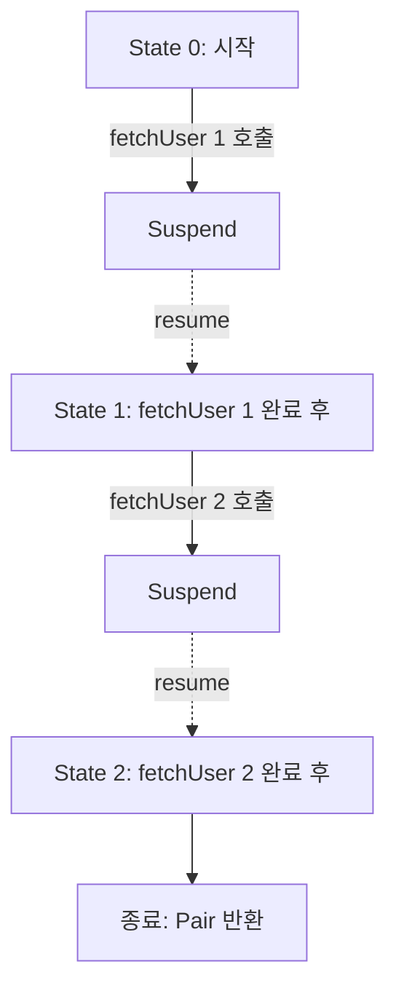

## Suspend 함수

- **suspend 함수**는 실행을 일시 중지(suspend)하고 나중에 재개(resume)할 수 있는 함수입니다.
    - `suspend` keyword를 함수 선언에 추가합니다.
    - 비동기 작업을 동기 code처럼 순차적으로 작성합니다.
    - thread를 blocking하지 않고 대기합니다.

```kotlin
suspend fun fetchUser(id: Long): User {
    // network 호출 중 일시 중지, 완료 후 재개
    val response = httpClient.get("https://api.example.com/users/$id")
    return response.body()
}

suspend fun loadUserData(userId: Long): UserData {
    val user = fetchUser(userId)        // 중지 → 재개
    val profile = fetchProfile(user)    // 중지 → 재개
    val friends = fetchFriends(user)    // 중지 → 재개
    return UserData(user, profile, friends)
}
```


### Suspend 함수의 특징

- **thread를 blocking하지 않습니다**.
    - suspend 중에 thread는 다른 coroutine을 실행합니다.
    - 효율적인 resource 사용이 가능합니다.

- **순차적 code로 비동기 작업을 표현합니다**.
    - callback이나 chaining 없이 직관적으로 작성합니다.
    - try-catch, 반복문 등 일반 제어 구조를 그대로 사용합니다.

- **다른 suspend 함수나 coroutine 내부에서만 호출 가능합니다**.
    - 일반 함수에서 직접 호출하면 compile error가 발생합니다.


---


## Suspend 함수 호출 규칙

- suspend 함수는 **중단과 재개를 관리할 수 있는 환경**에서만 호출할 수 있습니다.
    - 이 환경은 coroutine이 제공하는 `Continuation`을 통해 구현됩니다.
    - 일반 함수는 이 환경을 제공하지 않으므로 suspend 함수를 직접 호출할 수 없습니다.


### 호출 가능한 위치

```kotlin
// 1. 다른 suspend 함수 내부
suspend fun loadData(): Data {
    val user = fetchUser()  // OK
    return Data(user)
}

// 2. coroutine builder 내부
fun main() = runBlocking {
    val data = loadData()  // OK
}

// 3. launch, async 등 coroutine 내부
fun startLoading() {
    scope.launch {
        val data = loadData()  // OK
    }
}
```


### 호출 불가능한 위치

```kotlin
// 일반 함수에서 직접 호출 불가
fun regularFunction() {
    // val data = loadData()  // compile error!
}

// callback 내부에서 직접 호출 불가
button.setOnClickListener {
    // val data = loadData()  // compile error!
}
```


### 일반 함수에서 호출하는 방법

- coroutine builder를 사용하여 coroutine을 시작합니다.

```kotlin
class UserRepository(
    private val scope: CoroutineScope
) {
    fun loadUser(id: Long, callback: (User) -> Unit) {
        scope.launch {
            val user = fetchUser(id)  // suspend 함수 호출
            callback(user)
        }
    }
}
```


---


## Suspend vs Blocking

- suspend와 blocking은 모두 **작업 완료를 기다린다**는 점에서 유사하지만, **무엇이 멈추는가**가 다릅니다.
    - blocking은 thread 자체가 멈춰서 다른 작업을 수행할 수 없습니다.
    - suspend는 coroutine만 멈추고, thread는 다른 coroutine을 실행합니다.


### Blocking

- **thread 전체가 중지**되어 다른 작업을 수행할 수 없습니다.
    - thread가 대기 상태로 전환됩니다.
    - CPU 자원은 사용하지 않지만, thread 자원은 점유합니다.

```kotlin
fun fetchDataBlocking(): Data {
    Thread.sleep(1000)  // thread가 1초간 blocking
    return Data()
}

// 1000개의 동시 요청 시 1000개의 thread 필요
```


### Suspend

- **coroutine만 중지**되고 thread는 다른 작업을 수행합니다.
    - thread가 해제되어 다른 coroutine을 실행합니다.
    - 적은 thread로 많은 동시 작업을 처리합니다.

```kotlin
suspend fun fetchDataSuspend(): Data {
    delay(1000)  // coroutine만 suspend, thread는 free
    return Data()
}

// 1000개의 동시 요청도 적은 thread로 처리 가능
```


### 비교 예제

```kotlin
// Blocking : 10개의 thread 필요
fun blockingExample() {
    repeat(10) {
        thread {
            Thread.sleep(1000)
            println("Done $it")
        }
    }
}

// Suspend : 단일 thread로 가능
fun suspendExample() = runBlocking {
    repeat(10) {
        launch {
            delay(1000)
            println("Done $it")
        }
    }
}
```


---


## Suspend 함수의 동작 원리

- compiler는 suspend 함수를 **Continuation Passing Style(CPS)**로 변환합니다.
    - CPS는 함수가 결과를 직접 반환하는 대신, "다음에 실행할 code"를 인자로 받아 결과를 전달하는 방식입니다.
    - 일반 함수 : `val result = compute()` → 결과를 반환합니다.
    - CPS : `compute(continuation)` → continuation에 결과를 전달합니다.

- 변환된 함수는 state machine으로 동작합니다.
    - 각 suspension point에서 상태를 저장하고 복원합니다.


### Continuation

- **Continuation**은 "나머지 계산"을 나타내는 객체입니다.
    - suspend 시점 이후에 실행될 code를 캡슐화합니다.
    - resume 시 continuation을 통해 실행을 재개합니다.

```kotlin
// 원본 suspend 함수
suspend fun fetchTwoUsers(): Pair<User, User> {
    val user1 = fetchUser(1)  // suspension point 1
    val user2 = fetchUser(2)  // suspension point 2
    return Pair(user1, user2)
}

// compiler가 변환한 형태 (개념적)
fun fetchTwoUsers(continuation: Continuation<Pair<User, User>>): Any {
    // state machine으로 변환됨
    // 각 suspension point에서 상태 저장/복원
}
```


### State Machine

- suspend 함수는 **state machine**으로 변환됩니다.
    - 각 suspension point가 하나의 state가 됩니다.
    - resume 시 해당 state부터 실행을 재개합니다.




### Decompile 예시

```kotlin
// 원본
suspend fun example(): String {
    val a = suspendFunctionA()  // suspension point 1
    val b = suspendFunctionB()  // suspension point 2
    return a + b
}

// 변환 후 (간략화)
fun example(continuation: Continuation<String>): Any {
    val sm = continuation as? ExampleStateMachine
        ?: ExampleStateMachine(continuation)

    when (sm.state) {
        0 -> {
            sm.state = 1
            val result = suspendFunctionA(sm)
            if (result == COROUTINE_SUSPENDED) return COROUTINE_SUSPENDED
            sm.resultA = result
        }
        1 -> {
            sm.state = 2
            val result = suspendFunctionB(sm)
            if (result == COROUTINE_SUSPENDED) return COROUTINE_SUSPENDED
            sm.resultB = result
        }
        2 -> {
            return sm.resultA + sm.resultB
        }
    }
}
```


---


## Suspend 함수 작성 Guide

- suspend 함수는 호출자가 어떤 context에서 호출하든 안전하게 동작해야 합니다.
    - main thread에서 호출해도 blocking되지 않고, 적절한 thread에서 작업이 수행되어야 합니다.


### Main-Safety

- **suspend 함수는 main-safe하게 작성**합니다.
    - 어떤 dispatcher에서 호출해도 안전하게 동작해야 합니다.
    - 내부에서 적절한 dispatcher로 전환합니다.

```kotlin
// 나쁜 예 : 호출자가 dispatcher를 신경 써야 함
suspend fun fetchUsers(): List<User> {
    return api.getUsers()  // 어떤 thread에서 실행될지 모름
}

// 좋은 예 : 내부에서 dispatcher 지정
suspend fun fetchUsers(): List<User> {
    return withContext(Dispatchers.IO) {
        api.getUsers()
    }
}
```


### 적절한 Granularity

- **적절한 단위로 suspend 함수를 분리**합니다.
    - 너무 작으면 overhead가 발생합니다.
    - 너무 크면 재사용성이 떨어집니다.

```kotlin
// 나쁜 예 : 너무 세분화
suspend fun fetchName(): String { ... }
suspend fun fetchEmail(): String { ... }
suspend fun fetchAge(): Int { ... }

// 좋은 예 : 적절한 단위
suspend fun fetchUserProfile(): UserProfile {
    return withContext(Dispatchers.IO) {
        val name = api.getName()
        val email = api.getEmail()
        val age = api.getAge()
        UserProfile(name, email, age)
    }
}
```


### Suspend 함수 Naming

- **suspend 함수임을 알 수 있는 이름을 사용**합니다.
    - 비동기 동작을 암시하는 동사를 사용합니다.
    - `Async` 접미사는 `Deferred`를 반환하는 함수에만 사용합니다.

```kotlin
// 좋은 예
suspend fun fetchUser(): User
suspend fun loadData(): Data
suspend fun saveToDatabase(): Unit
suspend fun waitForConnection(): Connection

// Async 접미사 : Deferred 반환 시에만
fun fetchUserAsync(): Deferred<User>  // async로 시작된 coroutine
```


---


## Cancellation

- suspend 함수는 **취소 가능(cancellable)**해야 합니다.
    - coroutine이 취소되면 suspend 함수도 취소되어야 합니다.
    - 표준 library의 suspend 함수들은 모두 취소 가능합니다.


### 취소 확인

- `isActive`를 확인하거나 `ensureActive()`를 호출합니다.

```kotlin
suspend fun processItems(items: List<Item>) {
    for (item in items) {
        ensureActive()  // 취소 시 CancellationException throw
        process(item)
    }
}

suspend fun processItemsWithCheck(items: List<Item>) = coroutineScope {
    for (item in items) {
        if (!isActive) return@coroutineScope  // 취소 시 종료
        process(item)
    }
}
```


### yield

- `yield()`는 다른 coroutine에게 실행 기회를 양보하고 취소를 확인합니다.

```kotlin
suspend fun cpuIntensiveTask() {
    repeat(1000) { i ->
        yield()  // 취소 확인 + 다른 coroutine 실행 기회
        heavyComputation(i)
    }
}
```


### NonCancellable

- 취소 불가능한 작업이 필요할 때 `NonCancellable`을 사용합니다.
    - cleanup 작업 등에 사용합니다.

```kotlin
suspend fun saveData(data: Data) {
    try {
        uploadData(data)
    } finally {
        withContext(NonCancellable) {
            // 취소되어도 반드시 실행
            saveToLocalCache(data)
        }
    }
}
```


---


## suspendCoroutine

- **`suspendCoroutine`**은 callback 기반 API를 suspend 함수로 변환합니다.
    - continuation을 직접 제어하여 resume을 호출합니다.


### 기본 사용법

```kotlin
suspend fun await(callback: (String) -> Unit): String {
    return suspendCoroutine { continuation ->
        callback { result ->
            continuation.resume(result)
        }
    }
}
```


### Callback을 Suspend로 변환

```kotlin
// callback 기반 API
fun fetchUserCallback(id: Long, callback: (User?, Exception?) -> Unit) {
    // 비동기로 user를 가져와서 callback 호출
}

// suspend 함수로 변환
suspend fun fetchUser(id: Long): User {
    return suspendCoroutine { continuation ->
        fetchUserCallback(id) { user, exception ->
            if (exception != null) {
                continuation.resumeWithException(exception)
            } else {
                continuation.resume(user!!)
            }
        }
    }
}
```


### suspendCancellableCoroutine

- **취소 가능한 version**으로, 대부분의 경우 이것을 사용합니다.

```kotlin
suspend fun fetchUser(id: Long): User {
    return suspendCancellableCoroutine { continuation ->
        val call = api.fetchUser(id)

        // 취소 시 network call도 취소
        continuation.invokeOnCancellation {
            call.cancel()
        }

        call.enqueue(object : Callback<User> {
            override fun onSuccess(user: User) {
                continuation.resume(user)
            }

            override fun onFailure(e: Exception) {
                continuation.resumeWithException(e)
            }
        })
    }
}
```


---


## 실전 예제

- network 요청이나 외부 API 호출에서는 실패, 지연, 병렬 처리 등을 고려해야 합니다.
    - suspend 함수와 coroutine의 조합으로 이러한 요구 사항을 간결하게 구현합니다.


### Retry Logic

```kotlin
suspend fun <T> retry(
    times: Int = 3,
    initialDelay: Long = 100,
    maxDelay: Long = 1000,
    factor: Double = 2.0,
    block: suspend () -> T
): T {
    var currentDelay = initialDelay
    repeat(times - 1) {
        try {
            return block()
        } catch (e: Exception) {
            delay(currentDelay)
            currentDelay = (currentDelay * factor).toLong().coerceAtMost(maxDelay)
        }
    }
    return block()  // 마지막 시도
}

// 사용
suspend fun fetchUserWithRetry(id: Long): User {
    return retry(times = 3) {
        fetchUser(id)
    }
}
```


### Timeout

```kotlin
suspend fun fetchWithTimeout(id: Long): User? {
    return withTimeoutOrNull(5000) {
        fetchUser(id)
    }
}

suspend fun fetchWithTimeoutException(id: Long): User {
    return withTimeout(5000) {
        fetchUser(id)  // 5초 초과 시 TimeoutCancellationException
    }
}
```


### 병렬 실행 후 결과 조합

```kotlin
suspend fun loadDashboard(userId: Long): Dashboard = coroutineScope {
    val userDeferred = async { fetchUser(userId) }
    val ordersDeferred = async { fetchOrders(userId) }
    val recommendationsDeferred = async { fetchRecommendations(userId) }

    Dashboard(
        user = userDeferred.await(),
        orders = ordersDeferred.await(),
        recommendations = recommendationsDeferred.await()
    )
}
```


### 순차 vs 병렬

```kotlin
// 순차 실행 : 3초 소요
suspend fun sequential() {
    val user = fetchUser()      // 1초
    val profile = fetchProfile() // 1초
    val friends = fetchFriends() // 1초
}

// 병렬 실행 : 1초 소요
suspend fun parallel() = coroutineScope {
    val user = async { fetchUser() }      // 1초
    val profile = async { fetchProfile() } // 1초 (동시)
    val friends = async { fetchFriends() } // 1초 (동시)

    Triple(user.await(), profile.await(), friends.await())
}
```


---


## Reference

- <https://kotlinlang.org/docs/composing-suspending-functions.html>
- <https://kotlinlang.org/docs/cancellation-and-timeouts.html>

