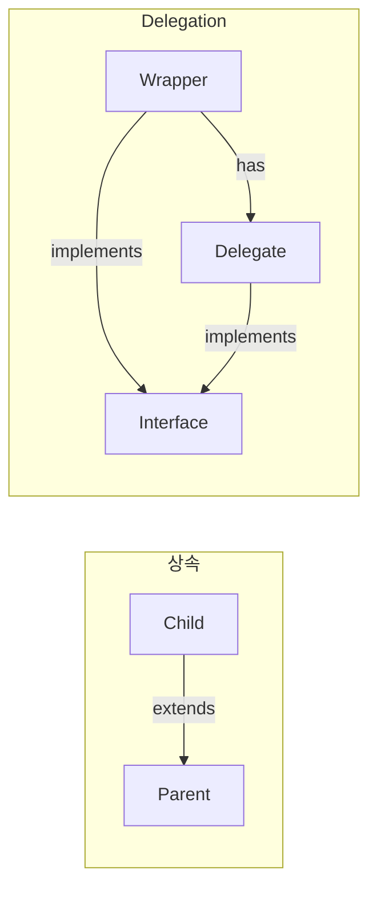

## Delegation

- **Delegation**은 **기능 구현을 다른 객체에 위임**하는 design pattern입니다.
    - 상속(is-a) 대신 composition(has-a)을 사용합니다.
    - code 재사용과 유연성을 높입니다.
    - Kotlin은 언어 차원에서 delegation을 지원합니다.




---


## Class Delegation

- **`by` keyword**로 interface 구현을 **다른 객체에 위임**합니다.
    - 위임받은 객체의 method가 자동으로 호출됩니다.
    - boilerplate 없이 decorator pattern을 구현합니다.

```kotlin
interface Printer {
    fun print(message: String)
}

class ConsolePrinter : Printer {
    override fun print(message: String) = println(message)
}

// printer에 모든 Printer 구현을 위임
class LoggingPrinter(private val printer: Printer) : Printer by printer

val printer = LoggingPrinter(ConsolePrinter())
printer.print("Hello")  // ConsolePrinter.print() 호출
```


### Method Override

- **위임받은 method를 override**하여 동작을 변경합니다.
    - override하지 않은 method는 delegate에 위임됩니다.

```kotlin
interface Repository {
    fun save(data: String)
    fun load(): String
}

class FileRepository : Repository {
    override fun save(data: String) = println("Saving to file: $data")
    override fun load(): String = "data from file"
}

class CachingRepository(
    private val delegate: Repository
) : Repository by delegate {

    private var cache: String? = null

    override fun load(): String {
        if (cache == null) {
            cache = delegate.load()  // 원본 호출
        }
        return cache!!
    }
}

val repo = CachingRepository(FileRepository())
repo.save("test")     // delegate에 위임
println(repo.load())  // cache 사용
```


### 여러 Interface 위임

- **여러 interface를 각각 다른 객체에 위임**합니다.

```kotlin
interface Flyable {
    fun fly()
}

interface Swimmable {
    fun swim()
}

class Bird : Flyable {
    override fun fly() = println("Flying")
}

class Fish : Swimmable {
    override fun swim() = println("Swimming")
}

class Duck(
    flyable: Flyable,
    swimmable: Swimmable
) : Flyable by flyable, Swimmable by swimmable

val duck = Duck(Bird(), Fish())
duck.fly()   // Flying
duck.swim()  // Swimming
```


### Delegation 활용

- **decoration** : 기존 구현에 기능을 추가합니다.
- **adaptation** : interface를 변환합니다.
- **composition** : 여러 기능을 조합합니다.

```kotlin
// Logging decorator
class LoggingList<T>(
    private val delegate: MutableList<T> = mutableListOf()
) : MutableList<T> by delegate {

    override fun add(element: T): Boolean {
        println("Adding $element")
        return delegate.add(element)
    }

    override fun remove(element: T): Boolean {
        println("Removing $element")
        return delegate.remove(element)
    }
}

val list = LoggingList<Int>()
list.add(1)      // Adding 1
list.add(2)      // Adding 2
list.remove(1)   // Removing 1
```


---


## Property Delegation

- **property의 getter/setter를 delegate 객체에 위임**합니다.
    - `by` keyword 뒤에 delegate 객체를 지정합니다.
    - `getValue`와 `setValue` operator를 구현한 객체가 delegate입니다.

```kotlin
class Delegate {
    operator fun getValue(thisRef: Any?, property: KProperty<*>): String {
        return "Delegate for '${property.name}'"
    }

    operator fun setValue(thisRef: Any?, property: KProperty<*>, value: String) {
        println("Setting '${property.name}' to '$value'")
    }
}

class Example {
    var text: String by Delegate()
}

val example = Example()
println(example.text)    // Delegate for 'text'
example.text = "Hello"   // Setting 'text' to 'Hello'
```


### getValue / setValue

- **`getValue`** : property를 읽을 때 호출됩니다.
- **`setValue`** : property에 값을 쓸 때 호출됩니다.
    - `val` property는 `getValue`만 필요합니다.
    - `var` property는 둘 다 필요합니다.

```kotlin
import kotlin.reflect.KProperty

class LoggingDelegate<T>(private var value: T) {
    operator fun getValue(thisRef: Any?, property: KProperty<*>): T {
        println("Getting ${property.name}: $value")
        return value
    }

    operator fun setValue(thisRef: Any?, property: KProperty<*>, newValue: T) {
        println("Setting ${property.name}: $value -> $newValue")
        value = newValue
    }
}

class User {
    var name: String by LoggingDelegate("Unknown")
    var age: Int by LoggingDelegate(0)
}

val user = User()
user.name = "Kim"  // Setting name: Unknown -> Kim
println(user.name) // Getting name: Kim
```


---


## Standard Delegates

- Kotlin은 **자주 사용되는 delegate를 표준 library**로 제공합니다.
    - `lazy` : 지연 초기화.
    - `observable` : 변경 감지.
    - `vetoable` : 변경 거부.


### lazy

- **`lazy`**는 property를 **처음 접근할 때 초기화**합니다.
    - 이후 접근에서는 cached 값을 반환합니다.
    - 비용이 큰 초기화를 필요할 때까지 미룹니다.

```kotlin
val expensiveValue: String by lazy {
    println("Computing...")
    Thread.sleep(1000)
    "Result"
}

println("Before access")
println(expensiveValue)  // Computing... (1초 후) Result
println(expensiveValue)  // Result (즉시, cache 사용)
```


### lazy Thread Safety Mode

- **`LazyThreadSafetyMode`**로 thread 안전성을 설정합니다.

| Mode | 설명 |
| --- | --- |
| SYNCHRONIZED | lock 사용, thread-safe (기본값) |
| PUBLICATION | 여러 thread가 동시 초기화 가능, 첫 결과 사용 |
| NONE | lock 없음, 단일 thread 환경용 |

```kotlin
// 단일 thread 환경 : 성능 향상
val value1: String by lazy(LazyThreadSafetyMode.NONE) {
    "Single thread"
}

// 여러 thread 동시 초기화 허용
val value2: String by lazy(LazyThreadSafetyMode.PUBLICATION) {
    "First wins"
}
```


### observable

- **`Delegates.observable`**은 property **변경을 감지**합니다.
    - 초기값과 callback을 받습니다.
    - 변경 후에 callback이 호출됩니다.

```kotlin
import kotlin.properties.Delegates

class User {
    var name: String by Delegates.observable("Unknown") { property, oldValue, newValue ->
        println("${property.name}: $oldValue -> $newValue")
    }
}

val user = User()
user.name = "Kim"   // name: Unknown -> Kim
user.name = "Lee"   // name: Kim -> Lee
```


### vetoable

- **`Delegates.vetoable`**은 조건에 따라 **변경을 거부**합니다.
    - callback이 `false`를 반환하면 변경되지 않습니다.

```kotlin
class User {
    var age: Int by Delegates.vetoable(0) { _, oldValue, newValue ->
        newValue >= 0  // 음수면 거부
    }
}

val user = User()
user.age = 25
println(user.age)  // 25

user.age = -1      // 거부됨
println(user.age)  // 25 (변경 안 됨)
```


### notNull

- **`Delegates.notNull`**은 non-null property를 **나중에 초기화**합니다.
    - `lateinit`과 유사하지만 primitive type에도 사용 가능합니다.

```kotlin
class Config {
    var port: Int by Delegates.notNull()
    var host: String by Delegates.notNull()
}

val config = Config()
// println(config.port)  // IllegalStateException

config.port = 8080
config.host = "localhost"
println(config.port)  // 8080
```


---


## Map Delegation

- **Map을 property delegate로 사용**합니다.
    - property 이름을 key로 하여 Map에서 값을 읽습니다.
    - JSON parsing, configuration 등에 유용합니다.

```kotlin
class User(map: Map<String, Any?>) {
    val name: String by map
    val age: Int by map
}

val map = mapOf(
    "name" to "Kim",
    "age" to 25
)

val user = User(map)
println(user.name)  // Kim
println(user.age)   // 25
```


### MutableMap

- **MutableMap**을 사용하면 **읽기와 쓰기** 모두 가능합니다.

```kotlin
class MutableUser(map: MutableMap<String, Any?>) {
    var name: String by map
    var age: Int by map
}

val map = mutableMapOf<String, Any?>(
    "name" to "Kim",
    "age" to 25
)

val user = MutableUser(map)
user.name = "Lee"
user.age = 30

println(map)  // {name=Lee, age=30}
```


### JSON Parsing 활용

- Map delegation을 활용하면 JSON을 간단히 객체로 변환합니다.

```kotlin
fun parseUser(json: String): User {
    val map: Map<String, Any?> = Gson().fromJson(
        json,
        object : TypeToken<Map<String, Any?>>() {}.type
    )
    return User(map)
}

val user = parseUser("""{"name": "Kim", "age": 25}""")
println(user.name)  // Kim
```


---


## Custom Delegate

- **custom delegate**를 만들어 반복되는 logic을 재사용합니다.
    - `ReadOnlyProperty` 또는 `ReadWriteProperty` interface를 구현합니다.
    - operator 함수를 직접 구현할 수도 있습니다.


### ReadOnlyProperty

- **`ReadOnlyProperty`** interface를 구현하여 `val` property용 delegate를 만듭니다.

```kotlin
import kotlin.properties.ReadOnlyProperty
import kotlin.reflect.KProperty

class ResourceDelegate<T>(
    private val loader: () -> T
) : ReadOnlyProperty<Any?, T> {

    private var resource: T? = null

    override fun getValue(thisRef: Any?, property: KProperty<*>): T {
        if (resource == null) {
            resource = loader()
        }
        return resource!!
    }
}

fun <T> resource(loader: () -> T) = ResourceDelegate(loader)

class App {
    val database: Database by resource { Database.connect() }
    val config: Config by resource { Config.load() }
}
```


### ReadWriteProperty

- **`ReadWriteProperty`** interface를 구현하여 `var` property용 delegate를 만듭니다.

```kotlin
import kotlin.properties.ReadWriteProperty
import kotlin.reflect.KProperty

class TrimDelegate : ReadWriteProperty<Any?, String> {
    private var value: String = ""

    override fun getValue(thisRef: Any?, property: KProperty<*>): String = value

    override fun setValue(thisRef: Any?, property: KProperty<*>, value: String) {
        this.value = value.trim()
    }
}

class Form {
    var username: String by TrimDelegate()
    var email: String by TrimDelegate()
}

val form = Form()
form.username = "  Kim  "
form.email = " kim@example.com "
println(form.username)  // Kim
println(form.email)     // kim@example.com
```


### PropertyDelegateProvider

- **delegate 생성 시점을 제어**합니다.
    - property 이름을 delegate 생성에 활용합니다.

```kotlin
class ConfigProvider(private val prefix: String) :
    PropertyDelegateProvider<Any?, ReadOnlyProperty<Any?, String>> {

    override fun provideDelegate(
        thisRef: Any?,
        property: KProperty<*>
    ): ReadOnlyProperty<Any?, String> {

        val key = "$prefix.${property.name}"
        val value = System.getProperty(key) ?: "default"
        return ReadOnlyProperty { _, _ -> value }
    }
}

fun config(prefix: String) = ConfigProvider(prefix)

class AppConfig {
    val host: String by config("app")      // app.host
    val port: String by config("app")      // app.port
    val timeout: String by config("http")  // http.timeout
}
```


---


## 실전 예제

- 실무에서 delegation은 **반복적인 접근 logic을 추상화**할 때 유용합니다.
    - 외부 저장소(SharedPreferences, Database)나 상태 관리의 복잡성을 숨깁니다.
    - property 접근처럼 자연스러운 API를 제공하여 사용 측 code를 간결하게 만듭니다.


### SharedPreferences Delegate

- Android의 `SharedPreferences`를 property처럼 사용하는 delegate입니다.

```kotlin
class PreferenceDelegate<T>(
    private val prefs: SharedPreferences,
    private val key: String,
    private val default: T
) : ReadWriteProperty<Any?, T> {

    @Suppress("UNCHECKED_CAST")
    override fun getValue(thisRef: Any?, property: KProperty<*>): T {
        return when (default) {
            is String -> prefs.getString(key, default) as T
            is Int -> prefs.getInt(key, default) as T
            is Boolean -> prefs.getBoolean(key, default) as T
            is Long -> prefs.getLong(key, default) as T
            is Float -> prefs.getFloat(key, default) as T
            else -> throw IllegalArgumentException("Unsupported type")
        }
    }

    override fun setValue(thisRef: Any?, property: KProperty<*>, value: T) {
        with(prefs.edit()) {
            when (value) {
                is String -> putString(key, value)
                is Int -> putInt(key, value)
                is Boolean -> putBoolean(key, value)
                is Long -> putLong(key, value)
                is Float -> putFloat(key, value)
            }
            apply()
        }
    }
}

fun <T> SharedPreferences.preference(key: String, default: T) =
    PreferenceDelegate(this, key, default)

class UserPreferences(prefs: SharedPreferences) {
    var username: String by prefs.preference("username", "")
    var isLoggedIn: Boolean by prefs.preference("logged_in", false)
    var loginCount: Int by prefs.preference("login_count", 0)
}
```


### ViewModel State Delegate

- `ViewModel`의 상태를 StateFlow로 관리하는 delegate입니다.

```kotlin
class ViewModelState<T>(
    private val viewModel: ViewModel,
    private val initial: T
) : ReadWriteProperty<Any?, T> {

    private val _state = MutableStateFlow(initial)
    val state: StateFlow<T> = _state.asStateFlow()

    override fun getValue(thisRef: Any?, property: KProperty<*>): T = _state.value

    override fun setValue(thisRef: Any?, property: KProperty<*>, value: T) {
        _state.value = value
    }
}

fun <T> ViewModel.state(initial: T) = ViewModelState(this, initial)

class UserViewModel : ViewModel() {
    var isLoading: Boolean by state(false)
    var errorMessage: String? by state(null)
    var users: List<User> by state(emptyList())
}
```


---


## Reference

- <https://kotlinlang.org/docs/delegation.html>
- <https://kotlinlang.org/docs/delegated-properties.html>

