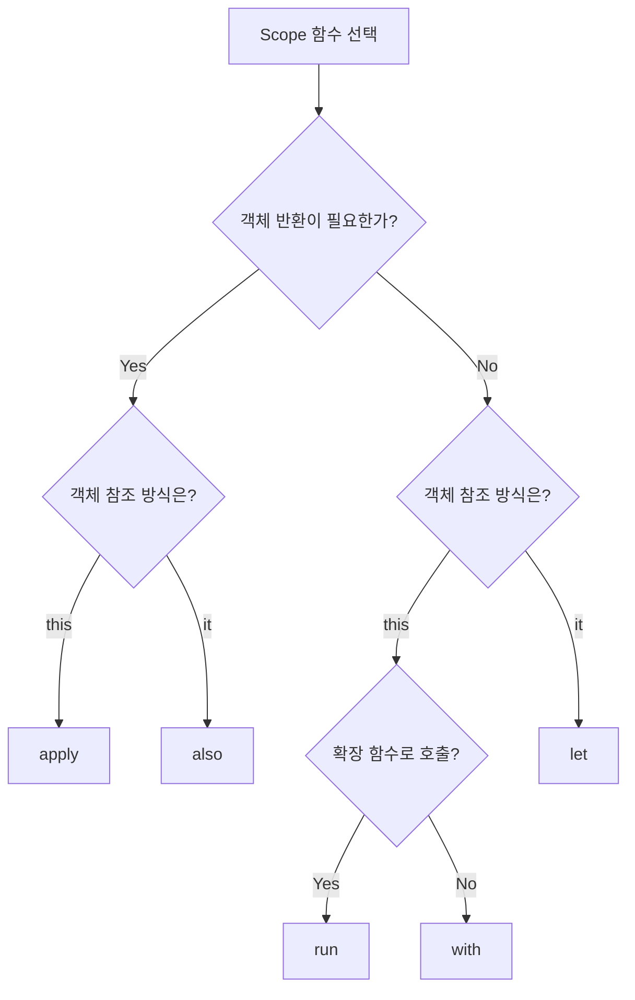

## 고차 함수

- **고차 함수(higher-order function)**는 함수를 parameter로 받거나 함수를 반환하는 함수입니다.
    - 함수를 일급 시민(first-class citizen)으로 취급하기 때문에 가능합니다.
    - logic을 추상화하여 재사용성을 높입니다.
    - Kotlin 표준 library의 `map`, `filter`, `fold` 등이 고차 함수입니다.

```kotlin
// 함수를 parameter로 받는 고차 함수
fun calculate(a: Int, b: Int, operation: (Int, Int) -> Int): Int {
    return operation(a, b)
}

val sum = calculate(3, 4) { x, y -> x + y }      // 7
val product = calculate(3, 4) { x, y -> x * y }  // 12
```


### 고차 함수의 장점

- **code 재사용성**이 높아집니다.
    - 공통 logic은 고차 함수로 정의하고, 변하는 부분만 함수로 전달합니다.
    - 반복되는 pattern을 추상화합니다.

- **관심사 분리**가 가능합니다.
    - "무엇을 할지"와 "어떻게 할지"를 분리합니다.
    - 고차 함수는 흐름을 제어하고, 전달된 함수는 구체적인 동작을 정의합니다.

- **선언적 code**를 작성합니다.
    - 반복문과 조건문 대신 의도를 명확히 표현합니다.
    - code의 가독성이 향상됩니다.

```kotlin
// 고차 함수 없이 : 반복되는 pattern
fun sumOfEven(numbers: List<Int>): Int {
    var result = 0
    for (n in numbers) {
        if (n % 2 == 0) result += n
    }
    return result
}

fun sumOfPositive(numbers: List<Int>): Int {
    var result = 0
    for (n in numbers) {
        if (n > 0) result += n
    }
    return result
}

// 고차 함수 사용 : 조건을 parameter로 추상화
fun sumIf(numbers: List<Int>, predicate: (Int) -> Boolean): Int {
    var result = 0
    for (n in numbers) {
        if (predicate(n)) result += n
    }
    return result
}

val evenSum = sumIf(numbers) { it % 2 == 0 }
val positiveSum = sumIf(numbers) { it > 0 }
```


---


## 함수를 Parameter로 받는 고차 함수

- **함수 type을 parameter로 선언**하여 동작을 외부에서 주입받습니다.
    - `(ParameterTypes) -> ReturnType` 형태로 함수 type을 정의합니다.
    - 호출 시 lambda나 함수 reference를 전달합니다.


### 기본 형태

```kotlin
// 함수 type parameter : (Int, Int) -> Int
fun operate(a: Int, b: Int, operation: (Int, Int) -> Int): Int {
    return operation(a, b)
}

// lambda 전달
val result1 = operate(10, 5) { x, y -> x + y }   // 15
val result2 = operate(10, 5) { x, y -> x - y }   // 5
val result3 = operate(10, 5) { x, y -> x * y }   // 50
```


### 여러 함수 Parameter

- **여러 함수를 parameter로 받아** 복합적인 동작을 구성합니다.

```kotlin
fun <T> process(
    data: T,
    validate: (T) -> Boolean,
    transform: (T) -> String,
    onSuccess: (String) -> Unit,
    onError: (T) -> Unit
) {
    if (validate(data)) {
        val result = transform(data)
        onSuccess(result)
    } else {
        onError(data)
    }
}

process(
    data = 42,
    validate = { it > 0 },
    transform = { "Value: $it" },
    onSuccess = { println(it) },
    onError = { println("Invalid: $it") }
)
// 출력 : Value: 42
```


### 실전 예제 : Retry Logic

```kotlin
fun <T> retry(
    times: Int,
    delay: Long = 1000L,
    block: () -> T
): T {
    repeat(times - 1) { attempt ->
        try {
            return block()
        } catch (e: Exception) {
            println("Attempt ${attempt + 1} failed: ${e.message}")
            Thread.sleep(delay)
        }
    }
    return block()  // 마지막 시도
}

// 사용
val result = retry(times = 3, delay = 500L) {
    fetchDataFromServer()
}
```


---


## 함수를 반환하는 고차 함수

- **함수를 반환 type으로 선언**하여 동적으로 함수를 생성합니다.
    - 설정값에 따라 다른 동작을 하는 함수를 생성합니다.
    - factory pattern을 함수형으로 구현합니다.


### 기본 형태

```kotlin
// (Int) -> Int type 함수를 반환
fun multiplier(factor: Int): (Int) -> Int {
    return { number -> number * factor }
}

val double = multiplier(2)
val triple = multiplier(3)

println(double(5))   // 10
println(triple(5))   // 15
```


### Currying

- **currying**은 여러 parameter를 받는 함수를 단일 parameter 함수들의 chain으로 변환합니다.
    - 일부 parameter를 고정하여 새로운 함수를 생성합니다.
    - 함수 재사용성이 높아집니다.

```kotlin
// 일반 함수
fun add(a: Int, b: Int): Int = a + b

// curried 함수
fun curriedAdd(a: Int): (Int) -> Int = { b -> a + b }

val add5 = curriedAdd(5)
println(add5(3))   // 8
println(add5(10))  // 15
```


### 함수 Factory

- **설정에 따라 다른 동작을 하는 함수를 생성**합니다.

```kotlin
enum class LogLevel { DEBUG, INFO, ERROR }

fun createLogger(level: LogLevel): (String) -> Unit {
    return { message ->
        val prefix = when (level) {
            LogLevel.DEBUG -> "[DEBUG]"
            LogLevel.INFO -> "[INFO]"
            LogLevel.ERROR -> "[ERROR]"
        }
        println("$prefix $message")
    }
}

val debugLog = createLogger(LogLevel.DEBUG)
val errorLog = createLogger(LogLevel.ERROR)

debugLog("Application started")   // [DEBUG] Application started
errorLog("Connection failed")     // [ERROR] Connection failed
```


### Validator Factory

```kotlin
fun createValidator(
    minLength: Int,
    maxLength: Int,
    pattern: Regex? = null
): (String) -> Boolean {
    return { input ->
        val lengthValid = input.length in minLength..maxLength
        val patternValid = pattern?.matches(input) ?: true
        lengthValid && patternValid
    }
}

val usernameValidator = createValidator(
    minLength = 4,
    maxLength = 20,
    pattern = Regex("^[a-zA-Z0-9_]+$")
)

val passwordValidator = createValidator(
    minLength = 8,
    maxLength = 100
)

println(usernameValidator("john_doe"))   // true
println(usernameValidator("ab"))         // false (too short)
println(passwordValidator("secret"))     // false (too short)
```


---


## 함수 Reference

- **함수 reference**는 기존 함수를 함수 type 값으로 변환합니다.
    - `::` 연산자를 사용합니다.
    - lambda 대신 기존 함수를 고차 함수에 전달할 때 사용합니다.


### 최상위 함수 Reference

```kotlin
fun isEven(n: Int): Boolean = n % 2 == 0

val numbers = listOf(1, 2, 3, 4, 5)

// lambda 사용
val evens1 = numbers.filter { isEven(it) }

// 함수 reference 사용
val evens2 = numbers.filter(::isEven)
```


### Member 함수 Reference

- **class의 member 함수**를 reference로 사용합니다.

```kotlin
data class Person(val name: String, val age: Int)

val people = listOf(
    Person("Kim", 25),
    Person("Lee", 30),
    Person("Park", 28)
)

// instance의 member 함수 reference
val names = people.map(Person::name)   // [Kim, Lee, Park]

// bound reference : 특정 instance에 binding
val kim = Person("Kim", 25)
val getName: () -> String = kim::name
println(getName())   // Kim
```


### 생성자 Reference

- **생성자도 함수 reference로 사용**합니다.

```kotlin
data class User(val name: String)

val names = listOf("Kim", "Lee", "Park")

// 생성자 reference로 객체 생성
val users = names.map(::User)
// [User(name=Kim), User(name=Lee), User(name=Park)]
```


### Property Reference

- **property도 reference로 접근**합니다.

```kotlin
data class Product(val name: String, val price: Int)

val products = listOf(
    Product("Apple", 1000),
    Product("Banana", 500),
    Product("Cherry", 2000)
)

// property reference로 정렬
val sortedByPrice = products.sortedBy(Product::price)
// [Product(Banana, 500), Product(Apple, 1000), Product(Cherry, 2000)]

// property reference로 값 추출
val prices = products.map(Product::price)   // [1000, 500, 2000]
```


---


## Scope 함수

- **scope 함수**는 객체의 context 내에서 code block을 실행하는 고차 함수입니다.
    - `let`, `run`, `with`, `apply`, `also` 5가지가 있습니다.
    - 객체 초기화, null 처리, 임시 scope 생성 등에 활용합니다.

| 함수 | 객체 참조 | 반환값 | 확장 함수 |
| --- | --- | --- | --- |
| let | it | lambda 결과 | O |
| run | this | lambda 결과 | O |
| with | this | lambda 결과 | X |
| apply | this | 객체 자신 | O |
| also | it | 객체 자신 | O |


### let

- **객체를 `it`으로 참조**하고 **lambda 결과를 반환**합니다.
    - null 처리에 자주 사용합니다.
    - 변환(mapping) 작업에 활용합니다.

```kotlin
// null 안전 호출과 함께 사용
val name: String? = "Kotlin"
val length = name?.let {
    println("Name: $it")
    it.length
}
// 출력 : Name: Kotlin
// length = 6

// 변환 작업
val numbers = mutableListOf(1, 2, 3)
val result = numbers.let {
    it.add(4)
    it.sum()
}
// result = 10
```


### run

- **객체를 `this`로 참조**하고 **lambda 결과를 반환**합니다.
    - 객체 초기화와 결과 계산을 동시에 수행합니다.
    - `this`는 생략 가능하여 객체의 member에 직접 접근합니다.

```kotlin
val result = StringBuilder().run {
    append("Hello")
    append(" ")
    append("World")
    toString()
}
// result = "Hello World"

// 객체 없이 run 사용 : 임시 scope 생성
val hexColor = run {
    val red = 255
    val green = 128
    val blue = 0
    String.format("#%02X%02X%02X", red, green, blue)
}
// hexColor = "#FF8000"
```


### with

- **객체를 argument로 받아 `this`로 참조**합니다.
    - 확장 함수가 아닙니다.
    - 이미 생성된 객체에 대해 여러 작업을 수행할 때 사용합니다.

```kotlin
val person = Person("Kim", 25)

val info = with(person) {
    println("Name: $name")
    println("Age: $age")
    "$name is $age years old"
}
// 출력 : Name: Kim
//       Age: 25
// info = "Kim is 25 years old"
```


### apply

- **객체를 `this`로 참조**하고 **객체 자신을 반환**합니다.
    - 객체 초기화에 주로 사용합니다.
    - builder pattern 대체로 활용합니다.

```kotlin
val person = Person().apply {
    name = "Kim"
    age = 25
    city = "Seoul"
}

// builder pattern 대체
val config = Configuration().apply {
    host = "localhost"
    port = 8080
    timeout = 30000
    enableLogging = true
}
```


### also

- **객체를 `it`으로 참조**하고 **객체 자신을 반환**합니다.
    - 부수 효과(side effect) 작업에 사용합니다.
    - logging, 유효성 검사 등에 활용합니다.

```kotlin
val numbers = mutableListOf(1, 2, 3)
    .also { println("Initial list: $it") }
    .also { it.add(4) }
    .also { println("After adding: $it") }
// 출력 : Initial list: [1, 2, 3]
//       After adding: [1, 2, 3, 4]

// method chaining 중간에 logging
fun createUser(name: String): User {
    return User(name)
        .also { logger.debug("Created user: $it") }
        .also { validateUser(it) }
}
```


### Scope 함수 선택 Guide



| 상황 | 함수 |
| --- | --- |
| 초기화 후 객체 반환 | apply |
| 부수 효과 후 객체 반환 | also |
| null 처리 또는 변환 | let |
| 객체 설정 후 결과 계산 | run |
| 이미 있는 객체에 여러 작업 | with |


---


## 고차 함수 설계 Guide

- 고차 함수를 설계할 때 고려해야 할 사항이 있습니다.


### 함수 Parameter 위치

- **함수 parameter는 마지막에 배치**합니다.
    - trailing lambda 문법을 활용할 수 있습니다.
    - Kotlin 관용적인 style입니다.

```kotlin
// 나쁜 예 : 함수 parameter가 중간에 위치
fun process(action: () -> Unit, data: String) { ... }
process({ println("action") }, "data")

// 좋은 예 : 함수 parameter가 마지막
fun process(data: String, action: () -> Unit) { ... }
process("data") { println("action") }
```


### 함수 Type 명확화

- **복잡한 함수 type은 typealias로 명확화**합니다.

```kotlin
// 복잡한 함수 type
fun process(
    transformer: (String, Int) -> Pair<String, Boolean>,
    validator: (Pair<String, Boolean>) -> Boolean
) { ... }

// typealias로 명확화
typealias Transformer = (String, Int) -> Pair<String, Boolean>
typealias Validator = (Pair<String, Boolean>) -> Boolean

fun process(transformer: Transformer, validator: Validator) { ... }
```


### Receiver를 활용한 DSL

- **lambda with receiver**를 활용하면 DSL style code를 작성합니다.
    - `this`로 receiver 객체에 접근합니다.
    - 설정 block, builder pattern 등에 유용합니다.

```kotlin
class HtmlBuilder {
    private val elements = mutableListOf<String>()

    fun div(content: String) {
        elements.add("<div>$content</div>")
    }

    fun p(content: String) {
        elements.add("<p>$content</p>")
    }

    fun build(): String = elements.joinToString("\n")
}

// lambda with receiver
fun html(block: HtmlBuilder.() -> Unit): String {
    val builder = HtmlBuilder()
    builder.block()
    return builder.build()
}

// DSL style 사용
val result = html {
    div("Header")
    p("Paragraph 1")
    p("Paragraph 2")
}
```


### Inline 고려

- **고차 함수는 inline을 고려**합니다.
    - lambda 객체 생성 overhead를 제거합니다.
    - 짧고 자주 호출되는 고차 함수에 적합합니다.

```kotlin
// inline으로 성능 최적화
inline fun measureTime(block: () -> Unit): Long {
    val start = System.currentTimeMillis()
    block()
    return System.currentTimeMillis() - start
}
```


---


## Reference

- <https://kotlinlang.org/docs/lambdas.html>
- <https://kotlinlang.org/docs/scope-functions.html>
- <https://kotlinlang.org/docs/inline-functions.html>

