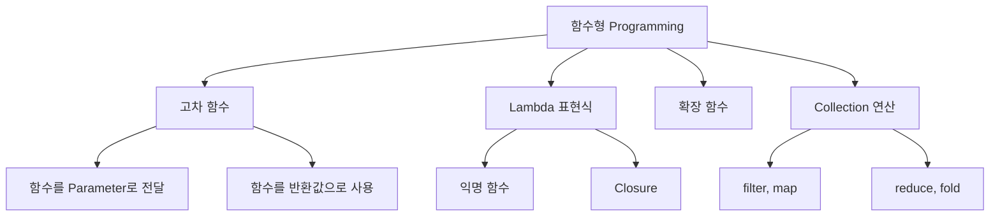

## 함수형 Programming

- **함수형 programming(functional programming)**은 함수를 기본 building block으로 사용하는 programming paradigm입니다.
    - 함수를 값처럼 변수에 저장하고, 다른 함수에 전달하고, 함수에서 반환할 수 있습니다.
    - 상태 변경과 부수 효과(side effect)를 최소화합니다.
    - 선언적(declarative) 방식으로 "무엇을"에 집중합니다.

```kotlin
// 명령형 : "어떻게" 처리할지 단계별로 기술
val numbers = listOf(1, 2, 3, 4, 5)
val result = mutableListOf<Int>()
for (n in numbers) {
    if (n % 2 == 0) {
        result.add(n * 2)
    }
}

// 함수형 : "무엇을" 원하는지 선언
val result2 = numbers.filter { it % 2 == 0 }.map { it * 2 }
```


### 함수형 Programming의 핵심 개념

- **함수를 일급 시민(first-class citizen)으로 취급**합니다.
    - 함수를 변수에 저장할 수 있습니다.
    - 함수를 다른 함수의 parameter로 전달할 수 있습니다.
    - 함수를 다른 함수의 반환값으로 사용할 수 있습니다.

- **순수 함수(pure function)를 지향**합니다.
    - 같은 입력에 대해 항상 같은 출력을 반환합니다.
    - 외부 상태를 변경하지 않습니다.
    - 부수 효과(side effect)가 없습니다.

```kotlin
// 순수 함수 : 외부 상태에 의존하지 않음
fun add(a: Int, b: Int): Int = a + b

// 비순수 함수 : 외부 상태에 의존
var counter = 0
fun incrementAndGet(): Int = ++counter
```

- **불변성(immutability)을 유지**합니다.
    - data를 변경하지 않고, 변경이 필요하면 새로운 data를 생성합니다.
    - `val`, immutable collection, `copy()` 등을 활용합니다.

```kotlin
// 가변 : 상태 변경
val mutableList = mutableListOf(1, 2, 3)
mutableList.add(4)

// 불변 : 새로운 list 생성
val immutableList = listOf(1, 2, 3)
val newList = immutableList + 4
```


### 함수형 Programming의 장점

- **code 간결성**이 높아집니다.
    - 반복문과 조건문 대신 고차 함수로 의도를 명확하게 표현합니다.
    - boilerplate가 줄어듭니다.

- **test가 용이**해집니다.
    - 순수 함수는 입력과 출력만 검증하면 됩니다.
    - 외부 의존성이 없어 mock이 필요 없습니다.

- **병렬 처리**에 유리합니다.
    - 불변 data는 동시 접근에 안전합니다.
    - 순수 함수는 실행 순서에 독립적입니다.

- **유지 보수성**이 좋아집니다.
    - 작은 함수들의 조합으로 복잡한 logic을 구성합니다.
    - 각 함수가 독립적이어서 변경 영향이 적습니다.


---


## Kotlin의 함수형 Programming 지원

- **Kotlin은 함수형 programming을 강력하게 지원**합니다.
    - 객체 지향과 함수형 paradigm을 모두 사용할 수 있는 multi-paradigm 언어입니다.
    - Java보다 간결한 문법으로 함수형 code를 작성할 수 있습니다.




### 고차 함수

- **고차 함수(higher-order function)**는 함수를 parameter로 받거나 함수를 반환하는 함수입니다.
    - Kotlin의 collection 연산 대부분이 고차 함수입니다.
    - 함수 type으로 parameter와 반환값을 선언합니다.

```kotlin
// 함수를 parameter로 받는 고차 함수
fun operate(a: Int, b: Int, operation: (Int, Int) -> Int): Int {
    return operation(a, b)
}

val sum = operate(3, 4) { x, y -> x + y }    // 7
val product = operate(3, 4) { x, y -> x * y }    // 12

// 함수를 반환하는 고차 함수
fun multiplier(factor: Int): (Int) -> Int {
    return { number -> number * factor }
}

val triple = multiplier(3)
println(triple(5))    // 15
```


### Lambda 표현식

- **lambda**는 이름 없이 정의하는 함수 literal입니다.
    - 중괄호 `{ }` 안에 parameter와 body를 작성합니다.
    - 마지막 표현식이 반환값이 됩니다.

```kotlin
// lambda 기본 형태
val sum: (Int, Int) -> Int = { a, b -> a + b }

// parameter가 하나면 it 사용
val double: (Int) -> Int = { it * 2 }

// trailing lambda : 마지막 parameter가 함수면 괄호 밖으로
listOf(1, 2, 3).map { it * 2 }
```


### 확장 함수

- **확장 함수(extension function)**는 기존 class에 함수를 추가합니다.
    - class를 수정하지 않고 기능을 확장합니다.
    - 함수형 style의 method chaining을 가능하게 합니다.

```kotlin
fun String.addExclamation(): String = this + "!"

println("Hello".addExclamation())    // Hello!

// collection에 확장 함수 추가
fun <T> List<T>.secondOrNull(): T? = if (size >= 2) this[1] else null

val list = listOf(1, 2, 3)
println(list.secondOrNull())    // 2
```


### Collection 연산

- **Kotlin collection**은 풍부한 함수형 연산을 제공합니다.
    - `filter`, `map`, `reduce`, `fold`, `groupBy` 등을 지원합니다.
    - method chaining으로 복잡한 data 변환을 간결하게 표현합니다.

```kotlin
data class Person(val name: String, val age: Int)

val people = listOf(
    Person("Kim", 25),
    Person("Lee", 30),
    Person("Park", 25),
    Person("Choi", 35)
)

// 25세인 사람들의 이름을 대문자로 변환
val result = people
    .filter { it.age == 25 }
    .map { it.name.uppercase() }
// [KIM, PARK]

// 나이별로 grouping
val byAge = people.groupBy { it.age }
// {25=[Person(Kim, 25), Person(Park, 25)], 30=[Person(Lee, 30)], 35=[Person(Choi, 35)]}
```


---


## 명령형 vs 함수형 비교

- **명령형(imperative)**과 **함수형(functional)**은 문제 해결 방식이 다릅니다.

| 특성 | 명령형 | 함수형 |
| --- | --- | --- |
| 초점 | 어떻게(How) | 무엇을(What) |
| 상태 | 가변 상태 사용 | 불변 상태 선호 |
| 제어 흐름 | 반복문, 조건문 | 고차 함수, 재귀 |
| 부수 효과 | 허용 | 최소화 |


### 예제 : 짝수의 제곱 합 구하기

```kotlin
val numbers = listOf(1, 2, 3, 4, 5, 6, 7, 8, 9, 10)

// 명령형
var sum = 0
for (n in numbers) {
    if (n % 2 == 0) {
        sum += n * n
    }
}
println(sum)    // 220

// 함수형
val sum2 = numbers
    .filter { it % 2 == 0 }
    .map { it * it }
    .sum()
println(sum2)    // 220
```


### 예제 : 단어 빈도수 계산

```kotlin
val words = listOf("apple", "banana", "apple", "cherry", "banana", "apple")

// 명령형
val countMap = mutableMapOf<String, Int>()
for (word in words) {
    countMap[word] = (countMap[word] ?: 0) + 1
}
println(countMap)    // {apple=3, banana=2, cherry=1}

// 함수형
val countMap2 = words.groupingBy { it }.eachCount()
println(countMap2)    // {apple=3, banana=2, cherry=1}
```


---


## Sequence : 지연 연산

- **Sequence**는 element를 지연(lazy) 평가합니다.
    - Collection 연산은 각 단계마다 중간 collection을 생성합니다.
    - Sequence는 최종 연산이 호출될 때까지 실제 계산을 미룹니다.
    - 대용량 data나 연산 chain이 길 때 성능상 이점이 있습니다.

```kotlin
val numbers = (1..1_000_000).toList()

// Collection : 각 단계마다 중간 list 생성
val result1 = numbers
    .map { it * 2 }        // 중간 list 생성
    .filter { it > 100 }   // 중간 list 생성
    .take(10)
    .toList()

// Sequence : 최종 연산 시 한 번에 처리
val result2 = numbers.asSequence()
    .map { it * 2 }        // 지연 : 아직 실행 안 함
    .filter { it > 100 }   // 지연 : 아직 실행 안 함
    .take(10)
    .toList()              // 최종 연산 : 여기서 실제 계산
```


### Collection vs Sequence 처리 방식

```kotlin
listOf(1, 2, 3)
    .map { print("map $it "); it * 2 }
    .filter { print("filter $it "); it > 2 }
// 출력 : map 1 map 2 map 3 filter 2 filter 4 filter 6
// Collection : 모든 element에 map 적용 후 filter 적용

listOf(1, 2, 3).asSequence()
    .map { print("map $it "); it * 2 }
    .filter { print("filter $it "); it > 2 }
    .toList()
// 출력 : map 1 filter 2 map 2 filter 4 map 3 filter 6
// Sequence : element별로 map → filter 순차 적용
```


---


## 함수형 Programming 활용 시 고려 사항

- **모든 상황에 함수형이 적합한 것은 아닙니다**.
    - 간단한 반복문은 명령형이 더 직관적일 수 있습니다.
    - 성능이 중요한 경우 중간 객체 생성을 고려해야 합니다.

- **가독성을 우선**합니다.
    - 과도한 함수 chaining은 오히려 이해하기 어렵습니다.
    - 적절한 중간 변수 사용으로 의도를 명확히 합니다.

```kotlin
// 과도한 chaining : 이해하기 어려움
val result = data
    .filter { it.isActive }
    .map { it.items }
    .flatten()
    .filter { it.price > 0 }
    .groupBy { it.category }
    .mapValues { it.value.sumOf { item -> item.price } }
    .filter { it.value > 1000 }

// 중간 변수로 의도 명확화
val activeItems = data
    .filter { it.isActive }
    .flatMap { it.items }
    .filter { it.price > 0 }

val expensiveCategories = activeItems
    .groupBy { it.category }
    .mapValues { it.value.sumOf { item -> item.price } }
    .filter { it.value > 1000 }
```

- **불변성과 성능의 균형**을 맞춥니다.
    - 불변 객체 생성은 비용이 발생합니다.
    - 내부적으로는 mutable을 사용하고 외부에는 immutable을 노출하는 방식도 있습니다.


---


## Reference

- <https://kotlinlang.org/docs/lambdas.html>
- <https://kotlinlang.org/docs/sequences.html>
- <https://kotlinlang.org/docs/collection-operations.html>

