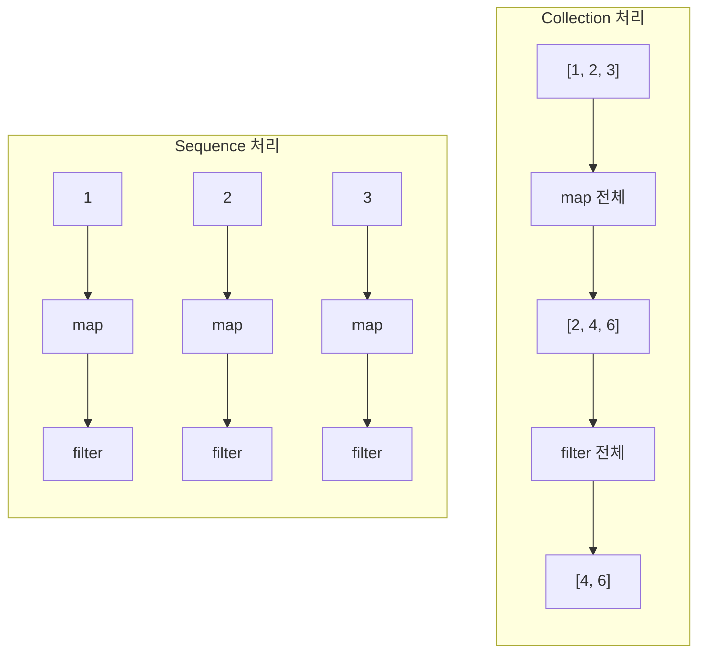

## Sequence

- **Sequence**는 element를 **lazy(지연) 평가**하는 collection입니다.
    - 일반 collection은 각 연산마다 중간 결과 collection을 생성합니다.
    - Sequence는 최종 연산이 호출될 때까지 실제 계산을 미룹니다.
    - 대용량 data나 연산 chain이 길 때 memory와 성능상 이점이 있습니다.

```kotlin
val numbers = (1..1_000_000).toList()

// Collection : 각 단계마다 중간 list 생성
val result1 = numbers
    .map { it * 2 }        // 100만 개 list 생성
    .filter { it > 100 }   // 또 다른 list 생성
    .take(10)
    .toList()

// Sequence : 중간 결과 없이 처리
val result2 = numbers.asSequence()
    .map { it * 2 }        // 지연 : 아직 실행 안 함
    .filter { it > 100 }   // 지연 : 아직 실행 안 함
    .take(10)
    .toList()              // 최종 연산 : 여기서 실제 계산
```


### Lazy Evaluation

- **lazy evaluation(지연 평가)**은 값이 실제로 필요할 때까지 계산을 미루는 전략입니다.
    - 불필요한 계산을 피합니다.
    - 무한한 data stream을 다룰 수 있습니다.
    - 중간 결과를 저장하지 않아 memory 사용을 줄입니다.

```kotlin
// 100개 element 중 조건에 맞는 첫 번째만 필요
val first = (1..100).asSequence()
    .map {
        println("map $it")
        it * 2
    }
    .filter {
        println("filter $it")
        it > 10
    }
    .first()

// 출력 : map 1, filter 2, map 2, filter 4, ..., map 6, filter 12
// 조건을 만족하는 6까지만 처리하고 종료
```


---


## Collection vs Sequence

- Collection과 Sequence는 **처리 순서**와 **평가 시점**이 다릅니다.

| 특성 | Collection | Sequence |
| --- | --- | --- |
| 평가 시점 | 즉시 (eager) | 지연 (lazy) |
| 중간 결과 | 매 단계 생성 | 생성하지 않음 |
| 처리 순서 | 연산별 전체 처리 | element별 전체 연산 |
| 적합한 상황 | 작은 data, 짧은 chain | 대량 data, 긴 chain |


### 처리 순서 비교

- **Collection**은 모든 element에 첫 번째 연산을 적용한 후 다음 연산으로 넘어갑니다.
- **Sequence**는 각 element가 모든 연산을 거친 후 다음 element로 넘어갑니다.

```kotlin
// Collection : 연산 단위 처리
listOf(1, 2, 3)
    .map { print("map $it "); it * 2 }
    .filter { print("filter $it "); it > 2 }
// 출력 : map 1 map 2 map 3 filter 2 filter 4 filter 6

// Sequence : element 단위 처리
listOf(1, 2, 3).asSequence()
    .map { print("map $it "); it * 2 }
    .filter { print("filter $it "); it > 2 }
    .toList()
// 출력 : map 1 filter 2 map 2 filter 4 map 3 filter 6
```




### 중간 연산 단락

- Sequence는 `take`, `first` 등으로 **필요한 만큼만 처리하고 조기 종료**합니다.

```kotlin
val numbers = generateSequence(1) { it + 1 }  // 무한 sequence

// 처음 5개만 처리
val firstFive = numbers
    .map { it * it }
    .take(5)
    .toList()
// [1, 4, 9, 16, 25]

// Collection으로는 무한 data를 다룰 수 없음
```


---


## Sequence 생성

- Sequence를 생성하는 방법은 `sequenceOf`, `asSequence`, `generateSequence`, `sequence { }` builder가 있습니다.


### sequenceOf

- **`sequenceOf`**는 고정된 값들로 sequence를 생성합니다.

```kotlin
val seq = sequenceOf(1, 2, 3, 4, 5)

seq.map { it * 2 }
    .filter { it > 4 }
    .toList()
// [6, 8, 10]
```


### asSequence

- **`asSequence`**는 기존 collection을 sequence로 변환합니다.

```kotlin
val list = listOf(1, 2, 3, 4, 5)

val result = list.asSequence()
    .filter { it % 2 == 1 }
    .map { it * it }
    .toList()
// [1, 9, 25]
```


### generateSequence

- **`generateSequence`**는 초기값과 생성 함수로 sequence를 생성합니다.
    - 함수가 `null`을 반환하면 sequence가 종료됩니다.
    - 무한 sequence를 만들 수 있습니다.

```kotlin
// 무한 sequence
val naturals = generateSequence(1) { it + 1 }
naturals.take(5).toList()  // [1, 2, 3, 4, 5]

// 2의 거듭제곱 (1000 이하)
val powersOfTwo = generateSequence(1) { if (it * 2 <= 1000) it * 2 else null }
powersOfTwo.toList()  // [1, 2, 4, 8, 16, 32, 64, 128, 256, 512]

// 피보나치 수열
val fibonacci = generateSequence(Pair(0, 1)) { Pair(it.second, it.first + it.second) }
    .map { it.first }
fibonacci.take(10).toList()  // [0, 1, 1, 2, 3, 5, 8, 13, 21, 34]
```


### sequence { }

- **`sequence`** builder는 `yield`와 `yieldAll`로 값을 생성합니다.
    - 복잡한 생성 logic을 표현할 수 있습니다.
    - suspend 함수처럼 실행이 중단되었다가 재개됩니다.

```kotlin
val seq = sequence {
    yield(1)                  // 단일 값
    yieldAll(listOf(2, 3))    // collection의 모든 값
    yieldAll(generateSequence(4) { it + 1 })  // 다른 sequence
}

seq.take(6).toList()  // [1, 2, 3, 4, 5, 6]
```

```kotlin
// 디렉토리 재귀 탐색
fun File.walkSequence(): Sequence<File> = sequence {
    yield(this@walkSequence)
    if (isDirectory) {
        listFiles()?.forEach { file ->
            yieldAll(file.walkSequence())
        }
    }
}
```


---


## 중간 연산과 최종 연산

- Sequence 연산은 **중간 연산(intermediate)**과 **최종 연산(terminal)**으로 나뉩니다.
    - 중간 연산은 새로운 Sequence를 반환하고 즉시 실행되지 않습니다.
    - 최종 연산이 호출되어야 실제 계산이 시작됩니다.


### 중간 연산

- **중간 연산**은 다른 Sequence를 반환합니다.
    - `map`, `filter`, `take`, `drop`, `distinct`, `sorted` 등이 있습니다.
    - 연산 정의만 저장하고 실제 계산은 하지 않습니다.

```kotlin
val seq = sequenceOf(1, 2, 3, 4, 5)
    .filter { println("filter $it"); it % 2 == 1 }
    .map { println("map $it"); it * 2 }

println("Sequence 생성 완료")
// 출력 : Sequence 생성 완료
// filter, map은 아직 실행되지 않음

val result = seq.toList()
// 이제 filter, map 실행
// filter 1, map 1, filter 2, filter 3, map 3, filter 4, filter 5, map 5
```


### 최종 연산

- **최종 연산**은 Sequence가 아닌 결과를 반환합니다.
    - `toList`, `toSet`, `first`, `last`, `count`, `sum`, `reduce`, `fold` 등이 있습니다.
    - 최종 연산이 호출되면 모든 중간 연산이 실행됩니다.

```kotlin
val numbers = sequenceOf(1, 2, 3, 4, 5)

numbers.toList()              // [1, 2, 3, 4, 5]
numbers.first()               // 1
numbers.count { it > 2 }      // 3
numbers.reduce { a, b -> a + b }  // 15
```


### 연산 순서 최적화

- **filter를 먼저 적용**하면 이후 연산의 처리량이 줄어듭니다.

```kotlin
val numbers = (1..1000).asSequence()

// 비효율 : 모든 element에 map 후 filter
numbers
    .map { it * 2 }
    .filter { it > 100 }
    .take(10)
    .toList()

// 효율 : filter로 줄인 후 map
numbers
    .filter { it > 50 }
    .map { it * 2 }
    .take(10)
    .toList()
```


---


## 무한 Sequence

- Sequence는 **무한한 data stream**을 표현할 수 있습니다.
    - lazy 평가로 필요한 만큼만 계산합니다.
    - `take`, `first`, `find` 등으로 유한한 결과를 추출합니다.

```kotlin
// 자연수
val naturals = generateSequence(1) { it + 1 }

// 홀수
val odds = generateSequence(1) { it + 2 }

// 소수 (에라토스테네스의 체)
fun primes(): Sequence<Int> = sequence {
    var numbers = generateSequence(2) { it + 1 }
    while (true) {
        val prime = numbers.first()
        yield(prime)
        numbers = numbers.drop(1).filter { it % prime != 0 }
    }
}

primes().take(10).toList()  // [2, 3, 5, 7, 11, 13, 17, 19, 23, 29]
```


### 무한 Sequence 주의사항

- **최종 연산 없이 사용하거나 종료 조건이 없으면 무한 loop**에 빠집니다.

```kotlin
val infinite = generateSequence(1) { it + 1 }

// infinite.toList()   // 무한 loop
// infinite.count()    // 무한 loop
// infinite.forEach { }  // 무한 loop

// 안전한 사용
infinite.take(10).toList()       // 처음 10개만
infinite.first { it > 100 }      // 조건 만족 시 종료
infinite.takeWhile { it < 100 }  // 조건 불만족 시 종료
```


---


## 성능 고려사항

- Sequence가 항상 Collection보다 빠른 것은 아닙니다.
    - 작은 data에서는 Sequence의 overhead가 더 클 수 있습니다.
    - 연산 chain이 짧으면 Collection이 더 효율적입니다.


### Sequence를 사용해야 하는 경우

- **대용량 data** : 중간 collection 생성 비용이 큽니다.
- **긴 연산 chain** : 중간 결과가 많이 생성됩니다.
- **early termination** : `take`, `first` 등으로 조기 종료가 가능합니다.
- **무한 data** : Collection으로 표현할 수 없습니다.

```kotlin
// Sequence가 유리한 경우
(1..10_000_000).asSequence()
    .map { it * 2 }
    .filter { it % 3 == 0 }
    .take(100)
    .toList()
```


### Collection을 사용해야 하는 경우

- **작은 data** : Sequence overhead가 더 큽니다.
- **짧은 연산 chain** : 중간 collection 비용이 작습니다.
- **sorted** : 정렬은 모든 element를 알아야 하므로 lazy 이점이 없습니다.
- **indexed 접근** : `get(index)` 같은 random access가 필요합니다.

```kotlin
// Collection이 유리한 경우
listOf(1, 2, 3, 4, 5)
    .filter { it > 2 }
    .map { it * 2 }
```


### Sequence 사용 시 sorted 주의

- **`sorted`는 모든 element를 수집해야 하므로** lazy 평가의 이점이 사라집니다.
    - sorted 전에 최대한 element를 줄여야 합니다.

```kotlin
// 비효율 : 전체 정렬 후 take
(1..1_000_000).asSequence()
    .sorted()        // 100만 개 전체 정렬
    .take(10)
    .toList()

// 효율 : filter로 줄인 후 정렬
(1..1_000_000).asSequence()
    .filter { it % 1000 == 0 }  // 1000개로 축소
    .sorted()                    // 1000개만 정렬
    .take(10)
    .toList()
```


---


## Sequence vs Flow

- `Sequence`와 `Flow`는 모두 lazy하게 값을 생성하지만 **동기/비동기** 차이가 있습니다.

| 항목 | Sequence | Flow |
| --- | --- | --- |
| 실행 방식 | 동기 (blocking) | 비동기 (suspending) |
| 사용 context | 일반 함수 | suspend 함수/coroutine |
| 중단 | 불가능 | 가능 (suspend) |
| thread | 호출 thread | dispatcher에 따라 다름 |
| 용도 | CPU 연산, 동기 data | IO 작업, 비동기 data |

```kotlin
// Sequence : 동기, blocking
fun numbersSequence(): Sequence<Int> = sequence {
    for (i in 1..3) {
        Thread.sleep(100)  // blocking
        yield(i)
    }
}

// Flow : 비동기, non-blocking
fun numbersFlow(): Flow<Int> = flow {
    for (i in 1..3) {
        delay(100)  // suspending
        emit(i)
    }
}
```


---


## Reference

- <https://kotlinlang.org/docs/sequences.html>
- <https://kotlinlang.org/api/latest/jvm/stdlib/kotlin.sequences/>

