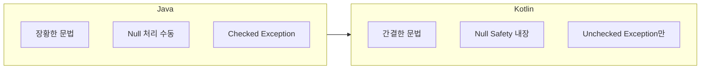
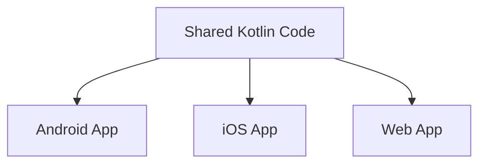

## Kotlin

- Kotlin은 **JetBrains에서 개발한 현대적이고 간결한 programming 언어**입니다.
    - 2011년에 처음 발표되었고, 2016년 1.0 version이 정식 release되었습니다.
    - 2017년 Google이 Android 공식 개발 언어로 채택하면서 널리 확산되었습니다.

- **JVM에서 실행**되며, Java와 100% 호환됩니다.
    - 기존 Java code, library, framework를 그대로 사용할 수 있습니다.
    - Java project에 Kotlin을 점진적으로 도입할 수 있습니다.

- JVM 외에도 **JavaScript, Native로 compile** 가능합니다.
    - Kotlin/JS : web frontend 개발.
    - Kotlin/Native : iOS, desktop application 개발.
    - Kotlin Multiplatform : 여러 platform에서 code를 공유.


### 설계 철학 : Pragmatic Language

- Kotlin은 **학술적 언어가 아닌 실무를 위한 실용적인 언어**입니다.
    - JetBrains가 Java로 IDE를 개발하면서 겪은 불편함을 해결하기 위해 만들었습니다.
    - 새로운 paradigm을 제시하기보다, 기존의 좋은 것들을 실용적으로 조합했습니다.

- Kotlin의 4가지 핵심 원칙 : **Pragmatic, Concise, Safe, Interoperable**.
    - **Pragmatic** : 이론보다 실무를 우선합니다.
    - **Concise** : boilerplate를 줄이고 의도를 명확히 표현합니다.
    - **Safe** : null safety 등 compile time에 오류를 잡아냅니다.
    - **Interoperable** : 기존 Java 생태계와 100% 호환됩니다.

- **OOP와 FP를 상황에 맞게 혼합**하는 multiparadigm 언어입니다.
    - 특정 paradigm을 강제하지 않고, 문제에 맞는 방식을 선택할 수 있습니다.


---


## Kotlin의 핵심 특징

- Kotlin은 **null safety, 간결한 문법, coroutine, 함수형 programming 지원** 등 현대적인 언어 기능을 제공합니다.


### Null Safety

- Kotlin은 **type system 수준에서 null을 구분**하여 `NullPointerException`을 방지합니다.
    - nullable type(`?`)과 non-null type을 명확히 구분합니다.
    - compile time에 null 관련 오류를 감지합니다.

```kotlin
var name: String = "Kotlin"    // non-null, null 할당 불가
var nickname: String? = null   // nullable, null 허용

// safe call operator
val length = nickname?.length  // nickname이 null이면 null 반환

// elvis operator
val len = nickname?.length ?: 0  // null이면 0 반환
```

- Java에서 흔히 발생하는 `NullPointerException`을 언어 차원에서 예방합니다.


### 간결한 문법

- Kotlin은 **boilerplate code를 줄이는 다양한 문법**을 제공합니다.

| 기능 | Java | Kotlin |
| --- | --- | --- |
| Data class | getter, setter, equals, hashCode 직접 구현 | `data class User(val name: String)` |
| Singleton | private 생성자 + static instance | `object Singleton { }` |
| Property | field + getter/setter | `val name: String` |
| String template | `"Hello, " + name` | `"Hello, $name"` |

```kotlin
// data class : equals, hashCode, toString, copy 자동 생성
data class User(val name: String, val age: Int)

// singleton
object DatabaseConfig {
    val url = "jdbc:mysql://localhost:3306/db"
}

// string template
val message = "User: ${user.name}, Age: ${user.age}"
```


### 함수형 Programming 지원

- Kotlin은 **first-class function, lambda, 고차 함수**를 지원합니다.
    - collection 처리에 유용한 `map`, `filter`, `reduce` 등의 함수를 제공합니다.
    - immutable collection을 기본으로 사용하여 안전한 code 작성이 가능합니다.

```kotlin
val numbers = listOf(1, 2, 3, 4, 5)

// lambda와 고차 함수
val doubled = numbers.map { it * 2 }           // [2, 4, 6, 8, 10]
val evens = numbers.filter { it % 2 == 0 }     // [2, 4]
val sum = numbers.reduce { acc, n -> acc + n } // 15

// function type
val operation: (Int, Int) -> Int = { a, b -> a + b }
```


### Extension Function

- **기존 class를 수정하지 않고 새로운 함수를 추가**할 수 있습니다.
    - Java의 utility class 없이 자연스러운 문법으로 기능을 확장합니다.

```kotlin
// String class에 새로운 함수 추가
fun String.addExclamation(): String {
    return this + "!"
}

val greeting = "Hello".addExclamation()  // "Hello!"
```


### Coroutine

- Kotlin은 **언어 차원에서 coroutine을 지원**하여 비동기 programming을 간편하게 처리합니다.
    - 비동기 code를 동기 code처럼 작성할 수 있습니다.
    - thread보다 가볍고 효율적입니다.

```kotlin
suspend fun fetchUser(): User {
    delay(1000)  // 1초 대기 (non-blocking)
    return User("Kotlin", 10)
}

fun main() = runBlocking {
    val user = fetchUser()
    println(user.name)
}
```


---


## Java와의 비교

- Kotlin은 Java의 장점을 유지하면서 단점을 개선한 언어입니다.



| 항목 | Java | Kotlin |
| --- | --- | --- |
| Null 처리 | runtime에 NPE 발생 | compile time에 null check |
| Data class | getter, setter, equals 등 직접 구현 | `data class`로 한 줄 선언 |
| 문자열 처리 | `+` 연산자로 연결 | string template `${}` |
| 함수형 | Java 8부터 lambda 지원 | first-class function 지원 |
| 비동기 | CompletableFuture, RxJava | Coroutine 내장 |
| Smart cast | 명시적 casting 필요 | type check 후 자동 cast |

```kotlin
// smart cast 예시
fun printLength(obj: Any) {
    if (obj is String) {
        // obj가 자동으로 String으로 cast됨
        println(obj.length)
    }
}
```


---


## Kotlin 활용 분야

- Kotlin은 **Android, server-side, multiplatform** 등 다양한 분야에서 활용됩니다.


### Android 개발

- Google의 공식 지원으로 Android 개발의 표준 언어가 되었습니다.
    - Android Studio에서 Kotlin을 완벽히 지원합니다.
    - Jetpack Compose는 Kotlin 전용으로 설계되었습니다.


### Server-side 개발

- **Spring Framework와 완벽히 호환**되어 server-side 개발에 적합합니다.
    - Spring Boot, Spring WebFlux와 함께 사용됩니다.
    - Ktor는 Kotlin 전용 경량 web framework입니다.

```kotlin
@RestController
class UserController(private val userService: UserService) {

    @GetMapping("/users/{id}")
    suspend fun getUser(@PathVariable id: Long): User {
        return userService.findById(id)
    }
}
```


### Multiplatform 개발

- **Kotlin Multiplatform**으로 여러 platform에서 code를 공유할 수 있습니다.
    - business logic을 한 번 작성하고 Android, iOS, web에서 재사용합니다.
    - platform별 UI는 각각 구현하고, 공통 logic만 공유하는 방식입니다.




---


## Reference

- <https://kotlinlang.org/docs/home.html>
- <https://developer.android.com/kotlin>

