## Mermaid.js Class Diagram

- mermaid를 사용해 Class Diagram을 그릴 수 있습니다.

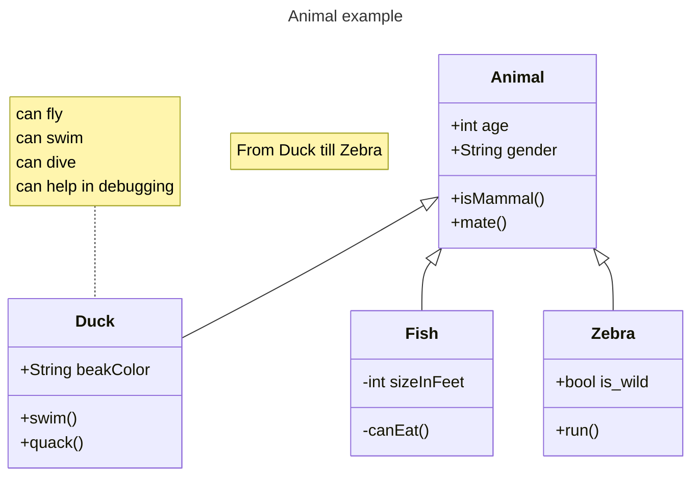


---


## Class 정의하기

- `class` 뒤에 class 이름을 작성하여 class를 정의합니다.
- label 방식과 back quote 방식으로 class 이름에 공백, 특수문자를 넣을 수 있습니다.

```plaintext
classDiagram

class Class
class LabelClass["Class with label !@#"]
class `Class with back quote !@#`
```

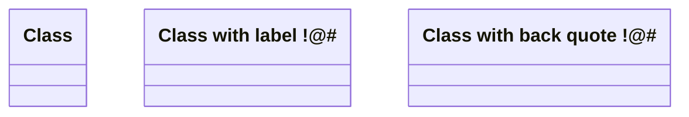


### Annotation 지정하기

- `<<`와 `>>`를 사용합니다.

| 종류 | 문법 |
| --- | --- |
| interface class | `<<interface>>` |
| abstract class | `<<abstract>>` |
| service class | `<<service>>` |
| enum | `<<enumeration>>` |
| custom annotation | `<<custom>>` |


```plaintext
classDiagram

class Class
<<interface>> Class

class BracketClass {
    <<interface>>
}
```

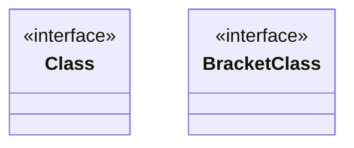


### Note 작성하기

```plaintext
note "[memo]"
note for [class_name] "[memo]"
```

- `note` keyword를 사용하여, class에 설명을 추가할 수 있습니다.
    - class를 지정하지 않으면 연결선 없이 설명만 추가합니다.
- 줄바꿈은 `<br>` tag를 사용합니다.

```plaintext
classDiagram

class Class

note "This is not a class memo.<br>memo one.<br>memo two."
note for Class "This is a class memo.<br>memo one.<br>memo two."
```

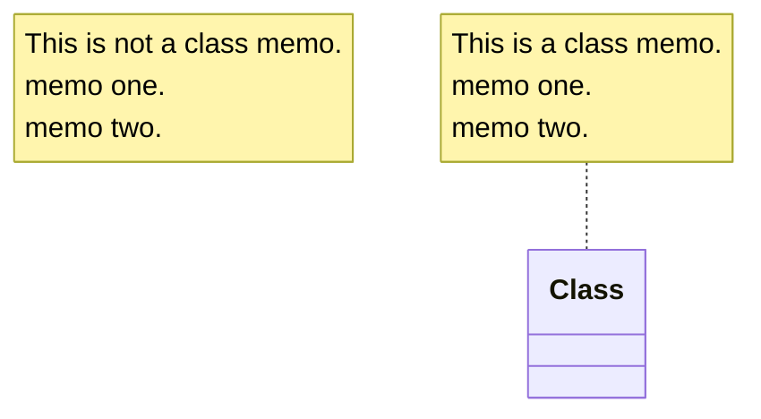


---


## Class Member 정의하기

- class의 member는 중괄호(`{}`) 또는 colon(`:`)으로 정의할 수 있습니다.
- 변수와 함수의 구분은 소괄호(`()`)로 합니다.
    - 함수명 뒤에 소괄호를 붙입니다.

```plaintext
classDiagram

class ColonClass
ColonClass : variable
ColonClass : method()

class BracketClass {
    variable
    method()
}
```

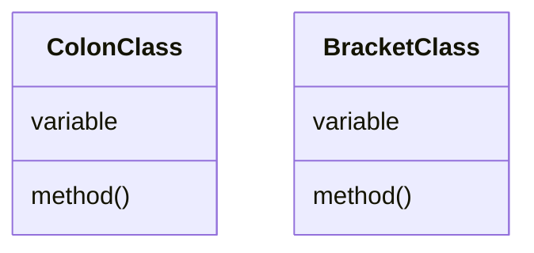


### 자료형 명시하기

```plaintext
[type] variable
method() [type]
```

- 변수의 자료형과 함수 반환 값의 자료형을 표시할 수 있습니다.
    - 변수의 자료형은 변수 앞에 작성합니다.
    - 함수 반환 값의 자료형은 함수 뒤에 작성합니다.

```plaintext
classDiagram

class Class {
    int variable
    String variable
    method() int
    method() String
}
```

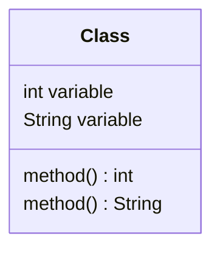


### 함수의 Parameter 정의하기

- 함수의 parameter는 함수의 소괄호 안에 작성합니다.

```plaintext
classDiagram

class Class {
    method()
    method(parameter)
    method(parameter, parameter)
}
```

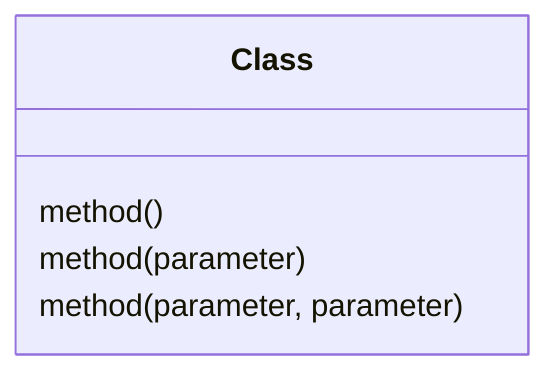


### 접근 제한자 설정하기

- 변수와 함수 앞에 접근 제한자 기호를 붙일 수 있습니다.

| Code | 접근 제한자 |
| --- | --- |
| `+` | Public |
| `-` | Private |
| `#` | Protected |
| `~` | Package/Internal |

```plaintext
classDiagram

class Class {
    +publicVariable
    -privatevariable
    +publicMethod()
    -privateMethod()
}
```

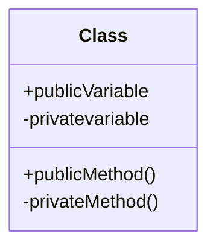


### Generic Type 작성하기

```plaintext
[type]~[generic_type]~
```
- type을 작성할 때, generic type을 물결표시(`~`)로 감쌉니다.

```plaintext
classDiagram

class Class {
    List~int~ variable
    List~List~int~~ variable
    method() List~int~
    method() List~List~int~~
    method(List~int~)
    method(List~List~int~~)
}
```

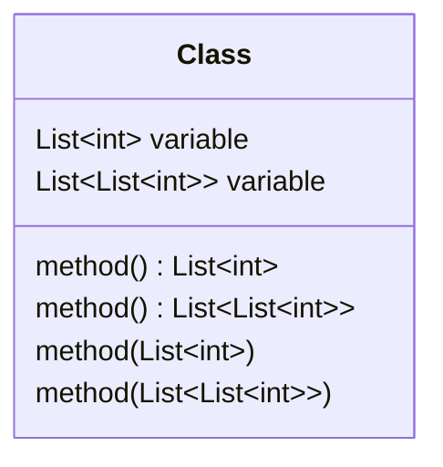


---


## Class 관계 정의하기

```plaintext
classDiagram

RelationA --|> RelationB : 상속 inheritance
RelationC --* RelationD : 합성 composition
RelationE --o RelationF : 집합 aggregation
RelationG --> RelationH : 연관 association
RelationI ..> RelationJ : 의존 dependency
RelationK ..|> RelationL : 구현 realization

LinkA -- LinkB : 연결 solid link
LinkC .. LinkD : 연결 dashed link

TwoWayA <|--|> TwoWayB : 양방향 many to many
```

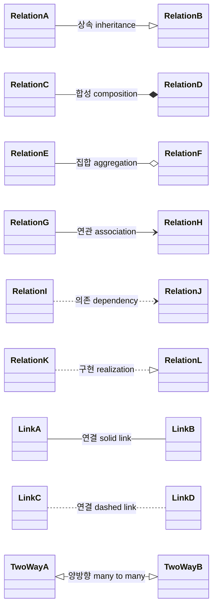


### 관계의 Label 작성하기

```plaintext
[class] [arrow] [target_class] : [label]
```

- label은 화살표 선 사이에 표시됩니다.
- colon(`:`) 뒤에 작성합니다.


```plaintext
classDiagram

LabelA --|> LabelB : this is label text
NoLabelA --|> NoLabelB
```

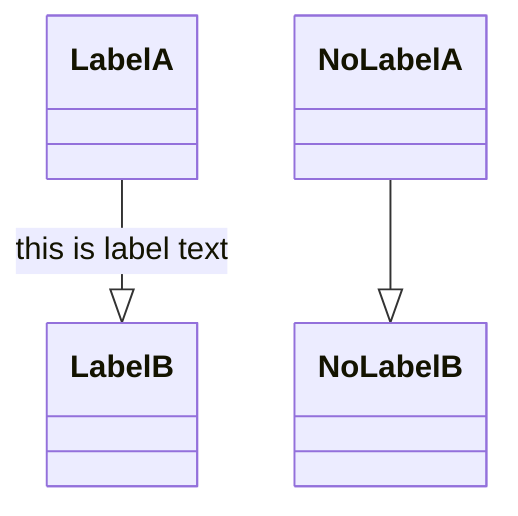


---


## Diagram 방향 설정하기

- `direction` 명령어와 상하좌우를 의미하는 `T`, `B`, `L`, `R` code를 이용하여 화살표의 방향을 설정합니다.

```plaintext
direction [begin][end]
```

| Code | 화살표의 방향 |
| --- | --- |
| `direction TB` | 상 -> 하 |
| `direction BT` | 하 -> 상 |
| `direction LR` | 좌 -> 우 |
| `direction RL` | 우 -> 좌 |


### Top to Bottom (상 -> 하)

```plaintext
classDiagram
direction TB
Begin --|> End
```

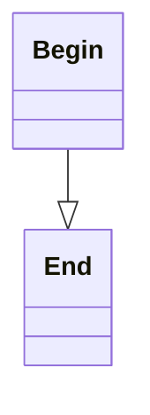


### Bottom to Top (하 -> 상)

```plaintext
classDiagram
direction BT
Begin --|> End
```

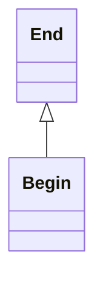


### Left to Right (좌 -> 우)

```plaintext
classDiagram
direction LR
Begin --|> End
```

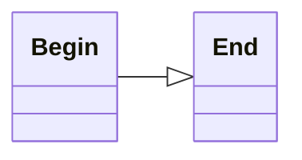


### Right to Left (우 -> 좌)

```plaintext
classDiagram
direction RL
Begin --|> End
```

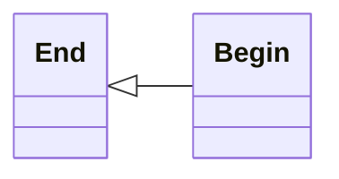


---


## Reference

- <https://mermaid.js.org/syntax/classDiagram.html>
