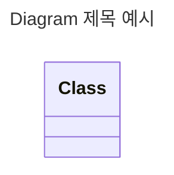
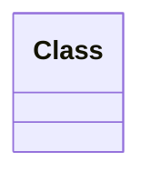

## Mermaid.js Diagram

- text와 code를 작성하여 diagram을 그립니다.
    - code로 작성하기 때문에 수정이 쉽습니다.

<pre>
<code>
```mermaid

```
</code>
</pre>

- mermaid code block 안에 mermaid의 문법에 맞게 작성합니다.


---


## Diagram 제목 작성하기

```txt
---
title: [diagramTitle]
---
```

- 모든 종류의 diagram은 `title` 영역에 제목을 작성할 수 있습니다.

```txt
---
title: Diagram 제목 예시
---

classDiagram
class Class
```




---


## Diagram code 안에 주석 작성하기

- percent 기호 두 개(`%%`)를 사용합니다.

```text
classDiagram

%% 주석입니다.
class Class
```




---


## Reference

- <https://mermaid.js.org/intro/>
