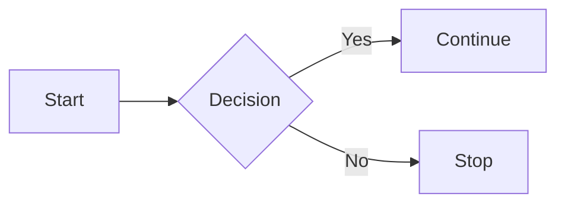
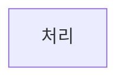
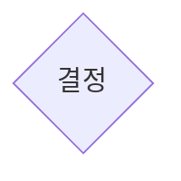
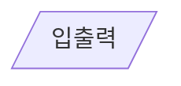
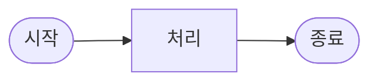
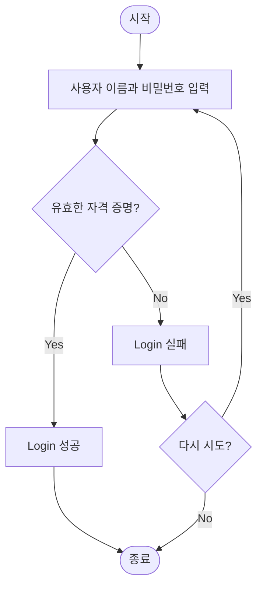
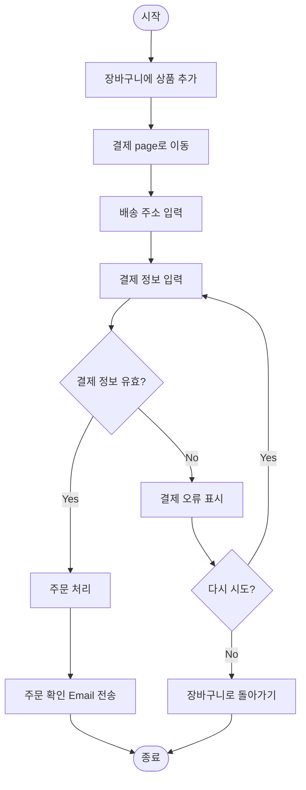

## Flowchart : 순서도, 흐름도

- flowchart는 **process나 algorithm의 단계를 시각적으로 표현하는 diagram**입니다.

- **다양한 모양의 symbol을 사용**하여 각 단계의 특성과 역할을 구분합니다.
    - 각 symbol은 특정 action이나 decision을 나타냅니다.
    - symbol 간의 연결은 arrow나 line을 통해 흐름의 방향을 표시합니다.

- **복잡한 process를 단순화**하여 이해하기 쉽게 만드는 도구입니다.
    - 논리적 구조와 흐름을 한눈에 파악할 수 있습니다.
    - 문제 해결 과정을 step-by-step으로 설계하는 데 도움이 됩니다.

---

## Flowchart의 기본 구성 요소

- flowchart는 **symbol**(도형)과 **flow line**(연결선)으로 구성됩니다.

### Symbol : 기본 도형

- **flowchart에서 사용되는 기본적인 도형**으로, 시작/종료, 처리, 결정, 입출력, 연결 등의 symbol이 있습니다.

#### Terminal Symbol : 시작/종료

- **타원형**이나 **둥근 직사각형**으로 표현합니다.

- **process의 시작과 끝**을 나타냅니다.
- 일반적으로 "시작", "종료", "Start", "End" 등의 text를 포함합니다.

#### Process Symbol : 처리

- **직사각형**으로 표현합니다.

- **계산, data 처리, 변수 할당 등의 작업**을 나타냅니다.
- 하나의 step이나 action을 의미합니다.

#### Decision Symbol : 결정

- **마름모꼴**로 표현합니다.

- **조건에 따른 분기점**을 나타냅니다.
- "예/아니오" 또는 다중 조건에 따른 다양한 경로를 표시합니다.

#### Input/Output Symbol : 입출력

- **평행사변형**으로 표현합니다.

- **data 입력이나 결과 출력**을 나타냅니다.
- 사용자 입력, file 읽기/쓰기, 화면 출력 등의 작업을 표시합니다.

#### Connector Symbol : 연결

- **원형**으로 표현합니다.

- **diagram 내의 다른 부분과 연결**됨을 나타냅니다.
- 복잡한 flowchart에서 line 교차를 줄이기 위해 사용합니다.

### Flow Line : 연결선

- **화살표와 선**으로 표현합니다.

- **화살표는 process의 순서와 방향**을 나타냅니다.
    - 단일 방향 화살표가 일반적으로 사용됩니다.
    - 조건부 분기에서는 각 화살표에 조건을 표기합니다.

- **실선은 일반적인 흐름**을, **점선은 선택적 또는 부가적 흐름**을 나타내기도 합니다.
    - 주요 흐름과 예외 처리 흐름을 구분할 수 있습니다.

---

## Flowchart 작성 기법

- flowchart를 작성할 때는 기본적인 규칙을 따라야 합니다.

### 기본적인 작성 단계

- **시작과 종료 지점을 명확히 정의**합니다.
    - 모든 flowchart는 명확한 시작점과 종료점을 가져야 합니다.
    - 여러 종료점이 있을 수 있지만, 시작점은 일반적으로 하나입니다.

- **주요 단계를 식별**하고 **적절한 symbol로 표현**합니다.
    - 각 단계의 특성에 맞는 symbol을 선택합니다.
    - 단계별 설명은 간결하고 명확하게 작성합니다.

- **단계 간의 논리적 흐름과 연결 관계를 화살표로 표시**합니다.
    - 모든 경로가 연결되도록 주의합니다.
    - 분기점에서 나온 모든 경로가 어딘가로 연결되어야 합니다.

- 조건부 분기에서는 **각 경로에 조건을 명확히 표기**합니다.
    - "Yes/No", "True/False" 등으로 조건을 명시합니다.
    - 복잡한 조건은 추가 설명을 통해 명확히 합니다.

### 추가적인 작성 규칙

- **왼쪽에서 오른쪽**, **위에서 아래**로의 흐름을 유지합니다.
    - 대부분의 사람들이 정보를 읽는 방식과 일치합니다.
    - 일관된 흐름 방향은 diagram 이해도를 높입니다.

- **symbol 크기와 형태를 일관되게 유지**합니다.
    - 같은 종류의 단계는 동일한 크기와 모양의 symbol을 사용합니다.
    - 시각적 일관성은 diagram의 가독성을 향상시킵니다.

- **line 교차를 최소화**하고, 불가피한 경우 jump 표시를 사용합니다.
    - jump 표시란, line이 다른 line을 지나갈 때, 해당 line이 다른 line 위를 뛰어 넘어가는 듯이 표시하는 것을 의미합니다.
        - 교차하는 지점에서, 두 개 중 하나의 line을 반원으로 이어서 그립니다.
    - 교차가 더 복잡한 경우 connector symbol을 활용합니다.

- **복잡한 process는 하위 flowchart로 분리**합니다.
    - 세부 단계가 많은 process는 별도의 diagram으로 표현할 수 있습니다.
    - 주요 flowchart에는 참조 symbol을 사용하여 연결합니다.

---

## Flowchart 예시

- flowchart는 다양한 분야에서 사용됩니다.

### Simple Login Process Flowchart

### Online Order Processing Flowchart

---

## Flowchart 작성 시 주의 사항

- flowchart를 읽는 사람의 관점을 고려하여 작성합니다.
    - 일관되고 명확하게 도형과 연결선을 사용해야 합니다.

### 일반적인 작성 오류와 해결 방법

- 너무 복잡한 flowchart.
    - 한 diagram에 과도한 정보를 포함하지 않습니다.
    - 필요한 경우 여러 개의 연결된 diagram으로 분리합니다.

- 일관성 없는 symbol 사용.
    - 같은 유형의 작업에는 동일한 symbol을 사용합니다.
    - 표준 convention을 따라 symbol을 선택합니다.

- 불명확한 조건 및 분기점.
    - decision symbol에서 나오는 모든 경로에 명확한 조건을 표기합니다.
    - 모호한 조건은 추가 설명을 제공합니다.

- 연결되지 않은 흐름이나 dead end.
    - 모든 경로가 종료점이나 다른 유효한 단계로 연결되는지 확인합니다.
    - 고립된 단계나 연결되지 않은 부분이 없는지 검토합니다.

### Flowchart 검증 방법

- 모든 경로 추적 및 검증하기.
    - 시작점에서 시작하여 모든 가능한 경로를 따라가며 검증합니다.
    - 각 조건부 분기에서 모든 조건이 처리되는지 확인합니다.

- 실제 사례를 통한 검증하기.
    - 실제 data나 scenario를 사용하여 flowchart를 test합니다.
    - 예상치 못한 상황이나 예외 case를 검토합니다.

- peer review 및 stakeholder 검토하기.
    - 다른 team 구성원이나 stakeholder와 함께 검토합니다.
    - 다양한 관점에서 diagram의 정확성과 완전성을 평가합니다.

---

## Reference

- <https://www.gliffy.com/blog/guide-to-flowchart-symbols>

