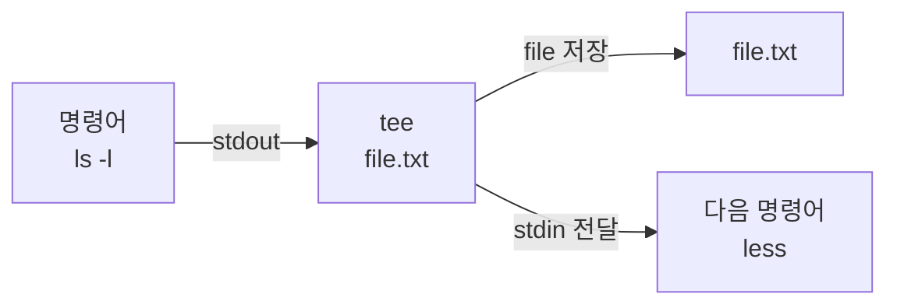

## `tee` : 표준 입력을 file에 저장하는 명령어

- **표준 입력을 읽어서 file에 저장하면서 표준 출력으로도 출력**해주는 명령어입니다.
- pipeline 중간 단계에서 data를 file로 저장하면서, 동시에 다음 명령어로 data를 전달할 수 있습니다.
- 여러 file에 동시에 data를 저장할 수 있습니다.


### 사용법

```sh
command | tee [option] [file_name]
```


### Option

| Option | 설명 |
| --- | --- |
| `-a` | file에 append (덮어쓰지 않음) |
| `-i` | interrupt signal을 무시함 |


### 동작 원리



- 앞의 명령어에서 나온 `stdout`을 받아 동시에 두 가지 작업을 수행합니다.
- 받은 data를 지정한 file에 저장하면서, 동시에 `stdin`으로 뒤의 명령어에 전달합니다.


---


## `tee` 사용 예시

- `tee`는 pipeline 중간에서 data를 file로 저장하면서도 다음 명령어로 data를 전달할 때 유용합니다.


### 표준 출력을 file에 저장하기

```sh
echo "hello" | tee output.txt
```

- `output.txt` file에 "hello"를 저장하면서, 동시에 "hello"를 terminal에 출력합니다.


### pipeline 중간 단계의 data를 file에 저장하기

```sh
cat input.txt | grep "error" | tee error_log.txt | wc -l
```

- `input.txt`에서 "error"를 포함한 행을 찾아 `error_log.txt`에 저장하면서, 동시에 그 행의 개수를 세어 출력합니다.


### 여러 file에 동시에 저장하기

```sh
echo "hello" | tee file1.txt file2.txt file3.txt
```

- "hello"를 `file1.txt`, `file2.txt`, `file3.txt` 세 file에 동시에 저장합니다.


### Append mode로 file에 추가하기

```sh
echo "world" | tee -a output.txt
```

- `output.txt`의 기존 내용을 유지하면서 "world"를 file에 추가합니다.


### 명령어 실행 결과와 error를 모두 file에 저장하기

```sh
command 2>&1 | tee output.txt
```

- 표준 출력(`1`)과 표준 error(`2`)를 모두 `output.txt`에 저장하면서, terminal에도 출력합니다.


### 실시간 log를 monitoring하면서 file에 저장하기

```sh
tail -f application.log | tee monitored_log.txt
```

- 실시간으로 변화하는 `application.log`를 terminal에 출력하면서, 동시에 `monitored_log.txt`에 저장합니다.


---


## Reference

- <https://man7.org/linux/man-pages/man1/tee.1.html>
- <https://www.gnu.org/software/coreutils/manual/html_node/tee-invocation.html>

