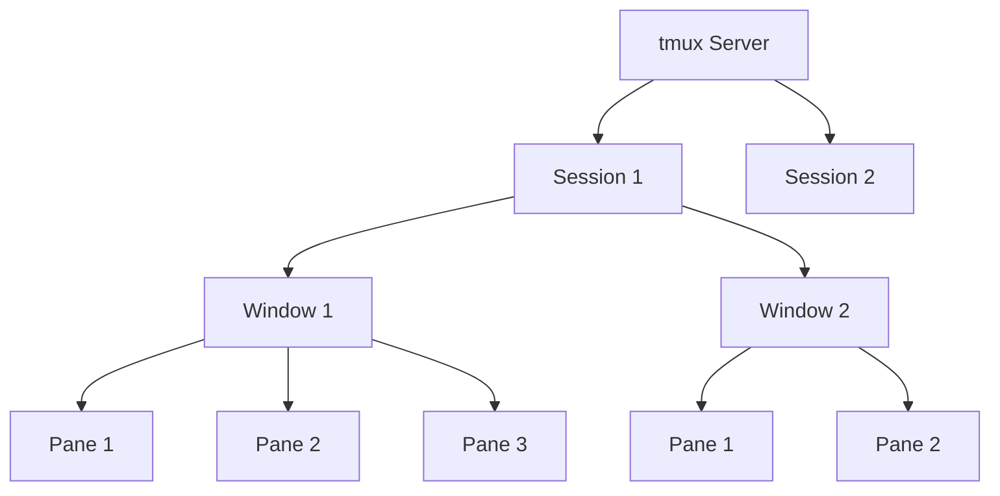

## tmux : Terminal Multiplexer

```sh
tmux
```

- tmux는 하나의 terminal 안에서 여러 작업 환경을 만들고 전환하며 동시에 관리하는 도구입니다.
    - 화면을 분할하여 여러 shell을 동시에 볼 수 있고, session을 분리(detach)했다가 다시 연결(attach)하는 것도 가능합니다.

- terminal 연결이 끊어져도 tmux session은 server에서 계속 실행됩니다.
    - SSH 원격 작업 중 네트워크가 끊어져도 작업이 유지되므로, server 환경에서 특히 유용합니다.


---


## tmux의 구조 : Session, Window, Pane

- tmux는 session, window, pane의 3계층 구조로 이루어져 있습니다.
    - session은 독립된 작업 공간이며, 그 안에 여러 window를 가집니다.
    - window는 하나의 전체 화면이며, 여러 pane으로 분할됩니다.
    - pane은 화면을 나눈 각각의 영역으로, 각 pane에서 독립적인 shell이 실행됩니다.




### Session

- session은 tmux에서 가장 큰 단위의 작업 공간입니다.
- 하나의 session은 독립된 작업 환경이며, 여러 window를 포함합니다.
- session 단위로 detach하고 attach할 수 있으므로, 작업 맥락을 보존한 채 terminal을 닫았다가 다시 열 수 있습니다.


### Window

- window는 session 안에서 하나의 전체 화면을 차지하는 단위입니다.
- browser의 tab과 비슷한 개념으로, 여러 window를 만들어 두고 전환하면서 사용합니다.
- 각 window에는 이름을 지정하여 구분합니다.


### Pane

- pane은 하나의 window를 분할한 영역입니다.
- window 안에서 화면을 수평 또는 수직으로 나누면 각각의 pane이 생성됩니다.
- 각 pane은 독립적인 shell을 실행하므로, 한 화면에서 여러 작업을 동시에 볼 수 있습니다.


---


## tmux의 동작 방식 : Client-Server 구조

- tmux는 client-server 구조로 동작합니다.
    - `tmux` 명령어를 실행하면, background에서 tmux server가 시작되고 client가 server에 연결됩니다.
    - session은 server에서 관리되므로, client(terminal)가 종료되어도 session은 유지됩니다.

- detach는 client와 server의 연결을 끊는 것이고, attach는 다시 연결하는 것입니다.
    - server가 실행 중인 한 session의 상태는 보존됩니다.


---


## Prefix Key

- tmux의 모든 단축키는 prefix key를 먼저 누른 후에 입력합니다.
    - 기본 prefix key는 `Ctrl` + `b`입니다.
    - prefix key를 누른 뒤 손을 떼고, 이어서 명령 key를 입력하는 방식입니다.

- 예를 들어, 화면을 수직으로 분할하려면 `Ctrl` + `b`를 누른 뒤 `%`를 입력합니다.
    - 이 문서에서는 prefix key를 `<prefix>`로 표기합니다.


---


## Session 관련 명령어

- `tmux new`로 session을 생성하고, `tmux attach`로 다시 연결하며, `<prefix>` + `d`로 분리합니다.


### Session 생성

```sh
tmux
tmux new -s my_session
```

| 명령어 | 설명 |
| --- | --- |
| `tmux` | 자동 번호가 부여되는 새 session 생성 |
| `tmux new -s [name]` | 지정한 이름으로 새 session 생성 |


### Session 목록 조회

```sh
tmux ls
```

| 명령어 | 설명 |
| --- | --- |
| `tmux ls` | 현재 실행 중인 모든 session 목록 출력 |
| `<prefix>` + `s` | tmux 내에서 session 목록 확인 및 전환 |


### Session 연결 (Attach)

```sh
tmux attach -t my_session
tmux a -t my_session
```

| 명령어 | 설명 |
| --- | --- |
| `tmux attach -t [name]` | 지정한 session에 다시 연결 |
| `tmux a` | 가장 최근에 사용한 session에 연결 |


### Session 분리 (Detach)

| 명령어 | 설명 |
| --- | --- |
| `<prefix>` + `d` | 현재 session에서 분리, session은 background에서 계속 실행 |


### Session 종료

```sh
tmux kill-session -t my_session
```

| 명령어 | 설명 |
| --- | --- |
| `tmux kill-session -t [name]` | 지정한 session 종료 |
| `tmux kill-server` | tmux server와 모든 session 종료 |
| `exit` | 현재 pane의 shell 종료, 마지막 pane이면 session도 종료 |


---


## Window 관련 단축키

- `<prefix>` + `c`로 window를 생성하고, `<prefix>` + `n`/`p`로 전환하며, `<prefix>` + `&`로 종료합니다.

| 단축키 | 설명 |
| --- | --- |
| `<prefix>` + `c` | 새 window 생성 |
| `<prefix>` + `,` | 현재 window 이름 변경 |
| `<prefix>` + `w` | window 목록 확인 및 전환 |
| `<prefix>` + `n` | 다음 window로 이동 |
| `<prefix>` + `p` | 이전 window로 이동 |
| `<prefix>` + `[번호]` | 해당 번호(0부터 시작)의 window로 이동 |
| `<prefix>` + `&` | 현재 window 종료 (확인 prompt 표시) |


---


## Pane 관련 단축키

- `<prefix>` + `%`/`"`로 pane을 분할하고, `<prefix>` + `방향키`로 pane 간 이동하며, `<prefix>` + `z`로 확대/복원합니다.


### Pane 분할

| 단축키 | 설명 |
| --- | --- |
| `<prefix>` + `%` | 화면을 수직(좌우)으로 분할 |
| `<prefix>` + `"` | 화면을 수평(상하)으로 분할 |


### Pane 이동

| 단축키 | 설명 |
| --- | --- |
| `<prefix>` + `방향키` | 해당 방향의 pane으로 이동 |
| `<prefix>` + `q` | pane 번호 표시 후 번호 입력으로 해당 pane 이동 |
| `<prefix>` + `o` | 다음 pane으로 순서대로 이동 |
| `<prefix>` + `;` | 직전에 사용한 pane으로 이동 |


### Pane 크기 조절

| 단축키 | 설명 |
| --- | --- |
| `<prefix>` + `Ctrl` + `방향키` | 해당 방향으로 pane 크기 조절 |
| `<prefix>` + `z` | 현재 pane 전체 화면 확대 또는 원래 크기 복원 |


### Pane 종료

| 단축키 | 설명 |
| --- | --- |
| `<prefix>` + `x` | 현재 pane 종료 (확인 prompt 표시) |
| `exit` | 현재 pane의 shell 종료 |


---


## 설치

- tmux는 대부분의 Linux 배포판과 macOS에서 package manager를 통해 설치합니다.

```sh
# Ubuntu / Debian
sudo apt install tmux

# CentOS / RHEL
sudo yum install tmux

# macOS (Homebrew)
brew install tmux
```


---


## Reference

- <https://github.com/tmux/tmux/wiki>

