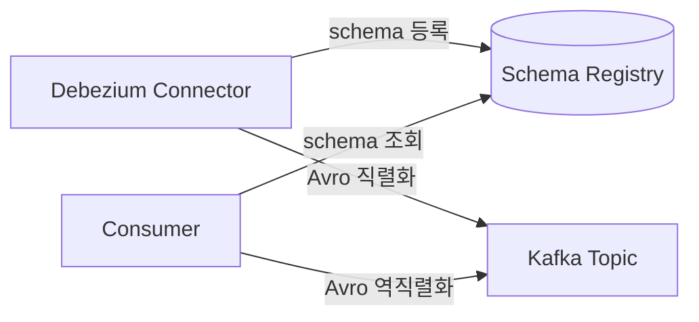
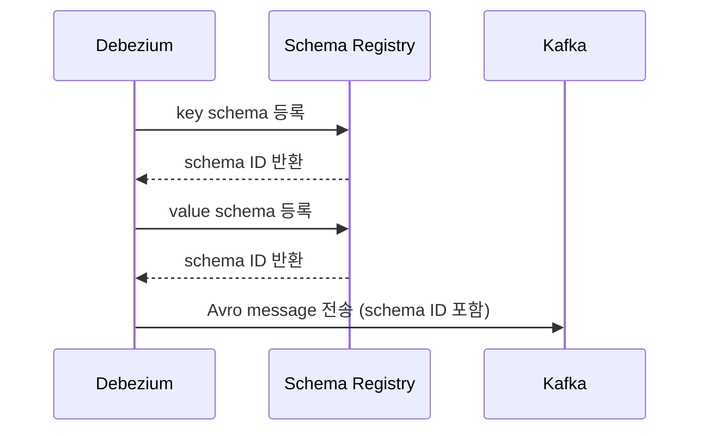

## Debezium의 Avro Serialization

- Debezium은 change event를 **Avro format으로 직렬화**하여 Kafka로 전송합니다.
    - Avro는 Apache에서 개발한 **binary serialization format**입니다.
    - schema 기반으로 data를 직렬화하여 **compact하고 빠른 처리**가 가능합니다.
    - **Schema Registry와 연동**하여 schema 버전 관리와 호환성 검증을 수행합니다.




---


## Avro를 사용하는 이유

- **message 크기 감소** : JSON 대비 50~70% 작은 message 크기를 달성합니다.
    - schema 정보가 message에 포함되지 않고 Schema Registry에 저장됩니다.
    - binary format으로 data를 압축합니다.

- **schema 진화(evolution) 지원** : schema 변경 시 호환성을 보장합니다.
    - backward compatibility : 새 schema로 기존 data를 읽습니다.
    - forward compatibility : 기존 schema로 새 data를 읽습니다.
    - full compatibility : 양방향 호환성을 보장합니다.

- **strong type 지원** : schema를 통해 data type을 명확하게 정의합니다.
    - producer와 consumer 간 data 계약을 보장합니다.
    - deserialization 시 type 검증이 자동으로 수행됩니다.


---


## JSON과 Avro 비교

| 항목 | JSON | Avro |
| --- | --- | --- |
| format | text | binary |
| schema | message에 포함 | Schema Registry에 저장 |
| message 크기 | 큼 | 작음 (50~70% 감소) |
| 처리 속도 | 느림 | 빠름 |
| 가독성 | 높음 | 낮음 (binary) |
| schema 진화 | 제한적 | 강력한 지원 |


---


## Schema Registry 연동

- Debezium은 **Confluent Schema Registry** 또는 **Apicurio Registry**와 연동합니다.
    - schema를 중앙에서 관리하고 version을 추적합니다.
    - producer가 schema를 등록하면 고유한 schema ID가 부여됩니다.
    - consumer는 schema ID로 schema를 조회하여 역직렬화합니다.


### Schema 등록 과정

- Debezium connector가 시작되면 **자동으로 schema를 등록**합니다.
    - key schema와 value schema가 각각 등록됩니다.
    - schema가 변경되면 새 version이 등록됩니다.




---


## Debezium Avro 설정

- Debezium connector에서 Avro converter를 설정합니다.

```json
{
    "key.converter": "io.confluent.connect.avro.AvroConverter",
    "key.converter.schema.registry.url": "http://schema-registry:8081",
    "value.converter": "io.confluent.connect.avro.AvroConverter",
    "value.converter.schema.registry.url": "http://schema-registry:8081"
}
```


### 주요 설정 항목

| 설정 | 설명 |
| --- | --- |
| `key.converter` | key serialization에 사용할 converter class |
| `value.converter` | value serialization에 사용할 converter class |
| `schema.registry.url` | Schema Registry 접속 URL |
| `auto.register.schemas` | schema 자동 등록 여부 (기본값 : true) |
| `use.latest.version` | 최신 schema version 사용 여부 |


---


## Avro Schema 예시

- Debezium이 생성하는 Avro schema 예시입니다.

```json
{
    "type": "record",
    "name": "Envelope",
    "namespace": "mysql.inventory.customers",
    "fields": [
        {
            "name": "before",
            "type": ["null", "Value"],
            "default": null
        },
        {
            "name": "after",
            "type": ["null", "Value"],
            "default": null
        },
        {
            "name": "op",
            "type": "string"
        },
        {
            "name": "ts_ms",
            "type": ["null", "long"],
            "default": null
        }
    ]
}
```


---


## Reference

- <https://debezium.io/documentation/reference/stable/configuration/avro.html>
- <https://debezium.io/blog/2016/09/19/Serializing-Debezium-events-with-Avro>
- <https://docs.confluent.io/platform/current/schema-registry/index.html>
