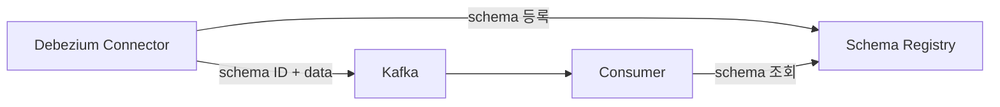

## Debezium의 Avro 직렬화

- Debezium은 database 변경 event를 직렬화하여 Kafka topic으로 전송하며, 기본 직렬화 형식은 **JSON**입니다.
    - JSON은 사람이 읽기 쉽지만, 모든 event에 schema 정보가 포함되어 **message 크기가 커집니다**.
    - 대량의 event를 처리하는 production 환경에서는 network 대역폭과 storage 비용이 증가합니다.

- **Avro**는 Apache에서 개발한 binary 직렬화 형식으로, schema와 data를 분리하여 **compact한 binary encoding**을 수행합니다.
    - Avro를 사용하면 message에 schema가 포함되지 않아 크기가 대폭 줄어듭니다.
    - schema는 **Schema Registry**에서 중앙 관리되며, producer와 consumer가 schema ID만으로 schema를 참조합니다.

- Debezium에서 Avro를 사용하려면 **Avro converter**와 **Schema Registry**를 함께 구성해야 합니다.


### JSON과 Avro 비교

- JSON과 Avro는 직렬화 방식, schema 관리, message 크기에서 근본적인 차이가 있습니다.

| 구분 | JSON | Avro |
| --- | --- | --- |
| **형식** | text 기반 | binary 기반 |
| **schema 포함** | 매 message에 포함 | Schema Registry에서 분리 관리 |
| **message 크기** | 큼 (schema + data) | 작음 (schema ID + data) |
| **가독성** | 사람이 읽기 쉬움 | binary라 직접 읽기 어려움 |
| **schema 호환성 검증** | 별도 검증 없음 | Schema Registry가 자동 검증 |
| **적합한 환경** | 개발/debugging, 소량 event | production, 대량 event 처리 |


---


## Avro Converter 설정

- Debezium에서 Avro를 사용하려면 Kafka Connect의 **key converter**와 **value converter**를 Avro converter로 변경해야 합니다.

```properties
# Kafka Connect worker 설정
key.converter=io.confluent.connect.avro.AvroConverter
key.converter.schema.registry.url=http://schema-registry:8081

value.converter=io.confluent.connect.avro.AvroConverter
value.converter.schema.registry.url=http://schema-registry:8081
```

- `key.converter`는 event key의 직렬화 형식을 지정합니다.
    - event key는 변경된 row의 primary key 정보를 포함합니다.

- `value.converter`는 event value의 직렬화 형식을 지정합니다.
    - event value는 `op`, `before`, `after`, `source`, `ts_ms` 등 변경 사항의 전체 정보를 포함합니다.

- `schema.registry.url`은 Avro schema를 저장하고 조회하는 Schema Registry의 endpoint입니다.


---


## Schema Registry

- **Schema Registry**는 Avro schema를 중앙에서 저장하고 관리하는 독립 service입니다.
    - Confluent Schema Registry가 가장 널리 사용됩니다.
    - Apicurio Registry도 Debezium과 호환됩니다.

- Debezium connector가 처음 event를 전송할 때 Avro schema가 Schema Registry에 자동 등록됩니다.
    - 이후 동일한 schema의 event는 schema ID만 포함하여 전송합니다.
    - consumer는 schema ID로 Schema Registry에서 schema를 조회하여 event를 역직렬화합니다.




### Schema 호환성 검증

- Schema Registry는 schema가 변경될 때 **호환성(compatibility) 검증**을 수행합니다.
    - database table에 column이 추가되거나 삭제되면 Debezium이 생성하는 Avro schema도 변경됩니다.
    - 호환되지 않는 schema 변경이 발생하면 Schema Registry가 등록을 거부하여 consumer의 역직렬화 오류를 사전에 방지합니다.

- Schema Registry의 호환성 mode는 subject 단위로 설정 가능합니다.

| 호환성 Mode | 허용되는 변경 | 설명 |
| --- | --- | --- |
| `BACKWARD` | field 삭제, default 값이 있는 field 추가 | 새 schema로 이전 data 읽기 가능 |
| `FORWARD` | field 추가, default 값이 있는 field 삭제 | 이전 schema로 새 data 읽기 가능 |
| `FULL` | default 값이 있는 field 추가/삭제만 허용 | 양방향 호환 |
| `NONE` | 모든 변경 허용 | 호환성 검증 없음 |

- Debezium 환경에서는 `BACKWARD` 또는 `FULL` mode가 권장됩니다.
    - table schema 변경 시 consumer가 이전 event와 새 event를 모두 처리할 수 있어야 하기 때문입니다.


---


## Avro 사용 시 고려 사항

- Avro는 production 환경에서 성능과 안정성 면에서 유리하지만, 운영 복잡도가 증가합니다.


### Schema Registry 가용성

- Schema Registry가 중단되면 Debezium connector와 consumer 모두 영향을 받습니다.
    - connector는 새로운 schema를 등록하지 못해 event 전송이 실패합니다.
    - consumer는 schema를 조회하지 못해 event 역직렬화가 실패합니다.

- Schema Registry의 고가용성 구성이 필수적입니다.
    - 복수의 Schema Registry instance를 배포하고 load balancer를 구성합니다.
    - client 측 schema caching을 활용하여 일시적인 Schema Registry 장애에 대비합니다.


### Schema 변경 관리

- database table의 DDL 변경은 Avro schema 변경으로 이어집니다.
    - column 추가는 일반적으로 `BACKWARD` 호환성을 만족합니다.
    - column 삭제나 type 변경은 호환성 위반을 일으킬 수 있어 사전 검증이 필요합니다.

- table schema 변경 전에 Schema Registry의 호환성 설정을 확인하고, 필요 시 consumer를 먼저 update해야 합니다.


### Debugging

- Avro는 binary 형식이므로 Kafka topic의 raw data를 직접 읽을 수 없습니다.
    - `kafka-avro-console-consumer`를 사용하면 Avro event를 JSON으로 변환하여 확인 가능합니다.
    - Schema Registry의 REST API를 통해 등록된 schema를 조회 가능합니다.

```bash
# Avro event를 JSON으로 확인
kafka-avro-console-consumer \
    --bootstrap-server localhost:9092 \
    --topic dbserver1.inventory.customers \
    --from-beginning \
    --property schema.registry.url=http://schema-registry:8081
```


---


## Reference

- <https://debezium.io/documentation/reference/stable/configuration/avro.html>
- <https://debezium.io/blog/2016/09/19/Serializing-Debezium-events-with-Avro>

