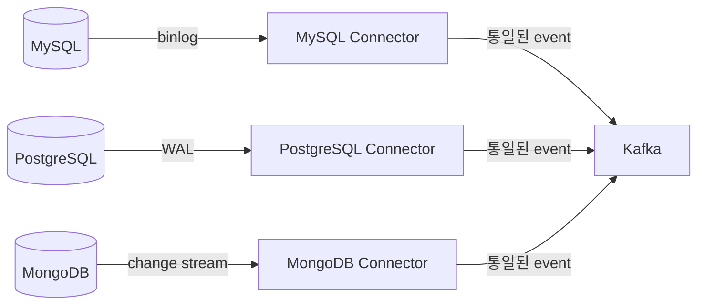

## Debezium의 변경 감지 원리

- Debezium은 **database의 transaction log를 직접 읽어** 변경 사항을 감지하는 log 기반 CDC(Change Data Capture) 방식을 사용합니다.
    - application code를 수정하지 않고도 database의 모든 변경 사항을 실시간으로 capture 가능합니다.
    - polling 방식과 달리 database에 추가 부하를 최소화하면서 millisecond 단위의 지연 시간으로 변경을 감지합니다.

- 각 database는 고유한 transaction log 구조를 갖고 있으며, Debezium은 **database별 전용 connector**를 통해 해당 log를 읽습니다.
    - connector는 database의 replication protocol을 활용하여 log를 수신합니다.
    - 수신한 log를 Debezium의 통일된 event 형식(`op`, `before`, `after`, `source`, `ts_ms`)으로 변환합니다.




---


## MySQL : Binary Log

- Debezium MySQL connector는 **binary log(binlog)**를 읽어 변경 사항을 감지합니다.
    - binlog는 MySQL server에서 실행된 모든 data 변경 사항을 기록하는 log file입니다.
    - 원래 replication 용도로 설계되었으며, Debezium은 replica server처럼 동작하여 binlog를 수신합니다.

- binlog 기반 capture를 사용하려면 MySQL server의 binlog 설정이 필요합니다.

```ini
# MySQL server 설정 (my.cnf)
server-id=1
log_bin=mysql-bin
binlog_format=ROW
binlog_row_image=FULL
```

- `binlog_format`은 반드시 `ROW`로 설정해야 합니다.
    - `STATEMENT` format은 실행된 SQL문만 기록하므로 정확한 변경 값을 추출하지 못합니다.
    - `ROW` format은 변경된 각 row의 before/after 값을 모두 기록합니다.

- `binlog_row_image`는 `FULL`로 설정하는 것이 권장됩니다.
    - `FULL`은 변경된 row의 모든 column 값을 기록합니다.
    - `MINIMAL`로 설정하면 변경된 column만 기록되어 `before` field가 불완전해집니다.


### MySQL GTID Mode

- GTID(Global Transaction Identifier)를 활성화하면 Debezium이 **binlog file 이름과 position 대신 GTID로 읽기 위치를 추적**합니다.
    - binlog file이 rotation되거나 server가 변경되어도 정확한 위치를 식별 가능합니다.
    - failover 시 새로운 primary server의 binlog에서 자동으로 올바른 위치를 찾습니다.

- GTID mode를 사용하려면 MySQL server에서 GTID를 활성화해야 합니다.

```ini
# MySQL GTID 활성화 설정
gtid_mode=ON
enforce_gtid_consistency=ON
```


### MySQL Connector의 권한 설정

- Debezium MySQL connector에는 binlog를 읽기 위한 전용 database 사용자가 필요합니다.

```sql
-- Debezium 전용 사용자 생성
CREATE USER 'debezium'@'%' IDENTIFIED BY 'password';

-- 필수 권한 부여
GRANT SELECT, RELOAD, SHOW DATABASES, REPLICATION SLAVE, REPLICATION CLIENT
    ON *.* TO 'debezium'@'%';
```

- `REPLICATION SLAVE`와 `REPLICATION CLIENT` 권한이 binlog 읽기에 필수입니다.
- `SELECT` 권한은 snapshot 수행 시 table data를 읽기 위해 필요합니다.


---


## PostgreSQL : Write-Ahead Log

- Debezium PostgreSQL connector는 **WAL(Write-Ahead Log)**의 logical decoding을 통해 변경 사항을 감지합니다.
    - WAL은 PostgreSQL이 data 변경을 disk에 기록하기 전에 먼저 작성하는 log입니다.
    - logical decoding은 WAL의 physical 변경 record를 application이 이해할 수 있는 논리적 형태로 변환합니다.

- WAL 기반 capture를 사용하려면 PostgreSQL의 WAL level 설정이 필요합니다.

```ini
# PostgreSQL 설정 (postgresql.conf)
wal_level=logical
max_replication_slots=4
max_wal_senders=4
```

- `wal_level`을 `logical`로 설정해야 logical decoding이 활성화됩니다.
    - 기본값인 `replica`에서는 logical decoding을 사용하지 못합니다.


### Logical Decoding Plugin

- PostgreSQL의 logical decoding은 **output plugin**을 통해 WAL data를 변환합니다.
    - Debezium은 여러 plugin을 지원하며, 환경에 맞는 plugin을 선택해야 합니다.

| Plugin | 특징 |
| --- | --- |
| `pgoutput` | PostgreSQL 10+ 내장, 별도 설치 불필요 |
| `decoderbufs` | Protocol Buffers 형식 출력, Debezium 전용 |
| `wal2json` | JSON 형식 출력, 범용 |

- PostgreSQL 10 이상에서는 `pgoutput`이 기본 권장 plugin입니다.
    - server에 별도 plugin 설치 없이 사용 가능합니다.


### Replication Slot

- Debezium은 **replication slot**을 생성하여 WAL의 변경 사항을 수신합니다.
    - replication slot은 consumer가 읽지 않은 WAL segment가 삭제되지 않도록 보장합니다.
    - connector가 중단되어도 slot이 유지되어 재시작 시 놓친 변경 사항부터 읽기를 재개합니다.

- replication slot이 오래 방치되면 WAL file이 무한히 쌓여 disk 공간 부족이 발생합니다.
    - 사용하지 않는 connector의 replication slot은 반드시 수동으로 삭제해야 합니다.


---


## MongoDB : Change Stream

- Debezium MongoDB connector는 **change stream**을 통해 변경 사항을 감지합니다.
    - change stream은 MongoDB 3.6부터 지원되는 실시간 변경 감지 기능입니다.
    - replica set 또는 sharded cluster 환경에서만 동작합니다.

- change stream은 oplog(operation log)를 기반으로 동작하지만, 직접 oplog를 읽는 것보다 안정적입니다.
    - oplog의 내부 구조 변경에 영향을 받지 않습니다.
    - resume token을 통한 자동 복구를 지원합니다.


### MongoDB Connector의 특수성

- MongoDB는 schema-less database이므로 Debezium의 event 구조에 차이가 있습니다.
    - `before` field는 MongoDB 6.0 이상에서 `changeStreamPreAndPostImages` 설정을 활성화해야 포함됩니다.
    - 하위 version에서는 `after` field만 포함되며, `before` field는 `null`입니다.

- document의 `_id` field가 event key로 사용됩니다.


---


## Database별 Capture 비교

| 구분 | MySQL | PostgreSQL | MongoDB |
| --- | --- | --- | --- |
| **log 유형** | binary log (binlog) | WAL (Write-Ahead Log) | change stream (oplog 기반) |
| **감지 방식** | replication protocol | logical decoding | change stream API |
| **필수 설정** | `binlog_format=ROW` | `wal_level=logical` | replica set 또는 sharded cluster |
| **위치 추적** | binlog file + position 또는 GTID | LSN (Log Sequence Number) | resume token |
| **`before` 지원** | `binlog_row_image=FULL` 시 지원 | 기본 지원 | 6.0+ 설정 시 지원 |
| **권한** | `REPLICATION SLAVE/CLIENT` | `REPLICATION` role | `read` role |


---


## Reference

- <https://debezium.io/documentation/reference/stable/connectors/mysql.html>
- <https://debezium.io/documentation/reference/stable/connectors/postgresql.html>
- <https://debezium.io/documentation/reference/stable/connectors/mongodb.html>

