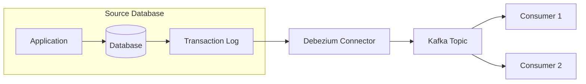

## Debezium의 Change Data Capture

- Debezium은 database의 **transaction log를 읽어 변경 사항을 실시간으로 capture**합니다.
    - application code 수정 없이 data 변경을 감지합니다.
    - database에 추가적인 부하를 최소화합니다.
    - 모든 변경 사항을 순서대로 capture하여 data 일관성을 보장합니다.




---


## Database별 Capture 방식

- 각 database는 고유한 transaction log mechanism을 가지고 있으며, Debezium은 이를 활용하여 변경 사항을 capture합니다.


### MySQL

- MySQL은 **binary log(binlog)** 를 통해 변경 사항을 읽습니다.
    - `ROW` format의 binary log에서 변경 사항을 추출합니다.
    - binary log의 raw data를 Debezium event 형식으로 변환합니다.

- MySQL connector 설정에서 binlog 관련 option을 지정합니다.

```json
{
    "database.hostname": "mysql-server",
    "database.port": "3306",
    "database.user": "debezium",
    "database.password": "password",
    "database.server.id": "184054"
}
```


### PostgreSQL

- PostgreSQL은 **Write-Ahead Log(WAL)** 를 사용합니다.
    - logical decoding을 통해 WAL의 변경 사항을 읽습니다.
    - `pgoutput` 또는 `decoderbufs` plugin을 사용하여 변경 사항을 추출합니다.

- PostgreSQL에서는 logical replication slot을 생성하여 변경 사항을 추적합니다.

```sql
SELECT * FROM pg_create_logical_replication_slot('debezium', 'pgoutput');
```


### MongoDB

- MongoDB는 **oplog(operation log)** 를 활용합니다.
    - replica set의 oplog에서 변경 사항을 읽습니다.
    - oplog의 operation을 Debezium event 형식으로 변환합니다.

- MongoDB connector는 change stream API를 통해 변경 사항을 capture합니다.
    - MongoDB 3.6 이상에서 지원됩니다.
    - resume token을 통해 중단된 지점부터 다시 시작합니다.


### SQL Server

- SQL Server는 **Change Data Capture(CDC)** 기능을 사용합니다.
    - database와 table에 CDC를 활성화해야 합니다.
    - transaction log에서 변경 사항을 별도의 CDC table에 저장합니다.

- CDC 활성화 명령입니다.

```sql
EXEC sys.sp_cdc_enable_db;
EXEC sys.sp_cdc_enable_table @source_schema = 'dbo', @source_name = 'my_table', @role_name = NULL;
```


### Oracle

- Oracle은 **LogMiner** 를 통해 redo log를 분석합니다.
    - archive log mode가 활성화되어 있어야 합니다.
    - supplemental logging이 설정되어 있어야 합니다.


---


## Change Event 구조

- Debezium은 모든 database의 변경 사항을 **표준화된 event 형식**으로 변환합니다.
    - event는 key와 value로 구성됩니다.
    - key는 변경된 row의 primary key 정보를 포함합니다.
    - value는 변경 전후의 data와 metadata를 포함합니다.


### Event Value 구성 요소

| field | 설명 |
| --- | --- |
| `op` | operation type (c : create, u : update, d : delete, r : read/snapshot) |
| `before` | 변경 전 row data (update, delete 시) |
| `after` | 변경 후 row data (create, update 시) |
| `source` | source database 정보 (server name, database, table, position 등) |
| `ts_ms` | event 생성 timestamp |


### Event 예시

- INSERT event 예시입니다.

```json
{
    "op": "c",
    "before": null,
    "after": {
        "id": 1,
        "name": "John",
        "email": "john@example.com"
    },
    "source": {
        "connector": "mysql",
        "name": "mysql-server",
        "db": "inventory",
        "table": "customers"
    },
    "ts_ms": 1704067200000
}
```


---


## Reference

- <https://debezium.io/documentation/reference/stable/connectors/mysql.html>
- <https://debezium.io/documentation/reference/stable/connectors/postgresql.html>
- <https://debezium.io/documentation/reference/stable/connectors/mongodb.html>
- <https://debezium.io/documentation/reference/stable/connectors/sqlserver.html>
- <https://debezium.io/documentation/reference/stable/connectors/oracle.html>
