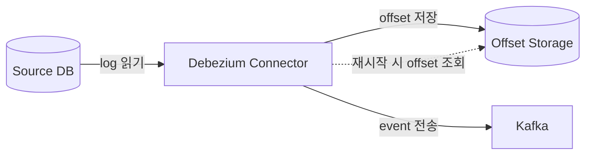

## Log Position

- **log position**은 Debezium connector가 source database의 transaction log에서 **현재 읽고 있는 위치**를 나타내는 정보입니다.
    - MySQL에서는 binlog file 이름과 position, 또는 GTID입니다.
    - PostgreSQL에서는 LSN(Log Sequence Number)입니다.
    - MongoDB에서는 resume token입니다.

- Debezium은 처리한 마지막 log position을 **offset**으로 저장하여, connector 재시작 시 **중단된 지점부터 읽기를 재개**합니다.
    - offset 저장 없이는 connector가 재시작될 때마다 처음부터 log를 다시 읽어야 합니다.
    - offset을 통해 data 누락이나 중복 없이 안정적인 CDC 운영이 가능합니다.




---


## Database별 Log Position 구조

- 각 database는 고유한 transaction log 구조를 갖고 있으며, log position의 구성 요소도 database마다 다릅니다.


### MySQL

- MySQL의 log position은 **binlog file 이름과 position의 조합**, 또는 **GTID**로 표현됩니다.

```json
{
    "file": "mysql-bin.000003",
    "pos": 154,
    "gtids": "05398e1d-efec-11ef-abed-0242ac120005:1-42"
}
```

- `file`과 `pos`는 binlog file 내의 정확한 byte 위치를 가리킵니다.
    - binlog file이 rotation되면 새로운 file 이름과 position 0부터 시작합니다.
    - file 기반 추적은 server 변경 시(failover) 위치를 잃을 수 있습니다.

- `gtids`는 GTID mode 활성화 시 사용되는 위치 정보입니다.
    - server가 변경되어도 GTID는 전역적으로 유일하여 정확한 위치를 식별 가능합니다.
    - GTID 기반 추적이 binlog file 기반보다 안정적입니다.


### PostgreSQL

- PostgreSQL의 log position은 **LSN(Log Sequence Number)**으로 표현됩니다.

```json
{
    "lsn": 23456789,
    "txId": 500
}
```

- LSN은 WAL 내의 byte 위치를 나타내는 64-bit 정수입니다.
    - 단조 증가하므로 event의 순서를 보장합니다.
    - `txId`는 해당 변경이 속한 transaction의 ID입니다.


### MongoDB

- MongoDB의 log position은 **resume token**으로 표현됩니다.

```json
{
    "resumeToken": "826ABF1C000000012B022C0100296E5A..."
}
```

- resume token은 change stream에서 마지막으로 수신한 event의 고유 식별자입니다.
    - oplog의 특정 위치를 가리키며, change stream 재개 시 해당 위치부터 event를 수신합니다.


---


## Offset 저장 방식

- Debezium connector의 offset은 **Kafka Connect의 offset storage**에 저장됩니다.
    - Kafka Connect는 distributed mode와 standalone mode에 따라 offset 저장 위치가 다릅니다.

| 배포 Mode | Offset 저장 위치 | 특징 |
| --- | --- | --- |
| distributed | Kafka 내부 topic (`connect-offsets`) | 고가용성, cluster 공유 |
| standalone | local file system | 단일 node 전용, 장애 시 유실 위험 |

- distributed mode에서는 offset이 Kafka topic에 저장되어 connector가 다른 worker node에서 재시작되어도 offset을 유지합니다.

- standalone mode에서는 offset이 local file에 저장되므로, node 장애 시 offset이 유실될 수 있습니다.
    - production 환경에서는 distributed mode 사용이 권장됩니다.


---


## Offset과 Data 정합성

- offset은 Debezium이 **"어디까지 읽었는가"**를 기록하는 핵심 정보이며, offset 관리가 잘못되면 data 정합성 문제가 발생합니다.


### Offset 유실

- offset이 유실되면 connector는 마지막으로 읽은 위치를 알 수 없습니다.
    - `snapshot.mode`가 `when_needed`로 설정되어 있으면 전체 snapshot을 다시 수행합니다.
    - `initial`로 설정되어 있으면 connector가 시작되지 않을 수 있습니다.


### Offset과 Event 전송의 비동기성

- offset 저장과 Kafka로의 event 전송은 atomic하게 이루어지지 않습니다.
    - event는 전송되었지만 offset이 저장되기 전에 connector가 중단되면, 재시작 시 동일한 event가 다시 전송됩니다.
    - 따라서 Debezium은 **at-least-once delivery**를 보장하며, consumer 측에서 멱등성(idempotency) 처리가 필요합니다.


### Offset Monitoring

- connector의 현재 offset을 monitoring하여 CDC pipeline의 상태를 파악 가능합니다.
    - source database의 현재 log position과 connector의 offset 차이가 **lag**입니다.
    - lag가 지속적으로 증가하면 connector의 처리 속도가 변경 발생 속도를 따라가지 못하는 상황입니다.

- JMX metric을 통해 lag를 확인 가능합니다.
    - `MilliSecondsBehindSource` : source database 대비 지연 시간(millisecond).
    - `NumberOfEventsFiltered` : filtering된 event 수.
    - `TotalNumberOfEventsSeen` : 전체 처리된 event 수.


---


## Reference

- <https://debezium.io/documentation/reference/stable/connectors/mysql.html#mysql-connector-events>
- <https://debezium.io/documentation/reference/stable/connectors/postgresql.html#postgresql-connector-events>
- <https://debezium.io/documentation/reference/stable/connectors/mongodb.html#mongodb-connector-events>

