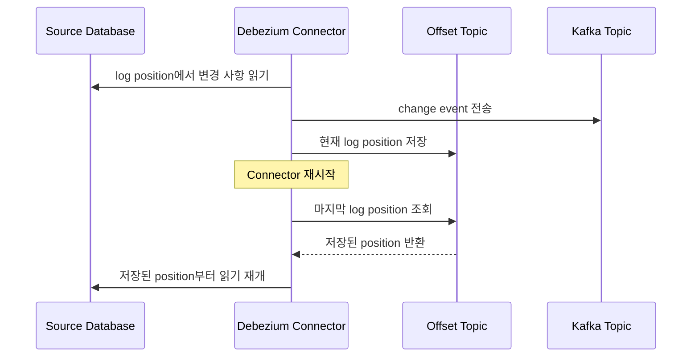

## Debezium의 Log Position

- Debezium은 source system의 transaction log나 commit log에서 변경 사항을 추적합니다.
    - MySQL의 binlog position.
    - PostgreSQL의 WAL(Write-Ahead Log) sequence number.
    - MongoDB의 oplog timestamp.
    - SQL Server의 log sequence number.

---

## Log Position 구성 요소

- log position은 source database의 특정 시점을 고유하게 식별하는 정보를 포함합니다.
    - 고유한 식별자.
    - timestamp 정보.
    - transaction 정보.
    - table별 tracking 정보.

---

## Log Position 활용

- Debezium은 connector가 마지막으로 읽은 위치를 저장하고 추적합니다.
    - connector가 재시작되어도 이전에 처리한 지점부터 다시 시작합니다.
    - data 손실이나 중복을 방지합니다.

- Debezium은 offset을 통해 log position을 관리합니다.
    - offset 정보는 Kafka Connect의 offset topic에 저장됩니다.
    - connector의 장애 상황에서도 안정적으로 복구합니다.

---

## Log Position 주요 기능

- exactly-once delivery를 보장합니다.
    - 동일한 변경 사항이 중복으로 전달되는 것을 방지합니다.
    - source에서 target으로 신뢰성 있는 data를 전달합니다.

- 실시간 변경 사항을 추적합니다.
    - millisecond 단위의 정밀한 tracking을 지원합니다.
    - source system의 부하를 최소화하면서 변경 사항을 포착합니다.

---

## Log Position Monitoring

- connector의 metric을 통해 현재 log position을 확인합니다.
    - 처리된 event의 수량.
    - 마지막으로 처리된 log position 정보.
    - lag monitoring 정보.

- JMX를 통해 상세한 monitoring을 수행합니다.
    - connector의 health check.
    - performance metric.
    - error 발생 현황.

---

## Reference

- <https://debezium.io/documentation/reference/stable/connectors/mysql.html#mysql-connector-events>
- <https://debezium.io/documentation/reference/stable/connectors/postgresql.html#postgresql-connector-events>
