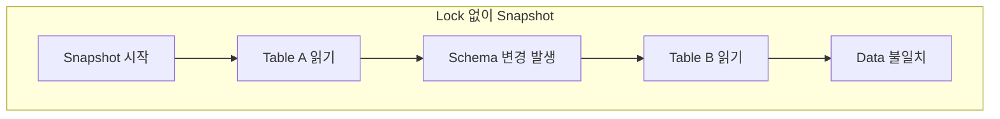

## Snapshot 시 Lock이 필요한 이유

- snapshot 수행 중 **schema 변경이 발생하면 data 불일치**가 발생합니다.
    - column 추가/삭제 중 snapshot이 진행되면 일부 row는 이전 schema로, 일부는 새 schema로 capture됩니다.
    - table 삭제나 이름 변경 시 snapshot이 실패합니다.

- **transaction log position과 snapshot data 간의 일관성**을 보장해야 합니다.
    - snapshot 시작 시점의 log position을 기록합니다.
    - 해당 position 이후의 변경 사항은 streaming에서 capture합니다.




---


## snapshot.locking.mode 설정

- Debezium은 `snapshot.locking.mode` 설정을 통해 lock 전략을 선택합니다.
    - lock 전략에 따라 **data 일관성과 service 가용성 사이의 균형**이 달라집니다.


### minimal (기본값)

- **schema capture 단계에서만 짧은 시간 lock을 획득**합니다.
    - global read lock을 획득하여 schema 정보를 수집합니다.
    - schema 수집이 완료되면 즉시 lock을 해제합니다.
    - data 읽기는 `REPEATABLE READ` transaction으로 진행합니다.

- 대부분의 운영 환경에서 권장되는 설정입니다.
    - service에 미치는 영향을 최소화합니다.
    - transaction isolation으로 data 일관성을 보장합니다.


### extended

- **snapshot이 완료될 때까지 lock을 유지**합니다.
    - 전체 snapshot 과정 동안 write 작업이 block됩니다.
    - 가장 강력한 data 일관성을 보장합니다.

- 대용량 table에서는 service 중단 시간이 길어질 수 있습니다.
    - schema 변경이 빈번한 환경에서 유용합니다.
    - 짧은 maintenance window에서 snapshot을 수행할 때 사용합니다.


### none

- **lock을 전혀 사용하지 않습니다**.
    - snapshot 중 schema 변경이 발생하면 data 불일치가 발생합니다.
    - service 중단 없이 snapshot을 수행합니다.

- schema 변경이 없는 환경에서만 사용합니다.
    - lock 권한이 없는 database 계정에서 유용합니다.
    - data 불일치 위험을 감수해야 합니다.


### custom

- **사용자 정의 lock 전략을 적용**합니다.
    - `snapshot.locking.mode.custom.name` 설정으로 custom class를 지정합니다.
    - 특수한 요구사항이 있는 환경에서 사용합니다.


---


## Database별 Lock 동작

- database 종류에 따라 lock mechanism이 다르게 동작합니다.


### MySQL / MariaDB

- **Global Read Lock**을 사용합니다.
    - `FLUSH TABLES WITH READ LOCK` 명령을 실행합니다.
    - 모든 table에 대한 write 작업이 block됩니다.

- lock 권한이 없는 경우 **table level lock**으로 대체합니다.
    - `LOCK TABLES ... READ` 명령을 실행합니다.
    - snapshot 대상 table에만 lock이 적용됩니다.

| 설정 | lock 동작 |
| --- | --- |
| minimal | schema capture 시 global read lock 획득 후 해제 |
| extended | snapshot 완료까지 global read lock 유지 |
| none | lock 사용 안 함 |


### PostgreSQL

- **별도의 lock 없이 MVCC로 일관성을 보장**합니다.
    - `SERIALIZABLE` 또는 `REPEATABLE READ` isolation level을 사용합니다.
    - snapshot 수행 중에도 write 작업이 가능합니다.

- `snapshot.locking.mode` 설정과 무관하게 service 영향이 없습니다.


### Oracle

- **Flashback Query**를 사용하여 lock 없이 일관성을 보장합니다.
    - SCN(System Change Number) 기준으로 과거 시점의 data를 조회합니다.
    - undo segment를 통해 일관된 view를 제공합니다.


### SQL Server

- **snapshot isolation**을 사용합니다.
    - database에 snapshot isolation이 활성화되어 있어야 합니다.
    - tempdb에 version 정보가 저장됩니다.


### MongoDB

- **oplog를 기반으로 일관성을 보장**합니다.
    - snapshot 시작 시점의 oplog timestamp를 기록합니다.
    - 별도의 lock 없이 동작합니다.


---


## Lock Timeout 설정

- `snapshot.lock.timeout.ms` 설정으로 lock 획득 timeout을 지정합니다.
    - 기본값 : 10000 (10초)
    - lock 획득에 실패하면 connector가 오류와 함께 종료됩니다.

```json
{
    "snapshot.locking.mode": "minimal",
    "snapshot.lock.timeout.ms": "30000"
}
```


---


## Lock 사용 시 주의사항

- **운영 환경에서는 minimal mode를 권장**합니다.
    - service 중단 시간을 최소화합니다.
    - 대부분의 경우 transaction isolation으로 충분한 일관성을 보장합니다.

- **lock 권한 확인이 필요**합니다.
    - MySQL에서 global read lock은 `RELOAD` 권한이 필요합니다.
    - 권한이 없으면 connector 시작이 실패합니다.

- **대용량 table에서는 snapshot 시간을 고려**합니다.
    - extended mode에서는 snapshot 완료까지 write가 block됩니다.
    - incremental snapshot 기능으로 lock 시간을 분산합니다.


---


## Reference

- <https://debezium.io/documentation/reference/stable/connectors/mysql.html#mysql-property-snapshot-locking-mode>
- <https://debezium.io/documentation/reference/stable/connectors/postgresql.html#postgresql-property-snapshot-locking-mode>
- <https://debezium.io/documentation/reference/stable/connectors/oracle.html#oracle-property-snapshot-locking-mode>
