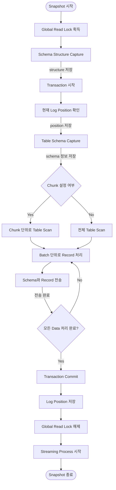

## Debezium Snapshot 과정 : Schema 및 Data Capture

- Debezium의 snapshot은 **source database의 현재 상태를 일괄적으로 capture하여 target system으로 전송하는 작업**입니다.

### 1. Transaction 준비

- transaction을 `REPEATABLE READ` isolation level로 시작하여 data 일관성을 보장합니다.
    - 이는 snapshot 진행 중 발생하는 변경 사항으로부터 영향을 받지 않게 합니다.

- global read lock을 획득하여 table schema 변경을 방지합니다.

- database의 현재 log position을 저장합니다.
    - 저장된 position은 이후 streaming process의 시작점으로 사용됩니다.

### 2. Schema Capture

- database의 metadata를 수집합니다.
    - table 목록을 조회하고, 각 table의 column, index 등의 구조적 정보를 수집합니다.

### 3. Data Capture

- table scanning을 통해 모든 record를 읽어 들입니다.
    - Chunk 설정이 있다면 chunk 단위로 나누어 처리합니다.
    - 설정이 없다면 table 전체를 한 번에 처리합니다.

- 읽어 들인 record를 create event 형태로 변환합니다.

- schema 정보와 record data를 target system으로 전송합니다.
    - 각 table마다 지정된 topic으로 전송합니다.
    - event 순서를 보장하며 전송합니다.

### 4. Snapshot 완료

- transaction을 commit하고, global read lock을 해제합니다.

- change log streaming process를 시작합니다.
    - binlog나 WAL을 통해 snapshot 이후의 변경 사항을 실시간으로 capture합니다.
