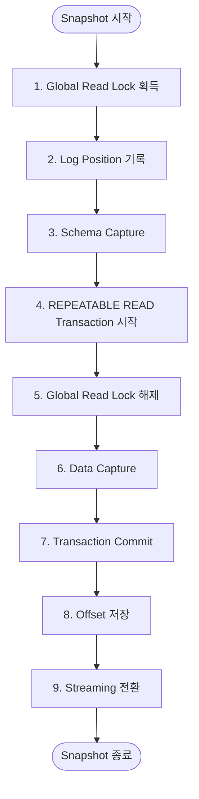
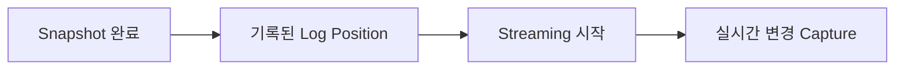

## Snapshot Process 개요

- Debezium의 snapshot process는 **source database의 현재 상태를 일관성 있게 capture하여 target system으로 전송하는 일련의 단계**입니다.
    - connector가 처음 시작되거나 offset이 유실된 경우에 실행됩니다.
    - snapshot이 완료된 후 streaming 단계로 자동 전환되어 실시간 변경 사항을 capture합니다.

- snapshot은 **schema capture와 data capture**의 두 가지 주요 작업으로 구성됩니다.
    - schema capture : table 구조, column 정보, index 등 metadata를 수집합니다.
    - data capture : table의 모든 record를 읽어 create event로 변환하여 전송합니다.

```mermaid
flowchart TD
    start([Snapshot 시작])
    lock[1. Global Read Lock 획득]
    log_pos[2. Log Position 기록]
    schema[3. Schema Capture]
    tx[4. REPEATABLE READ Transaction 시작]
    unlock[5. Global Read Lock 해제]
    data[6. Data Capture]
    commit[7. Transaction Commit]
    save[8. Offset 저장]
    stream[9. Streaming 전환]
    done([Snapshot 종료])

    start --> lock
    lock --> log_pos
    log_pos --> schema
    schema --> tx
    tx --> unlock
    unlock --> data
    data --> commit
    commit --> save
    save --> stream
    stream --> done
```

---

## Snapshot 단계별 상세 과정

- snapshot은 lock 획득부터 streaming 전환까지 순차적으로 진행됩니다.

### 1. Global Read Lock 획득

- snapshot의 첫 단계에서 **global read lock을 획득하여 database 전체의 DDL 변경을 차단**합니다.
    - MySQL에서는 `FLUSH TABLES WITH READ LOCK` 명령을 실행합니다.
    - 모든 table의 cache를 disk에 기록하고 read lock을 설정합니다.

- global read lock이 유지되는 동안 어떤 session도 table 구조를 변경하거나 data를 쓸 수 없습니다.
    - `snapshot.locking.mode`가 `minimal`인 경우, schema capture와 log position 기록이 끝나면 즉시 해제됩니다.

### 2. Log Position 기록

- **현재 시점의 transaction log 위치를 기록**합니다.
    - MySQL : binlog file 이름과 position, 또는 GTID를 기록합니다.
    - PostgreSQL : LSN(Log Sequence Number)을 기록합니다.

- 기록된 log position은 두 가지 용도로 사용됩니다.
    - snapshot 완료 후 streaming 단계의 시작점으로 사용됩니다.
    - connector offset으로 저장되어 재시작 시 참조됩니다.

### 3. Schema Capture

- **database의 metadata를 수집하여 table 구조 정보를 저장**합니다.
    - capture 대상 database와 table 목록을 조회합니다.
    - 각 table의 column 이름, data type, nullable 여부, primary key 정보를 수집합니다.

- 수집된 schema 정보는 **schema history topic**(Kafka topic)에 저장됩니다.
    - schema history는 이후 streaming 단계에서 DDL 변경을 추적하는 기준이 됩니다.

### 4. REPEATABLE READ Transaction 시작

- **`REPEATABLE READ` isolation level의 transaction을 시작**합니다.
    - MySQL InnoDB에서는 `START TRANSACTION WITH CONSISTENT SNAPSHOT` 명령을 실행합니다.
    - transaction 시작 시점의 data 상태가 고정되어, 이후 다른 session의 변경 사항이 보이지 않습니다.

- MVCC(Multi-Version Concurrency Control)를 통해 lock 없이도 일관된 data 읽기가 가능합니다.

### 5. Global Read Lock 해제

- schema capture가 완료되고 `REPEATABLE READ` transaction이 시작된 후 **global read lock을 즉시 해제**합니다.
    - `snapshot.locking.mode`가 `minimal`인 경우에만 이 시점에서 해제됩니다.
    - `extended` mode에서는 snapshot 전체가 완료될 때까지 lock이 유지됩니다.

- lock이 해제된 이후에도 `REPEATABLE READ` transaction이 data 일관성을 유지합니다.

### 6. Data Capture

- **table의 모든 record를 읽어 Debezium event로 변환하여 Kafka topic으로 전송**합니다.
    - 각 record는 `op` field가 `r`(read)인 create event로 변환됩니다.
    - event의 `source.snapshot` field가 `true`로 설정되어 snapshot event임을 식별 가능합니다.

- data는 **batch 단위로 처리**됩니다.
    - `snapshot.fetch.size` 설정으로 한 번에 읽어 들이는 record 수를 조절합니다.
    - 기본값은 2000이며, memory 상황에 따라 조정합니다.

- 대용량 table의 경우 **chunk 단위 처리**가 가능합니다.
    - primary key 기준으로 table을 분할하여 순차적으로 처리합니다.
    - memory 부하를 분산시키고 안정적인 처리를 보장합니다.

### 7. Transaction Commit 및 Offset 저장

- 모든 table의 data capture가 완료되면 **transaction을 commit**합니다.

- 2단계에서 기록한 **log position을 offset으로 저장**합니다.
    - offset은 Kafka Connect의 offset storage에 저장됩니다.
    - 저장된 offset은 streaming 단계의 시작점이자 connector 재시작 시 참조 정보입니다.

---

## Snapshot에서 Streaming으로의 전환

- snapshot이 완료되면 connector는 **자동으로 streaming 단계로 전환**됩니다.
    - streaming은 snapshot 시 기록한 log position부터 시작합니다.
    - snapshot 진행 중에 발생한 변경 사항은 streaming 단계에서 순차적으로 처리됩니다.

```mermaid
flowchart LR
    snapshot[Snapshot 완료]
    log_pos[기록된 Log Position]
    streaming[Streaming 시작]
    realtime[실시간 변경 Capture]

    snapshot --> log_pos
    log_pos --> streaming
    streaming --> realtime
```

- snapshot과 streaming 사이에 data 공백이 발생하지 않습니다.
    - snapshot 시 기록한 log position 이후의 모든 변경 사항이 streaming에서 capture됩니다.
    - 중복 event가 발생할 수 있으며, consumer 측에서 멱등성 처리가 필요합니다.

---

## Snapshot 실패와 재시도

- snapshot 도중 오류가 발생하면 connector는 실패 상태가 됩니다.
    - network 단절, database 연결 끊김, memory 부족 등이 원인입니다.

- connector를 재시작하면 **snapshot을 처음부터 다시 수행**합니다.
    - 부분적으로 완료된 snapshot은 이어서 수행되지 않습니다.
    - 이미 Kafka topic에 전송된 event는 중복으로 재전송됩니다.

- snapshot 실패를 방지하기 위한 사전 점검이 중요합니다.
    - database connection timeout을 충분히 설정합니다.
    - JVM heap size를 대상 table 크기에 맞게 설정합니다.
    - `snapshot.fetch.size`를 memory 상황에 맞게 조정합니다.

---

## Reference

- <https://debezium.io/documentation/reference/stable/connectors/mysql.html#mysql-snapshots>
- <https://debezium.io/documentation/reference/stable/connectors/postgresql.html#postgresql-snapshots>

