## Git Commit 삭제하기

```bash
git reset [option] [hash_of_commit]  # 최신 commit 삭제
git rebase -i [hash_of_commit]  # 중간 commit 삭제
git revert [hash_of_commit]  # 안전한 방법으로 commit 취소
```

- Git에서 commit을 삭제하는 방법은 삭제하려는 commit의 위치와 상황에 따라 다릅니다.
- 최신 commit을 삭제하는 것은 비교적 간단하지만, 중간에 있는 과거의 commit을 삭제할 때는 더 신중한 접근이 필요합니다.
- 주요 방법으로는 `git reset`, `git rebase -i`, `git revert`가 있으며, 각각 다른 상황에서 적합합니다.

- 인자로 사용하는 `hash_of_commit`은 commit의 hash value이며, `git log` 명령어로 확인할 수 있습니다.
- `hash_of_commit`은 hash value 대신 `HEAD~n` 형태로도 지정할 수 있습니다.
    - `HEAD~n`의 `n`은 현재 HEAD에서 n번째 이전 commit을 의미하는 숫자입니다.

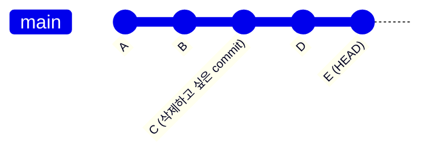


---


## 최신 Commit 삭제하기

```bash
git reset [option] [hash_of_commit]
git reset [option] HEAD~[n]
```

- 가장 최근에 만든 commit을 삭제하는 것은 `git reset`을 사용하여 간단히 처리할 수 있습니다.
- reset의 종류에 따라 작업 내용의 보존 여부가 달라지므로 상황에 맞게 선택해야 합니다.

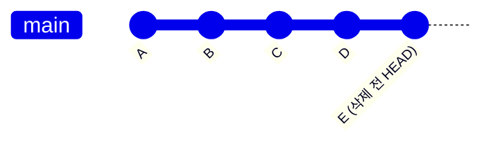

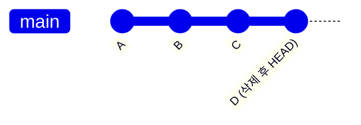


### Soft Reset 사용하기

```bash
git reset --soft HEAD~1
```

- `git reset --soft HEAD~1`은 가장 최근 commit만 취소하고 변경 사항은 staging area에 그대로 유지합니다.
- commit message를 다시 작성하거나 추가 수정 후 다시 commit하고 싶을 때 유용합니다.


### Mixed Reset 사용하기

```bash
git reset HEAD~1
git reset --mixed HEAD~1
```

- `git reset HEAD~1` 또는 `git reset --mixed HEAD~1`은 commit을 취소하고 변경 사항을 unstaged 상태로 되돌립니다.
- 가장 일반적으로 사용되는 방법으로, 필요에 따라 변경 사항을 다시 수정할 수 있습니다.


### Hard Reset 사용하기

```bash
git reset --hard HEAD~1
```

- `git reset --hard HEAD~1`은 commit과 모든 변경 사항을 완전히 삭제합니다.
- **복구가 불가능**하므로 정말 필요한 경우에만 사용해야 합니다.


---


## 중간 Commit 삭제하기

```bash
git rebase [option] [hash_of_commit]
git reset [option] HEAD~[n]
```

- commit history 중간에 있는 특정 commit을 삭제할 때는 interactive rebase가 가장 효과적입니다.
- 이 방법을 사용하면 선택적으로 commit을 제거하면서 나머지 history는 유지할 수 있습니다.


### Interactive Rebase로 삭제하기

```bash
git reset [option] HEAD~5
```

- `git rebase -i HEAD~n` 명령어로 최근 n개의 commit을 대상으로 rebase를 시작합니다.
- 삭제하려는 commit이 5번째 전에 있다면 `git rebase -i HEAD~5`를 실행합니다.

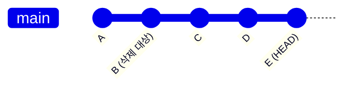

- text editor가 열리면 다음과 같은 화면이 나타납니다:

```
pick abc1234 A
pick def5678 B (삭제 대상)
pick ghi9012 C
pick jkl3456 D
pick mno7890 E
```

- 삭제하려는 commit 앞의 `pick`을 `drop` 또는 `d`로 변경합니다:

```
pick abc1234 A
drop def5678 B (삭제 대상)
pick ghi9012 C
pick jkl3456 D
pick mno7890 E
```

- editor를 저장하고 종료하면 rebase가 실행되어 해당 commit이 제거됩니다.


### Conflict 발생 시 처리 방법

- commit을 삭제하는 과정에서 conflict가 발생할 수 있습니다.
- 삭제하려는 commit의 변경 사항을 다른 commit에서 참조하는 경우에 주로 발생합니다.

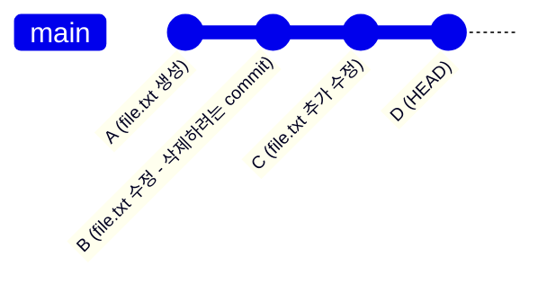

- conflict가 발생하면, 반드시 해결한 후 rebase를 계속 진행해야 합니다.
    1. `git status`로 conflict 파일 확인.
    2. conflict marker를 참고하여 file 수정.
    3. `git add <filename>`으로 해결된 file을 staging.
    4. `git rebase --continue`로 rebase 계속 진행.


---


## 여러 Commit 동시에 삭제하기

- 연속된 여러 commit을 한 번에 삭제할 때도 interactive rebase를 사용할 수 있습니다.
- 각 commit에 대해 개별적으로 `drop`을 설정하거나, commit 범위를 조정하여 처리합니다.


### 연속된 Commit 삭제하기

```bash
git rebase -i HEAD~5
```

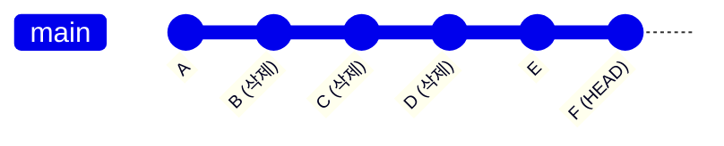

- `git rebase -i HEAD~5`를 실행하여 다음과 같이 설정합니다:

```
pick abc1234 A
drop def5678 B
drop ghi9012 C  
drop jkl3456 D
pick mno7890 E
pick pqr1234 F
```

- 결과적으로 B, C, D commit이 모두 제거됩니다.


### 특정 범위까지 Reset하기

```bash
git reset --hard [hash_of_commit]
```

- 특정 지점 이후의 모든 commit을 삭제하려면 `git reset`을 사용하는 것이 더 간단합니다.
- `git reset --hard [hash_of_commit]`를 사용하여 해당 commit 이후의 모든 commit을 삭제하고, 작업 directory도 해당 상태로 되돌립니다.

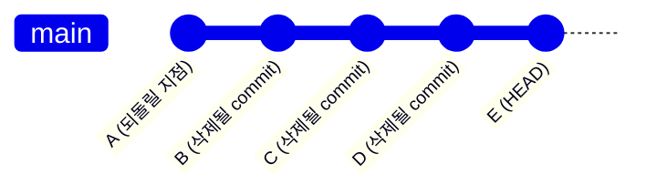

- `git reset --hard hash_of_commit_a`를 실행하면, A commit 상태로 되돌아갑니다.

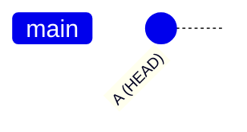


---


## Git Revert로 안전하게 취소하기

```bash
git revert [hash_of_commit]
```

- 이미 remote repository에 push된 commit을 삭제할 때는 `git revert`를 사용하는 것이 안전합니다.
- revert는 commit을 삭제하는 것이 아니라 해당 commit의 변경 사항을 취소하는 새로운 commit을 생성합니다.


### 단일 Commit Revert하기

```bash
git revert 9d956a0b5a4b8d98a1c5858d0b6c643498563uf1
```

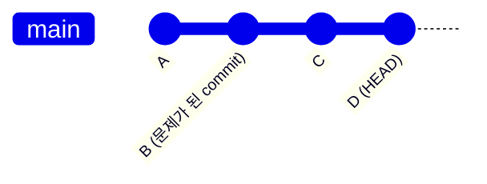

- `git revert hash_of_commit_b`를 실행하면 B의 변경 사항을 되돌리는 새로운 commit이 생성됩니다.

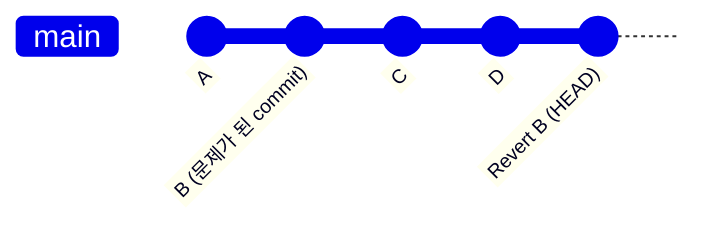

### 여러 Commit Revert하기

```bash
git revert 9d956a0b5a4b8d98a1c5858d0b6c643498563uf1 e1e661dedb5948ed29deaf982d084496cd0uf935
```

- 여러 commit을 순서대로 revert할 수 있습니다.
- `git revert hash_of_commit_b hash_of_commit_c`로 한 번에 여러 commit을 revert합니다.

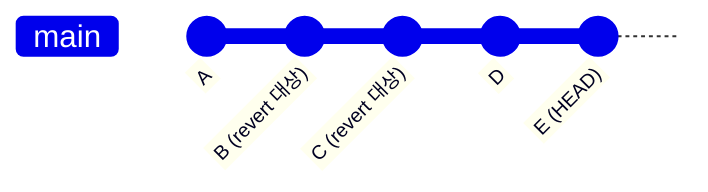

- revert 명령어를 실행하면, C와 B의 변경 사항을 취소하는 새로운 commit이 생성됩니다.

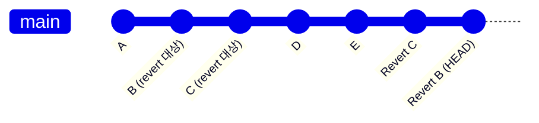


---


## 상황별 적절한 방법 선택하기

- commit 삭제 방법은 repository의 현재 상태와 협업 환경을 고려하여 신중하게 선택해야 합니다.
- 각 방법의 특성과 위험도를 이해하고 상황에 맞는 최적의 선택을 해야 합니다.


### Local에서만 작업한 경우

- 아직 remote에 push하지 않은 commit은 자유롭게 수정할 수 있습니다.
- **최신 commit 삭제** : `git reset --soft HEAD~1` (변경 사항 보존).
- **중간 commit 삭제** : `git rebase -i HEAD~n` (선택적 삭제).
- **특정 지점까지 삭제** : `git reset --hard <commit-hash>` (완전 삭제).


### Remote에 Push된 경우

- 다른 개발자가 해당 commit을 기반으로 작업했을 가능성을 고려해야 합니다.
- **안전한 방법** : `git revert <commit-hash>` (새로운 취소 commit 생성).
- **긴급한 경우** : `git reset` + `git push --force` (team 협의 필수).


### 협업 중인 경우

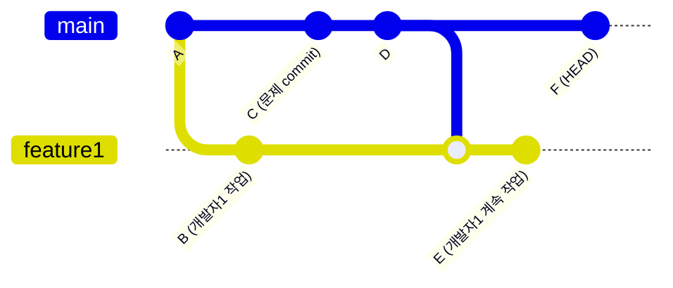

- 여러 명이 같은 repository에서 작업하는 경우 `git revert`만 사용해야 합니다.
- history를 유지하면서 안전하게 문제를 해결할 수 있습니다.
- force push는 다른 개발자들의 작업에 치명적인 영향을 줄 수 있으므로 피해야 합니다.


---


## 안전한 Commit 삭제를 위한 Check List

- commit 삭제는 되돌리기 어려운 작업이므로 사전에 충분한 준비와 검증이 필요합니다.
- 실행 전 check list를 확인하여 안전하게 작업을 진행할 수 있습니다.


### 작업 전 준비 사항

- **Backup 생성** : `git branch backup-$(date +%Y%m%d)`로 현재 상태 보존.
- **Remote 상태 확인** : `git log --oneline origin/main..HEAD`로 push되지 않은 commit 확인.
- **작업 directory 상태 확인** : `git status`로 uncommitted 변경 사항 확인.
- **팀원 작업 상태 확인** : 다른 개발자가 해당 commit 기반으로 작업 중인지 확인.


### 작업 후 검증사항

- **History 확인** : `git log --oneline --graph`로 원하는 대로 변경되었는지 확인.
- **File 상태 확인** : 삭제된 commit과 관련된 file들의 내용 점검.
- **Build Test** : project build가 정상적으로 되는지 확인.
- **기능 Test** : 삭제로 인해 application 기능에 문제가 없는지 확인.


### 문제 발생 시 복구 방법

- **Reflog 활용** : `git reflog`로 이전 상태 확인 후 `git reset --hard <reflog-entry>`로 복구.
- **Backup branch 활용** : 미리 생성한 backup branch로 `git reset --hard backup-branch_name`.
- **Remote에서 복구** : `git fetch origin`과 `git reset --hard origin/main`으로 remote 상태로 복구.


---


## Reference

- <https://git-scm.com/docs/git-reset>
- <https://git-scm.com/docs/git-rebase>
- <https://git-scm.com/docs/git-revert>
- <https://git-scm.com/docs/git-reflog>
