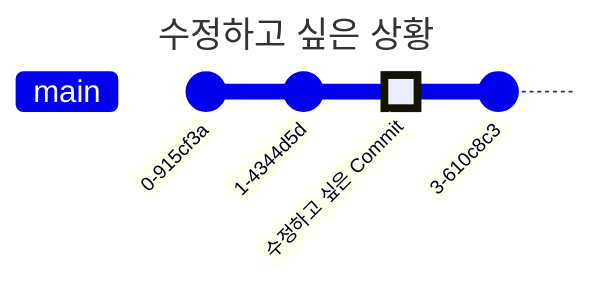

## 이미 저장한 과거의 Commit을 수정하기

- `rebase` 명령으로 과거의 commit을 수정 이력 없이 수정할 수 있습니다.
    - 기존 commit의 수정본에 대한 새로운 commit을 만들어 교체하는 방식입니다.
        - 새로운 commit에 대해 새로운 hash 값이 만들어집니다.

- remote 저장소에 해당 commit을 `push`한 적이 있다면, 수정 후 `push`할 때 remote commit 내역과 충돌하게 됩니다.
    - 기존의 remote commit 내역과 local에서 수정한 commit 내역이 다르기 때문입니다.

---

## 과거의 Commit을 수정하는 법

1. `git log` : 변경하려는 commit의 hash 값을 확인합니다.

2. `git rebase -i [commit_hash]~1` : rebase interface에 진입하여, 수정하려는 commit의 keyword를 `edit`으로 변경합니다.
    - rebase의 `i` option으로 rebase interface에 진입할 수 있습니다.
        - rebase interface에 진입할 때 수정 대상인 과거의 commit이 나오게 하려면, 대상 바로 이전의 commit hash 값을 인자에 넣어야 합니다.
        - 따라서 commit의 hash 값 뒤에 `~1`을 추가하여 '이전 commit'의 hash값을 가져옵니다.
    - rebase interface에서 수정하고 싶은 commit의 keyword를 `pick`에서 `edit`으로 수정하고, `:wq`(Vim을 사용하는 경우)로 나옵니다.

3. File 수정 : 수정하려 했던 file을 수정합니다.

4. `git add [modified_file_name]` : 수정한 file을 staging area에 추가합니다.

5. `git commit --amend` : 수정한 내용을 반영하여 commit을 수정합니다.
    - `--amend` option으로 마지막 commit을 수정할 수 있습니다.
    - commit message를 변경하고 싶지 않다면, 그냥 `:wq`(Vim을 사용하는 경우)로 나옵니다.

6. `git rebase --continue` : rebase를 마무리합니다.
    - 수정한 commit이 rebase 과정에 반영됩니다.
    - 수정한 file에서 충돌이 발생하면, 해결 후에 `git add [modified_file_name]` 명령을 수행하고, 다시 `git rebase --continue` 명령을 수행합니다.

---

## Reference

- <https://git-scm.com/book/ko/v2>

