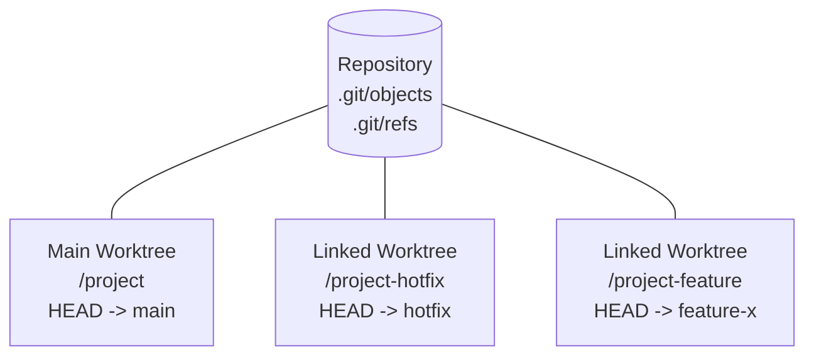
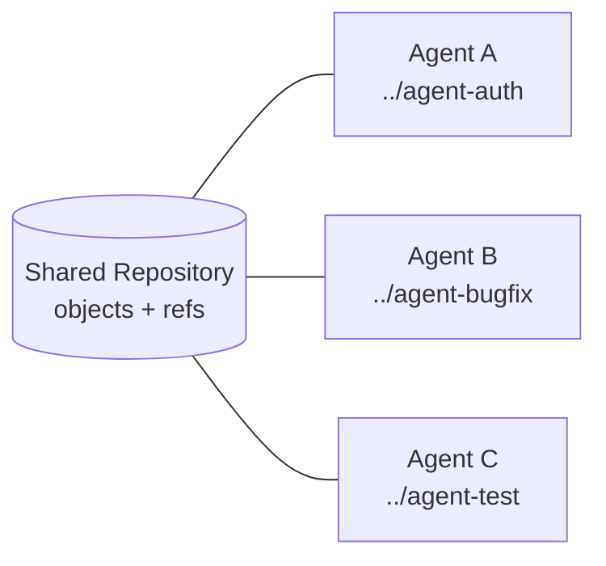

## 여러 Branch를 동시에 작업하기

- Git의 기본 작업 공간은 main worktree 하나로, `git checkout`으로 branch를 바꾸면 working directory 전체가 해당 branch로 교체됩니다.
    - 작업 중인 file을 commit하지 않은 상태에서는 다른 branch로 이동할 수 없습니다.
    - `git stash`로 변경 사항을 임시 저장할 수 있지만, 신규 file과 삭제된 file이 뒤섞인 상태에서는 stash를 다시 적용할 때 충돌 위험이 큽니다.

- `git clone`으로 같은 repository를 여러 번 복제하면 branch를 독립적으로 작업할 수 있지만, remote에서 object를 중복 download하고 disk 용량도 repository 전체 크기만큼 다시 차지합니다.
    - 각 clone의 commit을 서로 반영하려면 매번 push와 fetch를 거쳐야 합니다.

- `git worktree`는 하나의 repository에 여러 개의 working directory를 연결하여, 동일한 object database와 ref를 공유하면서도 branch별로 독립된 file 공간을 제공합니다.
    - main worktree는 `git init`이나 `git clone`으로 생성된 기본 작업 공간입니다.
    - linked worktree는 `git worktree add` 명령으로 추가된 부수적인 작업 공간으로, 원본 repository의 object를 공유합니다.


---


## Worktree의 구조

- Git repository는 하나의 `.git` directory를 중심으로 object database, ref, config 등을 관리합니다.
    - linked worktree는 `.git` directory 대신 `.git` file을 가지며, 이 file이 main worktree의 `$GIT_DIR/worktrees/<name>` 경로를 가리킵니다.
    - 각 linked worktree의 private directory에는 `HEAD`, `index`, `logs` 같은 per-worktree file이 저장됩니다.

- worktree 사이에서 공유되는 자원과 독립적인 자원은 명확히 구분됩니다.

| 구분 | 공유 여부 | 내용 |
| --- | --- | --- |
| object database | 공유 | commit, tree, blob |
| `refs/heads`, `refs/tags` | 공유 | branch, tag |
| `refs/bisect`, `refs/worktree`, `refs/rewritten` | 독립 | bisect 상태, worktree 전용 ref |
| `HEAD`, `index` | 독립 | 현재 checkout된 branch, staging 상태 |
| working directory file | 독립 | 실제 code file |

- main worktree와 linked worktree는 object database를 공유하기 때문에, 한쪽에서 만든 commit은 다른 worktree에서 즉시 참조할 수 있습니다.




---


## Worktree 기본 명령어

- `git worktree` 명령은 subcommand 단위로 동작하며, 주요 subcommand는 `add`, `list`, `remove`, `prune`, `move`, `lock`, `repair`입니다.


### Worktree 추가하기

- `git worktree add <path> [<branch>]` 명령으로 새 linked worktree를 생성합니다.
    - `<branch>`가 존재하면 해당 branch를 checkout하고, 존재하지 않으면 `<path>`의 basename을 새 branch 이름으로 사용합니다.
    - 이미 다른 worktree에서 checkout된 branch는 중복 checkout할 수 없습니다.

```sh
# ../hotfix 경로에 main branch 기반으로 새 worktree와 branch 생성
git worktree add -b hotfix ../hotfix main

# 기존 branch를 새 worktree에서 checkout
git worktree add ../feature-review feature-x

# 어떤 branch에도 속하지 않는 detached HEAD worktree 생성
git worktree add --detach ../experiment HEAD
```

- `-b <new-branch>`는 새 branch를 생성하여 checkout하고, `-B`는 기존 branch가 있더라도 강제로 재설정합니다.
- `--detach` option은 branch에 연결되지 않은 임시 작업 공간을 만들 때 사용합니다.


### Worktree 목록 확인

- `git worktree list` 명령으로 현재 repository에 연결된 모든 worktree를 확인합니다.
    - 출력에는 각 worktree의 경로, 현재 commit, checkout된 branch, 상태 annotation(`locked`, `prunable`)이 포함됩니다.

```sh
git worktree list
```

```plaintext
/path/to/project             abcd1234 [main]
/path/to/project-hotfix      1234abcd [hotfix]
/path/to/project-feature     5678cdef [feature-x]
```

- `--porcelain` option을 추가하면 script에서 parsing하기 쉬운 형식으로 출력됩니다.


### Worktree 제거

- `git worktree remove <worktree>` 명령으로 linked worktree를 제거합니다.
    - clean 상태(추적되지 않는 file이 없고 수정 사항이 없는 상태)에서만 제거됩니다.
    - 수정 사항이 남아 있을 때 강제 제거하려면 `--force`를 사용합니다.
    - main worktree는 이 명령으로 제거할 수 없습니다.

```sh
git worktree remove ../hotfix
```


### Prunable Worktree 정리

- worktree directory를 `git worktree remove` 없이 수동으로 삭제하면, repository에는 administrative file이 남아 prunable 상태가 됩니다.
    - prunable은 `git worktree list` 출력에서 worktree가 정리 대상임을 표시하는 annotation입니다.
    - `git worktree prune` 명령이 prunable 상태의 administrative file을 정리합니다.
    - `-n` option으로 삭제 대상을 먼저 확인할 수 있습니다.

```sh
git worktree prune -n
git worktree prune
```


### 이동과 잠금

- `git worktree move <worktree> <new-path>` 명령으로 linked worktree를 다른 경로로 옮길 수 있습니다.
    - submodule을 포함한 worktree와 main worktree는 이 명령으로 옮길 수 없습니다.

- `git worktree lock <worktree>` 명령은 자동 prune과 삭제로부터 worktree를 보호합니다.
    - 외장 drive나 network share처럼 항상 mount되지 않는 경로에 worktree가 있을 때 유용합니다.
    - `--reason` option으로 잠금 사유를 기록할 수 있으며, `git worktree unlock` 명령으로 잠금을 해제합니다.


---


## 실무 Use Case

- worktree는 작업 context를 유지한 채 새로운 작업을 병행해야 하는 상황에 적합합니다.


### 긴급 Hotfix 대응

- 진행 중인 대규모 refactoring으로 working directory가 어수선한 상태에서, 새 file과 삭제된 file이 뒤섞여 stash로 안전하게 보관하기 어려운 경우가 있습니다.
    - 임시 worktree를 생성하여 hotfix를 별도 공간에서 처리하면, 기존 working directory를 전혀 건드리지 않고 긴급 대응을 마칠 수 있습니다.

```sh
# 긴급 fix용 임시 worktree 생성
git worktree add -b emergency-fix ../temp main

# 새 worktree에서 작업
cd ../temp
# ... code 수정 ...
git commit -a -m "fix: 긴급 hotfix 대응"
git push origin emergency-fix

# 작업 완료 후 worktree 제거
cd -
git worktree remove ../temp
```


### Code Review와 Build 분리

- 동료의 pull request를 review할 때, 현재 작업 중인 branch에서 checkout을 전환하면 build cache가 무효화되고 IDE index도 다시 생성됩니다.
    - review 전용 worktree를 만들면 기존 작업 공간을 그대로 둔 채 reviewer용 build를 독립적으로 실행할 수 있습니다.

```sh
git worktree add ../project-review origin/pr-branch
cd ../project-review
npm install
npm test
```


### AI Agent 병렬 작업

- AI coding agent에게 여러 task를 병렬로 시킬 때, 같은 working directory를 공유하면 file 수정이 충돌하여 각 agent의 결과가 뒤섞입니다.
    - 각 agent session에 독립된 worktree를 할당하면, agent들이 서로 다른 branch에서 동시에 작업하면서도 repository history와 object는 공유합니다.
    - 하나의 agent가 authentication feature를 구현하는 동안 다른 agent가 bug를 수정하는 식으로 작업 흐름을 나눌 수 있습니다.

```sh
# 두 agent에게 서로 다른 task 할당
git worktree add ../agent-auth -b feature/auth main
git worktree add ../agent-bugfix -b fix/login-bug main

# 각각의 worktree에서 독립적으로 agent 실행
(cd ../agent-auth && claude -p "authentication module 구현")
(cd ../agent-bugfix && claude -p "login bug 수정")
```

- 작업이 끝나면 각 worktree에서 생성된 commit은 원본 repository에 이미 존재하므로, 별도 push 없이 local에서 review와 merge가 가능합니다.
- agent 실행 도구에 따라 `--worktree` 같은 flag로 worktree 생성과 정리 과정을 자동화할 수도 있습니다.




---


## 사용 시 주의 사항

- 같은 branch는 여러 worktree에서 동시에 checkout할 수 없습니다.
    - 두 worktree가 같은 branch의 `HEAD`를 동시에 움직이면 ref 정합성이 깨지기 때문입니다.
    - 동일 branch로 작업해야 하는 경우에는 `--detach` option으로 detached HEAD를 사용하거나 새 branch를 파생시켜야 합니다.

- 추적되지 않는 file은 새 worktree로 복사되지 않습니다.
    - `.env`, `.env.local` 같은 local 설정 file은 worktree마다 수동으로 배치해야 합니다.
    - node module이나 build 결과물 같은 ignore 대상 directory도 worktree별로 다시 생성해야 합니다.

- linked worktree의 directory를 `git worktree remove` 없이 수동 삭제하면 administrative file이 prunable 상태로 남습니다.
    - `gc.worktreePruneExpire` config 값이 지나면 자동으로 정리되지만, 명시적으로 `git worktree prune`을 실행하는 것이 확실합니다.

- main worktree를 수동으로 이동하면 linked worktree가 repository를 찾지 못할 수 있습니다.
    - 이 경우 `git worktree repair` 명령으로 연결 정보를 복구할 수 있습니다.


---


## Reference

- <https://git-scm.com/docs/git-worktree>
- <https://code.claude.com/docs/en/common-workflows>

