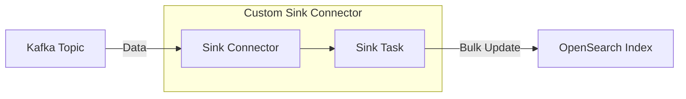

## Update by Query 기능을 가진 Custom OpenSearch Sink Connector 만들기

- 기존의 OpenSearch Sink Connector는 Kafka topic의 data를 OpenSearch로 전송하는 기능을 맡습니다.
    - OpenSearch document의 id를 기반으로, 단건에 대해 생성, 수정, 삭제 등의 작업을 수행합니다.
    - 기존 connector 기능은 <https://aiven.io/docs/products/kafka/kafka-connect/howto/opensearch-sink> 참고.

- 그러나 기존의 OpenSearch sink connector는 bulk update 기능을 제공하지 않기 때문에, 만약 connector를 통해 bulk update를 하고 싶다면, OpenSearch bulk update API를 사용하는 custom sink connector를 직접 개발해야 합니다.

- 이 글은 OpenSearch index를 대상으로 `update by query`를 실행하는 logic을 custom connector에서 처리할 수 있도록 구현하는 방법을 다룹니다.
    - OpenSearch의 `update by query` API를 사용하여, 특정 조건에 맞는 document를 bulk update합니다.

- custom connector 개발을 위해서는 Kafka Connect API의 `SinkConnector`와 `SinkTask` class를 확장하여 구현해야 합니다.
    - OpenSearch에 bulk update하는 logic은 `SinkTask` class에서 구현합니다.




### 1. Custom Sink Connector 개발하기

- 개발 환경은 JDK 17 이상, Gradle 7.0 이상을 요구합니다.
- Custom OpenSearch Sink Connector 개발에 필요한 Gradle Java project의 source code file을 준비합니다.

#### Gradle Java Project 생성

- project directory를 생성하고, Gradle project를 초기화합니다.

```bash
# project directory 생성
mkdir opensearch-sink-connector
cd opensearch-sink-connector

# Gradle project 초기화
gradle init --type java-library
```

#### File Preparation

- 생성된 Gradle project 구조에 따라 [필요한 file들](#file)을 추가합니다.

| Directory | File | Description |
| --- | --- | --- |
| `/` | [`settings.gradle`](#settingsgradle) | root project name config |
| `/` | [`build.gradle`](#buildgradle) | Gradle build config |
| `/src/main/java/com/example/` | [`UpdateByQuerySinkConnector.java`](#updatebyquerysinkconnectorjava) | Kafka Connect SinkConnector |
| `/src/main/java/com/example/` | [`UpdateByQuerySinkTask.java`](#updatebyquerysinktaskjava) | Kafka Connect SinkTask class file |
| `/src/main/java/com/example/vo/` | [`UpdateField.java`](#updatefieldjava) | Kafka Connect SinkTask에서 사용할 data model class |
| `/src/main/java/com/example/enums/` | [`UpdateFieldName.java`](#updatefieldnamejava) | Kafka Connect SinkTask에서 사용할 field name을 관리하는 enum class |
| `/src/main/java/com/example/util/` | [`VersionUtil.java`](#versionutiljava) | connector version을 관리하는 utility class |
| `/src/main/resources/` | [`version.properties`](#versionproperties) | connector version 설정 file |
| `/src/main/resources/META-INF/services/` | [`org.apache.kafka.connect.sink.SinkConnector`](#orgapachekafkaconnectsinksinkconnector) | Kafka Connect SinkConnector class를 등록하는 file |
| `/build/libs/` | `opensearch-sink-connector.jar` | build 결과로 생성되는 fat jar file |

#### 준비가 완료된 최종 구조

```plaintext
opensearch-sink-connector
├── settings.gradle
├── build.gradle
├── src
│   ├── main
│   │   ├── java
│   │   │   └── com
│   │   │       └── example
│   │   │           ├── UpdateByQuerySinkConnector.java
│   │   │           ├── UpdateByQuerySinkTask.java
│   │   │           ├── vo
│   │   │           │   └── UpdateField.java
│   │   │           ├── util
│   │   │           │   └── VersionUtil.java
│   │   │           └── enums
│   │   │               └── UpdateFieldName.java
│   │   └── resources
│   │       ├── META-INF
│   │       │   └── services
│   │       │       └── org.apache.kafka.connect.sink.SinkConnector
│   │       └── version.properties
│   └── test
│       ├── java
│       └── resources
└── build
    └── libs
        └── opensearch-sink-connector.jar
```


### 2. Build 및 배포

- Gradle을 사용하여 project를 build하고, 생성된 JAR file을 Kafka Connect에 배포합니다.

#### Project Build

- Gradle을 사용하여 project를 build합니다.
- fat JAR를 생성하기 위해 `shadowJar` plugin을 사용합니다.

```bash
# fat JAR 생성
./gradlew shadowJar
```

- build가 성공하면 `build/libs/opensearch-sink-connector.jar` file이 생성됩니다.

#### Kafka Connect에 배포

- 생성된 JAR file을 Kafka Connect의 plugin directory에 옮깁니다.
    - Kafka Connect 서버의 plugin 경로는 보통 `$KAFKA_HOME/plugins`이며, Kafka Connect 설정에서 직접 지정할 수도 있습니다.

```bash
# fat JAR를 plugin directory로 이동
cp build/libs/opensearch-sink-connector.jar /kafka-connect-home/plugins/
```

- Kafka Connect를 실행한 뒤, connector가 정상적으로 plugin되었는지 확인합니다.
    - `/connector-plugins` API를 통해 plugin list를 조회하여, `UpdateByQuerySinkConnector`가 포함되어 있는지 확인합니다.

```bash
# connector load 확인
curl http://localhost:8083/connector-plugins
# 결과 : [{"class": "com.example.UpdateByQuerySinkConnector", "version": "0.0.1"}]
```


### 3. Connector 설정 및 등록

- JSON 형식으로 config file을 작성하고, Kafka Connect REST API로 connector를 등록합니다.

#### Connector 설정

- connector 등록에 대한 세부 설정 정보를 담는 `opensearch-update-sink-connector.json` file을 생성합니다.

```json
/* opensearch-update-sink-connector.json */
{
    "name": "opensearch-update-sink-connector",
    "config": {
        /* connector 기본 정보와 OpenSearch 접속 정보 입력 */
        "connector.class": "com.example.UpdateByQuerySinkConnector",
        "topics": "opensearch.update-by-query",
        "opensearch.host": "192.168.81.109",
        "opensearch.port": "9200",

        /* OpenSearch의 default data format인 JSON으로 converting */
        "key.converter": "org.apache.kafka.connect.storage.StringConverter",
        "value.converter": "org.apache.kafka.connect.json.JsonConverter",
        "value.converter.schemas.enable": "false",
        "schema.ignore": "true"
    }
}
```

#### Connector 등록

- Kafka Connect REST API를 사용하여 connector를 등록합니다.

```bash
# connector 등록
curl -X POST -H "Content-Type: application/json" --data "@custom-sink-connector.json" http://localhost:8083/connectors
```

- connector가 정상적으로 등록되었는지 확인합니다.

```bash
# 등록된 connector 목록 확인
curl http://localhost:8083/connectors
```

- 등록된 connector의 세부 정보를 확인합니다.

```bash
# connector 세부 정보 확인
curl http://localhost:8083/connectors/opensearch-update-sink-connector/status
```


### 4. Connector 사용

- connector가 정상적으로 등록되면, Kafka topic이 message를 수신할 때 OpenSearch에 bulk update(update by query)를 수행합니다.

- topic에 발생하는 message는 반드시 `index_name`, `term_key`, `term_value`, `data_key`, `data_value` 형식으로 작성해야 합니다.
    - connector 내부에서 해당 값을 사용하여 OpenSearch에 bulk update를 수행합니다.

```json
/* Kafka topic에 전송할 message 예시 */
{
    /* 대상 */
    "index_name": "messenger",

    /* 조건 */
    "term_key": "member_seq",
    "term_value": "1283",

    /* 갱신 */
    "data_key": "member_name",
    "data_value": "New Name"
}
```

- `index_name`을 대상으로, `term_key`에 `term_value`를 조건으로 하여, `data_key`를 `data_value`로 갱신합니다.
    - 예를 들어, `messenger` index에서 `member_seq`가 `1283`인 document의 `member_name`을 `New Name`으로 갱신할 수 있습니다.


---


## File

- [file 준비 단계](#file-preparation)에서 필요한 file 내용입니다.


### [settings.gradle](#file-preparation)

```groovy
rootProject.name = 'opensearch-sink-connector'
```


### [build.gradle](#file-preparation)

```groovy
plugins {
    id 'java-library'
    id 'com.github.johnrengelman.shadow' version '7.1.2'
}

repositories {
    mavenCentral()
}

dependencies {
    // Kafka Connect
    compileOnly 'org.apache.kafka:connect-api:3.4.0'

    // OpenSearch
    implementation 'org.opensearch.client:opensearch-java:2.22.0'
    implementation 'org.opensearch.client:opensearch-rest-client:2.19.1'

    // JSON Processing
    implementation 'com.fasterxml.jackson.core:jackson-databind:2.14.2'
    implementation 'org.apache.kafka:connect-json:3.4.0'

    // Logging
    implementation 'org.slf4j:slf4j-api:1.7.36'
    implementation 'ch.qos.logback:logback-classic:1.2.11'
}

java {
    toolchain {
        languageVersion = JavaLanguageVersion.of(17)
    }
}

shadowJar {
    archiveBaseName.set('opensearch-sink-connector')
    archiveClassifier.set('')
    archiveVersion.set('')
}

artifacts {
    archives shadowJar
}
```


### [UpdateByQuerySinkConnector.java](#file-preparation)

```java
package com.hiworks;

import com.hiworks.util.VersionUtil;
import org.apache.kafka.common.config.ConfigDef;
import org.apache.kafka.connect.connector.Task;
import org.apache.kafka.connect.sink.SinkConnector;
import org.slf4j.Logger;
import org.slf4j.LoggerFactory;

import java.util.ArrayList;
import java.util.List;
import java.util.Map;

public class UpdateByQuerySinkConnector extends SinkConnector {
    private static final Logger log = LoggerFactory.getLogger(UpdateByQuerySinkConnector.class);
    private Map<String, String> configProps;

    @Override
    public void start(Map<String, String> props) {
        this.configProps = props;
    }

    @Override
    public Class<? extends Task> taskClass() {
        return UpdateByQuerySinkTask.class;
    }

    @Override
    public List<Map<String, String>> taskConfigs(int maxTasks) {
        final List<Map<String, String>> taskConfigs = new ArrayList<>(maxTasks);
        for (int i = 0; i < maxTasks; i++) {
            taskConfigs.add(configProps);
        }
        return taskConfigs;
    }

    @Override
    public void stop() {
        log.info("UpdateSinkConnector stopped");
    }

    @Override
    public ConfigDef config() {
        return new ConfigDef();
    }

    @Override
    public String version() {
        return VersionUtil.getVersion();
    }
}
```


### [UpdateByQuerySinkTask.java](#file-preparation)

```java
package com.hiworks;

import com.fasterxml.jackson.databind.ObjectMapper;
import com.hiworks.util.VersionUtil;
import com.hiworks.vo.UpdateField;
import org.apache.http.HttpHost;
import org.apache.kafka.connect.sink.SinkRecord;
import org.apache.kafka.connect.sink.SinkTask;
import org.opensearch.client.RestClient;
import org.opensearch.client.json.JsonData;
import org.opensearch.client.json.jackson.JacksonJsonpMapper;
import org.opensearch.client.opensearch.OpenSearchClient;
import org.opensearch.client.opensearch._types.FieldValue;
import org.opensearch.client.opensearch._types.Time;
import org.opensearch.client.opensearch._types.query_dsl.TermQuery;
import org.opensearch.client.opensearch.core.UpdateByQueryRequest;
import org.opensearch.client.opensearch.core.UpdateByQueryResponse;
import org.opensearch.client.transport.rest_client.RestClientTransport;
import org.slf4j.Logger;
import org.slf4j.LoggerFactory;

import java.io.IOException;
import java.util.Collection;
import java.util.Map;

public class UpdateByQuerySinkTask extends SinkTask {
    private static final Logger log = LoggerFactory.getLogger(UpdateByQuerySinkTask.class);

    private OpenSearchClient client;
    private RestClient restClient;
    private ObjectMapper objectMapper;

    @Override
    public void start(Map<String, String> props) {
        final String host = props.getOrDefault("opensearch.host", "localhost");
        final int port = Integer.parseInt(props.getOrDefault("opensearch.port", "9200"));
        HttpHost httpHost = new HttpHost(host, port);

        this.restClient = RestClient.builder(httpHost).build();
        this.client = new OpenSearchClient(
                new RestClientTransport(restClient, new JacksonJsonpMapper()));
        this.objectMapper = new ObjectMapper();
    }

    @Override
    public void put(Collection<SinkRecord> records) {
        if (records.isEmpty()) return;
        log.info("record 수신 성공 : {}개", records.size());

        for (SinkRecord record : records) {
            log.info("record = {}", record);
            try {
                update(record);
            } catch (Exception e) {
                log.error("record update 중 오류 발생", e);
            }
        }
    }

    private void update(SinkRecord record) throws IOException {
        final UpdateField updateField = UpdateField.fromRecord(record, objectMapper);
        log.info("updateField = {}", updateField);

        try {
            updateByQuery(updateField);
        } catch (Exception e) {
            log.error("record update by query 중 오류 발생 : updateField = {}", updateField, e);
        }
    }

    private void updateByQuery(UpdateField updateField) throws IOException {
        final UpdateByQueryRequest request = new UpdateByQueryRequest.Builder()
                .index(updateField.indexName())
                .query(q -> q
                        .term(TermQuery.of(t -> t
                                .field(updateField.termKey())
                                .value(FieldValue.of(updateField.termValue())))
                        )
                )
                .script(s -> s
                        .inline(i -> i
                                .source("ctx._source." + updateField.dataKey() + " = params." + updateField.dataKey())
                                .params(Map.of(updateField.dataKey(), JsonData.of(updateField.dataValue())))
                        )
                )
                .timeout(Time.of(t -> t.time("2m")))
                .build();
        log.info("update by query request : {}", request.toJsonString());

        final UpdateByQueryResponse response = client.updateByQuery(request);
        log.info("update by query response : {}", response.toJsonString());

        log.info("document update 완료 : {}개 {} ms 소요", response.updated(), response.took());
    }

    @Override
    public void stop() {
        try {
            if (restClient != null) {
                restClient.close();
                log.info("UpdateSinkTask 및 OpenSearch client 중지");
            }
        } catch (IOException e) {
            log.error("OpenSearch client 중지 중 오류 발생", e);
        }
    }

    @Override
    public String version() {
        return VersionUtil.getVersion();
    }
}
```


### [UpdateField.java](#file-preparation)

```java
package com.hiworks.vo;

import com.fasterxml.jackson.core.JsonProcessingException;
import com.fasterxml.jackson.databind.JsonNode;
import com.fasterxml.jackson.databind.ObjectMapper;
import org.apache.kafka.connect.sink.SinkRecord;
import com.hiworks.enums.UpdateFieldName;

public record UpdateField(String indexName, String termKey, String termValue, String dataKey, String dataValue) {

    public static UpdateField fromRecord(SinkRecord record, ObjectMapper objectMapper) throws JsonProcessingException {
        final String recordStr = objectMapper.writeValueAsString(record.value());
        final JsonNode recordNode = objectMapper.readTree(recordStr);

        for (UpdateFieldName name : UpdateFieldName.values()) {
            if (!recordNode.has(name.code())) {
                throw new IllegalArgumentException(name.code() + " field 지정 필요");
            }
        }

        return new UpdateField(
                recordNode.get(UpdateFieldName.INDEX_NAME.code()).asText(),
                recordNode.get(UpdateFieldName.TERM_KEY.code()).asText(),
                recordNode.get(UpdateFieldName.TERM_VALUE.code()).asText(),
                recordNode.get(UpdateFieldName.DATA_KEY.code()).asText(),
                recordNode.get(UpdateFieldName.DATA_VALUE.code()).asText()
        );
    }
}
```


### [UpdateFieldName.java](#file-preparation)

```java
package com.hiworks.enums;

public enum UpdateFieldName {
    INDEX_NAME("index_name"),
    TERM_KEY("term_key"),
    TERM_VALUE("term_value"),
    DATA_KEY("data_key"),
    DATA_VALUE("data_value");

    private final String name;

    UpdateFieldName(String name) {
        this.name = name;
    }

    public String code() {
        return name;
    }
}
```


### [VersionUtil.java](#file-preparation)

```java
package com.hiworks.util;

import org.slf4j.Logger;
import org.slf4j.LoggerFactory;

import java.io.IOException;
import java.io.InputStream;
import java.util.Properties;

public class VersionUtil {
    private static final Logger log = LoggerFactory.getLogger(VersionUtil.class);
    private static final String VERSION_FILE = "version.properties";
    private static final String VERSION_PROPERTY = "connector.version";
    private static final String DEFAULT_VERSION = "1.0";

    private static String version = null;

    public static String getVersion() {
        if (version != null) {
            return version;
        }

        try (InputStream input = VersionUtil.class.getClassLoader().getResourceAsStream(VERSION_FILE)) {
            if (input == null) {
                log.warn("{} file 읽기 오류 (기본값 {} 사용)", VERSION_FILE, DEFAULT_VERSION);
                version = DEFAULT_VERSION;
                return version;
            }

            Properties props = new Properties();
            props.load(input);

            version = props.getProperty(VERSION_PROPERTY, DEFAULT_VERSION);
            log.info("Connector Version : {}", version);
            return version;

        } catch (IOException e) {
            log.error("Connector Version 조회 오류 발생", e);
            version = DEFAULT_VERSION;
            return version;
        }
    }
}
```


### [version.properties](#file-preparation)

```plaintext
connector.version=0.0.1
```


### [org.apache.kafka.connect.sink.SinkConnector](#file-preparation)

```plaintext
com.hiworks.UpdateByQuerySinkConnector
```
