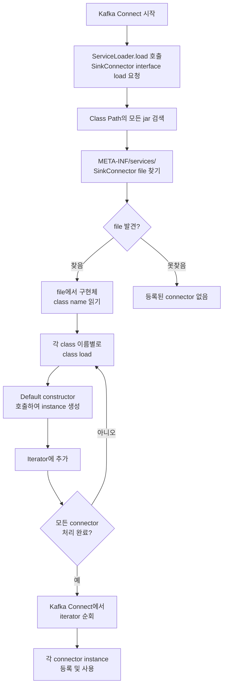

## Kafka Connect Custom Connector SPI 설정

- custom connector를 Kafka Connect framework에 등록하려면 `META-INF/services/` directory에 service provider 설정 file을 작성해야 합니다.
    - 이 설정을 통해 Kafka Connect가 자동으로 custom connector class를 발견하고 load할 수 있습니다.

- source connector의 경우 `org.apache.kafka.connect.source.SourceConnector`, sink connector의 경우 `org.apache.kafka.connect.sink.SinkConnector` file을 생성하여 SPI 설정을 진행합니다.


### Service Provider Interface File 구성

- SPI 설정을 위한 directory 구조를 생성합니다.

```
project-root/
├── src/
│   └── main/
│       └── resources/
│           └── META-INF/
│               └── services/
│                   ├── org.apache.kafka.connect.sink.SinkConnector
│                   └── org.apache.kafka.connect.source.SourceConnector
...
```

- `src/main/resources/META-INF/services/` directory를 생성합니다.
    - sink connector를 구현하는 경우 `org.apache.kafka.connect.sink.SinkConnector` file을 생성합니다.
    - source connector를 구현하는 경우 `org.apache.kafka.connect.source.SourceConnector` file을 생성합니다.

#### File 내용 작성

- file 내부에는 구현한 connector의 전체 class 경로(fully qualified class name)를 한 줄에 하나씩 작성합니다.

```txt
com.example.opensearch.OpenSearchSinkConnector
```

- 여러 connector를 같은 interface로 제공하는 경우 각 class 경로를 새 줄에 추가합니다.

```txt
com.example.opensearch.OpenSearchSinkConnector
com.example.elasticsearch.ElasticsearchSinkConnector
com.example.mongodb.MongoDBSinkConnector
```


### Service Provider Interface가 필요한 이유

- Java의 **ServiceLoader** mechanism을 사용하여 plugin처럼 동작하는 connector를 등록합니다.
    - ServiceLoader는 Java에서 runtime에 확장 가능한 module들을 자동으로 발견하는 표준 mechanism입니다.
    - `META-INF/services/` directory의 설정 file을 통해 ServiceLoader가 connector를 찾을 수 있습니다.

- Kafka Connect는 시작 시 class path의 모든 jar file에서 `META-INF/services/` 설정을 검색하여 등록된 connector를 자동으로 load합니다.
    - 이 mechanism이 없으면 개발자가 각 connector를 수동으로 등록해야 합니다.
    - 수동 등록 방식은 유지 보수가 어렵고 확장성이 떨어집니다.

- SPI 설정을 통해 자동 발견이 가능해지므로 plugin 기반 architecture를 쉽게 구현할 수 있습니다.
    - 새로운 connector를 추가할 때 기존 code를 수정하지 않아도 됩니다.
    - jar file을 class path에 추가하기만 하면 Kafka Connect가 자동으로 인식합니다.


---


## ServiceLoader Mechanism의 작동 원리

- ServiceLoader는 Java의 standard library에 포함된 mechanism으로, interface의 구현체들을 runtime에 자동으로 발견하고 load합니다.




### 1. Service Provider File 검색

- application이 시작될 때, ServiceLoader는 class path의 모든 jar file에서 `META-INF/services/` directory를 검색합니다.
    - 검색 대상은 load하려는 interface의 fully qualified class name과 일치하는 file입니다.
    - 예를 들어, `org.apache.kafka.connect.sink.SinkConnector` interface를 load하려면, `META-INF/services/org.apache.kafka.connect.sink.SinkConnector` file을 찾습니다.


### 2. 구현체 Class 이름 읽기

- 발견된 file을 열어서 구현체의 fully qualified class name들을 읽습니다.
    - 각 line은 하나의 구현체 class name을 나타냅니다.
    - 빈 줄이나 `#`로 시작하는 주석은 무시됩니다.

```txt
# SPI file 예시
com.example.opensearch.OpenSearchSinkConnector
com.example.elasticsearch.ElasticsearchSinkConnector
```


### 3. 구현체 Class Load 및 Instance 생성

- ServiceLoader는 읽은 class name에 해당하는 class를 class loader를 통해 load합니다.
    - `Class.forName()` 또는 현재 thread의 context class loader를 사용하여 class를 load합니다.
    - load된 class가 지정된 interface를 구현하고 있는지 검증합니다.

- 각 class의 **no-argument constructor**(default constructor)를 호출하여 instance를 생성합니다.
    - 따라서 service provider로 등록될 class는 반드시 public no-argument constructor를 포함해야 합니다.

```java
public class OpenSearchSinkConnector extends SinkConnector {
    // default constructor - ServiceLoader가 호출
    public OpenSearchSinkConnector() {
        // connector initialization code...
    }

    // other methods...
}
```

- 만약 connector class가 no-argument constructor를 가지지 않으면 `InstantiationException`이 발생합니다.
    - 이 경우 Kafka Connect startup이 실패합니다.

- instance 생성 후 ServiceLoader는 각 instance를 내부 list에 저장하고, iterator를 통해 접근할 수 있도록 합니다.


### 4. Iterator를 통한 접근

- ServiceLoader는 `Iterator<S>` interface를 구현하여, 발견된 모든 구현체를 순회할 수 있도록 합니다.
    - Kafka Connect는 이 iterator를 사용하여 등록된 모든 connector를 순회합니다.
    - 느슨한 결합(loose coupling)을 통해 새로운 connector 추가 시 기존 code를 수정할 필요가 없습니다.

```java
ServiceLoader<SinkConnector> loader = ServiceLoader.load(SinkConnector.class);
for (SinkConnector connector : loader) {
    // 발견된 모든 connector를 처리
}
```


---


## Reference

- <https://kafka.apache.org/documentation/#connectconfigs>

