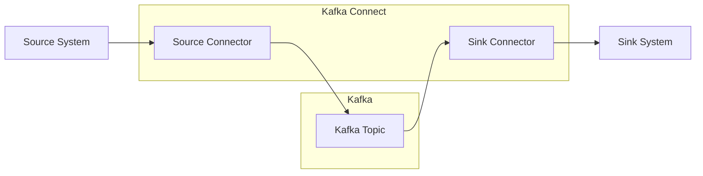
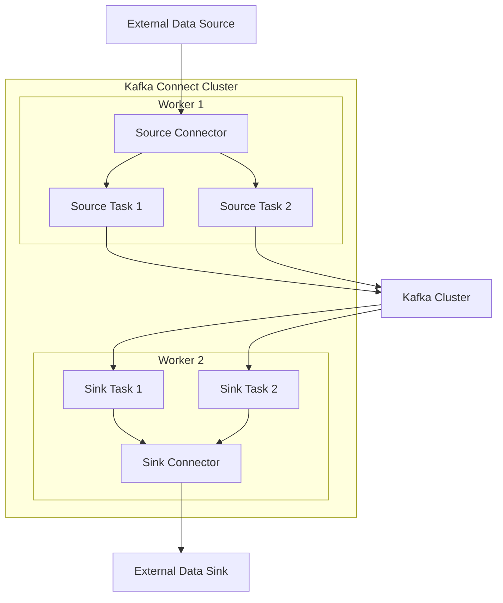

## Kafka Connect : Kafka Data Pipeline

- Kafka Connect는 **Apache Kafka와 다른 data system 간 data를 쉽게 import하고 export할 수 있는 도구**입니다.
    - 확장 가능한 streaming integration 기능을 제공하며, connector를 통해 다양한 system과의 연동을 지원합니다.
    - 주로 Kafka와 외부 system 간의 data pipeline을 구축하는 데 사용됩니다.



- **fault-tolerant**하며 **분산 처리가 가능한 구조**로 설계되었습니다.
    - 여러 worker에 task를 분산하여 처리하여, 확장하기 쉽고 가용성이 높습니다.

- **code 작성 없이 configuration만으로 data pipeline 구축이 가능**합니다.
    - source connector와 sink connector 설정을 통해 data source와 sink를 연결하고, data를 변환(SMT)할 수 있습니다.

```json
/* Source Connector 설정 예시 */
{
    "name": "jdbc-source-connector",
    "config": {
        "connector.class": "io.confluent.connect.jdbc.JdbcSourceConnector",
        "connection.url": "jdbc:mysql://localhost:3306/test",
        "connection.user": "user",
        "connection.password": "password",
        "mode": "incrementing",
        "incrementing.column.name": "id",
        "topic.prefix": "mysql-",
        "tasks.max": "1"
    }
}

/* Sink Connector 설정 예시 */
{
    "name": "elasticsearch-sink-connector",
    "config": {
        "connector.class": "io.confluent.connect.elasticsearch.ElasticsearchSinkConnector",
        "connection.url": "http://localhost:9200",
        "topics": "mysql-users",
        "key.ignore": "true",
        "schema.ignore": "true",
        "tasks.max": "1"
    }
}
```


### Kafka Connect의 특징

- **분산 처리** : 여러 worker에 task를 분산하여 처리합니다.
    - 분산 처리를 하기 때문에 확장성과 가용성이 높습니다.
    - worker 장애 시 다른 worker로 task가 자동 이관됩니다.

- **장애 허용성** : connector와 task의 상태를 Kafka topic에 저장합니다.
    - worker 장애 발생 시 다른 worker가 작업을 이어받아 수행합니다.
    - offset 정보를 관리하여 data 손실이나 중복 없이 안전하게 처리합니다.

- **Data 변환** : Single Message Transform(SMT)을 통해 data 흐름 중간에 변환 작업이 가능합니다.
    - field 추가, 삭제, 이름 변경, data type 변환 등 다양한 변환 작업을 지원합니다.
    - 여러 변환 규칙을 chain 형태로 구성할 수 있습니다.

- **REST API** : connector 관리를 위한 REST API를 제공합니다.
    - connector 생성, 수정, 삭제, 상태 조회 등의 작업이 가능합니다.
    - 외부 system에서 API를 통해 connector를 제어할 수 있습니다.


### Kafka Connect의 장점

- code 작성 없이 configuration만으로 data pipeline 구축이 가능합니다.
- 다양한 system과의 연동을 위한 connector ecosystem이 풍부합니다.
    - 이미 많은 connector가 개발되어 있어, 다양한 system과의 연동을 쉽게 구현할 수 있습니다.
- 분산 처리와 장애 허용성을 기본으로 제공합니다.
- 확장성이 좋아서 대규모 환경에서도 효과적으로 활용할 수 있습니다.
- streaming data pipeline 구축에 최적화되어 있습니다.


### Kafka Connect의 한계점

- connector가 없는 system과의 연동은 custom connector 개발이 필요합니다.
- 복잡한 data 변환은 SMT만으로는 한계가 있어 별도의 stream processing이 필요할 수 있습니다.
- 대규모 환경에서는 resource 관리와 monitoring이 필요합니다.
- connector별로 세부 설정 방법이 달라서, 각 connector에 대해 따로 학습해야 합니다.
    - connector의 설정이나 동작 방식에 대한 이해가 필요해 학습 곡선이 있습니다.


### Kafka Connect 활용 예시

- **ETL (Extract, Transform, Load)** : 다양한 source에서 data를 추출하여 Kafka로 전송합니다.
    - Kafka를 통해 data를 변환하고, 변환된 data를 다양한 target system으로 저장합니다.

- **CDC (Change Data Capture)** : database의 변경 사항을 실시간으로 capture하여 Kafka로 전송합니다.
    - Debezium과 같은 CDC connector를 활용하여 database의 변경 사항을 Kafka로 전파합니다.

- **Data Migration** : data를 다른 system으로 이관합니다.
    - Kafka Connect로 구성된 data pipeline을 통해, data를 다른 system으로 이동시키거나 복제합니다.

- **Event Sourcing** : event 기반 architecture에서 event 전파에 활용합니다.
    - event를 Kafka로 전파하여 다른 system이 event를 구독하고 처리합니다.

- **Log 수집** : application log를 Kafka로 수집합니다.
    - 수집된 log를 Elasticsearch나 S3와 같은 storage로 저장합니다.
    - log 분석 및 monitoring에 활용합니다.


---


## Kafka Connect의 주요 개념

- **Connector** : 특정 system과 Kafka 간의 연결을 담당하는 high-level abstraction입니다.
    - Source Connector : 외부 system에서 Kafka로 data를 가져옵니다.
    - Sink Connector : Kafka에서 외부 system으로 data를 내보냅니다.

- **Task** : connector의 실제 data 복사 작업을 수행하는 단위입니다.
    - connector는 여러 task로 분할되어 병렬 처리가 가능합니다.

- **Worker** : connector와 task를 실행하는 process입니다.

- **Converter** : data format 변환을 담당합니다.
    - JSON, Avro, Protobuf 등 다양한 format을 지원합니다.

- **Transform** : data를 변형하는 단순한 logic을 적용할 수 있습니다.
    - field 이름 변경, 특정 field filtering 등의 작업이 가능합니다.



- Kafka Connect는 worker process로 실행됩니다.
- worker는 connector를 load하고 관리합니다.
- connector는 task로 분할되어 실행됩니다.
- task는 실제 data 복사 작업을 수행합니다.


### Connector : Data 전송 Plugin

- connector는 **특정 system과 Kafka 간 data 이동을 담당하는 plugin**입니다.

- **Source Connector**와 **Sink Connector**로 구분됩니다.
    - Source Connector : 외부 system에서 Kafka로 data를 가져옵니다.
    - Sink Connector : Kafka에서 외부 system으로 data를 내보냅니다.

- 다양한 database, messaging system, file system 등과 연동할 수 있는 connector가 존재합니다.
    - 미리 개발된 connector를 사용하거나, custom connector를 개발할 수 있습니다.
        - 미리 개발된 connector로는 JDBC Connector, MongoDB Connector, Elasticsearch Connector 등이 있습니다.

- Kafka Connect의 REST API를 통해 connector 생성, 수정, 삭제가 가능합니다.


### Task : Connector의 작업 단위

- **connector의 실제 작업 단위**입니다.

- 하나의 connector는 여러 task로 분할되어 병렬 처리됩니다.

- task는 data 복사 작업을 수행하는 실제 process입니다.
    - source connector의 task는 data를 가져와 Kafka topic에 저장합니다.
    - sink connector의 task는 Kafka topic에서 data를 가져와 외부 system에 저장합니다.


### Worker : Task 실행 Process

- **connector와 task를 실행하는 process**입니다.

- worker의 구성에 따라 Kafka Connect는 **standalone mode**와 **distributed mode**로 동작할 수 있습니다.
    - **standalone mode** : 단일 process에서 모든 connector와 task를 실행합니다.
        - 설정과 배포가 간단하여, 개발 환경이나 소규모 환경에 적합합니다.
        - configuration은 properties file로 관리됩니다.
    - **distributed mode** : 여러 worker에 connector와 task를 분산하여 실행합니다.
        - 확장성과 고가용성이 좋아서, 운영 환경에 적합합니다.
        - configuration은 REST API나 Kafka topic을 통해 관리됩니다.


### Converter : Data Format 변환

- Kafka와 외부 system 간 **data format 변환**을 처리합니다.

- Kafka와 외부 system 간 data 형식 변환을 처리합니다.
    - 예를 들어, Kafka 내부에서는 Avro format을 사용하고, 외부 system은 JSON format을 사용하는 경우에, converter를 통해 Avro를 JSON으로 변환합니다.

- JSON, Avro, Protobuf 등 다양한 format을 지원합니다.


### Transform : Data 변환

- data가 source에서 sink로 이동하는 과정에서 **data 변환 작업**을 수행합니다.
    - field 추가/삭제, 이름 변경, data type 변환 등의 작업이 가능합니다.

- **SMT**(Single Message Transform)를 통해 data 변환 작업을 수행합니다.
    - 여러 transform 규칙을 chain 형태로 구성할 수 있습니다.
    - data pipeline 중간에 변환 작업을 쉽게 적용할 수 있습니다.
