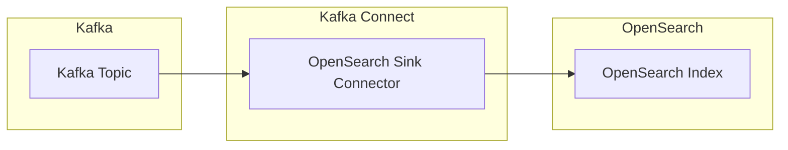

## OpenSearch Sink Connector

- OpenSearch Sink Connector는 **Kafka topic의 data를 OpenSearch index로 전송하는 Kafka Connect plugin**입니다.
    - Kafka에 저장된 event나 log data를 OpenSearch에 indexing하여 검색 및 분석 기능을 제공합니다.
    - Aiven에서 개발하고 관리하며, Apache 2.0 license로 제공됩니다.




### 주요 기능

- **Bulk Indexing** : 여러 record를 batch로 묶어 OpenSearch에 전송합니다.
    - `batch.size`와 `linger.ms` 설정으로 batch 크기와 대기 시간을 조절합니다.

- **Document ID 생성** : Kafka record key 또는 자동 생성 전략으로 document ID를 결정합니다.
    - `key.ignore` 설정으로 key 무시 여부를 선택합니다.
    - `topic.partition.offset` 전략으로 고유한 ID를 자동 생성합니다.

- **Upsert 지원** : 동일 ID의 document를 insert하거나 update합니다.
    - `index.write.method` 설정으로 insert 또는 upsert mode를 선택합니다.

- **Data Stream 지원** : OpenSearch Data Stream으로 시계열 data를 효율적으로 저장합니다.
    - `data.stream.enabled` 설정으로 Data Stream mode를 활성화합니다.

- **Tombstone 처리** : null value record(Kafka tombstone)를 처리하는 방식을 설정합니다.
    - `behavior.on.null.values` 설정으로 무시, 삭제, 실패 중 선택합니다.


### 사용 사례

- **Log 분석** : application log를 OpenSearch에 저장하여 검색 및 시각화합니다.
- **실시간 검색** : Kafka의 event data를 OpenSearch에 indexing하여 실시간 검색 기능을 제공합니다.
- **CDC Pipeline** : database 변경 사항을 Kafka를 거쳐 OpenSearch에 동기화합니다.
- **Monitoring** : metric data를 OpenSearch에 저장하여 dashboard로 monitoring합니다.


---


## Connector 설정

- OpenSearch Sink Connector는 connection, batching, data conversion, data stream, authentication 관련 설정을 제공합니다.


### 기본 설정 예시

```json
{
    "name": "opensearch-sink-connector",
    "config": {
        "connector.class": "io.aiven.kafka.connect.opensearch.OpensearchSinkConnector",
        "connection.url": "http://localhost:9200",
        "connection.username": "admin",
        "connection.password": "password",
        "topics": "logs,events",
        "key.ignore": "true",
        "schema.ignore": "true",
        "batch.size": 2000,
        "tasks.max": "1"
    }
}
```


### Connection 설정

| 설정 | 설명 | 기본값 |
| --- | --- | --- |
| `connection.url` | OpenSearch HTTP 연결 URL 목록 | 필수 |
| `connection.username` | 인증 username | `null` |
| `connection.password` | 인증 password | `null` |
| `connection.timeout.ms` | 연결 timeout | `1000` |
| `read.timeout.ms` | 읽기 timeout | `3000` |


### Batching 설정

| 설정 | 설명 | 기본값 |
| --- | --- | --- |
| `batch.size` | 한 번에 처리할 record 수 | `2000` |
| `max.in.flight.requests` | 동시에 진행 가능한 indexing 요청 수 | `5` |
| `max.buffered.records` | task당 buffer에 저장할 최대 record 수 | `20000` |
| `linger.ms` | batch 전송 전 대기 시간 | `1` |
| `flush.timeout.ms` | flush 작업 timeout | `10000` |

- `linger.ms`를 늘리면 batch 효율이 높아지지만 지연 시간이 증가합니다.
- `max.buffered.records`로 memory 사용량을 제한합니다.


### Retry 설정

| 설정 | 설명 | 기본값 |
| --- | --- | --- |
| `max.retries` | 실패한 indexing 요청의 최대 재시도 횟수 | `5` |
| `retry.backoff.ms` | 재시도 간 대기 시간 | `100` |

- 재시도할 때마다 대기 시간이 최대 2배씩 증가합니다.


### Data Conversion 설정

| 설정 | 설명 | 기본값 |
| --- | --- | --- |
| `index.write.method` | 쓰기 방식 (`insert`, `upsert`) | `insert` |
| `key.ignore` | record key를 document ID로 사용하지 않음 | `false` |
| `key.ignore.id.strategy` | key 무시 시 ID 생성 전략 | `topic.partition.offset` |
| `schema.ignore` | schema 무시 여부 | `false` |
| `compact.map.entries` | map entry를 compact하게 저장 | `true` |
| `drop.invalid.message` | 변환 실패 message 삭제 여부 | `false` |

- `key.ignore.id.strategy` 옵션은 `none`, `record.key`, `topic.partition.offset` 중 선택합니다.
    - `topic.partition.offset` : `topic+partition+offset` 조합으로 고유 ID를 생성합니다.


### Error Handling 설정

| 설정 | 설명 | 기본값 |
| --- | --- | --- |
| `behavior.on.null.values` | null value record 처리 방식 | `ignore` |
| `behavior.on.malformed.documents` | 잘못된 document 처리 방식 | `fail` |
| `behavior.on.version.conflict` | version 충돌 처리 방식 | `fail` |

- 처리 방식 옵션은 `ignore`, `warn`, `report`, `fail` 중 선택합니다.
    - `ignore` : 무시하고 계속 진행합니다.
    - `warn` : 경고 log를 남기고 계속 진행합니다.
    - `report` : errant record reporter에 보고합니다.
    - `fail` : task를 실패 처리합니다.


### Data Stream 설정

| 설정 | 설명 | 기본값 |
| --- | --- | --- |
| `data.stream.enabled` | Data Stream 사용 여부 | `false` |
| `data.stream.prefix` | Data Stream 이름 prefix | `null` |
| `data.stream.timestamp.field` | timestamp field 이름 | `@timestamp` |

- Data Stream을 사용하면 `{data.stream.prefix}-{topic}` 형식으로 data stream 이름이 결정됩니다.
- 시계열 data(log, metric 등)에 적합합니다.


---


## 장점과 한계점

- OpenSearch Sink Connector는 설정만으로 pipeline을 구축할 수 있지만, 복잡한 변환에는 한계가 있습니다.


### 장점

- code 작성 없이 configuration만으로 Kafka-OpenSearch pipeline을 구축합니다.
- bulk indexing으로 높은 처리량을 제공합니다.
- retry와 error handling 옵션으로 안정적인 data 전송이 가능합니다.
- Data Stream 지원으로 시계열 data를 효율적으로 관리합니다.


### 한계점

- 복잡한 data 변환은 SMT만으로 한계가 있어 별도 처리가 필요합니다.
    - SMT(Single Message Transform)는 Kafka Connect에서 각 record를 개별적으로 변환하는 기능입니다.
- OpenSearch의 mapping 충돌 시 수동 개입이 필요할 수 있습니다.
- 대량 data 처리 시 batch size와 memory 설정 최적화가 필요합니다.


## Reference

- <https://github.com/Aiven-Open/opensearch-connector-for-apache-kafka>

