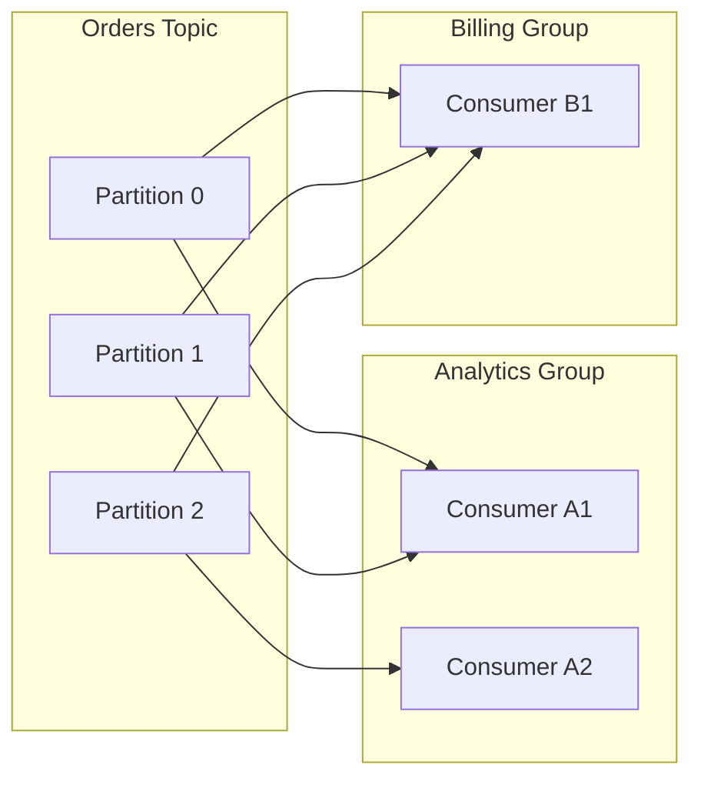
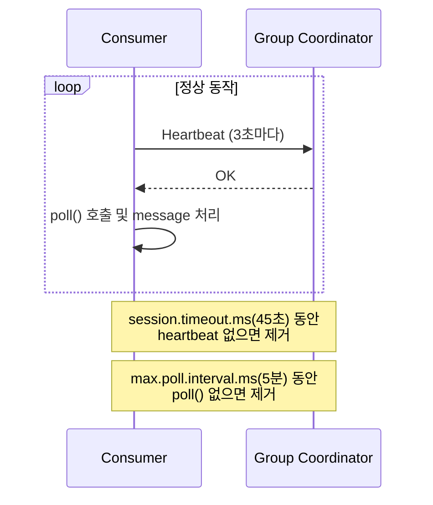
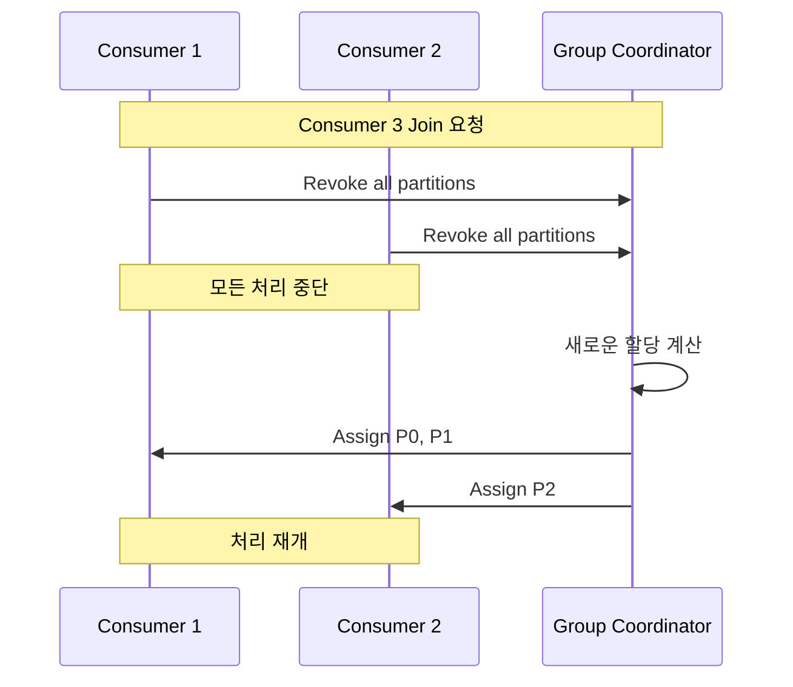
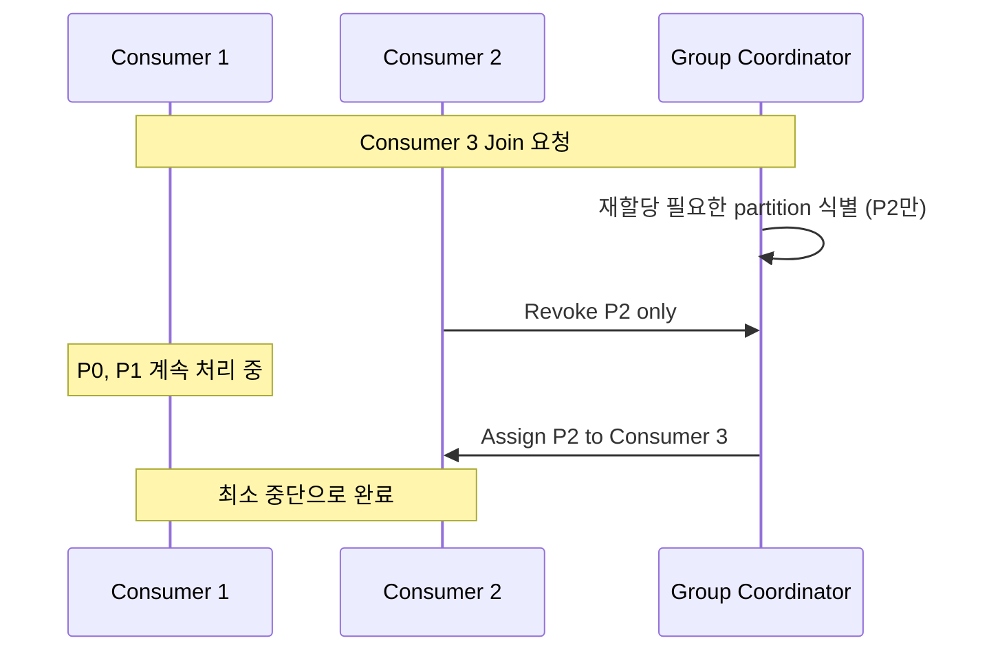
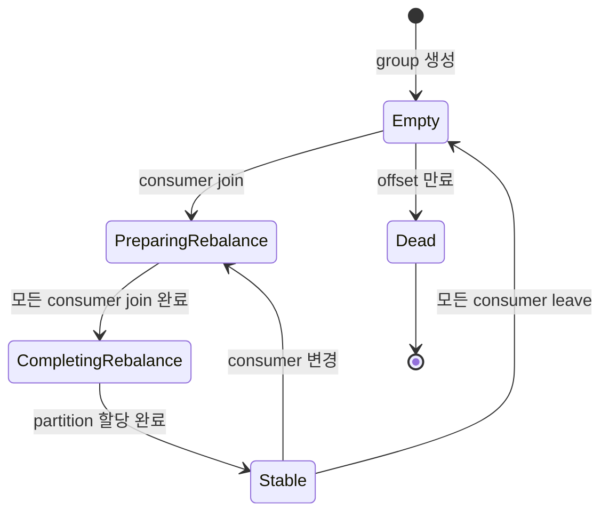

## Consumer Group

- **consumer group**은 동일한 topic을 함께 소비하는 consumer들의 논리적 집합입니다.
    - 여러 consumer를 하나의 단위로 묶어 **병렬 처리**와 **고가용성**을 제공합니다.
    - 각 consumer group은 `group.id`로 식별됩니다.

- consumer group의 핵심 기능은 **partition 분배**와 **장애 대응**입니다.
    - group 내 consumer들에게 partition을 자동으로 분배합니다.
    - consumer 추가/제거 시 partition을 자동으로 재분배합니다.
    - 각 partition은 group 내 하나의 consumer에만 할당되어 중복 처리를 방지합니다.

- 서로 다른 consumer group은 동일한 topic을 독립적으로 소비합니다.
    - 예를 들어, `analytics` group과 `billing` group이 같은 `orders` topic을 각자의 목적으로 처리합니다.
    - 각 group은 독립적인 offset을 관리하여 서로 영향을 주지 않습니다.



- 위 diagram은 두 개의 consumer group이 동일한 topic을 독립적으로 소비하는 구조입니다.
    - Analytics Group은 2개의 consumer가 3개의 partition을 나누어 처리합니다.
    - Billing Group은 1개의 consumer가 모든 partition을 처리합니다.


---


## Consumer Group의 구성 요소

- consumer group은 **consumer**, **group coordinator**, **group leader**로 구성됩니다.


### Consumer

- group에 속한 개별 message 소비자입니다.
    - 각 consumer는 할당받은 partition에서 message를 읽어 처리합니다.
    - 동일한 `group.id`를 설정하여 group에 참여합니다.

- consumer 수와 partition 수의 관계에 따라 처리 효율이 달라집니다.
    - **consumer 수 ≤ partition 수** : 모든 consumer가 활성 상태로 병렬 처리합니다.
    - **consumer 수 > partition 수** : 초과하는 consumer는 유휴 상태로 대기합니다.


### Group Coordinator

- consumer group을 관리하는 **Kafka broker**입니다.
    - 각 consumer group마다 하나의 broker가 coordinator 역할을 담당합니다.
    - `__consumer_offsets` topic의 partition을 기준으로 coordinator가 결정됩니다.

- coordinator의 주요 역할은 membership 관리와 rebalancing 조정입니다.
    - consumer의 join/leave 요청을 처리합니다.
    - heartbeat를 통해 consumer의 상태를 모니터링합니다.
    - rebalancing이 필요하면 group leader에게 partition 재할당을 요청합니다.


### Group Leader

- consumer group 내에서 **partition 할당을 담당하는 consumer**입니다.
    - group에 처음 join한 consumer가 leader로 선출됩니다.
    - coordinator가 아닌 consumer 중 하나가 leader 역할을 수행합니다.

- leader는 할당 전략(assignor)을 실행하여 partition을 분배합니다.
    - coordinator로부터 전체 consumer 목록과 구독 정보를 받습니다.
    - 할당 전략에 따라 각 consumer에게 partition을 배정합니다.
    - 할당 결과를 coordinator에게 전달하고, coordinator가 각 consumer에게 통보합니다.


---


## Partition 할당 전략

- consumer group은 **할당 전략(assignor)**을 사용하여 partition을 consumer에게 분배합니다.
    - consumer가 group에 join하면 group leader가 할당 전략을 실행합니다.
    - 각 consumer는 할당받은 partition에서만 message를 읽습니다.

| 전략 | 특징 | 적합한 상황 |
| --- | --- | --- |
| RangeAssignor | topic별 순차 분배 | 단일 topic 구독 |
| RoundRobinAssignor | 전체 partition 순환 분배 | 다중 topic 균등 분배 |
| StickyAssignor | 기존 할당 유지 + 균등 분배 | local state 보존 필요 |
| CooperativeStickyAssignor | 점진적 재할당 | 무중단 운영 (Kafka 2.4+) |


### RangeAssignor

- topic별로 partition을 순차적으로 분배합니다.
    - topic의 partition을 순서대로 정렬한 후, consumer 수로 나누어 할당합니다.
    - 예를 들어, partition 0-2는 consumer 1에게, partition 3-5는 consumer 2에게 할당합니다.

- partition 수가 consumer 수로 나누어떨어지지 않으면 앞쪽 consumer에게 더 많이 할당됩니다.
- 여러 topic을 구독할 때 특정 consumer에게 partition이 집중될 수 있습니다.


### RoundRobinAssignor

- 모든 topic의 partition을 순환 방식으로 분배합니다.
    - 모든 topic의 partition을 하나의 pool로 모아서 순서대로 할당합니다.
    - 예를 들어, consumer 1에게 topic A partition 0, topic B partition 0을 할당하고, consumer 2에게 topic A partition 1, topic B partition 1을 할당합니다.

- RangeAssignor보다 균등한 분배가 가능합니다.


### StickyAssignor

- 기존 할당을 최대한 유지하면서 균등하게 분배합니다.
    - 첫 할당은 RoundRobinAssignor와 유사합니다.
    - 재할당 시 기존 consumer-partition mapping을 최대한 보존합니다.

- partition 이동을 최소화하여 rebalancing 시간을 줄입니다.
- consumer의 local state를 보존할 수 있습니다.


### CooperativeStickyAssignor

- StickyAssignor에 **cooperative rebalancing**을 적용한 전략입니다.
    - Kafka 2.4부터 도입되었습니다.
    - Kafka 3.0부터 기본 전략으로 사용됩니다.

- 재할당이 필요한 partition만 revoke하여 나머지 partition은 계속 처리합니다.
    - eager rebalancing처럼 모든 partition을 중단하지 않습니다.


---


## Consumer 상태 관리

- consumer group은 **heartbeat**와 **poll interval**을 통해 consumer의 상태를 모니터링합니다.




### Heartbeat

- consumer는 주기적으로 group coordinator에게 heartbeat를 보냅니다.
    - heartbeat는 consumer가 정상 동작 중임을 알리는 신호입니다.
    - `heartbeat.interval.ms` 주기마다 전송되며, 기본값은 3초입니다.

- coordinator는 `session.timeout.ms` 시간 동안 heartbeat를 받지 못하면 해당 consumer를 제거합니다.
    - 기본값은 45초이며, Kafka 3.0 이전에는 10초였습니다.
    - 제거된 consumer의 partition은 다른 consumer에게 재할당됩니다.


### Poll Interval

- `max.poll.interval.ms`는 `poll()` 호출 간 최대 시간 간격입니다.
    - 기본값은 5분입니다.
    - 이 시간 내에 `poll()`을 호출하지 않으면 consumer는 dead 상태로 간주됩니다.

- message 처리 시간이 긴 경우 이 값을 증가시켜야 합니다.
- 적절한 값으로 설정하여 실제 hang과 느린 처리를 구분해야 합니다.


---


## Rebalancing

- **rebalancing**은 consumer group의 구성원이 변경될 때 partition을 재할당하는 과정입니다.
    - consumer의 추가/제거 시 자동으로 발생합니다.
    - partition을 재분배하여 모든 partition이 활성 consumer에게 할당되도록 보장합니다.


### Rebalancing 발생 조건

- 새로운 consumer가 group에 join하면 rebalancing이 발생합니다.
- 기존 consumer가 장애로 종료되거나 heartbeat를 보내지 못하면 rebalancing이 발생합니다.
- consumer가 `max.poll.interval.ms` 내에 `poll()`을 호출하지 않으면 rebalancing이 발생합니다.
- topic의 partition 수가 변경되어도 rebalancing이 발생합니다.
- consumer가 구독하는 topic list가 변경될 때도 rebalancing이 발생합니다.


### Eager Rebalancing

- **eager rebalancing**(stop-the-world rebalancing)은 전통적인 방식입니다.
    - rebalancing 시작 시 모든 consumer가 partition 소유권을 포기합니다.
    - group leader가 새로운 partition assignment를 계산합니다.
    - 모든 consumer에게 새로운 partition을 재할당합니다.

- rebalancing 동안 **전체 consumer group의 message 처리가 중단**됩니다.




### Cooperative Rebalancing

- **cooperative rebalancing**(incremental rebalancing)은 점진적 재조정 방식입니다.
    - 영향받는 partition만 재할당하고, 나머지는 계속 동작합니다.
    - 여러 단계(phase)로 나누어 점진적으로 재조정합니다.

- 첫 번째 phase에서 재할당이 필요한 partition을 식별합니다.
- 두 번째 phase에서 해당 partition만 재할당합니다.
- 대부분의 consumer는 계속해서 message를 처리합니다.

- eager rebalancing보다 중단 시간을 크게 줄입니다.
    - 전체 group이 아닌 일부 consumer만 영향을 받습니다.
    - Kafka 2.4 이후부터 지원되며, Kafka 3.0부터 기본값으로 사용됩니다.




### Rebalancing 최적화

- rebalancing은 가능한 한 최소화해야 합니다.
    - rebalancing 중에는 해당 partition의 message 처리가 중단됩니다.
    - 빈번한 rebalancing은 전체 처리량을 감소시킵니다.

| 설정 | 기본값 | 설명 |
| --- | --- | --- |
| `session.timeout.ms` | 45초 | heartbeat timeout, 너무 짧으면 불필요한 rebalancing 발생 |
| `heartbeat.interval.ms` | 3초 | session.timeout.ms의 1/3 이하 권장 |
| `max.poll.interval.ms` | 5분 | 처리 시간이 긴 경우 증가 필요 |

- **static membership**을 사용하면 재시작 시 rebalancing을 줄입니다.
    - `group.instance.id`를 설정하여 consumer에게 고정된 identity를 부여합니다.
    - consumer 재시작 시 `session.timeout.ms` 이내에 복귀하면 rebalancing이 발생하지 않습니다.
    - 배포나 rolling restart 시 rebalancing overhead를 줄입니다.


---


## Consumer Group 상태

- consumer group은 5가지 상태를 가지며, `kafka-consumer-groups.sh --describe` 명령으로 확인합니다.




### Stable

- 모든 consumer가 partition을 할당받아 **정상적으로 동작하는 상태**입니다.
    - rebalancing이 완료되고 각 consumer가 message를 처리 중입니다.
    - 운영 환경에서 대부분의 시간 동안 유지되어야 하는 상태입니다.


### PreparingRebalance

- **rebalancing을 준비하는 상태**입니다.
    - consumer의 join/leave로 인해 rebalancing이 trigger되었습니다.
    - coordinator가 모든 consumer의 JoinGroup 요청을 기다립니다.
    - `rebalance.timeout.ms` 내에 응답하지 않는 consumer는 제거됩니다.


### CompletingRebalance

- **partition 할당을 완료하는 상태**입니다.
    - group leader가 partition assignment를 계산했습니다.
    - coordinator가 각 consumer에게 SyncGroup 응답을 보내는 중입니다.
    - 모든 consumer가 할당을 받으면 Stable 상태로 전환됩니다.


### Empty

- **consumer가 없는 상태**입니다.
    - 모든 consumer가 group을 떠났지만 offset 정보는 남아있습니다.
    - 새로운 consumer가 join하면 PreparingRebalance 상태로 전환됩니다.
    - `offsets.retention.minutes` 기간이 지나면 Dead 상태로 전환됩니다.


### Dead

- **group이 완전히 삭제된 상태**입니다.
    - offset 정보가 만료되어 더 이상 존재하지 않습니다.
    - 동일한 `group.id`로 새로운 consumer가 join하면 새 group으로 시작됩니다.


---


## Consumer Group 관리

- `kafka-consumer-groups.sh` 명령어로 consumer group을 관리합니다.
    - broker 주소는 `--bootstrap-server` option으로 지정합니다.


### 상태 조회

- group 목록을 조회합니다.

```bash
kafka-consumer-groups.sh --bootstrap-server localhost:9092 --list
```

- 특정 group의 상세 정보를 조회합니다.

```bash
kafka-consumer-groups.sh --bootstrap-server localhost:9092 \
    --group my-consumer-group \
    --describe
```

- 조회 결과에는 partition별 offset, lag, consumer 할당 정보가 포함됩니다.

| Column | 설명 |
| --- | --- |
| GROUP | consumer group ID |
| TOPIC | 구독 중인 topic |
| PARTITION | partition 번호 |
| CURRENT-OFFSET | 현재 commit된 offset |
| LOG-END-OFFSET | partition의 마지막 offset |
| LAG | 처리되지 않은 message 수 |
| CONSUMER-ID | 할당된 consumer의 ID |
| HOST | consumer가 실행 중인 host |
| CLIENT-ID | consumer의 client ID |


### Group 상태 확인

- group의 상태와 coordinator 정보를 확인합니다.

```bash
kafka-consumer-groups.sh --bootstrap-server localhost:9092 \
    --group my-consumer-group \
    --describe \
    --state
```


### Consumer 목록 확인

- group에 속한 consumer 목록을 확인합니다.

```bash
kafka-consumer-groups.sh --bootstrap-server localhost:9092 \
    --group my-consumer-group \
    --describe \
    --members
```

- 각 consumer에게 할당된 partition 상세 정보를 확인합니다.

```bash
kafka-consumer-groups.sh --bootstrap-server localhost:9092 \
    --group my-consumer-group \
    --describe \
    --members \
    --verbose
```


### Group 삭제

- consumer가 없는 group을 삭제합니다.

```bash
kafka-consumer-groups.sh --bootstrap-server localhost:9092 \
    --group my-consumer-group \
    --delete
```


---


## Reference

- <https://kafka.apache.org/documentation/#consumerconfigs>
- <https://www.conduktor.io/kafka/kafka-consumer-groups-and-consumer-offsets/>
- <https://www.popit.kr/kafka-consumer-group/>

