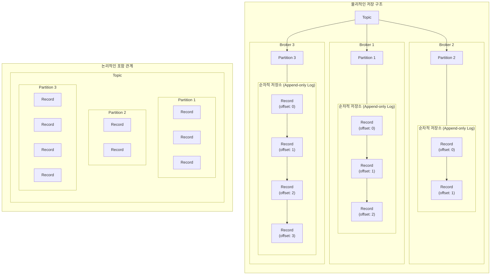

## Topic & Partition & Record

- Kafka의 핵심 개념인 **topic, partition, record**는 **data 흐름과 저장 기능을 구성하는 가장 기본적인 요소**입니다.
    - Kafka는 분산 event streaming platform으로 고성능, 확장성, 내구성을 갖춘 message processing system입니다.
    - 고성능, 확장성, 내구성에 대한 요구 사항을 충족하기 위해, Kafka는 topic, partition, record의 개념으로 data를 효율적으로 저장하고 처리합니다.

| 구성 요소 | 설명 |
| --- | --- |
| **Record** | Kafka에서 처리되는 **data의 기본 단위** |
| **Partition** | record를 순서대로 저장하는 **물리적인 단위**이자 **실질적인 기억 장치** |
| **Topic** | data stream을 구분하는 **논리적 단위**로, **다수의 partition을 grouping**하여 하나의 주제를 나타냄 |

- 논리적으로는 topic이 partition을 포함하는 단순한 계층 구조를 가지지만, 물리적으로는 분산 system의 특성을 활용해 data를 여러 server에 분산 저장합니다.

- 물리적인 저장 구조는 topic, partition, record 간의 논리적인 계층 구조와 다릅니다.
    - 실제로는(물리적으로는) topic이 partition을 포함하지 않습니다.
        - topic은 주제에 맞는 여러 partition을 grouping할 뿐입니다.

| 관계 | 의미 | 설명 |
| --- | --- | --- |
| `topic : partition` = `1 : N` | 하나의 topic이 여러 partition으로 구성됨 | partition 수는 topic의 병렬 처리 능력을 결정함 |
| `partition : record` = `1 : N` | 하나의 partition에 여러 record가 저장됨 | partition 내에서 record는 순서가 보장되지만, partition 간에는 순서가 보장되지 않음 |
| `record : key` = `N : 1` | 동일한 key를 가진 record는 항상 같은 partition에 저장됨 | key가 null인 경우, round-robin 방식으로 partition에 자동 분배됨 |
| `broker : partition` = `1 : N` | 하나의 broker는 여러 partition을 관리함 | 각 partition은 하나의 leader broker와 여러 follower broker가 관리함 |

### 1. Record : Data Unit

- **record**는 **Kafka에서 처리되는 data의 기본 단위**입니다.
    - Kafka에서 **message**라고도 불리며, **producer가 발행**하고 **consumer가 구독**하는 data를 나타냅니다.

- record는 **key, value, timestamp로 구성**됩니다.
    - **key** : record를 특정 partition에 할당하는 데 사용됩니다.
        - 선택적으로 사용되며, key가 없는 경우 round-robin 방식으로 partition이 선택됩니다.
    - **value** : 실제 data 내용을 담고 있습니다.
    - **timestamp** : record가 생성된 시간을 나타냅니다.

- record는 **생성되면 topic의 특정 partition에 추가**되며, 한 번 기록된 record는 불변(immutable)합니다..
    - 한 번 들어간 record는 수정할 수 없으며, 삭제하거나 덮어쓸 수 없습니다.

- record는 **partition 내에서 순차적으로 저장**되며, 각 record는 해당 partition 내에서 **고유한 offset**을 가집니다.
    - **offset**은 0부터 시작하여 증가하는 정수값으로, consumer가 partition 내에서 자신의 위치를 추적하는 데 사용됩니다.
    - consumer가 record를 읽으면 offset이 증가하며, consumer는 자신이 마지막으로 읽은 offset을 기억하고 있다가 다음에 읽을 record를 결정합니다.

### 2. Partition : Record List

- partition은 **record를 순차적으로 저장**하는 **물리적인 단위**입니다.
    - partition은 **실질적인 기억 장치**로, record를 저장하고 관리합니다.

- partition은 **순서가 있는 불변(immutable)의 record sequence**입니다.
    - partition은 각 record는 순서를 가지도록 하기 위해, record가 생성될 때 sequence number(offset)를 할당합니다.
    - partition이 할당하기 때문에, offset은 partition 내에서만 유일합니다.

- partition의 주요 목적은 확장성과 병렬 처리를 제공하는 것입니다.
    - 여러 server에 partition을 분산시켜 단일 server의 용량 제한을 극복하고 처리량을 높일 수 있습니다.
    - 각 partition은 Kafka cluster의 여러 broker에 분산되어 저장될 수도 있습니다.

- **partition의 갯수**를 나중에 증가시키는 것은 가능하지만, **줄이는 것은 불가능**합니다.
    - Kafka는 **수평적 확장에 최적화된 system**으로, **축소보다는 확장 작업에 중점을 두고 설계**되었습니다.
    - 따라서 기술적으로 축소에 대한 지원은 제한적이며, 새로운 topic을 생성하여 기존 data를 이관하는 방식을 사용하는 것이 더 권장되는 방법입니다.
        - 만약 강제로 partition 수를 줄인다면, data 일관성 문제, record 순서 보장 문제, offset sequence 충돌 문제, consumer group rebalancing 문제 등이 발생할 수 있습니다.
    - 초기 partition의 수는 topic 생성 시 설정할 수 있습니다.

- 각 partition은 Kafka cluster 내 **하나의 broker가 leader 역할**을 하며, **다른 broker들은 follower로 data를 복제**합니다.
    - **leader partition은 record를 추가**하고, **follower partition은 leader partition의 record를 복제**합니다.
    - follower partition은 leader partition의 record를 복제하여 fault tolerance를 제공하며, **leader partition이 실패하면 follower partition 중 하나가 leader로 승격**됩니다.
    - **복제 계수**(replication factor)를 설정하여 follower partition의 수를 지정할 수 있습니다.

### 3. Topic : Partition Group

- topic은 Kafka에서 **data stream을 구분하는 논리적 단위**입니다.
    - topic은 논리적 개념이지만, 실제 data는 partition이라는 물리적 단위에 저장됩니다.
    - "주제"를 의미하기 때문에, **논리적으로 같은 주제(topic)라면 물리적으로 분리(partition)되어 있어도 하나의 topic**이 될 수 있습니다.

- topic은 **특정 category**의 message를 저장하는 channel로 생각할 수 있습니다.
    - 예를 들어, website 사용자 활동, 결제 transaction, 장치 sensor data 등의 category가 각각 별도의 topic이 될 수 있습니다.

- 각 topic은 고유한 이름을 가지며, **producer는 특정 topic에 data를 발행**하고 **consumer는 원하는 topic에서 data를 구독**합니다.

- **topic은 내부적으로 여러 partition으로 분할**되어, 분산 저장 및 병렬 처리가 가능합니다.
    - topic을 생성할 때 partition 수를 지정할 수 있습니다.
    - partition의 갯수는 topic의 병렬 처리 능력과 확장성을 결정합니다.
    - partition 수에 따른 장단점이 있으므로, 적절한 partition 수를 선택하는 것이 중요합니다.

---

## 현실에서 Kafka Data Model 적용해보기

- 다양한 scenario에서 topic, partition, record의 개념을 활용하여 messaging system을 구성할 수 있습니다.

1. **실시간 Log 처리 System** : application log, access log, error log 등을 처리하는 system.
    - 각 application component의 log는 별도 topic으로 구성됩니다.
    - log volume에 따라 적절한 수의 partition으로 나누어 처리 capacity를 확보합니다.
    - service ID를 key로 사용하여 같은 service의 log는 항상 같은 partition에서 순서대로 처리됩니다.

2. **E-Commerce Platform** : 주문 처리, 재고 관리, 배송 추적 등을 처리하는 system.
    - 주문, 재고, 배송 등 각 업무 영역별로 별도의 topic을 구성합니다.
    - 고객 ID를 key로 사용하여 같은 고객의 주문 event가 순서대로 처리되도록 보장합니다.
    - 처리량이 많은 주문 topic은 partition을 더 많이 할당하여 병렬 처리 capacity를 높입니다.

3. **IoT 장치 Monitoring System** : 다양한 IoT 장치의 telemetry data와 상태 정보를 수집하고 분석하는 system.
    - 각 device type별로 별도의 topic을 생성합니다.
        - 온도 sensor, 습도 sensor, 움직임 감지기 등.
    - device ID를 key로 사용하여 특정 device에서 발생하는 모든 data가 순서대로 처리됩니다.
    - 지역별로 consumer group을 구성하여 특정 지역의 device만 monitoring할 수 있습니다.
    - 중요한 alert는 별도의 고우선순위 topic으로 분리하여 처리합니다.

4. **금융 거래 처리 System** : 은행 거래, 결제, 송금 등의 금융 transaction을 처리하는 system.
    - 거래 유형별(입금, 출금, 이체, 투자 등)로 각각 topic을 구성합니다.
    - 계좌 번호를 key로 사용하여 동일 계좌의 transaction은 항상 순서대로 처리됩니다.
    - 각 partition은 특정 범위의 계좌를 담당하도록 설계하여 load balancing을 구현합니다.
    - transaction 처리 결과는 별도의 topic에 기록하여 감사(audit) 추적이 가능하도록 합니다.

5. **Social Media 활동 분석** : 사용자 상호작용, content 생성, 참여 활동 등을 분석하는 system.
    - 게시물 작성, 댓글, 좋아요 등 각 활동 유형별로 topic을 구성합니다.
    - 사용자 ID를 key로 사용하여 특정 사용자의 활동 sequence를 유지합니다.
    - 인기 있는 content에 대한 활동은 별도의 topic으로 분리하여 실시간 trend 분석에 활용합니다.
    - 여러 consumer가 사용자 행동 pattern, content 인기도, 사용자 간 상호작용 등의 다양한 분석을 병렬로 수행합니다.

6. **배달 Service Platform** : 음식 주문과 배달 과정을 추적하고 관리하는 system.
    - 주문 접수, 음식 준비, 배달원 할당, 배달 상태 등 배달 lifecycle의 각 단계별로 topic을 구성합니다.
    - 주문 ID를 key로 사용하여 동일 주문의 모든 상태 변경이 순차적으로 처리됩니다.
    - 지역별로 partition을 구성하여 지역 내 주문을 효율적으로 처리합니다.
    - 실시간 위치 data는 높은 처리량을 위해 partition 수가 많은 별도 topic에서 관리합니다.

7. **실시간 추천 System** : 사용자 행동을 기반으로 맞춤형 상품이나 content를 추천하는 system.
    - 사용자 조회, click, 구매 등 각 활동 유형별로 topic을 분리합니다.
    - session ID를 key로 사용하여 동일 session 내 활동 sequence를 유지합니다.
    - 여러 consumer가 다양한 추천 algorithm을 병렬로 실행하고 결과를 별도 topic에 발행합니다.
    - 추천 결과의 우선순위에 따라 partition 수를 다르게 구성하여 resource 사용을 최적화합니다.

---

## Reference

- <https://velog.io/@jwpark06/Kafka-%EC%8B%9C%EC%8A%A4%ED%85%9C-%EA%B5%AC%EC%A1%B0-%EC%95%8C%EC%95%84%EB%B3%B4%EA%B8%B0>

