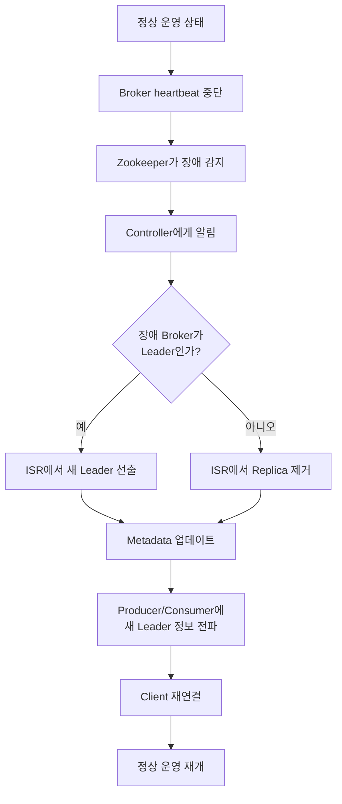
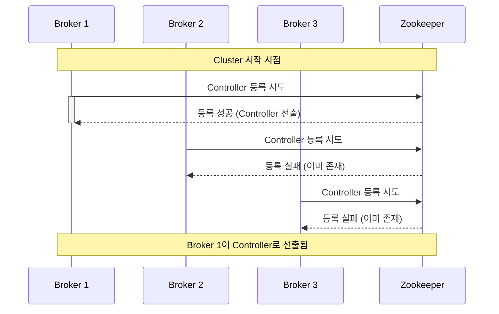

## Kafka Fault Tolerance

- Kafka는 분산 system으로서 개별 component의 장애에도 전체 system이 지속 동작하도록 설계되었습니다.
- replication, leader election, controller broker 등의 mechanism을 통해 자동화된 장애 대응 체계를 제공합니다.
- 장애 감지부터 복구까지 자동으로 처리되어 최소한의 service 중단만 발생합니다.

---

## Broker 장애 감지와 복구 Flow

- Kafka는 자동화된 장애 감지와 복구 mechanism을 통해 높은 가용성을 확보합니다.

### 1. 정상 운영 상태

- producer는 leader broker에게 message를 전송합니다.
- leader broker는 follower broker들에게 data를 복제합니다.
- consumer는 leader broker로부터 message를 소비합니다.

### 2. 장애 감지

- 각 broker는 zookeeper 또는 controller에게 주기적으로 heartbeat를 전송합니다.
    - heartbeat 전송 주기는 broker 설정에 의해 결정됩니다.
    - `session.timeout.ms` 시간 동안 heartbeat가 없으면 장애로 판단됩니다.

- zookeeper는 broker의 session 만료를 감지하여 controller에게 알립니다.
    - ephemeral node mechanism을 통해 자동으로 감지됩니다.

### 3. Leader Election

- 장애가 발생한 broker가 partition의 leader였다면, 새로운 leader를 선출합니다.
    - controller가 leader election process를 주도합니다.
    - ISR(In-Sync Replicas) 목록에서 가장 up-to-date 상태인 follower를 선택합니다.

- 선출된 새 leader에게 승격을 통보하고, leader 역할을 시작하게 합니다.

### 4. Metadata 업데이트

- controller는 새로운 leader 정보를 cluster metadata에 업데이트합니다.
    - zookeeper에 새로운 leader 정보를 기록합니다.
    - 모든 broker에게 metadata 변경을 전파합니다.

### 5. Client 재연결

- producer와 consumer는 metadata 업데이트를 받아 새로운 leader로 재연결합니다.
    - client는 주기적으로 metadata를 refresh합니다.
    - 자동으로 새 leader와 연결을 재설정하여 message 전송/수신을 재개합니다.

---

## Replication을 통한 Fault Tolerance

- Kafka는 partition을 여러 broker에 복제하여 data 손실을 방지합니다.

- **leader replica**는 모든 읽기/쓰기를 처리하고, **follower replica**는 leader의 data를 복제합니다.
    - replication factor N은 최대 N-1개의 broker 장애를 허용합니다.
    - 장애 발생 시 follower 중 하나가 새로운 leader가 됩니다.

- **ISR**(In-Sync Replicas)은 leader와 동기화된 replica 집합입니다.
    - ISR에 속한 replica만 leader 후보가 될 수 있습니다.
    - `replica.lag.time.max.ms` 시간 내에 leader와 동기화를 유지해야 ISR에 포함됩니다.

- leader는 ISR의 모든 replica가 message를 복제한 후에만 commit 완료로 간주합니다.
    - `acks=all` 설정 시, `min.insync.replicas` 설정에 따라 최소 ISR 수를 보장합니다.

---

## Controller Broker의 역할

- **controller**는 cluster 내에서 관리 역할을 담당하는 특별한 broker입니다.
    - cluster 내 모든 broker 중 하나만 controller 역할을 수행합니다.
    - controller는 broker 장애 감지, leader election, partition 관리 등을 담당합니다.

### Controller 선출 과정

- cluster 시작 시, 가장 먼저 zookeeper에 controller 등록을 시도하는 broker가 controller가 됩니다.
    - zookeeper의 ephemeral node 기능을 활용하여 유일성을 보장합니다.
    - 다른 broker들은 등록 실패를 받고 일반 broker로 동작합니다.

- controller broker에 장애가 발생하면, 다른 broker 중 하나가 자동으로 새로운 controller가 됩니다.
    - zookeeper session 만료를 통해 장애를 감지합니다.
    - 다른 broker들이 controller 선출에 다시 참여합니다.

### Controller의 주요 책임

- **broker 상태 관리**
    - cluster 내 모든 broker의 생존 여부를 모니터링합니다.
    - broker의 추가와 제거를 감지하고 필요한 조치를 수행합니다.

- **partition 관리**
    - topic의 partition 할당과 재분배를 조율합니다.
    - partition의 leader와 follower 관계를 설정하고 관리합니다.

- **leader election 관리**
    - partition leader에 장애가 발생하면 새로운 leader를 선출합니다.
    - ISR 목록을 참조하여 최적의 leader 후보를 선정합니다.
    - 선출된 새 leader 정보를 cluster 전체에 전파합니다.

- **metadata 관리**
    - cluster의 metadata를 local에 caching하여 성능을 최적화합니다.
    - metadata 변경 사항을 모든 broker에게 전파합니다.

---

## Clean vs Unclean Leader Election

- leader election 방식에 따라 data 일관성과 가용성 간의 trade-off가 존재합니다.

### Clean Leader Election

- **ISR에 속한 replica만 leader가 될 수 있는 방식**입니다.
    - data 손실이 없음을 보장합니다.
    - leader와 동기화된 replica만 승격되므로 data 일관성이 유지됩니다.

- 모든 ISR replica가 down되면 partition이 unavailable 상태가 됩니다.
    - service 가용성보다 data 일관성을 우선합니다.
    - production 환경에서 권장되는 방식입니다.

### Unclean Leader Election

- **ISR에 속하지 않은 replica도 leader가 될 수 있는 방식**입니다.
    - `unclean.leader.election.enable=true` 설정으로 활성화됩니다.
    - 가용성을 우선하지만, 일부 data 손실이 발생할 수 있습니다.

- 모든 ISR replica가 down되어도 out-of-sync replica를 leader로 선출합니다.
    - data 일관성보다 service 가용성을 우선합니다.
    - data 손실 위험이 있어 일반적으로 권장되지 않습니다.

---

## Zookeeper의 역할 (KRaft로의 전환)

- Kafka 3.0 이전 version에서는 zookeeper를 사용하여 cluster metadata를 관리했습니다.
    - broker 상태 추적, leader election 조정, cluster configuration 저장 등의 역할을 수행했습니다.

- **KRaft**(Kafka Raft)는 zookeeper 없이 Kafka 자체적으로 metadata를 관리하는 새로운 architecture입니다.
    - Kafka 3.0부터 도입되어 점진적으로 zookeeper를 대체하고 있습니다.
    - Raft consensus algorithm을 사용하여 metadata를 관리합니다.

- KRaft의 장점은 다음과 같습니다.
    - zookeeper 의존성 제거로 운영 복잡도가 감소합니다.
    - metadata 관리 성능이 향상됩니다.
    - partition 수 제약이 완화되어 더 많은 partition을 지원합니다.

---

## Kafka의 Fault Tolerance 설정 Best Practice

- **replication factor = 3**
    - 1개의 broker 장애를 허용하면서 적절한 overhead를 유지합니다.

- **`min.insync.replicas = 2`**
    - replication factor 3과 함께 사용 시, 1개 broker 장애까지 write 가능합니다.

- **`acks = all` (producer 설정)**
    - 모든 ISR replica가 message를 확인한 후 성공으로 간주합니다.
    - data 손실 위험을 최소화합니다.

- **`unclean.leader.election.enable = false`**
    - clean leader election만 허용하여 data 일관성을 보장합니다.

- **적절한 retry 설정 (producer/consumer)**
    - `retries` 설정을 통해 일시적 장애에 대응합니다.
    - `retry.backoff.ms`로 적절한 재시도 간격을 설정합니다.

---

## Reference

- <https://kafka.apache.org/documentation/#replication>
- <https://www.confluent.io/blog/kafka-replication-explained/>
- <https://cwiki.apache.org/confluence/display/KAFKA/KIP-500%3A+Replace+ZooKeeper+with+a+Self-Managed+Metadata+Quorum>

