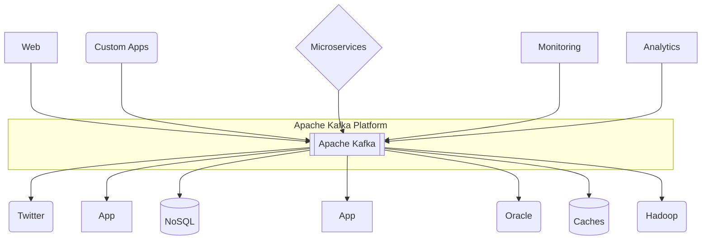
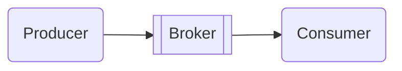
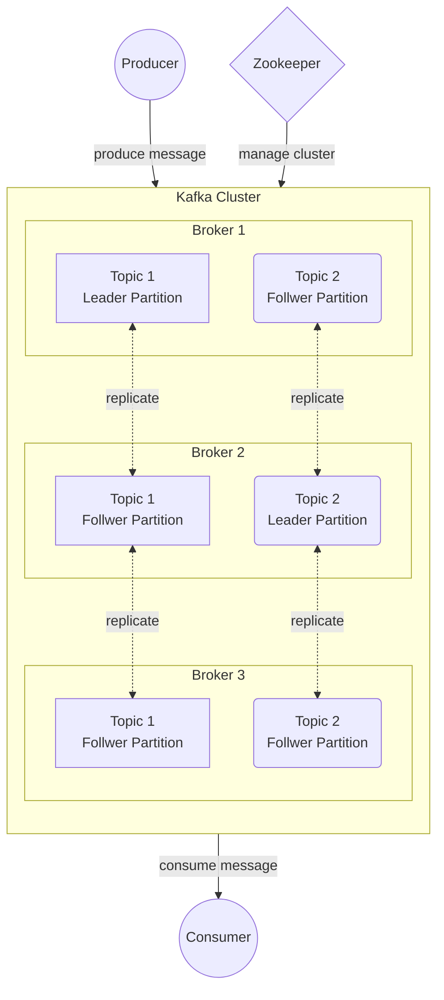

## Apache Kafka

- Apache Kafka는 **분산 message streaming platform**입니다.
    - 주로 실시간 streaming data pipeline을 구성할 때나 event 기반 system을 구축할 때 활용됩니다.

- **대용량 실시간 data 처리**에 특화되어 있으며, **초당 수백만 건**의 message까지도 안정적으로 처리할 수 있습니다.
    - **분산 및 복제 구조**를 통해 내결함성(fault tolerance)을 갖추고 있으며, 확장성(scalability)이 뛰어납니다.
        - 내결함성 : 시스템이 장애 상황에서도 정상적으로 동작할 수 있는 능력.

- **발행-구독(Publish-Subscribe) model을 기반으로 동작하는 messaging system**입니다.
    - **data 생산자(Producer)가 message를 발행**하면, **소비자(Consumer)가 필요한 message를 구독하여 처리**합니다.
    - 다수의 생산자와 소비자가 동시에 data를 주고받을 수 있는 구조입니다.

- Apache Kafka는 대규모 데이터 스트리밍과 실시간 로그 수집, 분석을 위해 **LinkedIn에서 개발**되었습니다.
    - 개발 목적은 **높은 처리량**을 보장하면서 **분산 시스템**으로 이루어져 있는, **지속성**과 **확장성**이 좋은 messaging system을 구축하는 것이었습니다.
        - **높은 처리량** : 초당 수백만 개의 메시지를 처리할 수 있도록 설계됨.
        - **분산 시스템** : 여러 서버에 걸쳐 데이터를 분산하여 높은 가용성과 내결함성 제공.
        - **지속성** : 데이터를 디스크에 영구 저장하여 시스템 장애 시에도 데이터 손실 방지.
        - **확장성** : 필요에 따라 쉽게 클러스터를 확장할 수 있음.
    - 초기에는 LinkedIn 내부 project로 시작되었습니다.
        - 2011년 초기 버전이 LinkedIn 내부에서 사용되기 시작했습니다.
        - 내부에서 검증된 후 오픈 소스로 공개되었습니다.
    - 2011년 Apache Software Foundation에 기부되어 오픈 소스 project가 되었습니다.
        - Apache Incubator 과정을 거쳐 top-level project로 승격되었습니다.
        - 이후 global 개발자 community의 지원을 받으며 발전했습니다.

- Kafka에선 **Publish 모델과 Subscribe 모델이 분리**되어 있어, 데이터를 발행하는 Producer와 데이터를 소비하는 Consumer가 독립적으로 동작할 수 있습니다.
    - Producer는 데이터를 발행하고, Consumer는 데이터를 구독하여 처리합니다.
    - Consumer group을 통해 여러 Consumer가 동시에 데이터를 처리할 수도 있습니다.
        - Consumer group : 동일한 topic을 구독하는 Consumer들의 집합.
        - Consumer group 내에서는 각 Consumer가 처리할 partition을 분배하여 병렬 처리가 가능합니다.
        - Consumer group은 Kafka의 처리량을 확장하고 가용성을 높이는 중요한 개념 중 하나입니다.

- Kafka는 **Topic과 Partition**을 통해 데이터를 관리합니다.
    - 데이터는 topic이라는 논리적인 단위로 구분되어 관리됩니다.
    - topic은 여러 개의 partition으로 분할되어 저장되며, partition은 여러 Broker에 분산 저장됩니다.

- Kafka에 저장되는 데이터는 **영구성**을 가지고 있어, 데이터를 안전하게 보관할 수 있고, 여러 Subscribe 모델(Consumer)이 동시에 사용할 수 있습니다.
    - 데이터는 disk에 저장되고, replication을 통해 여러 Broker에 복제됩니다.
    - 데이터를 일정 기간 동안 보관하며, 보관 기간은 설정에 따라 조절할 수 있습니다.

- Kafka는 처리량을 높게 유지하기 위해 **자체적으로 메시지를 최적화**합니다.
    - 데이터를 메모리에 캐싱하여 빠른 처리 속도를 보장합니다.
    - disk에 저장할 때에도 sequential I/O를 활용하여 성능을 높입니다.
    - 데이터를 partition으로 분할하여 여러 Broker에 분산 저장함으로써 처리량을 늘릴 수 있습니다.

- 데이터의 증가에 따른 **scale out이 쉬운 구조**를 가지고 있습니다.
    - Broker를 추가하거나, partition을 추가함으로써 쉽게 확장할 수 있습니다.
    - Producer와 Consumer도 독립적으로 확장할 수 있어, 시스템의 부하를 효율적으로 분산할 수 있습니다.

- Kafka는 대용량 실시간 data 처리를 **batch 처리 중심에서 실시간 stream 처리로 전환**하는 데 중요한 역할을 했습니다.
    - 동시에 event-driven architecture의 기반 기술로 자리잡았습니다.

- 현재 Kafka는 **실시간 data streaming의 표준**이며, Kafka Connect, Kafka Streams, ksqlDB 등의 다양한 component가 추가되면서 Kafka ecosystem도 지속적으로 확장되고 있습니다.
    - Netflix, Uber, LinkedIn, Twitter 등 수많은 기업에서 핵심 infrastructure로 활용하고 있습니다.
        - IoT, 실시간 분석, log 수집, event sourcing 등 다양한 영역에서 활용되고 있습니다.
    - message queue system을 넘어서, 실시간 data pipeline 구축을 위한 종합 platform으로 발전하고 있습니다.

### Kafka의 장점

- **높은 처리량과 낮은 지연 시간** : Kafka는 초당 수백만 건의 message를 처리할 수 있는 분산 messaging system으로, 대규모 data stream을 실시간으로 처리하는 데 적합합니다.
    - partitioning을 통한 분산 처리 방식으로, 단일 cluster에서도 초당 수 Terabyte의 data를 안정적으로 처리할 수 있습니다.

- **Data 영속성과 안정성** : 모든 message는 disk에 저장되어 data 손실 위험을 최소화합니다.
    - replication factor 설정을 통해 여러 Broker에 data를 복제함으로써 고가용성을 보장합니다.
    - Broker 장애 발생 시에도 자동으로 복구되어 무중단 service가 가능합니다.

- **확장성과 유연성** : 수평적 확장이 가능한 구조로 설계되어 cluster에 Broker를 동적으로 추가할 수 있습니다.
    - Producer와 Consumer를 독립적으로 확장할 수 있어 system resource를 더 효율적으로 활용할 수 있습니다.

### Kafka 활용 사례

- **Log 수집 및 처리 System** : 대규모 web service의 application log, system metric, 사용자 활동 log 등을 실시간으로 수집하고 처리합니다.
    - ELK(Elasticsearch, Logstash, Kibana) stack과 연동하여 log 분석 및 monitoring system을 구축할 수 있습니다.

- **실시간 Streaming Data 처리** : SNS feed, 주식 시세, IoT sensor data와 같은 실시간 streaming data를 처리합니다.
    - Apache Spark, Apache Flink 등의 stream processing engine과 연동하여 복잡한 실시간 분석을 수행할 수 있습니다.

- **Event 기반 Microservice Architecture** : service 간 비동기 통신을 위한 event bus로 활용됩니다.
    - service 간 결합도를 낮추고 확장성을 높이는 데 기여합니다.
    - 장애 전파를 방지하고 system 복원력을 향상시킵니다.

- **실시간 고객 Data Pipeline** : 사용자 행동 data를 실시간으로 수집하고 분석하여 개인화된 service를 제공합니다.
    - A/B test, 실시간 추천 system 등에 활용됩니다.

### Kafka 도입 시 고려 사항

- **운영 복잡성** : Zookeeper 의존성 관리와 cluster 운영에 대한 전문성이 필요합니다.
    - 적절한 partition 수와 replication factor 설정이 중요합니다.

- **Resource 관리** : memory와 disk 사용량을 monitoring하고 적절히 관리해야 합니다.
    - disk 사용량을 관리하기 위해, data 보존 기간과 정책을 명확히 설정해야 합니다.

- **Message 순서 보장** : partition level에서만 순서가 보장되므로, 순서가 중요한 경우 partitioning 전략을 신중히 설계해야 합니다.
    - 전역적(global) 순서 보장이 필요한 경우 단일 partition을 사용해야 합니다.
        - 단일 partition을 사용한다면 처리량 제한을 염두에 두어야 합니다.
    - 또는 partition key를 활용하여 특정 key에 대해서 순서를 보장하는 방법을 사용할 수도 있습니다.

---

## Kafka Architecture

- **Kafka는 Broker** 역할을 수행하며, 일종의 **Message Queue**입니다.
    - Producer application과 Conumer application 사이에 위치하여 Message를 전달합니다.

- 여러 대의 broker server로 **Kafka cluster**를 구성하여, 더 많은 data를 처리할 수도 있습니다.

- **Producer** : **data를 생성하고 Kafka system에 전달**하는 application입니다.
    - **message를 특정 topic으로 발행**하며, **partition에 data를 분배하는 역할**을 수행합니다.
    - **Kafka에서 제공하는 Producer API를 활용하여 구현**됩니다.

- **Consumer** : Producer가 발행한 **message를 Broker로부터 가져와 처리**하는 application입니다.
    - **하나 이상의 topic을 구독하여 message를 소비**할 수 있습니다.
    - Consumer group을 통해 병렬 처리도 가능합니다.

- **Cluster** : 여러 대의 broker server가 하나의 system처럼 동작하는 **분산 환경을 구성**합니다.
    - 높은 가용성과 확장성을 제공하며, 대용량 data 처리가 가능한 구조를 만듭니다.
    - **각각의 server는 독립적으로 동작**하면서도 **전체적으로는 단일 system처럼 운영**됩니다.

- **Broker** : **Producer와 Consumer 사이에서 message를 중계하는 Kafka server**입니다.
    - 각 Broker는 고유한 `broker.id`를 가지며, **cluster의 일부로 동작**합니다.
    - **message의 저장과 전달을 담당**하며, **Zookeeper와 연동하여 cluster 운영을 관리**합니다.

- **Topic** : **message를 논리적으로 구분하는 단위**입니다.
    - **특정 category나 event 종류별로 구분되어 관리**됩니다.
    - 하나의 topic은 **여러 개의 partition으로 분할**될 수 있습니다.

- **Partition** : **topic의 물리적 저장소 단위**입니다.
    - **수평적 확장이 가능한 구조**로, 처리량을 얼마든지 늘릴 수 있습니다.
    - 각 partition은 leader와 follower로 구성되어 고가용성을 보장합니다.

### Cluster 운영 구조

- **Zookeeper 연동** : Zookeeper는 **cluster의 metadata 관리를 담당**합니다.
    - **Broker의 상태 관리와 leader 선출을 조율**합니다.
    - 설정 정보의 중앙화된 저장소 역할을 수행합니다.

- **Leader와 Follower 구조** : **각 partition은 하나의 leader와 여러 follower로 구성**됩니다.
    - **leader**는 **해당 partition의 읽기와 쓰기를 담당**합니다.
    - **follower**는 **leader의 data를 복제하여 가용성을 보장**합니다.

- **장애 대응 체계** : **Broker 장애 발생 시 controler가 새로운 leader를 선출**합니다.
    - **변경된 leader 정보는 Zookeeper에 기록**되어 cluster 전체에 공유됩니다.
    - **자동화된 복구 process**를 통해 system의 안정성을 유지합니다.

---

## Reference

- <https://velog.io/@hyeondev/Apache-Kafka-%EC%9D%98-%EA%B8%B0%EB%B3%B8-%EC%95%84%ED%82%A4%ED%85%8D%EC%B3%90>
- <https://medium.com/@0joon/10%EB%B6%84%EC%95%88%EC%97%90-%EC%95%8C%EC%95%84%EB%B3%B4%EB%8A%94-kafka-bed877e7a3bc>
- <https://velog.io/@holicme7/Apache-Kafka-Kafka-Streams-%EB%9E%80>

