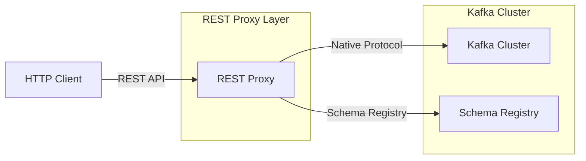

## Kafka REST Proxy

- **Kafka REST Proxy**는 RESTful HTTP API를 통해 Kafka cluster와 상호작용할 수 있게 하는 component입니다.
- native Kafka client를 사용할 수 없는 환경이나 언어에서도 HTTP 기반으로 Kafka를 사용할 수 있습니다.
- Confluent에서 개발하고 유지 보수하는 open source project입니다.


---


## REST Proxy가 필요한 이유

- **다양한 언어에서 Kafka를 사용할 수 있습니다.**
    - native Kafka client가 없는 언어에서도 HTTP client만 있으면 Kafka를 사용할 수 있습니다.
    - 모든 programming 언어가 HTTP library를 제공하므로 접근성이 높습니다.

- **application과 간단하게 통합할 수 있습니다.**
    - Kafka client library를 application에 포함시킬 필요가 없습니다.
    - dependency 관리와 version 호환성 문제를 줄일 수 있습니다.

- **방화벽 환경에서 사용하기 용이합니다.**
    - Kafka native protocol (9092 port)을 열지 않고 HTTP/HTTPS (80/443 port)만 열면 됩니다.
    - 보안 정책상 제한된 port만 허용하는 환경에서 유용합니다.

- **빠른 prototype 개발이 가능합니다.**
    - `curl` 같은 도구로 간단히 test하고 검증할 수 있습니다.
    - client library 설정 없이 즉시 Kafka를 사용할 수 있습니다.


---


## REST Proxy Architecture



- REST Proxy는 HTTP request를 받아 Kafka native protocol로 변환하는 gateway 역할을 합니다.
    - client의 HTTP request를 Kafka producer/consumer API 호출로 변환합니다.
    - Kafka response를 HTTP response로 변환하여 client에게 전달합니다.

- REST Proxy는 stateless service로 설계되어 수평적 확장이 가능합니다.
    - 여러 REST Proxy instance를 실행하고 load balancer로 분산할 수 있습니다.

- Schema Registry와 통합하여 Avro, JSON Schema, Protobuf 등의 schema를 지원합니다.


---


## 주요 기능

### Producer 기능

- **HTTP POST request로 topic에 message를 전송할 수 있습니다.**
    - HTTP POST request로 topic에 message를 전송합니다.
    - 단일 message 또는 batch message 전송을 지원합니다.

```bash
curl -X POST -H "Content-Type: application/vnd.kafka.json.v2+json" \
  --data '{"records":[{"value":{"name":"testUser"}}]}' \
  "http://localhost:8082/topics/my-topic"
```

- **partition key를 지정하여 message를 routing할 수 있습니다.**
    - partition key를 지정하여 message를 특정 partition으로 routing할 수 있습니다.

```bash
curl -X POST -H "Content-Type: application/vnd.kafka.json.v2+json" \
  --data '{"records":[{"key":"user1","value":{"name":"testUser"}}]}' \
  "http://localhost:8082/topics/my-topic"
```


### Consumer 기능

- **consumer group을 생성하고 consumer instance를 등록할 수 있습니다.**
    - consumer group을 생성하고 consumer instance를 등록합니다.

```bash
curl -X POST -H "Content-Type: application/vnd.kafka.v2+json" \
  --data '{"name":"my-consumer","format":"json","auto.offset.reset":"earliest"}' \
  "http://localhost:8082/consumers/my-consumer-group"
```

- **생성한 consumer로 특정 topic을 구독할 수 있습니다.**
    - 생성한 consumer로 특정 topic을 구독합니다.

```bash
curl -X POST -H "Content-Type: application/vnd.kafka.v2+json" \
  --data '{"topics":["my-topic"]}' \
  "http://localhost:8082/consumers/my-consumer-group/instances/my-consumer/subscription"
```

- **HTTP GET request로 message를 가져올 수 있습니다.**
    - HTTP GET request로 message를 가져옵니다.

```bash
curl -X GET -H "Accept: application/vnd.kafka.json.v2+json" \
  "http://localhost:8082/consumers/my-consumer-group/instances/my-consumer/records"
```

- **처리한 message의 offset을 commit할 수 있습니다.**
    - 처리한 message의 offset을 commit합니다.

```bash
curl -X POST -H "Content-Type: application/vnd.kafka.v2+json" \
  "http://localhost:8082/consumers/my-consumer-group/instances/my-consumer/offsets"
```


### Metadata 조회

- **cluster의 모든 topic 목록을 조회할 수 있습니다.**
    - cluster의 모든 topic을 조회합니다.

```bash
curl -X GET "http://localhost:8082/topics"
```

- **특정 topic의 partition 정보를 조회할 수 있습니다.**
    - 특정 topic의 partition 정보를 조회합니다.

```bash
curl -X GET "http://localhost:8082/topics/my-topic/partitions"
```


---


## 지원하는 Data Format

- REST Proxy는 여러 data format을 지원합니다.


### JSON Format

- 가장 간단하고 일반적으로 사용되는 format입니다.
- `Content-Type: application/vnd.kafka.json.v2+json`

```json
{
  "records": [
    {"value": {"name": "Alice", "age": 30}},
    {"value": {"name": "Bob", "age": 25}}
  ]
}
```


### Avro Format

- Schema Registry와 함께 사용하여 schema 관리가 가능합니다.
- `Content-Type: application/vnd.kafka.avro.v2+json`

```json
{
  "value_schema": "{\"type\":\"record\",\"name\":\"User\",\"fields\":[{\"name\":\"name\",\"type\":\"string\"}]}",
  "records": [
    {"value": {"name": "Alice"}}
  ]
}
```


### Binary Format

- base64 encoding된 binary data를 전송합니다.
- `Content-Type: application/vnd.kafka.binary.v2+json`

```json
{
  "records": [
    {"value": "SGVsbG8gV29ybGQ="}
  ]
}
```


---


## REST Proxy 설정

- REST Proxy는 `kafka-rest.properties` file을 통해 설정합니다.


### 기본 설정

```properties
# REST Proxy가 listen할 port
listeners=http://0.0.0.0:8082

# Kafka broker 주소
bootstrap.servers=localhost:9092

# Schema Registry 주소 (Avro 사용 시)
schema.registry.url=http://localhost:8081

# Consumer request timeout
consumer.request.timeout.ms=30000
```


### 보안 설정

```properties
# SSL 활성화
listeners=https://0.0.0.0:8082
ssl.keystore.location=/path/to/keystore.jks
ssl.keystore.password=password
ssl.key.password=password

# SASL 인증
client.security.protocol=SASL_SSL
client.sasl.mechanism=PLAIN
client.sasl.jaas.config=org.apache.kafka.common.security.plain.PlainLoginModule required username="admin" password="admin-secret";
```


---


## REST Proxy의 제약 사항

- **성능 overhead가 발생합니다.**
    - HTTP protocol overhead로 인해 native client보다 throughput이 낮습니다.
    - latency가 증가할 수 있습니다.

- **일부 기능이 제약됩니다.**
    - native client의 모든 고급 기능을 지원하지 않습니다.
    - transaction, exactly-once semantic 등 일부 기능은 제한적입니다.

- **consumer state 관리에 제약이 있습니다.**
    - consumer는 REST Proxy server에 state를 유지하므로, server 재시작 시 consumer를 재생성해야 합니다.
    - long-running consumer에는 적합하지 않을 수 있습니다.

- **server resource를 사용합니다.**
    - 각 consumer instance가 server의 resource를 사용합니다.
    - 많은 수의 consumer를 동시에 사용하면 server 부하가 증가합니다.


---


## REST Proxy 사용 Best Practice

- **짧은 작업에 사용하는 것이 적합합니다.**
    - message를 가끔 전송하거나, 일회성 조회 작업에 적합합니다.
    - 지속적인 streaming 처리에는 native client를 권장합니다.

- **적절한 timeout을 설정해야 합니다.**
    - `consumer.request.timeout.ms`를 적절히 설정하여 장시간 대기를 방지합니다.

- **consumer를 정리해야 합니다.**
    - 사용 완료한 consumer는 반드시 삭제하여 server resource를 확보합니다.

```bash
curl -X DELETE \
  "http://localhost:8082/consumers/my-consumer-group/instances/my-consumer"
```

- **batch 처리를 활용해야 합니다.**
    - 여러 message를 한 번에 전송하여 network overhead를 줄입니다.

- **load balancing을 구성해야 합니다.**
    - 여러 REST Proxy instance를 실행하고 load balancer를 앞단에 배치합니다.


---


## REST Proxy Alternatives

- **Kafka Connect는 data pipeline 구축에 더 적합합니다.**
    - data pipeline 구축에는 Kafka Connect가 더 적합합니다.
    - 다양한 connector를 통해 외부 system과 통합할 수 있습니다.

- **Native Client Libraries는 고성능이 필요한 경우 사용됩니다.**
    - 고성능이 필요한 경우 Java, Python, Go 등의 native client를 사용합니다.
    - 더 많은 기능과 더 나은 성능을 제공합니다.

- **ksqlDB는 SQL 기반으로 Kafka를 다룰 수 있습니다.**
    - SQL 기반으로 Kafka를 다루고 싶다면 ksqlDB를 고려합니다.
    - stream processing과 query 기능을 제공합니다.


---


## Reference

- <https://docs.confluent.io/platform/current/kafka-rest/index.html>
- <https://github.com/confluentinc/kafka-rest>
- <https://velog.io/@holicme7/Apache-Kafka-Kafka-REST-Proxy%EB%9E%80>

