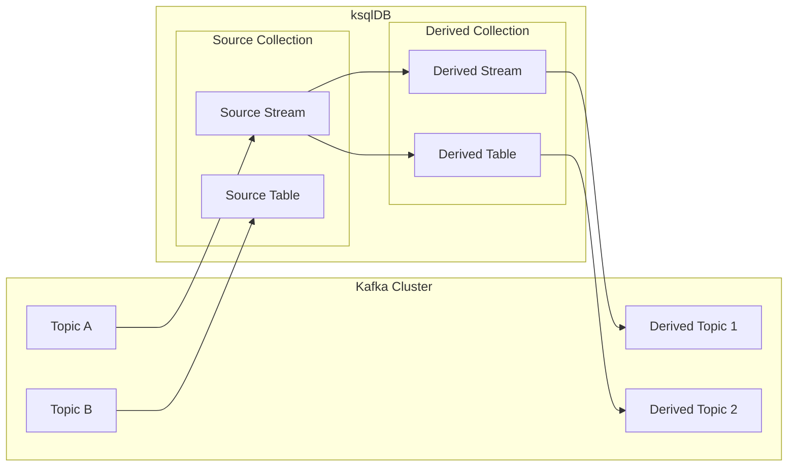

## Collection : ksqlDB의 Data 저장소

- ksqlDB에서 data를 저장하고 처리하는 단위를 **collection**이라고 합니다.
- collection은 **data 원천**에 따라 Source Collection과 Derived Collection으로, **data model**에 따라 Stream과 Table로 나뉩니다.

|  | **Source Collection** | **Derived Collection** |
| --- | --- | --- |
| **Stream** | Source Stream | Derived Stream |
| **Table** | Source Table | Derived Table |




---


## Source Collection : Kafka Topic에서 직접 읽는 Collection

- source collection은 **Kafka topic의 data를 직접 읽어와서 생성하는 collection**입니다.
    - `CREATE STREAM` 또는 `CREATE TABLE` 문으로 Kafka topic과 연결하여 생성합니다.
    - source collection 자체는 새로운 Kafka topic을 생성하지 않습니다.

- source collection은 외부 system에서 Kafka로 유입된 원본 data를 ksqlDB에서 처리하기 위한 진입점 역할을 합니다.


### Source Stream

- Kafka topic의 event를 시간 순서대로 읽어오는 **append-only collection**입니다.
    - 모든 event가 그대로 보존되며, 수정이나 삭제가 불가능합니다.

```sql
CREATE STREAM order_stream (
    order_id VARCHAR KEY,
    product_name VARCHAR,
    amount DECIMAL,
    order_time TIMESTAMP
) WITH (
    KAFKA_TOPIC = 'orders',
    VALUE_FORMAT = 'JSON',
    TIMESTAMP = 'order_time'
);
```


### Source Table

- Kafka topic의 data를 key 기준으로 **최신 상태만 유지하는 collection**입니다.
    - 동일한 key에 새로운 값이 들어오면 기존 값을 덮어씁니다.

```sql
CREATE TABLE user_table (
    user_id VARCHAR PRIMARY KEY,
    name VARCHAR,
    email VARCHAR
) WITH (
    KAFKA_TOPIC = 'users',
    VALUE_FORMAT = 'JSON'
);
```


---


## Derived Collection : Query 결과로 생성되는 Collection

- derived collection은 **기존 collection에 query를 실행하여 생성하는 collection**입니다.
    - `CREATE STREAM AS SELECT` 또는 `CREATE TABLE AS SELECT` 문으로 생성합니다.
    - source collection과 달리 **새로운 Kafka topic이 자동으로 생성**되며, query 결과가 해당 topic에 기록됩니다.

- derived collection은 persistent query로 동작하여, 원본 collection에 새로운 data가 들어올 때마다 자동으로 결과가 갱신됩니다.


### Derived Stream

- 기존 stream이나 table에 filtering, 변환, join 등의 연산을 적용하여 **새로운 event stream을 생성**합니다.

```sql
CREATE STREAM high_value_orders AS
    SELECT order_id, product_name, amount, order_time
    FROM order_stream
    WHERE amount > 10000
    EMIT CHANGES;
```


### Derived Table

- 기존 stream이나 table에 집계 연산을 적용하여 **상태를 유지하는 table을 생성**합니다.
    - `GROUP BY` 절이 필수이며, 집계 함수(`COUNT`, `SUM`, `AVG` 등)와 함께 사용합니다.

```sql
CREATE TABLE product_sales AS
    SELECT
        product_name,
        COUNT(*) AS order_count,
        SUM(amount) AS total_amount
    FROM order_stream
    GROUP BY product_name
    EMIT CHANGES;
```


---


## Source Collection과 Derived Collection의 차이

| 특성 | Source Collection | Derived Collection |
| --- | --- | --- |
| **생성 방법** | `CREATE STREAM/TABLE` | `CREATE STREAM/TABLE AS SELECT` |
| **data 원천** | Kafka topic 직접 연결 | 기존 collection의 query 결과 |
| **Kafka topic 생성** | 기존 topic 사용 (새로 생성하지 않음) | 새로운 topic 자동 생성 |
| **query 실행** | 없음 (data 읽기만 수행) | persistent query 상시 실행 |
| **data 갱신** | Kafka topic에 data가 들어올 때 | 원본 collection에 변경이 발생할 때 |

- source collection은 **data 유입의 시작점**이고, derived collection은 **data 가공의 결과물**입니다.
    - 하나의 source collection에서 여러 derived collection을 생성할 수 있으며, derived collection에서 또 다른 derived collection을 생성하는 것도 가능합니다.


---


## Reference

- <https://docs.ksqldb.io/en/latest/concepts/collections/>
- <https://ojt90902.tistory.com/1207>

