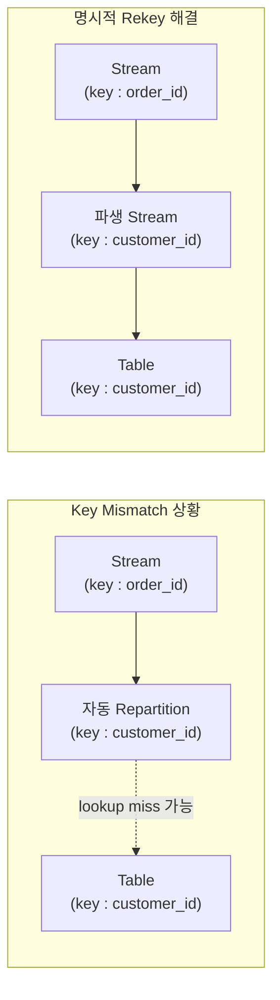

## Stream Key와 Join Key가 다른 문제

- Stream-Table Join에서 **stream의 Kafka key와 `ON` 절에 사용하는 join key가 서로 다른 column이면, table lookup miss가 발생**할 수 있습니다.
    - stream의 Kafka key는 stream 생성 시 `KEY` column이나 `PARTITION BY`로 지정된 column입니다.
    - join key는 `ON stream.column = table.column`에서 사용하는 column입니다.
    - 이 두 column이 다르면, 동일한 join key 값을 가진 stream record와 table record가 서로 다른 partition에 위치하게 됩니다.

- ksqlDB는 stream key와 join key가 다른 경우 **자동 repartition을 수행**합니다.
    - 내부적으로 join key 기준의 intermediate topic을 생성하고, stream data를 해당 topic으로 재분배합니다.
    - 문법적으로는 허용되며, query 생성 시 error가 발생하지 않습니다.

- 그러나 자동 repartition이 항상 안정적으로 동작하지는 않습니다.
    - ksqlDB server 재시작, 상태 복구(state restoration), offset reset 등의 상황에서 **repartition된 stream과 table의 상태가 동기화되지 않을 수 있습니다**.
    - 이 경우 stream record가 도착하는 시점에 table에 해당 key의 상태가 아직 로드되지 않아 lookup이 실패합니다.


---


## 증상 : INNER JOIN에서 Row 소실, LEFT JOIN에서 Null 발생

- key mismatch로 인한 lookup miss는 **join 유형에 따라 다른 증상**으로 나타납니다.

| Join 유형 | 증상 | 설명 |
| --- | --- | --- |
| **INNER JOIN** | row가 결과에서 사라짐 | lookup miss된 record는 양쪽 모두 match 실패로 판정되어 출력되지 않음 |
| **LEFT JOIN** | 오른쪽(table) 값이 모두 null | stream record는 유지되지만 table 조회가 실패하여 null로 채워짐 |

- LEFT JOIN으로 바꿨을 때 오른쪽 값이 null로 나타나는 것은 **문제를 해결한 것이 아니라, lookup miss를 눈에 보이게 만든 것**입니다.
    - INNER JOIN에서는 실패한 lookup이 조용히 row를 삭제합니다.
    - LEFT JOIN에서는 실패한 lookup이 null로 드러나므로, 문제의 존재를 확인할 수 있습니다.


### 예시 : Stream Key(ORDER_ID)와 Join Key(CUSTOMER_ID)가 다른 경우

- 주문 stream의 Kafka key는 `order_id`이고, join 조건에는 `customer_id`를 사용하여 고객 table과 join하는 상황입니다.

```sql
-- stream의 Kafka key : order_id
CREATE STREAM order_stream WITH (
    KAFKA_TOPIC='orders',
    VALUE_FORMAT='JSON',
    PARTITIONS=3
) AS
SELECT *
FROM raw_order_stream
PARTITION BY order_id
EMIT CHANGES;

-- table의 primary key : customer_id
CREATE TABLE customer_table (
    customer_id BIGINT PRIMARY KEY,
    name VARCHAR,
    region VARCHAR
) WITH (
    KAFKA_TOPIC='customers',
    VALUE_FORMAT='JSON'
);

-- stream key(order_id) != join key(customer_id) -> lookup miss 가능
CREATE STREAM enriched_order_stream AS
SELECT
    o.order_id,
    o.customer_id,
    o.amount,
    c.name AS customer_name,
    c.region
FROM order_stream o
    INNER JOIN customer_table c
    ON o.customer_id = c.customer_id
EMIT CHANGES;
```

- `order_stream`은 `order_id` 기준으로 partition되어 있지만, join은 `customer_id` 기준으로 수행됩니다.
    - ksqlDB가 `customer_id` 기준으로 자동 repartition을 시도하지만, 상태 동기화 문제로 lookup miss가 발생할 수 있습니다.
    - INNER JOIN에서 결과가 나오지 않고, LEFT JOIN으로 변경하면 `customer_name`과 `region`이 null로 출력됩니다.


---


## 원인 : Partition 기반 Join과 Key Mismatch

- ksqlDB의 Stream-Table Join은 **partition 단위로 독립적으로 처리**됩니다.
    - partition 0을 처리하는 worker는 stream의 partition 0과 table의 partition 0만 접근합니다.
    - 따라서 join이 성공하려면, **같은 join key를 가진 stream record와 table record가 같은 번호의 partition에 위치**해야 합니다.

- Kafka는 record의 key에 hash function을 적용하여 partition을 결정합니다.
    - `hash(key) % partition_count = partition_number`로 계산합니다.
    - **같은 key 값은 항상 같은 partition에 저장**됩니다.

- stream key와 join key가 다르면, **stream record와 table record가 서로 다른 partition에 위치**하게 됩니다.
    - stream의 Kafka key가 `order_id`이면, `hash(order_id)`로 partition이 결정됩니다.
    - table의 primary key가 `customer_id`이면, `hash(customer_id)`로 partition이 결정됩니다.
    - join 조건이 `ON o.customer_id = c.customer_id`여도, stream record는 `order_id` 기준으로 배치되어 있으므로 같은 `customer_id`를 가진 두 record가 다른 partition에 있을 수 있습니다.

```plaintext
order_stream (key : order_id) :
  order_id=ORD-001, customer_id=42 -> hash(ORD-001) % 3 = partition 0
  order_id=ORD-002, customer_id=42 -> hash(ORD-002) % 3 = partition 2

customer_table (key : customer_id) :
  customer_id=42 -> hash(42) % 3 = partition 1

결과 : customer_id=42로 join하려 하지만,
       stream record는 partition 0, 2에, table record는 partition 1에 위치.
       partition 0을 처리하는 worker는 partition 1의 table data에 접근 불가 -> lookup miss.
```

- ksqlDB는 이 문제를 감지하면 **자동 repartition**을 수행하여, join key 기준으로 stream data를 재분배합니다.
    - 그러나 이 자동 repartition이 항상 안정적으로 동작하지는 않습니다.


### 자동 Repartition의 한계

- ksqlDB의 자동 repartition은 **query 실행 중에 내부적으로 처리**되므로, 외부에서 직접 제어하거나 상태를 확인하기 어렵습니다.



- 자동 repartition이 있음에도 lookup miss가 발생하는 주요 원인입니다.
    - **상태 복구 timing** : ksqlDB server 재시작 시, repartition된 intermediate topic과 table의 state store가 서로 다른 속도로 복구됩니다. stream record가 먼저 도착하면 table에 아직 해당 key가 없어 lookup이 실패합니다.
    - **offset reset** : `auto.offset.reset`이 `latest`로 설정된 경우, repartition된 intermediate topic의 기존 data는 건너뛰고 새로운 data만 처리합니다. table이 아직 해당 key를 가지고 있지 않은 상태에서 stream event가 도착하면 miss가 발생합니다.
    - **partition 할당 변경** : consumer group rebalancing이나 ksqlDB instance 추가/제거 시, partition 할당이 변경되면서 state store의 일부가 재구축됩니다. 재구축이 완료되기 전에 도착하는 stream record는 lookup에 실패합니다.


---


## 해결 : 명시적 Rekey 파생 Stream 생성

- **join key를 Kafka key로 갖는 파생 stream을 명시적으로 생성한 후, 해당 stream으로 table을 join**합니다.
    - 자동 repartition에 의존하지 않고, join key 기준으로 partition된 독립적인 stream을 만드는 방식입니다.
    - 파생 stream은 별도의 Kafka topic을 가지므로, state store와의 동기화가 안정적입니다.


### 해결 방법

- `PARTITION BY` 절로 join key를 Kafka key로 지정한 파생 stream을 생성합니다.

```sql
-- Step 1. join key(customer_id) 기준으로 rekey된 파생 stream 생성
CREATE STREAM order_by_customer_stream WITH (
    KAFKA_TOPIC='orders-by-customer',
    VALUE_FORMAT='JSON',
    PARTITIONS=3
) AS
SELECT *
FROM order_stream
PARTITION BY customer_id
EMIT CHANGES;

-- Step 2. 파생 stream으로 table join (INNER JOIN 정상 동작)
CREATE STREAM enriched_order_stream AS
SELECT
    o.order_id,
    o.customer_id,
    o.amount,
    c.name AS customer_name,
    c.region
FROM order_by_customer_stream o
    INNER JOIN customer_table c
    ON o.customer_id = c.customer_id
EMIT CHANGES;
```

- 파생 stream의 Kafka key가 `customer_id`이므로, table의 primary key `customer_id`와 동일한 기준으로 partition됩니다.
    - stream과 table이 같은 key 기준으로 partition되어 있으므로, 동일한 key 값을 가진 record가 같은 partition에 위치합니다.
    - 자동 repartition이 필요 없어지므로, 상태 복구 timing에 의한 lookup miss가 발생하지 않습니다.


### 기존 Pipeline에 적용하는 절차

- 기존에 자동 repartition에 의존하던 pipeline을 명시적 rekey 방식으로 전환하는 절차입니다.

```sql
-- 1. 기존 join stream 제거
DROP STREAM IF EXISTS enriched_order_stream DELETE TOPIC;

-- 2. rekey 파생 stream 생성
CREATE STREAM order_by_customer_stream WITH (
    KAFKA_TOPIC='orders-by-customer',
    VALUE_FORMAT='JSON',
    PARTITIONS=3
) AS
SELECT *
FROM order_stream
PARTITION BY customer_id
EMIT CHANGES;

-- 3. 파생 stream 기반으로 join stream 재생성
CREATE STREAM enriched_order_stream AS
SELECT
    o.order_id,
    o.customer_id,
    o.amount,
    c.name AS customer_name,
    c.region
FROM order_by_customer_stream o
    INNER JOIN customer_table c
    ON o.customer_id = c.customer_id
EMIT CHANGES;
```

- `auto.offset.reset`이 `latest`인 경우, 파생 stream 생성 후 새로운 event가 유입되어야 join 결과가 출력됩니다.
    - 기존 data로 test하려면 `SET 'auto.offset.reset' = 'earliest';`를 실행한 후 pipeline을 재생성합니다.


---


## Debugging : LEFT JOIN으로 Lookup Miss 확인하기

- INNER JOIN에서 결과가 나오지 않을 때, **LEFT JOIN으로 변경하면 lookup miss 여부를 확인**할 수 있습니다.
    - INNER JOIN은 lookup이 실패한 record를 조용히 제거하므로, 문제의 원인을 파악하기 어렵습니다.
    - LEFT JOIN은 lookup이 실패해도 stream record를 유지하고 table 쪽 값을 null로 채우므로, 어떤 record에서 miss가 발생하는지 확인할 수 있습니다.

```sql
-- INNER JOIN : 결과가 나오지 않음 (원인 파악 불가)
SELECT o.customer_id, c.name, c.region
FROM order_stream o
    INNER JOIN customer_table c
    ON o.customer_id = c.customer_id
EMIT CHANGES;

-- LEFT JOIN : null로 lookup miss 확인 가능
SELECT o.customer_id, c.name, c.region
FROM order_stream o
    LEFT JOIN customer_table c
    ON o.customer_id = c.customer_id
EMIT CHANGES;
-- 결과 예시 : 1042 | null | null
-- -> customer_id=1042인 record가 table에서 조회되지 않았음을 의미
```

- LEFT JOIN 결과에서 table 쪽 column이 null이면, 두 가지 가능성을 순서대로 확인합니다.
    - **table에 해당 key의 row가 존재하는지** : `SELECT * FROM customer_table WHERE customer_id = 1042;` pull query로 확인합니다.
    - **row가 존재하는데 null이면 key mismatch** : stream key와 join key가 다르거나, partition 정렬이 맞지 않아 lookup miss가 발생한 것입니다. 명시적 rekey 파생 stream을 생성하여 해결합니다.


---


## Reference

- <https://docs.confluent.io/platform/current/ksqldb/developer-guide/joins/join-streams-and-tables.html>
- <https://docs.ksqldb.io/en/latest/developer-guide/joins/partition-data/>

