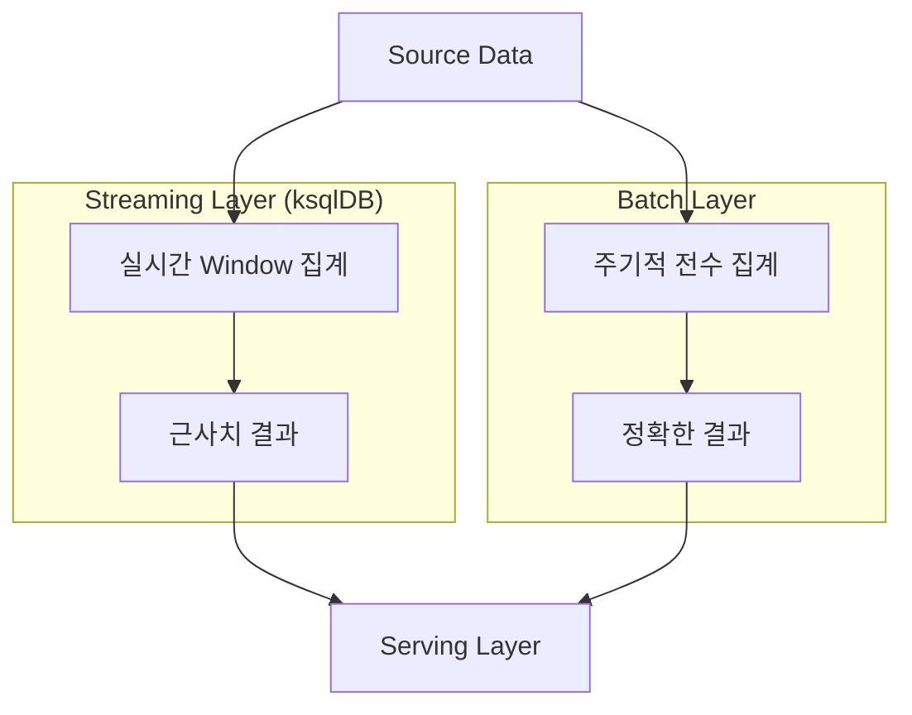

## Window 집계의 한계

- ksqlDB의 window 집계는 시간 기반으로 data를 grouping하여 처리하지만, 실시간 streaming 환경에서 근본적인 한계가 존재합니다.
    - window는 종료 시간 + `GRACE PERIOD`가 지나면 닫히며, 닫힌 window에 속하는 지연 data는 무시됩니다.
    - 한번 닫힌 window는 재개할 수 없으므로, 과거 data의 대량 재처리가 필요한 경우 새로운 stream을 생성해야 합니다.


### 지연 Data 처리의 제약

- `GRACE PERIOD` 이후에 도착한 data는 해당 window 집계에 포함되지 않고 **영구적으로 버려집니다**.
    - network 지연, system 장애, 외부 system 연동 지연 등으로 data가 늦게 도착하는 상황은 실무에서 빈번하게 발생합니다.

| Window 시간 | GRACE PERIOD | Data Timestamp | Data 도착 시간 | 처리 결과 |
| --- | --- | --- | --- | --- |
| 13:00-14:00 | 2시간 | 13:30 | 14:30 | 포함 (GRACE PERIOD 이내) |
| 13:00-14:00 | 2시간 | 13:45 | 16:30 | 버림 (GRACE PERIOD 초과) |
| 13:00-14:00 | 24시간 | 13:15 | 23:45 | 포함 (GRACE PERIOD 이내) |


### Window 재설정 불가

- 닫힌 window는 다시 열 수 없으며, window 정의 자체를 변경하는 것도 불가능합니다.
    - window 크기나 `GRACE PERIOD`를 변경하려면 기존 table을 삭제하고 새로 생성해야 합니다.
    - 기존 persistent query가 실행 중인 상태에서는 동일한 source stream에 대해 동일한 이름의 table을 생성할 수 없으므로, query를 먼저 종료해야 합니다.


### 상태 저장소의 Resource 제약

- window 집계의 결과는 local state store에 저장되며, window 수가 많아질수록 **memory와 disk 사용량이 증가**합니다.
    - `WINDOW_RETENTION_MS` 설정으로 오래된 window data를 자동 삭제할 수 있지만, retention 기간이 길수록 resource 사용량이 높아집니다.
    - 특히 `GRACE PERIOD`를 길게 설정하면 그만큼 많은 window를 동시에 열어 두어야 하므로, state store 부담이 커집니다.


---


## 설계 배경 : 실시간성과 정확성의 Trade-off

- window 집계의 한계는 streaming system의 본질적인 제약에서 비롯됩니다.

- **resource 효율성** : 무한한 stream에서 모든 window 상태를 영구적으로 유지하면 memory와 disk가 무한히 증가하므로, window를 닫아 resource를 회수해야 합니다.

- **실시간 처리의 본질** : streaming system은 실시간에 가까운 처리를 목표로 하므로, 지연 data를 무한정 기다리면 결과 반영이 지연되어 실시간성이 훼손됩니다.

- **확장성 확보** : 수백, 수천 개의 window를 동시에 처리할 때 명확한 종료 정책이 없으면 system 부하를 예측하고 관리하기 어렵습니다.


---


## 해결 방안

- `GRACE PERIOD` 조정, 다중 pipeline 구성, batch 처리 병행으로 window 집계의 한계를 완화할 수 있습니다.


### 1. GRACE PERIOD 최적화

- data 지연 pattern을 분석하여 **대다수의 지연 data를 포함할 수 있는 적절한 `GRACE PERIOD`를 설정**합니다.
    - `GRACE PERIOD`가 짧으면 지연 data 손실이 많아지고, 길면 resource 사용량과 결과 확정 지연이 증가합니다.

```sql
-- 대부분의 data가 24시간 내에 도착하는 경우
CREATE TABLE hourly_sales AS
    SELECT
        product_id,
        COUNT(*) AS sale_count,
        SUM(amount) AS total_amount
    FROM order_stream
    WINDOW TUMBLING (SIZE 1 HOUR, GRACE PERIOD 24 HOURS)
    GROUP BY product_id
    EMIT CHANGES;
```


### 2. 다중 Pipeline 구성

- **짧은 `GRACE PERIOD`의 실시간 pipeline**과 **긴 `GRACE PERIOD`의 보정 pipeline**을 별도로 운영하여, 실시간성과 정확성을 동시에 확보합니다.

```sql
-- 실시간 결과용 (빠르지만 지연 data 누락 가능)
CREATE TABLE realtime_hourly AS
    SELECT product_id, COUNT(*) AS sale_count
    FROM order_stream
    WINDOW TUMBLING (SIZE 1 HOUR, GRACE PERIOD 10 MINUTES)
    GROUP BY product_id
    EMIT CHANGES;

-- 보정용 (느리지만 대부분의 지연 data 포함)
CREATE TABLE corrected_hourly AS
    SELECT product_id, COUNT(*) AS sale_count
    FROM order_stream
    WINDOW TUMBLING (SIZE 1 HOUR, GRACE PERIOD 7 DAYS)
    GROUP BY product_id
    EMIT CHANGES;
```

- 실시간 pipeline의 결과를 먼저 사용하고, 이후 보정 pipeline의 결과로 갱신하는 방식으로 운영합니다.


### 3. Batch 처리와 병행

- streaming 처리의 한계를 batch 처리로 보완하는 **Lambda Architecture** 방식을 적용합니다.
    - streaming layer에서는 실시간 근사치를 생성하고, batch layer에서는 주기적으로 정확한 결과를 산출합니다.
    - 두 결과를 data warehouse나 data lake에서 병합하여 최종 결과를 만듭니다.




---


## Reference

- <https://docs.ksqldb.io/en/latest/concepts/time-and-windows-in-ksqldb-queries/>
- <https://docs.ksqldb.io/en/latest/developer-guide/ksqldb-reference/create-table-as-select/>

