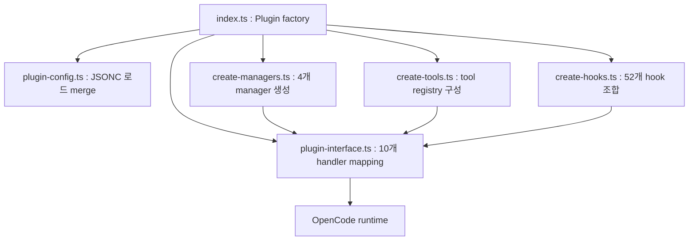

## OpenCode Plugin의 구조

- OpenCode plugin은 **JavaScript/TypeScript module**로, 한 개 이상의 factory 함수를 export합니다.
    - 각 factory 함수는 `context` object를 받아서 hook object를 반환합니다.
    - OpenCode runtime이 startup 시 plugin을 불러와 hook을 등록합니다.

- plugin은 `opencode.json`의 `plugin` array에 등록하여 load합니다.
    - npm package는 package 이름을 지정합니다. (예 : `"opencode-wakatime"`, `"@my-org/custom-plugin"`)
    - local file은 `file://` prefix로 경로를 지정합니다. (예 : `"file://./plugins/my-plugin.js"`)

- 공식 문서에는 `~/.config/opencode/plugins/`, `.opencode/plugins/` directory의 file이 자동 load된다고 안내하지만, 실제로는 config 등록이 필요한 경우가 많습니다.

- npm plugin은 OpenCode가 startup 시 Bun으로 자동 설치하고, `~/.cache/opencode/node_modules/`에 cache합니다.


### 기본 형태

- 가장 작은 plugin은 async factory 함수 하나로 끝납니다.

```ts
import type { Plugin } from "@opencode-ai/plugin"

export const MyPlugin: Plugin = async ({ project, client, $, directory, worktree }) => {
    return {
        event: async ({ event }) => {
            if (event.type === "session.idle") {
                await $`osascript -e 'display notification "Session completed!" with title "opencode"'`
            }
        },
    }
}
```

- factory 함수가 받는 context object는 다섯 가지 값을 포함합니다.

| Field | 설명 |
| --- | --- |
| `project` | 현재 project 정보 |
| `directory` | 실행 directory 경로 |
| `worktree` | git worktree 경로 |
| `client` | opencode SDK client |
| `$` | Bun shell API |


---


## Plugin이 걸 수 있는 Hook

- plugin은 다양한 event category에 hook을 걸 수 있으며, 필요한 hook만 선택적으로 구현합니다.


### Lifecycle Event

- session, message, todo, server, LSP, installation 등 runtime 전반의 event를 수신합니다.
    - `session.created`, `session.idle`, `session.compacted`, `session.error`로 session 흐름을 추적합니다.
    - `message.updated`, `message.part.updated`로 message 단위의 변경을 감지합니다.
    - `todo.updated`로 todo list 변화에 반응합니다.


### Tool Hook

- tool 실행 전후에 개입하여 guard, sanitization, post-processing을 수행합니다.
    - `tool.execute.before`에서 argument를 수정하거나 실행을 차단합니다.
    - `tool.execute.after`에서 output을 검증하거나 후처리합니다.

- 예를 들어, `.env` file 읽기를 막는 hook은 `tool.execute.before`에서 filePath를 검사하여 error를 throw합니다.

```js
export const EnvProtection = async () => {
    return {
        "tool.execute.before": async (input, output) => {
            if (input.tool === "read" && output.args.filePath.includes(".env")) {
                throw new Error("Do not read .env files")
            }
        },
    }
}
```


### Chat Hook

- LLM 호출에 붙는 parameter, header, message를 manipulation합니다.
    - `chat.params`로 thinking budget, effort 같은 model 특수 parameter를 override합니다.
    - `chat.headers`로 `x-initiator`, `x-client-name` 등 HTTP header를 삽입합니다.
    - `chat.message`로 사용자 message를 preprocessing합니다.


### Shell Hook

- agent와 user terminal의 shell 실행에 environment variable을 주입합니다.

```js
export const InjectEnvPlugin = async () => {
    return {
        "shell.env": async (input, output) => {
            output.env.MY_API_KEY = "secret"
            output.env.PROJECT_ROOT = input.cwd
        },
    }
}
```


### Compaction Hook

- `experimental.session.compacting` hook으로 context 압축 시점에 필요한 정보를 보존합니다.
    - `output.context` array에 항목을 push하여 default prompt에 추가합니다.
    - `output.prompt`를 설정하면 compaction prompt 전체를 교체합니다.


---


## Custom Tool 등록

- plugin은 hook뿐 아니라 **custom tool**을 등록할 수 있습니다.
    - `@opencode-ai/plugin`이 제공하는 `tool` helper로 정의합니다.
    - Zod schema로 argument 구조를 선언하면, OpenCode는 built-in tool과 동일한 방식으로 호출합니다.

```ts
import { type Plugin, tool } from "@opencode-ai/plugin"

export const CustomToolsPlugin: Plugin = async (ctx) => {
    return {
        tool: {
            mytool: tool({
                description: "This is a custom tool",
                args: {
                    foo: tool.schema.string(),
                },
                async execute(args, context) {
                    const { directory, worktree } = context
                    return `Hello ${args.foo} from ${directory} (worktree: ${worktree})`
                },
            }),
        },
    }
}
```

- tool 정의는 세 field로 구성됩니다.
    - `description` : tool의 용도 설명이며, LLM이 호출 시점을 판단하는 근거.
    - `args` : Zod schema로 기술한 argument 구조.
    - `execute` : 실제 동작을 수행하는 async 함수.


---


## 실제 Project 구조 : oh-my-opencode

- oh-my-opencode는 **batteries-included OpenCode plugin**으로, plugin이 얼마나 복잡한 architecture로 확장될 수 있는지 보여주는 reference입니다.
    - `@opencode-ai/plugin` protocol을 그대로 따르면서 11개 agent, 26개 tool, 52개 hook을 통합합니다.
    - Bun runtime 기반 TypeScript project이며 Zod로 설정을 validation합니다.


### 전체 Architecture

- plugin은 factory 함수 하나에서 시작하여 여러 layer를 통해 조립됩니다.



- `index.ts`는 plugin의 entry point로, context를 받아 factory pipeline을 실행합니다.
    - config load, manager 생성, tool registry, hook 구성, interface mapping, dispose 등록 순서로 초기화합니다.
    - 최종적으로 `name`과 hook object를 반환합니다.


### Directory 구조

- `oh-my-openagent/` project는 기능별 module로 세분화되어 있습니다.

| Directory | 역할 |
| --- | --- |
| `src/index.ts` | plugin factory entry point |
| `src/plugin-interface.ts` | 내부 hook을 OpenCode handler로 mapping |
| `src/plugin-config.ts` | JSONC config load와 Zod validation |
| `src/create-hooks.ts` | 3-tier hook composition |
| `src/create-managers.ts` | manager instance 생성 |
| `src/create-tools.ts` | tool 등록 logic |
| `src/agents/` | 11개 specialized agent 정의 |
| `src/hooks/` | 52개 hook 구현 |
| `src/tools/` | 26개 tool 구현 |
| `src/features/` | background-agent, tmux, skill 등 기능 module |
| `src/config/schema/` | Zod schema 32개 |
| `src/mcp/` | 내장 MCP server |
| `src/shared/` | logger, validator, state 등 공통 utility |


### Configuration

- oh-my-opencode는 JSONC format의 설정 file을 사용하며, user 단과 project 단을 merge합니다.
    - user : `~/.config/opencode/oh-my-openagent.json[c]`.
    - project : `.opencode/oh-my-openagent.json[c]`.

- Zod v4 schema로 설정 전체를 type-safe하게 검증합니다.
    - agent 설정, category 설정, disabled list, feature 설정 등을 계층적으로 정의합니다.
    - migration field로 설정 version 전환을 idempotent하게 처리합니다.


### Manager Pattern

- 복잡한 state를 가진 작업은 manager로 분리합니다.

| Manager | 책임 |
| --- | --- |
| `TmuxSessionManager` | tmux pane 기반 background agent UI 관리 |
| `BackgroundManager` | background task spawn, polling, notification |
| `SkillMcpManager` | skill 내장 MCP server lifecycle 관리 |
| `ConfigHandler` | `/config` command introspection 처리 |

- manager는 factory 함수(`createXXX`)로 생성되며, plugin factory 안에서 조립됩니다.
    - manager 간 직접 의존을 피하기 위해 message storage 같은 shared state를 거쳐 통신합니다.


### Hook Composition

- hook은 **3개 tier**로 분리되어 composition됩니다.
    - core hook 43개 : session lifecycle, tool guard, context transform 처리.
    - continuation hook 7개 : ralph loop, todo enforcement 등 자동 재개 logic.
    - skill hook 2개 : skill 주입과 availability tracking.

- 세 tier의 hook이 `plugin-interface.ts`에서 OpenCode protocol의 10개 handler로 mapping됩니다.
    - 동일한 event에 여러 hook이 걸려도 순차 실행되므로, handler는 각 hook을 iterate하는 구조로 작성됩니다.


### Tool Registry Pattern

- tool 등록은 registry object로 일괄 관리됩니다.
    - `create-tools.ts`에서 built-in tool, custom tool, MCP bridge tool을 합쳐 하나의 record로 구성합니다.
    - config의 `disabled_tools`에 포함된 tool은 registry에서 제외되어 LLM에게 노출되지 않습니다.

- oh-my-opencode의 대표 tool은 background 위임, 안전한 편집, todo 조작, 사용자 질문 네 가지 카테고리로 구분됩니다.
    - `task` : category를 지정하여 background agent에게 작업을 위임.
    - `hashline-edit` : 내용 hash로 검증하는 안전한 file 편집.
    - `todocreate`, `todoread`, `todowrite`, `tododelete` : todo list 조작.
    - `question` : 사용자에게 질문을 던져 답을 받음.


### Disposal Pattern

- plugin이 unload되거나 reload될 때 정리 logic이 실행됩니다.
    - `createPluginDispose`로 background task abort, MCP shutdown, LSP client 종료, hook dispose 등을 수행합니다.
    - plugin factory 안에서 `activePluginDispose` 전역 변수에 저장해 두었다가 다음 load 전에 호출합니다.


---


## Plugin 설계 시 주의점

- plugin을 안정적으로 동작시키려면 logging, dependency 관리, hook 실행 순서, type 안정성 네 가지를 점검해야 합니다.


### Logging

- `console.log` 대신 `client.app.log()`를 사용해 구조화된 log를 남깁니다.
    - level은 `debug`, `info`, `warn`, `error` 중에서 선택합니다.
    - `service`, `message`, `extra` field로 검색 가능한 log를 남깁니다.

```ts
await client.app.log({
    body: {
        service: "my-plugin",
        level: "info",
        message: "Plugin initialized",
        extra: { foo: "bar" },
    },
})
```


### Dependency 관리

- local plugin이 외부 npm package를 사용하려면 config directory에 `package.json`을 둡니다.
    - OpenCode가 startup 시 `bun install`을 실행해 의존성을 설치합니다.
    - plugin file에서는 일반적인 import 구문으로 package를 사용합니다.


### Hook 순서

- 여러 plugin이 동시에 설치되면 hook이 순차 실행됩니다.
    - global config, project config, global plugin directory, project plugin directory 순서로 load됩니다.
    - 동일 이름 npm package는 한 번만 load되지만, local과 npm에 동시에 있으면 둘 다 load됩니다.


### Type 안정성

- `@opencode-ai/plugin`의 `Plugin` type을 import하여 factory 함수 signature를 고정합니다.
    - hook handler의 input/output type이 보장되어 refactoring이 안전합니다.
    - Zod schema와 결합하면 설정과 tool argument까지 type-safe하게 관리합니다.


---


## Reference

- <https://opencode.ai/docs/plugins>
- <https://github.com/code-yeongyu/oh-my-openagent>
- <https://github.com/anomalyco/opencode>

