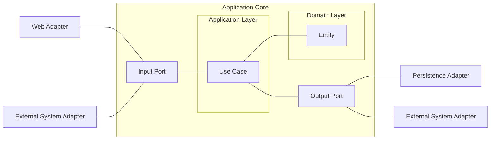

## Hexagonal Architecture



- **Hexagonal Architecture**는 business 로직을 외부 system으로부터 격리시켜 유지 보수성과 확장성을 높이는 software architecture pattern입니다.
- **Port and Adapter Architecture**라고도 불리며, port와 adapter를 중심으로 구성됩니다.
- 핵심 business 로직은 중앙의 domain 영역에 위치하며, 외부와의 소통은 port와 adapter를 통해 이루어집니다.


---


## Hexagonal Architecture의 핵심 설계 원칙

- Hexagonal Architecture는 business logic을 중심에 두고 외부 의존성을 최소화하는 것을 목표로 합니다.
- 모든 외부 요소들은 port와 adapter를 통해서만 domain과 상호작용할 수 있습니다.


### Domain 중심 설계

- 핵심 business logic은 중앙의 domain 영역에 위치하며, 입출력 처리는 port와 adapter를 통해 수행됩니다.
- domain logic과 infrastructure 계층을 명확히 분리하여 변경 사항이 domain logic에 미치는 영향을 줄입니다.
- system의 다양한 부분을 독립적으로 개발하고 test할 수 있는 환경을 제공합니다.


### 의존성 역전

- 모든 의존성은 안쪽(domain)을 향하도록 설계되어 domain code가 바깥으로 향하는 어떠한 의존성도 갖지 않습니다.
- domain은 어떤 영속성(persistence) framework나 외부 system이 사용되는지 알 수 없어야 합니다.
- 외부 계층이 domain 계층에 의존하는 구조로 설계됩니다.


---


## Hexagonal Architecture의 주요 Component

- Hexagonal Architecture는 adapter, port, application service, domain model의 4가지 주요 component로 구성됩니다.
- 각 component는 명확한 역할과 책임을 가지며 서로 독립적으로 개발하고 test할 수 있습니다.


### Domain Model

- **DDD의 domain model과 동일한 개념**을 가진 계층입니다.
- business logic이라 부르는 entity에 대한 변경은 모두 해당 계층에서만 실행됩니다.
- 원칙적으로 어떠한 의존성도 없어야 하지만, database 참조가 필요한 경우 port를 통해 adapter를 주입받을 수 있습니다.


### Application Service (Usecase)

- **adapter를 주입받아 domain model과 adapter를 적절히 orchestration하는 계층**입니다.
- business workflow를 조정하고 domain model의 행동을 호출합니다.
- usecase는 단일 책임을 갖기 위해 세분화되어 있습니다.
    - 예를 들어, `UserService`를 `RegisterUserService`로 분할합니다.


### Port

- **service(또는 usecase)에 adapter 명세만을 제공하는 계층**입니다.
- 단순히 interface 정의만 존재하며, dependency injection을 위해 사용됩니다.
- incoming port와 outgoing port로 구분됩니다.


### Adapter

- **port를 통해 infrastructure와 실제로 연결하는 부분**을 담당하는 구현체입니다.
- Driving Adapter(Primary Adapter)와 Driven Adapter(Secondary Adapter)로 구분됩니다.

#### Driving Adapter (Primary Adapter)

- 사용자 요청을 받아들일 때 사용되는 adapter입니다.
- AWS Lambda의 handler, web application의 controller 등이 해당됩니다.

#### Driven Adapter (Secondary Adapter)

- domain model의 처리에 사용되는 adapter입니다.
- message queue, persistence adapter 등이 해당됩니다.


---


## Clean Architecture와의 관계

- **Hexagonal Architecture는 Clean Architecture를 일반화한 구조 중 하나**로, Clean Architecture의 핵심 원칙을 실제 구현 가능한 형태로 구체화합니다.
- Clean Architecture의 이론적 개념을 port와 adapter라는 구체적인 구현 pattern으로 발전시켰습니다.


### Clean Architecture 핵심 원칙

- **Clean Architecture**는 business 규칙을 외부로부터 독립적으로 만들어 test를 용이하게 하고 외부 영향으로부터 보호합니다.
- 모든 의존성은 안쪽을 향하도록 설계되어 domain code가 바깥으로 향하는 어떠한 의존성도 갖지 않습니다.
- 영속성 계층이 domain 계층에 의존하며, 영속성 entity를 domain entity로 변환하는 과정이 필요합니다.


### Clean Architecture를 구체화하면 Hexagonal Architecture

- Clean Architecture의 추상적인 계층 구분을 port와 adapter라는 구체적인 구현 방식으로 명확히 정의합니다.
- Clean Architecture에서 말하는 "의존성 역전"을 port interface를 통해 실제로 구현합니다.
- Clean Architecture의 "세부 사항으로부터 독립"을 adapter를 통한 외부 system 추상화로 달성합니다.


---


## Hexagonal Architecture의 장점과 단점

- Hexagonal Architecture는 명확한 장단점을 가지며, project의 특성과 요구 사항을 고려하여 적용 여부를 결정해야 합니다.
- 복잡한 business logic을 가진 system에서 그 효과가 극대화됩니다.


### 장점

- **유연성** : 외부 system이나 infrastructure와의 의존성이 낮아 구성 요소를 쉽게 교체하거나 update할 수 있습니다.
- **Test 용이성** : business logic을 독립적으로 test할 수 있으며, 필요한 port만 mocking하여 test를 수행할 수 있습니다.
- **유지 보수성** : 책임이 분리되어 있어 code의 이해와 수정이 용이합니다.


### 단점

- **구현 복잡성** : port와 adapter를 구성하고 관리하는 데 복잡함이 있습니다.
- **초기 개발 시간 증가** : architecture 설계와 component 분리에 추가적인 시간이 필요합니다.


---


## Hexagonal Architecture에서의 관심사 분리와 Test 전략

- **DDD, Clean Architecture, Hexagonal Architecture에서 가장 중요한 것은 명확한 관심사의 분리**입니다.
- 각 layer와 component가 명확한 책임을 가짐으로써 문제 발생 시 정확한 위치를 파악할 수 있습니다.


### 문제 해결 시 확인 지점

- 외부와의 연결에 문제가 생기면 **adapter**를 확인합니다.
- interface 정의를 변경하고자 한다면 **port**를 확인합니다.
- 처리 중간에 측정을 위해 event를 보내거나 trace log를 추가하고 싶다면 **service(usecase)**를 확인합니다.
- business logic이 제대로 동작하지 않는다면 **domain model**을 확인합니다.


### Test 용이성

- 본인의 역할을 수행하기 위해 필요한 port만 mocking하여 test를 쉽게 수행할 수 있습니다.
- 각 component가 독립적으로 test 가능하여 전체 system의 안정성을 보장합니다.


---


## Hexagonal Architecture Package 구조 예시

- Hexagonal Architecture를 실제 project에 적용할 때의 권장 package 구조입니다.
- 계층별 명확한 분리와 의존성 방향을 고려하여 설계되었습니다.

```
payment-system
└── account
    ├── adapter
    │   ├── in
    │   │   └── web
    │   │       └── AccountController
    │   └── out
    │       └── persistence
    │           ├── AccountPersistenceAdapter
    │           └── SpringDataAccountRepository
    ├── domain
    │   ├── Account
    │   └── Activity
    ├── application
    │   └── SendMoneyService
    └── port
        ├── in
        │   └── SendMoneyUseCase
        └── out
            ├── LoadAccountPort
            └── UpdateAccountStatePort
```

- **최상위 account package** : account와 관련된 usecase를 구현하는 module입니다.
- **application package** : domain model을 둘러싼 service를 포함하며, `SendMoneyService`는 incoming port interface인 `SendMoneyUseCase`를 구현합니다.
- **adapter package** : application 계층의 incoming port를 호출하는 incoming adapter와 outgoing port에 대한 구현을 제공하는 outgoing adapter를 포함합니다.
- **domain package** : business logic이 포함된 entity들이 위치합니다.
- **port package** : incoming port와 outgoing port interface들이 정의됩니다.


---


## Hexagonal Architecture가 해결하려는 문제 (등장 배경)

- Hexagonal Architecture는 전통적인 계층형 architecture의 한계를 극복하기 위해 설계되었습니다.
- 계층형 architecture의 근본적인 문제점들을 해결하여 더 유연하고 유지 보수 가능한 system 구조를 제공합니다.


### 계층형 Architecture의 문제점

- layered(계층형) architecture는 여러 근본적인 한계로 인해 복잡한 business logic을 효과적으로 관리하기 어렵습니다.
- 이러한 문제점들은 system의 유지 보수성을 저하시키고 변경에 대한 취약성을 증가시킵니다.

#### Database와 영속성에 대한 의존성

- domain 계층이 database에 직접 의존하게 되어 database 변화가 domain 계층에 직접적인 영향을 미칩니다.
- service 계층에서 영속성 model을 domain model처럼 사용하게 되어 즉시 loading, 지연 loading, transaction, flush 등을 고려해야 합니다.
- 영속성에 대한 의존이 project 전체로 확산되어 변경에 취약한 구조를 만듭니다.

#### Architecture 경계 강제 불가

- 상위 계층 component에 접근하기 위해 해당 component를 하위 계층으로 이동시킬 수 있습니다.
- 이러한 행위가 반복되면 architecture 경계가 모호해지고 점차 허물어집니다.

#### 계층 건너뛰기 허용

- 구현이 간단한 경우 controller에서 직접 domain을 참조하는 등 계층을 건너뛰는 것이 가능합니다.
- 이는 기능 확장을 어렵게 만들고 test를 복잡하게 만듭니다.

#### Usecase 은닉

- 개발자가 usecase를 어느 계층에나 자유롭게 생성할 수 있어 usecase의 존재 여부를 파악하기 어렵습니다.
- 동일한 logic을 다른 위치에 새롭게 구현하여 code 중복과 오염을 야기합니다.

#### Service 크기 제어 불가

- service의 크기를 강제하지 않아 수십 개의 service logic을 한 곳에 작성할 수 있습니다.
- service가 과도한 의존성을 가지게 되어 수많은 web 계층이 해당 service에 의존하게 됩니다.
- 결과적으로 service test가 어려워지고 작업해야 할 usecase를 찾기 힘들어집니다.


---


## Domain 주도 설계(DDD)와의 관계

- **Domain 주도 설계**는 software 개발에서 business domain의 복잡성을 관리하는 방법론입니다.
- Hexagonal Architecture와 DDD는 서로 보완적인 관계로, DDD의 실제 구현을 위한 효과적인 architecture pattern을 제공합니다.


### DDD 3계층 구조

- **Application Layer** : 주로 domain과 repository를 바탕으로 실제 service(API)를 제공하는 계층입니다.
- **Domain Model Layer** : entity를 활용해 domain logic(business logic)이 수행되는 계층입니다.
- **Infrastructure Layer** : 외부와의 통신(RDBMS, Redis, HttpClient 등)을 담당하는 계층입니다.


### DDD와 Hexagonal Architecture의 Synergy

- DDD 적용으로 개발자는 business logic을 더 깊이 이해할 수 있게 됩니다.
- Hexagonal Architecture는 domain logic과 infrastructure 사이의 결합도를 낮추는 역할을 수행합니다.
- domain logic을 중심으로 system을 구성하여 요구 사항 변경이 system 전체에 미치는 영향을 최소화합니다.
- **DDD는 domain model 중심으로 system을 설계**하고, **Hexagonal Architecture는 이러한 domain model을 효과적으로 구현할 수 있는 구조를 제공**합니다.


---


## Reference

- <https://ivory-room.tistory.com/91>
- <https://github.com/wikibook/clean-architecture>
- <https://yozm.wishket.com/magazine/detail/1813/>
- <https://tech.osci.kr/hexagonal-architecture/>
