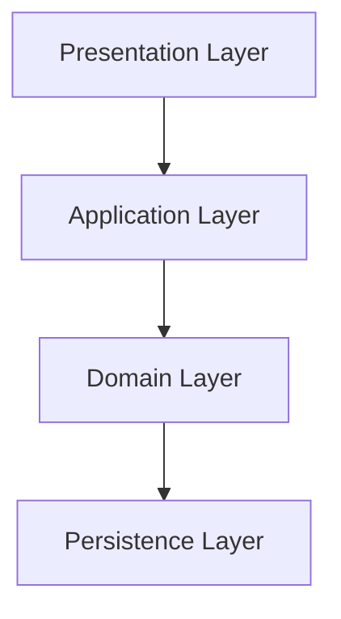

## Layered Architecture

- **layered architecture**는 application을 **역할별 계층으로 분리**하여 관심사를 나누는 architecture pattern입니다.
    - 각 계층은 특정 역할을 담당하며, 하위 계층에만 의존합니다.
    - 상위 계층의 변경이 하위 계층에 영향을 주지 않습니다.

- 가장 일반적으로 사용되는 software architecture pattern으로, Spring MVC가 대표적인 예입니다.

- layered architecture는 일반적으로 **presentation, application, domain, persistence**의 4개 계층으로 구성됩니다.
    - 3-tier architecture(presentation, business, data)를 더 세분화한 구조입니다.

### Presentation Layer

- **사용자 interface와 HTTP 요청/응답을 처리**하는 계층입니다.
    - API endpoint를 정의하고 HTTP 요청을 읽어들이는 logic을 구현합니다.
    - controller, view, DTO 변환 logic이 위치합니다.

- business logic을 포함하지 않으며, 요청을 application layer로 위임합니다.

### Application Layer

- **여러 domain을 조합하여 usecase를 구현**하는 계층입니다.
    - domain model의 business logic을 호출하고 조합하여 요청을 처리합니다.
    - transaction 관리와 domain 간 협력을 조정합니다.

- 핵심 business logic을 직접 구현하지 않고 얇게 유지합니다.
    - business logic은 domain layer에 위치해야 합니다.
    - application layer는 domain logic의 실행 순서만 관리합니다.

- domain model을 캡슐화하여 presentation layer에 직접 노출되지 않도록 보호합니다.
    - DTO를 반환하여 domain model과 presentation layer의 결합을 끊습니다.

### Domain Layer

- **핵심 business logic과 business 규칙**을 담당하는 계층입니다.
    - entity, value object, domain service가 위치합니다.
    - data와 그에 관련된 행위를 함께 가집니다.

- database와 관계가 있는 entity뿐만 아니라 값 객체(value object)도 포함합니다.

### Persistence Layer

- **database와의 상호작용**을 담당하는 계층입니다.
    - data의 저장, 수정, 조회, 삭제 logic을 구현합니다.
    - repository, DAO가 위치합니다.

- ORM(Object Relational Mapping)을 통해 domain 객체와 database 간의 mapping을 처리합니다.

---

## 핵심 원칙 (Deep Dive)

- layered architecture는 **단방향 의존성**과 **관심사 분리**를 핵심 원칙으로 합니다.
    - 단순히 "층을 쌓는 것" 이상의 가치를 가지려면 세부 원칙들이 엄격하게 지켜져야 합니다.

### 단방향 의존성 규칙 (Unidirectional Dependency)

- **하향식 의존성** : 의존성의 화살표는 반드시 위에서 아래로(presentation → persistence)만 향해야 합니다.
    - 하위 계층이 상위 계층을 참조하는 '순환 의존성'은 결합도를 높여 계층 분리 자체를 무의미하게 만듭니다.
    - 의존성 방향이 명확해야 특정 기능을 수정할 때 영향 범위를 예측할 수 있습니다.

- **제어의 흐름 vs 의존성** : 호출은 위에서 아래로 흐르지만(제어의 흐름), 하위 계층은 상위 계층의 존재를 전혀 몰라야 합니다.
    - 하위 계층의 변경이 상위 계층에 영향을 미치지만, 그 반대는 성립하지 않도록 격리합니다.

### 계층의 폐쇄성 (Closed vs Open)

- **Closed Layer (기본 원칙)** : 특정 계층은 **바로 아래의 인접 계층에만 접근**할 수 있습니다.
    - 예를 들어, presentation이 persistence에 직접 접근하는 것을 금지합니다.
    - 이는 변경의 파생 효과를 막는 '방화벽' 역할을 하며 계층 간 결합도를 낮춥니다.

- **Open Layer (예외 상황)** : 특정 계층이 하위의 모든 계층에 접근할 수 있도록 허용하는 구조입니다.
    - 공유 서비스(logging, security 등) 계층을 둘 때 주로 사용됩니다.
    - **Architecture Sinkhole Anti-pattern** : logic 없이 단순히 하위 계층으로 요청을 전달만 하는 계층이 많아지는 현상을 경계해야 합니다.

### 관심사 분리 (Separation of Concerns)

- 각 계층은 **고유한 역할만 수행**하며 기술적 침투를 허용하지 않습니다.
    - **Presentation** : HTTP status code 처리, JSON parsing 등의 **UI 관련 logic을 담당**하며, business logic 등의 침투는 금지됩니다.
    - **Domain** : **순수한 business 규칙과 정책을 구현**하며, DB query, 외부 API 호출 등의 기술적 세부 사항은 포함하지 않습니다.
    - **Persistence** : **data 저장 및 조회 logic을 담당**하며, business 정책 구현은 포함하지 않습니다.

- 역할이 명확하게 분리되어 code의 가독성이 높아지고, 특정 기술(DB framework 등) 변경 시에도 수정 범위가 제한됩니다.

### Interface를 통한 격리

- 계층 간 통신은 구체 class(concrete class)가 아닌 **interface**를 통해 이루어져야 합니다.
    - 상위 계층이 하위 계층의 interface에 의존하면, 하위 계층의 내부 구현이 바뀌어도 상위 계층의 code는 수정할 필요가 없습니다.
    - 이는 test 시에 하위 계층을 가짜 객체(mock)로 대체하기 쉽게 만들어 **test 용이성**을 높여줍니다.

- interface는 각 계층의 경계 역할을 하여 **결합도를 낮추고 유연성을 높입니다**.
    - 예를 들어, persistence layer의 repository interface를 정의하고, 구체 구현체는 하위 계층에서 제공하도록 합니다.

---

## Layered Architecture의 장단점

- layered architecture는 **단순함과 명확한 구조**가 가장 큰 특징입니다.
    - 이 단순함은 빠른 개발과 쉬운 이해라는 장점을 제공합니다.
    - 동시에 복잡한 business logic을 다루기 어렵다는 한계로 이어집니다.

- project의 복잡도와 요구 사항에 따라 layered architecture의 적합성이 달라집니다.
    - 단순한 CRUD application에는 적합합니다.
    - 복잡한 domain logic이 필요한 경우 hexagonal architecture 등의 대안을 고려해야 합니다.

### 장점 : 단순함과 명확한 구조

- layered architecture는 **구조가 단순하고 직관적**이어서 가장 널리 사용되는 architecture pattern입니다.
    - 대부분의 개발자가 익숙하여 팀 내 의사소통이 쉽습니다.
    - framework와 library의 기본 구조로 채택되어 있어 생태계 지원이 풍부합니다.

- **유지 보수 용이** : 특정 계층만 수정하여 기능을 변경할 수 있습니다.
    - database를 변경해도 persistence layer만 수정하면 됩니다.
    - UI를 변경해도 presentation layer만 수정하면 됩니다.

- **재사용성** : 계층이 독립적이어서 다른 context에서 재사용할 수 있습니다.
    - 하나의 application layer를 여러 presentation layer(web, mobile, API)에서 재사용할 수 있습니다.

- **Test 용이** : 계층별로 독립적인 test가 가능합니다.
    - 하위 계층을 mocking하여 상위 계층을 test할 수 있습니다.

- **낮은 학습 곡선** : 구조가 직관적이어서 새로운 개발자도 쉽게 이해할 수 있습니다.

### 단점과 한계 : 유연성 부족

- layered architecture는 **단순함의 대가로 유연성이 부족**합니다.
    - 계층 간 의존성이 고정되어 있어 변경에 취약합니다.
    - project가 복잡해질수록 architecture의 한계가 드러납니다.

- **Database 중심 설계** : persistence layer가 가장 하위에 위치하여 **database 중심으로 설계**되기 쉽습니다.
    - domain layer가 persistence layer에 의존하여 database 변경이 domain에 영향을 미칩니다.
    - 영속성 model을 domain model처럼 사용하게 되어 transaction, lazy loading 등을 고려해야 합니다.

- **계층 건너뛰기** : 단순한 CRUD의 경우 **계층을 건너뛰고 직접 호출**하는 유혹이 생깁니다.
    - controller에서 repository를 직접 호출하면 architecture 경계가 무너집니다.
    - 시간이 지나면 계층 간 의존성이 복잡해집니다.

- **Usecase 파악 어려움** : service class가 비대해지면 **어떤 usecase가 있는지 파악하기 어렵습니다.**
    - 하나의 service에 수십 개의 method가 존재할 수 있습니다.
    - 동일한 logic이 여러 곳에 중복 구현될 수 있습니다.

- **의존성 역전 부재** : 의존성이 항상 아래로만 향하여 **외부 system 변경에 취약**합니다.
    - database 변경 시 domain layer까지 영향을 받을 수 있습니다.
    - hexagonal architecture는 port와 adapter를 통해 이 문제를 해결합니다.

---

## Hexagonal Architecture와의 비교 (Architecture Evolution)

- 두 architecture는 "관심사를 분리한다"는 목적은 같으나, **"무엇을 중심으로 보호할 것인가"**에 대한 관점이 완전히 다릅니다.

| 비교 항목 | Layered Architecture | Hexagonal (Ports & Adapters) |
| --- | --- | --- |
| **핵심 철학** | 기능적 역할에 따른 수직적 분리 | 내부(business)와 외부(기술)의 대칭적 분리 |
| **Database 위치** | 가장 하위 계층 | 외부 adapter |
| **Domain 보호** | database에 의존 | 외부 의존성으로부터 격리 |
| **의존성 방향** | 상위 → 하위 (단방향) | 외부 → 내부 (의존성 역전) |
| **의존성 기준** | 하위 계층(보통 DB)이 기준이 됨 | 중앙의 domain model이 기준이 됨 |
| **의존성 역전 (DIP)** | 선택적 (주로 사용하지 않음) | **필수** (인터페이스/포트를 통한 역전) |
| **Test 용이성** | DB 등 하위 module mocking이 필요함 | 외부 환경 없이 domain 단독 test 가능 |
| **교체 가능성** | DB나 framework 변경 시 전파 범위가 넓음 | adapter만 교체하면 되므로 매우 유연함 |
| **복잡도** | 낮음 | 높음 |
| **적합한 경우** | 단순한 CRUD application | 복잡한 business logic |

### 의존성의 방향과 'Domain'의 위치

- **Layered (DB 중심 설계)** : domain이 persistence(DB) 위에 위치합니다.
    - 따라서 DB 기술이 바뀌면 domain code도 영향을 받을 가능성이 큽니다.

- **Hexagonal (domain 중심 설계)** : domain이 최첨단 '핵(Core)'에 위치합니다.
    - DB, UI, 외부 API 등은 모두 외부 adapter일 뿐이며, 모든 의존성은 domain 내부를 향합니다. 

### Hexagonal로 넘어가는 이유

- Layered Architecture의 가장 큰 약점은 **business logic이 특정 기술(JPA, AWS SDK 등)에 오염**되기 쉽다는 점입니다.
- Hexagonal은 'Port(interface)'라는 개념을 도입해 business logic을 순수하게 유지하므로, cloud native 환경이나 복잡한 MicroService(MSA)에서 훨씬 강력한 유지 보수성을 제공합니다.

---

## Reference

- <https://www.oreilly.com/library/view/software-architecture-patterns/9781491971437/ch01.html>

