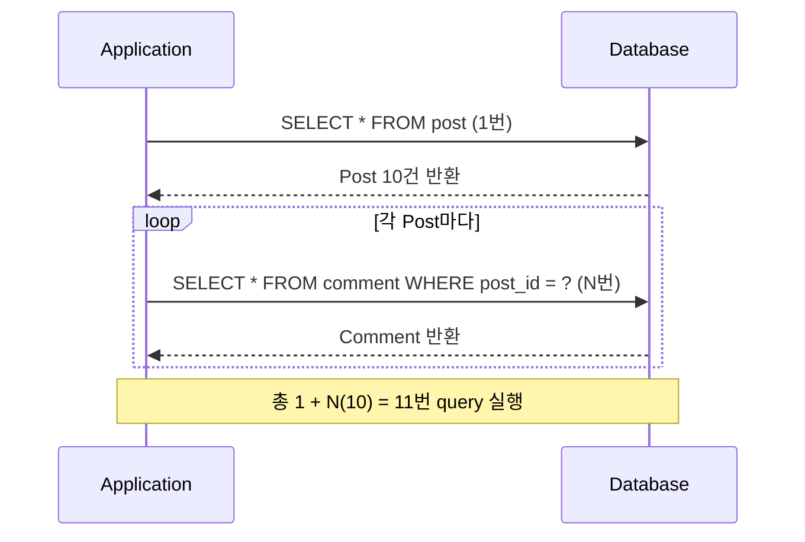

## N+1 문제란

- N개의 부모 객체를 조회한 후, 각 부모의 연관 객체에 접근할 때마다 개별 `SELECT`가 N번 실행되어 총 1+N번의 query가 발생하는 현상입니다.
    - SQLAlchemy 공식 문서에서 직접 "N plus one problem"으로 명명한 대표적인 ORM 성능 문제입니다.
- lazy loading의 편의성이 반대로 query 폭발로 이어지는 대표적인 ORM trade-off입니다.

- `Post` 10건을 조회하면 1번의 query가 실행되고, 각 `Post`의 `Comment`에 접근할 때마다 추가 query가 실행되어 총 11번의 query가 발생합니다.




---


## 발생 원인

- 객체 model과 관계형 model의 근본적인 간극이 N+1 문제의 원인입니다.
    - **객체 model** : `post.comments`처럼 참조를 따라가며 탐색합니다.
    - **관계형 model** : `JOIN` 또는 별도 `SELECT`를 명시해야 연관 data를 취득합니다.
- ORM은 이 간극을 **lazy loading**으로 메웁니다.
    - 연관 객체 자리에 placeholder를 두고, 실제 접근 시점에 `SELECT`를 실행합니다.
    - 단일 객체 접근 시에는 문제가 없지만, loop로 N개를 순회하면 N번의 `SELECT`가 연쇄 발생합니다.


### ORM별 Lazy Loading 구현 방식

- 각 ORM은 lazy loading을 서로 다른 방식으로 구현하지만, 연관 객체 접근 시점에 query를 실행한다는 원리는 동일합니다.

| ORM | lazy loading 구현 |
| --- | --- |
| Hibernate | runtime proxy 또는 bytecode enhancement |
| SQLAlchemy | attribute 첫 접근 시 발동하는 trigger |
| TypeORM | relation을 `Promise`로 선언, `await` 시 SQL 발행 |
| ActiveRecord | association method 호출 시 `SELECT` 실행 |


---


## ORM별 발생 예시

- 언어와 ORM이 달라도 N+1 문제가 발생하는 구조는 동일합니다.
    - 부모 객체를 조회하는 1번의 query 이후, loop 안에서 연관 객체에 접근할 때마다 추가 query가 실행됩니다.


### Hibernate (Java)

- `findAll()`로 `Author` 목록을 조회한 뒤, 각 `Author`의 `getPosts()`를 호출하면 N번의 추가 query가 발생합니다.

```java
List<Author> authors = authorRepository.findAll(); // SELECT * FROM author (1번)
for (Author author : authors) {
    author.getPosts(); // SELECT * FROM post WHERE author_id = ? (N번)
}
```


### ActiveRecord (Ruby)

- `User.all`로 전체 사용자를 조회한 뒤, 각 사용자의 `posts`에 접근하면 N번의 추가 query가 발생합니다.

```ruby
users = User.all           # SELECT * FROM users (1번)
users.each do |user|
  user.posts.each { }      # SELECT * FROM posts WHERE user_id = ? (N번)
end
```


### Sequelize (Node.js)

- `findAll()`로 사용자 목록을 조회한 뒤, loop 안에서 각 사용자의 `Post`를 별도로 조회하면 N번의 추가 query가 발생합니다.

```js
const users = await User.findAll(); // SELECT * FROM users (1번)
for (const user of users) {
  const posts = await Post.findAll({ // SELECT * FROM posts WHERE user_id = ? (N번)
    where: { userId: user.id }
  });
}
```


### SQLAlchemy (Python)

- `session.query(Book).all()`로 `Book` 목록을 조회한 뒤, 각 `Book`의 `author` attribute에 접근하면 N번의 추가 query가 발생합니다.

```python
books = session.query(Book).all()  # SELECT * FROM book (1번)
for book in books:
    print(book.author.name)        # SELECT * FROM author WHERE id = ? (N번)
```


---


## 일반적인 해결 전략

- 공통 원리는 연관 객체를 개별 `SELECT` 대신 **한 번에 함께 가져오는 것**입니다.
    - 전략에 따라 `JOIN`으로 단일 query를 만들거나, `IN` 절로 query 수를 2번으로 줄입니다.


### Eager Loading (JOIN)

- 부모 query에 `JOIN`을 추가하여 연관 객체를 단일 query로 함께 조회합니다.
    - query 수는 1번으로 줄어듭니다.
    - 연관 객체가 많으면 결과 row가 중복될 수 있어 중복 제거가 필요합니다.

```java
// JPA JPQL
"SELECT DISTINCT a FROM Author a LEFT JOIN FETCH a.posts"
```

```ruby
# ActiveRecord
User.eager_load(:posts).all   # LEFT OUTER JOIN
```

```python
# SQLAlchemy
stmt = select(Book).options(joinedload(Book.author))
```


### Batch Loading (IN 절)

- 부모 ID들을 모아 `IN` 절로 한 번에 연관 객체를 조회합니다.
    - query 수는 2번입니다 (부모 1번 + 연관 객체 1번).
    - `JOIN` 방식과 달리 결과 row 중복이 없어 collection 관계에 적합합니다.

```java
// Hibernate @BatchSize
// SELECT * FROM post WHERE author_id IN (1, 2, 3, ...)
```

```python
# SQLAlchemy selectinload
stmt = select(Book).options(selectinload(Book.chapters))
```


### 명시적 Preloading

- query 실행 전에 함께 loading할 연관 객체를 명시적으로 선언합니다.
    - ORM에 따라 `JOIN` 방식과 `IN` 절 방식 중 적절한 전략을 자동 선택하거나, 직접 지정할 수 있습니다.

```ruby
# ActiveRecord
User.includes(:posts).all     # 전략 자동 선택
User.preload(:posts).all      # 항상 별도 query (IN 절)
User.eager_load(:posts).all   # 항상 LEFT OUTER JOIN
```

```js
// Sequelize
const users = await User.findAll({ include: [{ model: Post }] });
```


---


## 해결 전략 비교

- 상황에 따라 적합한 전략이 다르며, 연관 관계의 종류와 data 양을 기준으로 선택합니다.

| 전략 | query 수 | 방식 | 적합한 상황 |
| --- | --- | --- | --- |
| **Eager loading (JOIN)** | 1 | `JOIN` | 단일 연관 관계, 소량 data |
| **Batch loading (IN 절)** | 2 | `IN` 절 | collection 관계, 중복 없이 |
| **명시적 preloading** | 1~2 | ORM 선택 | 다중 연관 관계 |


---


## Reference

- <https://docs.sqlalchemy.org/en/20/orm/queryguide/relationships.html>
- <https://docs.hibernate.org/orm/current/userguide/html_single/>
- <https://sequelize.org/docs/v6/advanced-association-concepts/eager-loading/>
- <https://jakarta.ee/specifications/persistence/3.2/jakarta-persistence-spec-3.2>

