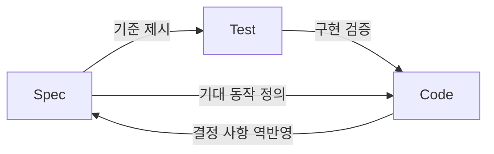
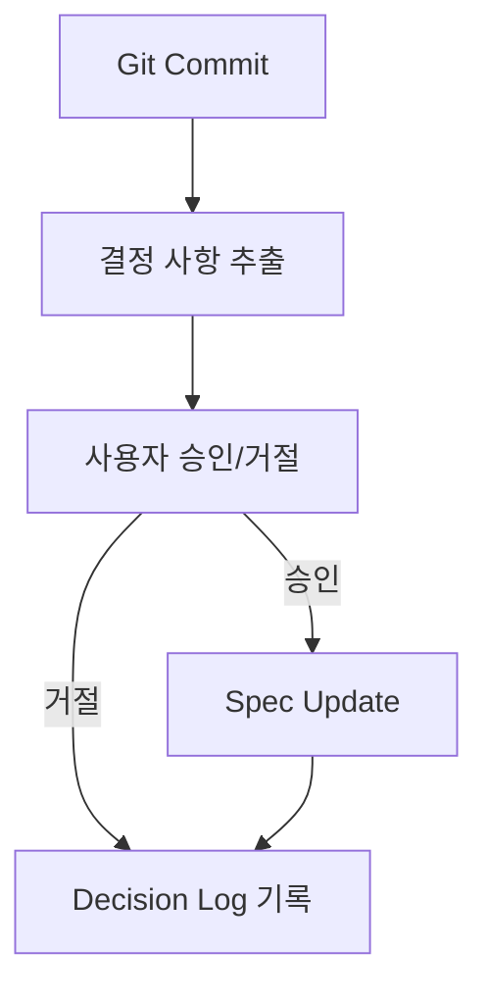

## Spec-Driven Development Triangle



- **Spec-Driven Development Triangle**은 spec·test·code(명세·검증·구현)의 관계를 **삼각형 feedback loop**로 보는 개발 model입니다.
    - 전통적인 spec-driven 방식은 "spec → test → code"의 단방향 흐름을 전제합니다.
    - 삼각형 model은 code가 spec의 불완전함을 드러내고, spec을 역으로 개선한다는 통찰에서 출발합니다.

- 삼각형의 각 꼭짓점은 **서로를 동기화하는 책임**을 가집니다.
    - spec은 test와 code가 달성해야 할 기준을 정의합니다.
    - test는 code가 spec을 충족하는지 검증합니다.
    - code는 구현 과정에서 발견된 결정 사항을 spec으로 역반영합니다.


---


## 핵심 통찰 : Code가 Spec을 개선한다

- 전통적인 spec-driven 방식은 spec을 **고정된 source of truth**로 취급합니다.
    - spec이 완성되면 code는 spec을 따르기만 하면 된다고 가정합니다.
    - 그러나 spec은 구현 전까지 완성될 수 없습니다.

- 실제 구현 과정에서는 spec이 예측하지 못한 **결정 사항(decision)**이 발생합니다.
    - edge case 처리 방식, 성능 trade-off, library 선택 등이 해당됩니다.
    - 결정들이 spec으로 역반영되지 않으면, spec과 code 사이에 괴리가 생깁니다.

- Drew Breunig의 실험 project **whenwords**는 이 통찰을 실제로 보여줍니다.
    - whenwords는 Unix timestamp를 사람이 읽기 쉬운 format으로 변환하는 library입니다.
    - repository에는 구현 code 대신 markdown spec과 약 750개의 YAML conformance test만 포함합니다.
    - contributor들이 spec과 test 사이의 불일치(rounding 규칙 위반 등)를 발견하고 PR을 제출했습니다.
    - 구현이 spec의 불완전함을 드러낸다는 사실이 확인되었습니다.


---


## 동기화 문제

- 삼각형의 세 꼭짓점이 서로 동기화되지 않으면, **각각 다른 진실을 가리키는 상태**가 됩니다.
    - spec은 이상적인 동작을, test는 초기 합의를, code는 현재 구현을 반영합니다.

- 동기화가 무너지는 원인은 구조적입니다.
    - spec은 모든 실제 scenario를 사전에 예측할 수 없습니다.
    - test coverage 도구는 code coverage를 측정하지, spec coverage를 측정하지 않습니다.
    - hotfix나 구현 shortcut은 spec update를 건너뜁니다.
    - 개발자는 속도(velocity)를 문서화보다 우선시합니다.

- Drew Breunig은 이 문제를 software 위기(Software Crisis)의 반복으로 해석합니다.
    - 1968년 NATO Software Crisis는 복잡도가 인간의 인지 한계를 초과하면서 발생했습니다.
    - AI agent 시대에는 "waterfall의 volume을 agile의 속도로" code가 생성됩니다.
    - code가 인간이 검토 가능한 속도보다 빠르게 생성되면, spec과의 동기화는 더욱 어려워집니다.


---


## Plumb : 동기화 자동화 도구

- **Plumb**은 spec·test·code의 동기화 문제를 해결하기 위한 proof-of-concept 도구입니다.
    - Git commit hook에 통합되어 code 변경 시마다 동작합니다.
    - 목수 도구 plumb(다림추)에서 이름을 따왔습니다.

```bash
pip install plumb-dev
# 또는
uv add plumb
```


### 동작 방식



- Plumb은 code diff와 AI agent 대화 기록에서 **구현 결정 사항을 추출**합니다.
    - 사용자가 각 결정을 승인·거절·수정합니다.
    - 승인된 결정은 spec에 자동으로 반영됩니다.
    - spec과 test 사이의 coverage report를 생성합니다.
    - 결정 이력을 JSONL 형식의 decision log로 기록합니다.


### 설계 원칙

- Plumb은 **agent 외부에서 결정론적 checkpoint**로 동작합니다.
    - agent의 선택적 제안이 아닌, 필수 관문으로 설계되어 있습니다.
    - LLM 호출에만 의존하지 않고, DSPy를 사용하여 구조화된 prompt를 최적화합니다.

- Plumb은 **spec 참조, 의도 추적, 결정 이력 관리**에서 실용적 이점을 가집니다.
    - agent가 codebase 전체를 탐색하지 않고 spec을 참조합니다.
    - decision log가 "이 code는 왜 존재하는가?"라는 질문에 답합니다.
    - shortcut과 hack이 결정 이력을 통해 추적 가능해집니다.


---


## AI Agent 시대의 시사점

- AI agent가 code를 생성하는 속도가 빨라질수록, **spec·test·code의 동기화 문제는 심화**됩니다.
    - agent는 spec에 없는 결정을 내리면서 code를 생성합니다.
    - 결정들이 spec으로 역반영되지 않으면, spec은 점점 현실과 멀어집니다.

- Drew Breunig은 GitHub가 agentic workflow를 지원하도록 진화해야 한다고 제안합니다.
    - markdown spec을 code·test와 동등한 first-class citizen으로 취급합니다.
    - 결정·요구 사항·code·test 사이의 연결 관계를 시각화합니다.
    - system의 의도와 architecture에 대한 자연어 질의를 지원합니다.

- 핵심 결론은 **spec은 구현을 통해서만 완성된다**는 것입니다.
    - no-code library는 구현 경험 없이 검증되지 않은 개념에 머뭅니다.
    - 구현은 결정 사항을 생성하고, 그 결정을 구조화하여 spec으로 되돌리는 과정이 필요합니다.


---


## Reference

- <https://www.dbreunig.com/2026/03/04/the-spec-driven-development-triangle.html>

