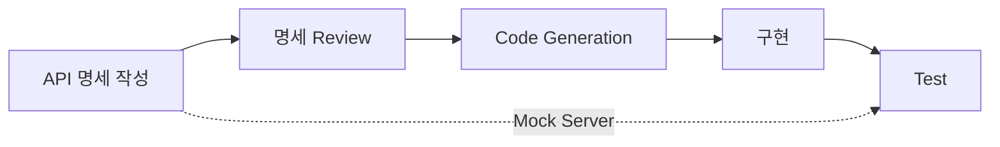
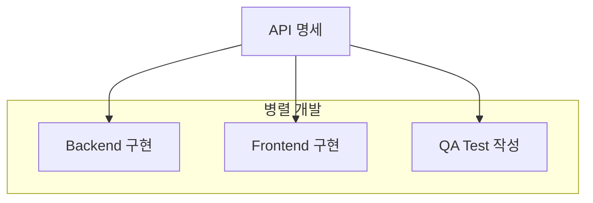
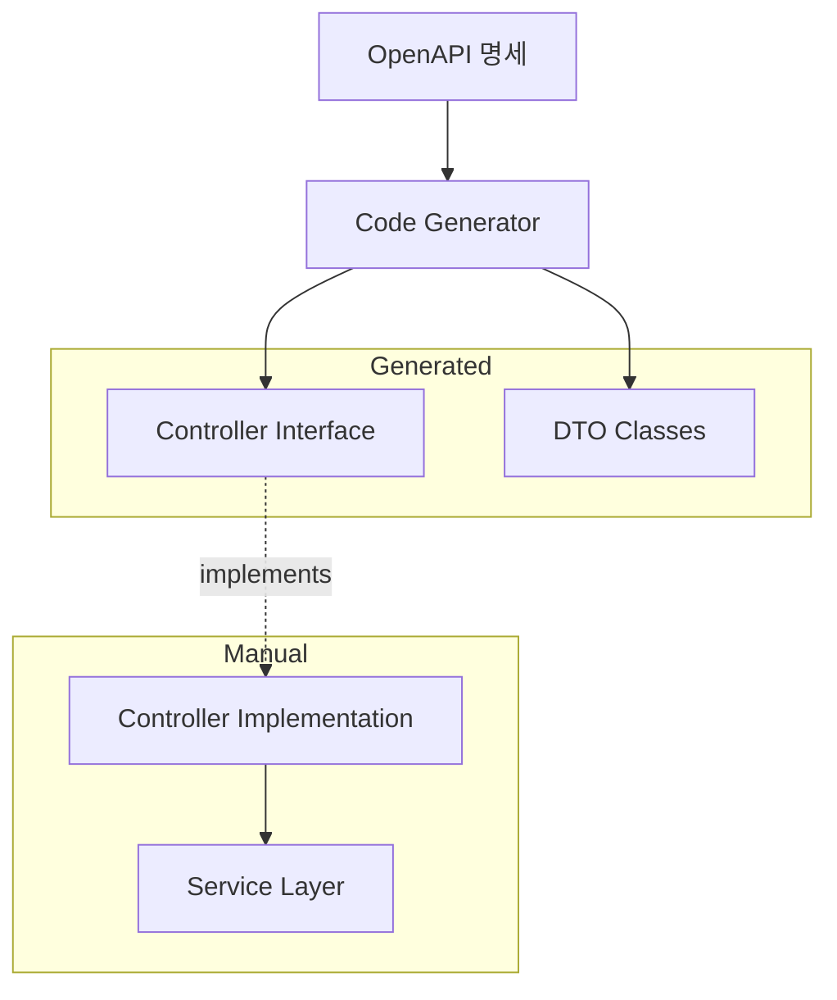
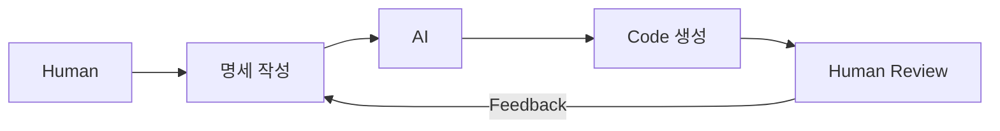

## Spec-Driven Programming



- **Spec-Driven Programming**은 **code 구현 전에 API 명세를 먼저 정의**하고, 명세를 기반으로 개발하는 방식입니다.
    - API-First, Contract-First, Design-First 등의 용어로도 불립니다.
    - 명세가 code보다 먼저 존재하며, 명세가 구현의 기준이 됩니다.

- 전통적인 Code-First 방식과 대비됩니다.
    - **Code-First** : code를 먼저 작성하고, 문서를 나중에 생성합니다.
    - **Spec-First** : 명세를 먼저 작성하고, code를 명세에 맞춰 구현합니다.


### Code-First vs Spec-First 비교

| 비교 항목 | Code-First | Spec-First |
| --- | --- | --- |
| **개발 순서** | code → 명세 | 명세 → code |
| **명세 생성** | annotation 기반 자동 생성 | 직접 작성 |
| **명세 정확성** | code와 불일치 가능 | 명세가 정확한 기준 |
| **협업 시점** | 구현 후 | 구현 전 |
| **변경 비용** | 구현 후 변경 비용 높음 | 설계 단계에서 변경 용이 |


---


## Spec-Driven Programming의 장점

- Spec-Driven Programming은 **team 간 협업, 병렬 개발, 일관성 유지**에서 이점을 제공합니다.


### Team 간 협업 향상

- 명세가 **계약(contract) 역할**을 하여 team 간 의사소통이 명확해집니다.
    - frontend와 backend team이 명세를 기준으로 독립적으로 개발합니다.
    - API 변경 시 명세 변경이 선행되어 영향 범위를 사전에 파악합니다.

- 비개발자(기획자, QA)도 명세를 통해 API를 이해할 수 있습니다.
    - OpenAPI의 경우 Swagger UI로 시각적으로 확인 가능합니다.


### 병렬 개발 가능



- 명세가 확정되면 **frontend, backend, QA가 동시에 작업**을 시작할 수 있습니다.
    - frontend는 mock server를 사용하여 backend 구현 전에 개발합니다.
    - QA는 명세 기반으로 test case를 작성합니다.


### Code Generation

- 명세에서 **boilerplate code를 자동 생성**하여 생산성을 높입니다.
    - server stub : controller interface, request/response DTO.
    - client SDK : API client code.
    - validation : request parameter 검증 code.

- 명세와 code의 일관성이 자동으로 유지됩니다.
    - 명세 변경 시 code를 재생성하여 동기화합니다.


---


## API 명세 도구

- API 유형에 따라 **다양한 명세 도구**가 사용됩니다.
    - REST API는 OpenAPI, event-driven은 AsyncAPI, GraphQL은 SDL, gRPC는 Protocol Buffers를 사용합니다.


### OpenAPI (REST API)

- **OpenAPI**는 RESTful API를 기술하는 표준 명세 format입니다.
    - 구 Swagger Specification에서 발전하여 OpenAPI Initiative에서 관리합니다.
    - YAML 또는 JSON 형식으로 작성합니다.

```yaml
openapi: 3.0.3
info:
  title: User API
  version: 1.0.0
paths:
  /users/{userId}:
    get:
      summary: 사용자 조회
      parameters:
        - name: userId
          in: path
          required: true
          schema:
            type: integer
      responses:
        '200':
          description: 성공
          content:
            application/json:
              schema:
                $ref: '#/components/schemas/User'
components:
  schemas:
    User:
      type: object
      properties:
        id:
          type: integer
        name:
          type: string
        email:
          type: string
          format: email
```

- OpenAPI 생태계의 주요 도구는 다음과 같습니다.
    - **Swagger UI** : 명세를 시각화하고 API를 테스트합니다.
    - **OpenAPI Generator** : 다양한 언어의 server/client code를 생성합니다.
    - **Redoc** : API 문서를 정적 HTML로 생성합니다.


### AsyncAPI (Event-Driven API)

- **AsyncAPI**는 event-driven, message-driven API를 기술하는 명세 format입니다.
    - Kafka, RabbitMQ, WebSocket 등의 비동기 통신을 정의합니다.
    - OpenAPI와 유사한 구조로 작성합니다.

```yaml
asyncapi: 2.6.0
info:
  title: Order Events
  version: 1.0.0
channels:
  order/created:
    subscribe:
      summary: 주문 생성 event 수신
      message:
        payload:
          type: object
          properties:
            orderId:
              type: string
            userId:
              type: string
            totalAmount:
              type: number
```


### GraphQL SDL

- **GraphQL SDL(Schema Definition Language)**은 GraphQL API의 명세입니다.
    - type system을 기반으로 query, mutation, subscription을 정의합니다.
    - schema가 곧 명세이자 runtime validation의 기준입니다.

```graphql
type User {
  id: ID!
  name: String!
  email: String!
  orders: [Order!]!
}

type Order {
  id: ID!
  totalAmount: Float!
  createdAt: DateTime!
}

type Query {
  user(id: ID!): User
  users(limit: Int): [User!]!
}

type Mutation {
  createUser(name: String!, email: String!): User!
}
```


### Protocol Buffers (gRPC)

- **Protocol Buffers(protobuf)**는 gRPC API의 명세 format입니다.
    - binary serialization으로 높은 성능을 제공합니다.
    - `.proto` file에서 service와 message를 정의합니다.

```protobuf
syntax = "proto3";

service UserService {
  rpc GetUser(GetUserRequest) returns (User);
  rpc CreateUser(CreateUserRequest) returns (User);
}

message User {
  int64 id = 1;
  string name = 2;
  string email = 3;
}

message GetUserRequest {
  int64 user_id = 1;
}

message CreateUserRequest {
  string name = 1;
  string email = 2;
}
```


---


## Spec-Driven 개발 Workflow

- Spec-Driven 개발은 **명세 작성 → review → code generation → 구현 → validation**의 단계로 진행됩니다.
    - 각 단계에서 명세가 중심 역할을 합니다.


### 1단계 : 명세 작성

- API의 **endpoint, request/response schema, error 정의**를 명세로 작성합니다.
    - 기획서나 요구 사항을 기반으로 API 설계를 진행합니다.
    - 명세 작성 도구(Stoplight Studio, Swagger Editor 등)를 활용합니다.

- 명세 작성 시 고려 사항은 resource 명명, HTTP method, error format, versioning입니다.
    - resource 이름과 URL 구조의 일관성을 유지합니다.
    - GET, POST, PUT, DELETE 등 HTTP method를 적절하게 사용합니다.
    - error response format을 표준화합니다.
    - URL path 또는 header를 사용한 versioning 전략을 결정합니다.


### 2단계 : 명세 Review

- 작성된 명세를 **stakeholder와 함께 검토**합니다.
    - frontend, backend, QA, 기획자가 참여하여 API 설계를 확정합니다.
    - breaking change 여부, backward compatibility를 확인합니다.

- 명세를 version control(Git)에서 관리합니다.
    - 명세 변경 이력을 추적합니다.
    - PR review를 통해 변경 사항을 검토합니다.


### 3단계 : Code Generation 및 Mock Server

- 확정된 명세에서 **code와 mock server를 생성**합니다.
    - server stub을 생성하여 구현의 skeleton으로 사용합니다.
    - mock server를 실행하여 frontend 개발을 지원합니다.

```bash
# OpenAPI Generator로 Spring server stub 생성
openapi-generator generate \
  -i api-spec.yaml \
  -g spring \
  -o ./generated

# Prism으로 mock server 실행
prism mock api-spec.yaml
```


### 4단계 : 구현 및 Validation

- 생성된 code를 기반으로 **business logic을 구현**합니다.
    - DTO, controller interface는 재생성하지 않도록 분리합니다.
    - 명세와 구현의 일치를 CI에서 자동 검증합니다.

- **contract test**로 명세 준수 여부를 검증합니다.
    - server가 명세대로 응답하는지 test합니다.
    - client가 명세대로 요청하는지 test합니다.


---


## 명세와 Code 동기화 전략

- Spec-First의 가장 큰 도전 과제는 **명세와 code의 동기화 유지**입니다.
    - 시간이 지나면 명세와 실제 구현이 달라질 위험이 있습니다.


### Generate-Once vs Regenerate

| 전략 | 설명 | 장점 | 단점 |
| --- | --- | --- | --- |
| **Generate-Once** | 최초 1회만 생성 | 자유로운 customization | 명세 변경 시 수동 반영 |
| **Regenerate** | 명세 변경마다 재생성 | 항상 동기화 | customization 유지 어려움 |
| **Partial Regenerate** | interface만 재생성 | 균형 잡힌 접근 | 구조 설계 필요 |


### Partial Regenerate Pattern



- **interface와 DTO만 재생성**하고, 구현체는 수동으로 관리하는 pattern입니다.
    - 생성된 interface를 구현하여 business logic을 작성합니다.
    - 명세 변경 시 interface가 변경되면 compile error로 감지됩니다.


### CI에서 명세 Validation

- CI pipeline에서 **명세와 구현의 일치를 자동 검증**합니다.
    - 실제 API response가 명세와 일치하는지 test합니다.
    - 명세에 정의되지 않은 endpoint가 있는지 검사합니다.

```yaml
# GitHub Actions 예시
- name: Validate API against spec
  run: |
    # server 실행 후 명세 기반 test
    npm run start:test &
    sleep 5
    npx dredd api-spec.yaml http://localhost:3000
```


---


## Spec-Driven Programming의 한계

- Spec-Driven Programming은 **명세 작성 비용과 관리 overhead**가 발생합니다.
    - 빠른 iteration이 필요한 초기 단계에서는 오히려 병목이 됩니다.


### 초기 개발 속도 저하

- 명세 작성과 review에 시간이 소요됩니다.
    - 빠른 prototyping이 필요한 경우 병목이 될 수 있습니다.
    - 요구 사항이 불명확한 초기 단계에서는 명세 변경이 빈번합니다.


### 명세 관리 overhead

- 명세를 별도로 관리해야 하는 부담이 있습니다.
    - code와 명세의 이중 관리가 필요합니다.
    - 명세 작성 도구와 workflow를 team 내에 도입해야 합니다.


### Code-First가 적합한 경우

- **소규모 team의 빠른 개발, 내부 API, 실험적 project**에서는 Code-First가 효율적입니다.
    - 소규모 team에서는 명세 없이도 직접 소통으로 API를 조율합니다.
    - 내부 API는 consumer가 한정되어 명세의 계약 역할이 덜 중요합니다.
    - 실험적 project는 API 변경이 빈번하여 명세 유지 비용이 높습니다.


---


## 도입 시 고려 사항

- Spec-Driven Programming 도입 시 **team 문화, 도구 선정, 점진적 적용**이 핵심입니다.
    - 명세 중심 개발은 기술보다 process 변화가 더 중요합니다.


### Team 문화와 Process

- 명세 review를 개발 process에 포함시킵니다.
    - API 설계 단계에서 stakeholder의 참여를 보장합니다.
    - 명세 변경에 대한 승인 process를 정의합니다.


### 도구 선정

- team의 기술 stack과 workflow에 맞는 도구를 선정합니다.
    - 명세 작성 도구 : Stoplight Studio, Swagger Editor, VS Code extension.
    - code generation : OpenAPI Generator, gRPC tools, GraphQL Code Generator.
    - mock server : Prism, WireMock, Mock Service Worker.
    - validation : Dredd, Schemathesis, spectral.


### 점진적 도입

- 전체 system에 한 번에 적용하기보다 **점진적으로 도입**합니다.
    - 새로운 API부터 Spec-First로 개발합니다.
    - 기존 API는 명세를 생성하여 문서화 수준에서 시작합니다.


---


## AI 시대의 Spec-Driven Programming

- AI coding tool의 등장으로 **Spec-Driven Programming이 재조명**받고 있습니다.
    - Cursor, Claude Code, GitHub Copilot 등 AI가 code를 생성하는 시대가 되었습니다.
    - AI에게 무엇을 만들지 명확히 전달하는 것이 결과물 품질을 결정합니다.


### 명세가 AI의 Prompt가 된다

- AI coding tool에서 **명세는 곧 prompt**입니다.
    - OpenAPI 명세를 AI에게 제공하면 명세대로 구현체를 생성합니다.
    - 명세가 정확할수록 AI가 생성하는 code의 품질이 높아집니다.
    - 모호한 자연어 지시보다 구조화된 명세가 더 정확한 결과를 만듭니다.

- AI는 **명세와 구현의 일관성 검증**에도 활용됩니다.
    - 기존 code가 명세를 준수하는지 AI가 검토합니다.
    - 명세 변경 시 영향받는 code를 AI가 자동으로 찾아 수정합니다.


### Human-AI 협업 Workflow



- Human-AI 협업에서 **Human은 명세를, AI는 구현을 담당**하는 역할 분담이 명확해집니다.
    - Human은 business logic과 API 설계에 집중합니다.
    - AI는 boilerplate code와 반복적인 구현을 생성합니다.
    - Human은 AI가 생성한 code를 review하고 feedback합니다.

- 명세 품질이 **AI 활용 효과를 결정**합니다.
    - 불완전한 명세는 AI의 추측을 유발하여 잘못된 code를 생성합니다.
    - 상세한 명세는 AI의 창의적 해석 여지를 줄여 예측 가능한 결과를 만듭니다.


---


## Reference

- <https://swagger.io/resources/articles/adopting-an-api-first-approach/>
- <https://www.openapis.org/>
- <https://www.asyncapi.com/>

