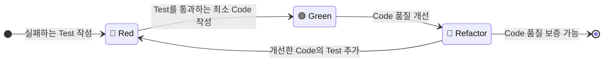
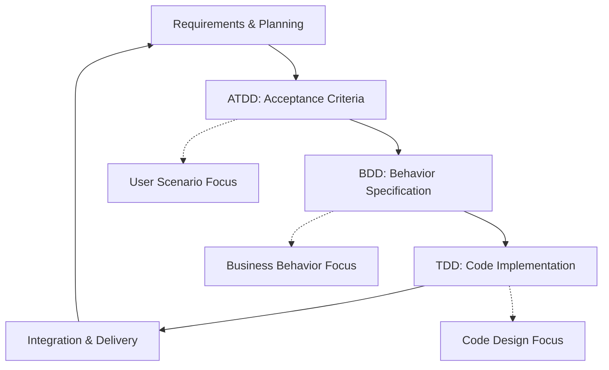

## TDD, BDD, ATDD

- **Test-First Development 방법론들은 각각 다른 관점에서 software 품질을 향상시키는 접근법**입니다.
    - TDD는 code 설계와 유지 보수성 개선에 집중합니다.
    - BDD는 business 행위와 stakeholder 협업에 집중합니다.
    - ATDD는 customer acceptance와 요구 사항 충족에 집중합니다.

- 세 방법론은 상호 보완적으로 함께 활용할 수 있습니다.

---

## TDD (Test-Driven Development)

- **test가 주도하는 개발 방법론으로 설계 관점에서 접근**합니다.
    - 자동화된 test로 개발을 이끌어나가는 방식입니다.
    - 단위 test와는 목적이 다르며, TDD의 결과물이 단위 test일 뿐입니다.

- "test를 먼저 작성하여 설계가 좋은 code를 만들 수 있지 않을까?"에서 시작된 방법론입니다.
- code 설계와 module 간 의존성 문제를 해결하는 것이 주요 목표입니다.

### Red-Green-Refactor Cycle

- TDD의 핵심은 **Red-Green-Refactor의 3단계 cycle을 반복**하는 것입니다.
    - 각 단계는 명확한 목적과 규칙을 가지고 있습니다.
    - 짧은 cycle을 빠르게 반복하여 점진적으로 code를 완성해나갑니다.
    - test가 개발을 주도하는 특징적인 개발 rhythm을 만들어냅니다.

- **각 단계는 하나의 목적에만 집중**하여, 단계별 관심사를 분리합니다.
    - Red : 요구 사항 명세와 interface design.
    - Green : 동작하는 code 구현.
    - Refactor : code 품질과 설계 개선.

- **짧고 빠른 cycle을 유지**합니다.
    - 각 cycle은 몇 분에서 최대 10분 내외로 진행합니다.
    - 빠른 feedback을 통해 문제를 조기에 발견합니다.
    - 작은 단위의 변경으로 risk를 최소화합니다.

1. 🔴 **Red 단계** : **아직 구현되지 않은 기능에 대한 test를 먼저 작성**합니다.
    - compile조차 되지 않을 수 있지만 정상적인 과정입니다.
    - test 실행 시 실패(Red)하는 것을 확인합니다.
    - 구체적인 기대값과 검증 조건을 명확히 정의합니다.
    - 이 단계에서 요구 사항과 interface design이 결정됩니다.

2. 🟢 **Green 단계** : **test를 통과시키는 것만을 목표로 최소한의 code를 작성**합니다.
    - 좋은 code나 완벽한 구현을 고민하지 않습니다.
    - quick하고 dirty한 구현도 허용됩니다.
    - hard coding이나 임시 구현도 괜찮습니다.
    - test가 통과(Green)하는 것을 확인합니다.

3. 🔵 **Refactor 단계** : **test가 통과하는 상태를 유지하면서 code 품질을 개선**합니다.
    - 중복 code를 제거하고 naming을 개선합니다.
    - code structure를 최적화하고 design pattern을 적용합니다.
    - test code도 함께 refactoring하여 유지 보수성을 확보합니다.
    - 모든 test가 여전히 통과하는지 지속적으로 확인합니다.

### TDD의 설계 개선 효과

- **unit 간의 종속성을 자연스럽게 분리**하게 됩니다.
    - unit 단위로 test하려면 unit 간의 종속성을 끊어낼 수 있도록 설계되어야 합니다.
    - 종속성의 coupling이 약한 설계가 유지 보수성이 좋습니다.
    - 단위 test 작성을 통해 자연스럽게 coupling이 약한 좋은 설계를 얻어낼 수 있습니다.
    - 순수하게 단위 test만을 위해 존재한다고 할 수 없는 이유입니다.

- **API 설계가 client 관점에서 자연스럽게 개선**됩니다.
    - test를 먼저 작성하므로 API를 사용하는 입장에서 interface를 설계하게 됩니다.
    - 복잡하고 사용하기 어려운 API는 test 작성 과정에서 자연스럽게 발견됩니다.
    - method signature와 parameter 설계가 더 직관적이고 사용하기 쉬워집니다.
    - 불필요한 dependency나 복잡한 constructor가 제거되는 효과가 있습니다.

- **단일 책임 원칙(single responsibility principle)을 자연스럽게 준수**하게 됩니다.
    - 하나의 class나 method에 여러 책임이 있으면 test 작성이 복잡해집니다.
    - test case가 많아지고 setup이 복잡해지는 것을 통해 설계 문제를 조기에 발견할 수 있습니다.
    - 각 unit이 명확한 하나의 책임만 갖도록 자연스럽게 refactoring이 이루어집니다.
    - 결과적으로 더 작고 집중된 module들로 구성된 architecture가 만들어집니다.

- **의존성 주입(dependency injection)과 제어의 역전(inversion of control) 적용**이 촉진됩니다.
    - external dependency가 있는 code는 test하기 어렵습니다.
    - mock이나 stub을 활용하기 위해 dependency를 주입받는 구조로 설계하게 됩니다.
    - hard-coded dependency 대신 추상화(abstraction)에 의존하는 설계가 자연스럽게 만들어집니다.
    - 결과적으로 유연하고 확장 가능한abstraction architecture를 얻을 수 있습니다.

### TDD의 현실적 한계

- **resource 부담으로 인한 도입 어려움**이 존재합니다.
    - test case 유지 보수에 많은 비용이 소요됩니다.
    - 일정 관리 관점에서 resource 부담이 매우 큽니다.
    - test case를 창작하고 고민하는 모든 것이 비용입니다.
    - 많은 개발자가 장점에 공감하지만 실제 개발에서는 잘 이루어지지 않습니다.

- **초기 개발 속도 저하와 learning curve**가 있습니다.
    - TDD에 익숙하지 않은 개발자는 처음에 생산성이 크게 떨어집니다.
    - test 작성에 소요되는 시간으로 인해 feature 개발이 느려질 수 있습니다.
    - 좋은 test를 작성하는 skill을 습득하는 데 상당한 시간이 필요합니다.
    - 단기적인 delivery pressure가 있는 project에서는 도입이 어려울 수 있습니다.

- **요구 사항 변경에 따른 test maintenance 부담**이 큽니다.
    - business logic이 자주 변경되면 관련된 모든 test도 함께 수정해야 합니다.
    - 특히 초기 개발 단계에서는 요구 사항이 불안정하여 test 재작성이 빈번합니다.
    - test code의 양이 production code보다 많아질 수 있어 관리 point가 증가합니다.
    - poorly designed test는 오히려 refactoring을 방해하는 요소가 될 수 있습니다.

- **legacy system이나 external dependency가 많은 환경에서 적용하는 데에 어려움**이 있습니다.
    - 기존 code base가 testable하지 않은 구조로 되어 있으면 TDD 적용이 매우 어렵습니다.
    - database, file system, network 등의 external dependency가 많으면 test 환경 구성이 복잡해집니다.
    - legacy code와의 integration point에서는 test 작성이 현실적으로 불가능할 수 있습니다.
    - 전체 system을 한 번에 TDD로 전환하기 어려워 점진적 적용이 필요합니다.

- **test의 false positive와 brittleness 문제**가 발생할 수 있습니다.
    - 과도하게 implementation detail에 의존하는 test는 code 변경 시 쉽게 깨지는 경우(brittleness)가 많습니다.
    - mock의 과도한 사용으로 인해 실제 integration에서는 문제가 발생할 수 있습니다.
    - test가 통과하지만 실제로는 bug가 있는 경우(false positive)가 생길 수 있습니다.
    - 잘못 작성된 test는 개발자에게 false confidence를 주어 오히려 위험할 수 있습니다.

- **team 전체의 약속(commitment)과 개발 문화(culture) 변화**가 필요합니다.
    - 개발자 개인의 노력만으로는 TDD의 효과를 온전히 얻기 어렵습니다.
    - code review에서 test quality도 함께 검토해야 하므로 추가적인 process가 필요합니다.
    - project manager나 stakeholder의 이해와 지원이 없으면 지속하기 어렵습니다.
    - 단기적인 성과보다 장기적인 관점에서 접근해야 하므로 조직 문화의 변화가 전제되어야 합니다.

---

## BDD (Behavior-Driven Development)

- BDD는 **TDD에서 파생된 행위 주도 개발 방법론**입니다.
    - BDD는 TDD의 test case 작성에 따른 비용 부담 문제를 해결하기 위해 등장했습니다.
        - TDD에서 개발자가 test case를 창작하고 고민하는 모든 과정이 비용이었습니다.
    - 기존에 작성된 요구 사항이나 기획서를 그대로 test case로 활용하여 비용을 절감합니다.
    - TDD의 기술적 관점에서 벗어나 business 관점과 stakeholder 협업에 집중합니다.

- BDD에서는 test case를 작성하는 대신 **system의 행위(behavior)에 대한 명세(specification)를 작성**합니다.
    - BDD는 **business stakeholder와 개발자 간의 의사소통을 개선**하는 데 중점을 둡니다.
    - TDD가 code의 동작을 검증하는 test case를 작성하는 것에 중점을 둔다면, BDD는 system이 어떻게 작동해야 하는지에 대한 명세를 작성합니다.

    - 이미 작성된 요구 사항이나 기획서가 바로 test case가 되어 비용을 줄입니다.
        - TDD의 test case 창작 비용 문제를 해결하는 접근법입니다.
    - code 작성 전에 code가 수행할 행위에 대한 명세를 먼저 작성합니다.

- BDD에서는 **비기술적 언어를 사용하여 더 많은 사람들이 이해하도록** 합니다.
    - customer와 개발자의 관점에서 system이 어떻게 작동해야 하는지에 초점을 맞춥니다.
    - 아직 존재하지 않은 code에 대해 test를 작성하기보다는 행위에 대한 명세를 작성합니다.
    - 직관적으로 쉽게 이해할 수 있는 접근법입니다.
    - stakeholder 간의 의사소통을 개선하는 효과가 있습니다.

## BDD (Behavior-Driven Development)

- **TDD에서 파생된 행위 주도 개발 방법론**입니다.
    - TDD의 test case 작성에 따른 비용 부담 문제를 해결하기 위해 등장했습니다.
    - 개발자가 test case를 창작하고 고민하는 모든 과정이 TDD에서는 순수한 비용이었습니다.
    - 기존에 작성된 요구사항이나 기획서를 그대로 test case로 활용하여 비용을 절감합니다.
    - TDD의 기술적 관점에서 벗어나 business 관점과 stakeholder 협업에 집중합니다.

- **test case 대신 system의 behavior에 대한 specification을 작성**합니다.
    - TDD가 code의 동작을 검증하는 test case 작성에 중점을 둡니다.
    - BDD는 system이 어떻게 작동해야 하는지에 대한 명세 작성에 중점을 둡니다.
    - 아직 존재하지 않은 code에 대해 test를 작성하기보다는 행위에 대한 명세를 작성합니다.
    - code 작성 전에 code가 수행할 행위에 대한 specification을 먼저 정의합니다.

- **business stakeholder와 개발자 간의 의사소통을 개선**하는 데 중점을 둡니다.
    - 비기술적 언어를 사용하여 더 많은 사람들이 이해할 수 있도록 합니다.
    - customer와 개발자의 관점에서 system이 어떻게 작동해야 하는지에 초점을 맞춥니다.
    - 직관적으로 쉽게 이해할 수 있는 접근법을 제공합니다.
    - stakeholder 간의 공통 이해를 바탕으로 한 협업을 촉진합니다.

### BDD의 주요 장점

- **요구 사항과 구현 간의 gap을 줄입니다.**
    - business language로 작성된 specification이 그대로 executable test가 됩니다.
    - 요구사항 변경 시 specification 수정만으로 test case가 자동으로 update됩니다.
    - product owner나 business analyst가 직접 test scenario를 검토하고 승인할 수 있습니다.
    - misunderstanding으로 인한 rework을 크게 줄일 수 있습니다.

- **living documentation 역할**을 수행합니다.
    - specification이 항상 최신 상태의 system behavior를 반영합니다.
    - 새로운 team member가 system의 동작을 빠르게 이해할 수 있습니다.
    - business rule과 edge case가 명확하게 문서화됩니다.
    - 별도의 문서 관리 없이도 specification이 documentation 역할을 합니다.

### Given-When-Then Pattern

- BDD에서는 주로 **Given-When-Then 패턴을 사용하여 scenario를 표현**합니다.
    - **자연어에 가까운 형태로 scenario를 작성**할 수 있어 이해하기 쉽습니다.

1. Given : 특정 상황이나 전제 조건을 설정합니다.
2. When : 사용자의 행동이나 event를 정의합니다.
3. Then : 기대되는 결과나 system의 response를 명세합니다.

### BDD의 한계와 고려 사항

- **초기 setup과 learning curve**가 존재합니다.
    - Cucumber, SpecFlow 등의 BDD framework 학습이 필요합니다.
    - step definition 작성과 maintenance에 추가적인 effort가 필요합니다.
    - business stakeholder의 적극적인 참여가 전제되어야 효과를 발휘합니다.
    - 잘못 작성된 scenario는 오히려 confusion을 증가시킬 수 있습니다.

- **execution performance와 maintenance 이슈**가 있습니다.
    - end-to-end test 위주로 구성되어 실행 시간이 상대적으로 오래 걸립니다.
    - UI나 API 변경 시 여러 scenario에 동시에 영향을 줄 수 있습니다.
    - test data management와 environment setup이 복잡해질 수 있습니다.
    - scenario 간의 dependency 관리가 어려울 수 있습니다.

---

## ATDD (Acceptance Test-Driven Development)

- **인수 test가 주도하는 개발 방법론**입니다.
    - 구현 전에 사용자, tester, 개발자가 acceptance criteria를 정의합니다.
    - 모든 project 구성원이 수행해야 할 작업과 요구 사항을 정확히 이해할 수 있도록 돕습니다.
    - user scenario 관점에서 정확한 요구 사항을 capture하는 데 중점을 둡니다.
    - customer acceptance와 satisfaction을 객관적으로 측정할 수 있습니다.

- **BDD와 ATDD에는 관점과 초점의 차이**가 있습니다.
    - BDD는 개발자 관점에서 기능의 동작에 더 중점을 둡니다.
    - ATDD는 사용자 scenario 관점에서 정확한 요구 사항 capture에 중점을 둡니다.
    - BDD는 business behavior에 집중하고, ATDD는 customer acceptance에 집중합니다.
    - 두 방법론은 유사하지만 접근하는 관점이 다릅니다.

- **backend system에서는 주로 API에 acceptance test code를 작성**합니다.
    - software acceptance test를 위해 API level에서 검증을 수행합니다.
    - RestAssured 등의 tool을 주로 사용합니다.
    - end-to-end scenario를 API 호출을 통해 검증합니다.
    - user journey 전체를 포괄하는 test case를 작성합니다.

---

## 세 방법론의 상호 보완적 관계

- **각 방법론은 서로 다른 관점에서 software quality를 보완**합니다.
    - ATDD로 user 관점의 acceptance criteria를 정의합니다.
    - BDD로 business 관점의 behavior specification을 작성합니다.
    - TDD로 technical 관점의 code implementation을 진행합니다.
    - 세 관점의 조합으로 holistic한 quality management가 가능합니다.

### 각 방법론의 역할 분담

- **개발 과정에서 서로 다른 level과 관점을 담당**합니다.
    - TDD는 code level에서 설계 품질과 unit correctness를 보장합니다.
    - BDD는 feature level에서 business behavior와 stakeholder 협업을 담당합니다.
    - ATDD는 system level에서 customer acceptance와 요구 사항 충족을 검증합니다.
    - 각각의 고유한 가치와 목적이 있어 선택이 아닌 조합이 효과적입니다.

### 통합 적용 전략

- **필요한 부분에 함께 사용될 수 있는 상호 보완적 관계**입니다.
    - 하나만 선택해서 적용할 필요가 없습니다.
    - project의 특성과 team의 상황에 따라 적절히 조합하여 사용합니다.
    - 각 방법론의 장점을 살리고 단점을 상호 보완할 수 있습니다.
    - comprehensive한 quality assurance를 위해 multi-level 접근이 필요합니다.

### 실무 적용 시 고려 사항

- **team의 maturity와 project 특성을 고려한 점진적 도입**이 중요합니다.
    - TDD는 개발팀의 technical skill과 discipline이 필요합니다.
    - BDD는 business stakeholder의 적극적 참여가 전제되어야 합니다.
    - ATDD는 cross-functional team의 collaboration culture가 필요합니다.
    - 각 방법론의 비용과 효과를 realistic하게 평가하여 적용 범위를 결정해야 합니다.

