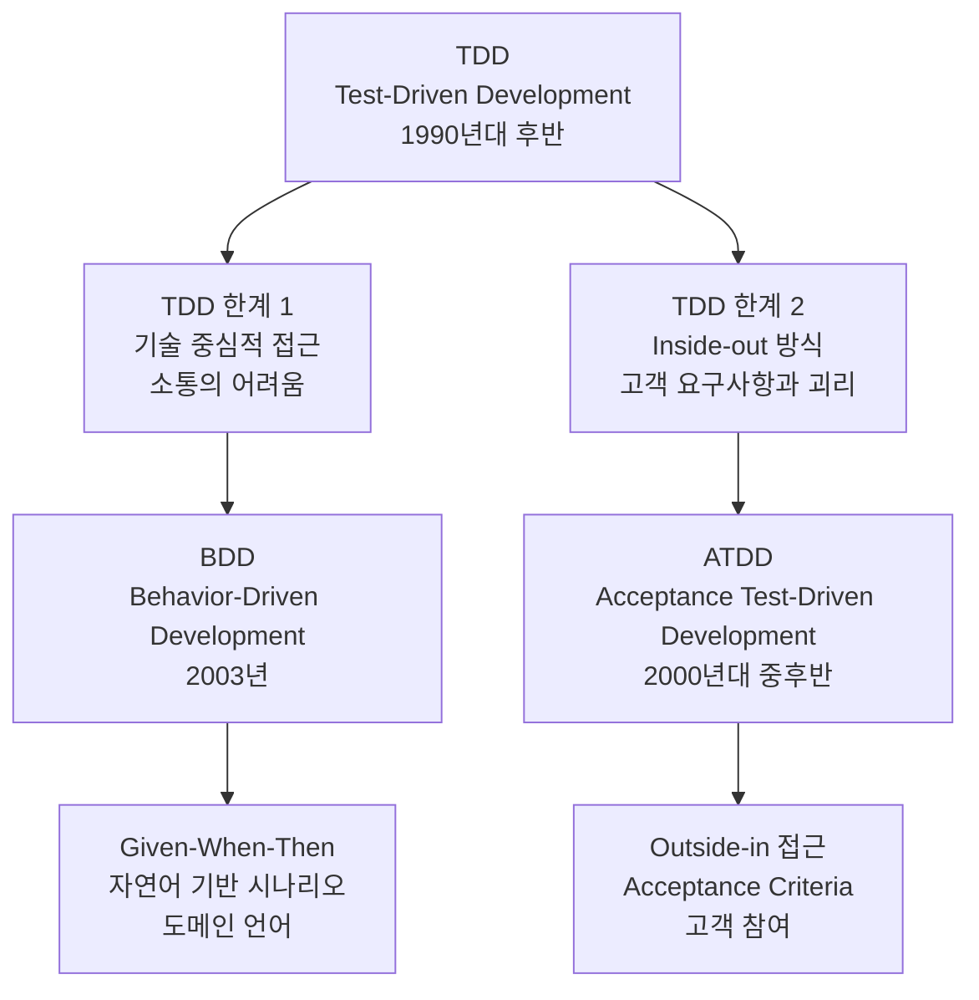

# Test-First Development

- Test-First Development는 실제 production code를 작성하기 전에 test code를 먼저 작성하는 software 개발 방법론입니다.
- 전통적인 개발 process와 달리 test가 개발의 출발점이 되어 더 안정적이고 유지보수가 용이한 software를 만들 수 있습니다.
- TDD, BDD, ATDD와 같은 구체적인 방법론들을 포괄하는 상위 개념으로, 각 방법론은 서로 다른 관점과 목적을 가지고 있습니다.

## 기본 개념

- Test-First Development는 기능 구현 전에 해당 기능의 동작을 검증하는 test를 먼저 작성하는 접근 방식입니다.
- 개발자는 원하는 기능의 예상 동작을 test code로 명시한 후, 이 test를 통과시키기 위한 production code를 작성합니다.
- test가 개발 process의 설계 도구 역할을 하여 명확한 요구사항 정의와 interface 설계를 가능하게 합니다.

### 핵심 원칙

- **Test 우선 작성** : production code 작성 전에 반드시 test code를 먼저 작성합니다.
- **점진적 개발** : 작은 단위로 기능을 나누어 test와 구현을 반복합니다.
- **지속적인 검증** : 매 단계마다 test를 통해 기능의 정확성을 확인합니다.
- **Refactoring 안전성** : test가 있기 때문에 안전하게 code 개선을 수행할 수 있습니다.

### 주요 장점

- **설계 품질 향상** : test 작성 과정에서 자연스럽게 좋은 설계를 유도합니다.
- **요구사항 명확화** : test를 통해 애매한 요구사항을 구체적으로 정의합니다.
- **개발 효율성 증대** : debugging 시간 단축과 regression 방지 효과를 얻습니다.
- **문서화 효과** : test code가 실행 가능한 specification 역할을 합니다.

## 세 가지 방법론

### TDD (Test-Driven Development)

- TDD는 Test-First Development의 가장 기본적이고 널리 알려진 구현 방법입니다.
- Red-Green-Refactor cycle을 통해 unit level에서 code의 품질을 보장합니다.
- 개발자가 작성하는 단위 test에 집중하여 내부 구조와 algorithm의 정확성을 검증합니다.
- Kent Beck이 eXtreme Programming의 일부로 체계화했으며, 현재 가장 널리 사용되는 방법론입니다.

#### 특징

- **Red 단계** : 실패하는 unit test를 작성합니다.
- **Green 단계** : test를 통과시키는 최소한의 code를 작성합니다.
- **Refactor 단계** : test 통과를 유지하면서 code 품질을 개선합니다.
- method나 class 단위의 작은 범위에서 적용됩니다.

### BDD (Behavior-Driven Development)

- BDD는 TDD의 한계를 보완하기 위해 Dan North가 2003년 제안한 방법론입니다.
- business 요구사항과 기술적 구현 사이의 gap을 줄이는 것이 주요 목적입니다.
- Given-When-Then 구조를 사용하여 사용자 관점에서 system의 behavior를 정의합니다.
- domain expert, product owner, developer 간의 협업을 강화합니다.

#### 특징

- **Given** : 초기 상황이나 전제 조건을 설정합니다.
- **When** : 특정 event나 action이 발생합니다.
- **Then** : 예상되는 결과나 outcome을 검증합니다.
- 자연어에 가까운 표현으로 비개발자도 이해할 수 있습니다.

### ATDD (Acceptance Test-Driven Development)

- ATDD는 customer나 product owner의 관점에서 acceptance criteria를 test로 먼저 정의하는 방법론입니다.
- 전체 feature나 user story level에서 시작하여 개발 방향을 설정합니다.
- Ken Pugh가 2003년 처음 소개했으며, 고객 요구사항의 정확한 이해와 구현에 중점을 둡니다.
- development team과 business stakeholder 간의 소통을 개선합니다.

#### 특징

- **Outside-In 접근** : 사용자 관점에서 시작하여 내부 구현으로 진행합니다.
- **Customer collaboration** : 고객이나 product owner와 함께 acceptance test를 정의합니다.
- **End-to-end 검증** : 전체 workflow나 user journey를 검증합니다.
- integration test와 system test level에서 적용됩니다.

## 세 가지 방법론 비교

| 측면 | TDD | BDD | ATDD |
| --- | --- | --- | --- |
| **초점** | 내부 구현, algorithm | 사용자 behavior, domain logic | 고객 요구사항, acceptance criteria |
| **범위** | Unit level | Feature level | Story/Epic level |
| **참여자** | 개발자 | 개발자, BA, QA | 개발자, Product Owner, Customer |
| **언어** | 기술적 용어 | Domain 용어 | Business 용어 |
| **Test 형태** | Unit test | Scenario test | Acceptance test |
| **시작점** | Method/Class | User story | Business requirement |
| **목적** | Code 품질 | Communication | Requirement validation |

## 발전 역사

### TDD의 등장 (1990년대 후반)

- eXtreme Programming movement의 일환으로 Kent Beck이 체계화했습니다.
- 기존 개발 방식의 문제점인 늦은 bug 발견과 불안정한 refactoring을 해결하고자 했습니다.
- unit test를 개발 과정의 핵심으로 끌어올려 code 품질 향상에 크게 기여했습니다.

#### TDD의 한계와 문제점

- **Technical focus** : 기술적 구현에만 집중하여 business value와의 연결이 약했습니다.
- **Communication gap** : 개발자 중심의 용어와 접근으로 business stakeholder와의 소통이 어려웠습니다.
- **What vs How** : '무엇을' 만들어야 하는지보다 '어떻게' 만들지에 치중하는 경향이 있었습니다.

### BDD의 등장 (2003년)

- Dan North가 TDD를 가르치면서 겪은 어려움을 해결하기 위해 2003년에 개발했습니다.
- "어떤 test를 작성해야 하는가?"라는 TDD의 근본적 질문에 대한 답을 제시했습니다.
- behavior에 집중함으로써 개발자와 business stakeholder 간의 공통 언어를 만들고자 했습니다.
- Given-When-Then 구조를 통해 scenario 기반 개발을 추구했습니다.

#### BDD가 해결하고자 한 TDD의 문제점

- **Technical focus** : 기술적 구현에만 집중하여 business value와의 연결이 약했습니다.
- **Communication gap** : 개발자 중심의 용어와 접근으로 business stakeholder와의 소통이 어려웠습니다.
- **What vs How** : '무엇을' 만들어야 하는지보다 '어떻게' 만들지에 치중하는 경향이 있었습니다.

### ATDD의 등장 (2000년대 중후반)

- Ken Pugh가 customer와 개발팀 간의 requirement 이해 차이를 해결하기 위해 제안했습니다.
- BDD와는 독립적으로 TDD의 한계를 다른 관점에서 접근했습니다.
- TDD의 inside-out 방식이 아닌 outside-in 방식으로 customer 관점에서 시작하는 접근을 강조했습니다.
- acceptance criteria를 test로 먼저 정의함으로써 개발 목표를 명확히 하고자 했습니다.

#### ATDD가 해결하고자 한 TDD의 문제점

- **Inside-out limitation** : TDD는 내부 구현부터 시작하여 실제 고객 요구사항과 괴리가 생길 수 있었습니다.
- **Acceptance gap** : unit test는 통과하지만 고객의 acceptance criteria는 충족하지 못하는 경우가 발생했습니다.
- **Customer disconnect** : 기술적인 unit test는 고객이 이해하기 어려워 요구사항 검증이 제한적이었습니다.

### 방법론 간의 관계

- BDD와 ATDD는 각각 TDD의 서로 다른 한계를 해결하기 위해 등장했습니다.
- **BDD** : developer와 business stakeholder 간의 소통 개선에 집중했습니다.
- **ATDD** : customer와 development team 간의 requirement 정렬에 집중했습니다.
- 두 방법론은 서로 경쟁하기보다는 TDD의 서로 다른 측면을 보완하는 방향으로 발전했습니다.

## 세 방법론의 상호 보완적인 사용 방법

### 계층별 적용 전략

- **ATDD** : project 시작 시 high-level requirement와 acceptance criteria를 정의합니다.
    - customer와 함께 user story level의 acceptance test를 작성합니다.
    - 전체 feature의 완료 기준을 명확히 설정합니다.
- **BDD** : feature 개발 과정에서 business logic과 user scenario를 검증합니다.
    - domain expert와 함께 Given-When-Then scenario를 작성합니다.
    - business rule과 workflow를 자연어로 표현합니다.
- **TDD** : 개별 component나 service 구현 시 unit level에서 품질을 보장합니다.
    - 내부 algorithm과 data processing logic을 검증합니다.
    - code level의 refactoring을 안전하게 수행합니다.

### 협업 workflow

- **Discovery phase** : product owner, business analyst와 함께 ATDD로 acceptance criteria를 정의합니다.
- **Analysis phase** : domain expert와 함께 BDD로 business scenario를 상세화합니다.  
- **Implementation phase** : 개발자가 TDD로 실제 code를 구현합니다.
- **Validation phase** : 모든 level의 test를 실행하여 요구사항 충족을 확인합니다.

### Test Pyramid와의 연계

- **Unit tests (TDD)** : 빠르고 많은 수의 test로 기본 building block을 검증합니다.
- **Integration tests (BDD)** : 중간 수준의 test로 component 간 상호작용을 검증합니다.
- **Acceptance tests (ATDD)** : 적은 수의 test로 end-to-end user scenario를 검증합니다.

### 도구와 기술의 통합

- **공통 기반** : 모든 방법론이 동일한 CI/CD pipeline에서 실행됩니다.
- **Test 자동화** : 각 level의 test가 자동으로 실행되어 지속적인 feedback을 제공합니다.
- **Documentation** : 각 level의 test가 서로 다른 관점의 documentation 역할을 합니다.

### 실무 적용 가이드

- **프로젝트 초기** : ATDD로 big picture를 그리고 주요 user journey를 정의합니다.
- **Sprint 계획** : BDD로 각 feature의 상세 scenario를 계획합니다.
- **일일 개발** : TDD로 실제 구현과 refactoring을 수행합니다.
- **Sprint 완료** : 모든 level의 test 통과를 통해 Done 조건을 확인합니다.

### 성공 요인

- **역할 분담** : 각 방법론의 목적과 범위를 명확히 이해하고 적절히 분배합니다.
- **점진적 도입** : 한 번에 모든 방법론을 적용하지 않고 팀의 성숙도에 따라 단계적으로 도입합니다.
- **도구 선택** : 각 방법론에 적합한 framework와 도구를 선택하여 효율성을 높입니다.
- **지속적 개선** : retrospective를 통해 각 방법론의 적용 효과를 점검하고 개선합니다.