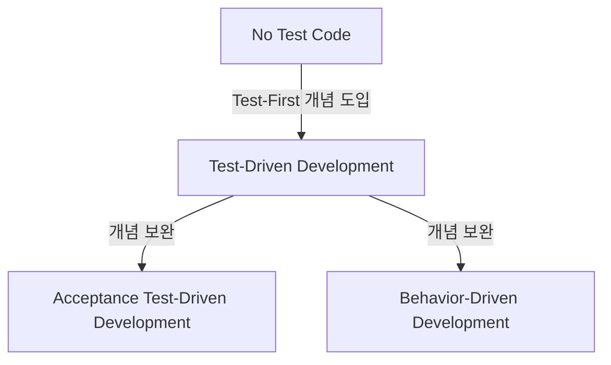
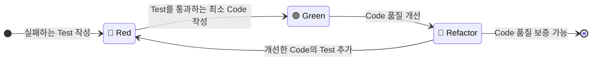

## Test-First Development

- Test-First Development는 실제 production code를 작성하기 전에 test code를 먼저 작성하는 software 개발 방법론입니다.
    - 기능 구현 전에 해당 기능의 동작을 검증하는 test를 먼저 작성하는 접근 방식입니다.
    - 개발자는 원하는 기능의 예상 동작을 test code로 명시한 후, 이 test를 통과시키기 위한 production code를 작성합니다.
    - test가 개발 process의 설계 도구 역할을 하여 명확한 요구 사항 정의와 interface 설계를 가능하게 합니다.
    
- 전통적인 개발 process와 달리 test가 개발의 출발점이 되어 더 안정적이고 유지 보수가 용이한 software를 만들 수 있습니다.
    - **Test 우선 작성** : production code 작성 전에 반드시 test code를 먼저 작성합니다.
    - **설계 품질 향상** : test 작성 과정에서 자연스럽게 좋은 설계를 유도합니다.
    - **요구 사항 명확화** : test를 통해 애매한 요구 사항을 구체적으로 정의합니다.
    - **개발 효율성 증대** : debugging 시간 단축과 regression 방지 효과를 얻습니다.
    - **문서화 효과** : test code가 실행 가능한 specification 역할을 합니다.
    - **Refactoring 안전성** : test가 있기 때문에 안전하게 code 개선을 수행할 수 있습니다.

- **TDD, BDD, ATDD와 같은 구체적인 방법론들을 포괄하는 상위 개념**으로, 각 방법론은 서로 다른 관점과 목적을 가지고 있습니다.
    - 세 가지 방법론(TDD, BDD, ATDD)은 상호 보완적으로 사용될 수 있으며, 개발 팀의 필요와 상황에 따라 적절히 선택하여 적용할 수 있습니다.


---


## 세 가지 방법론 : TDD, ATDD, BDD

- Test-First Development는 여러 가지 구체적인 방법론으로 발전했으며, 이 중 가장 대표적인 세 가지는 TDD, ATDD, BDD입니다.

|  | TDD | ATDD | BDD |
| --- | --- | --- | --- |
| **초점** | 내부 구현, algorithm | 고객 요구 사항, acceptance criteria | 사용자 behavior, domain logic |
| **범위** | Unit level | Story/Epic level | Feature level |
| **참여자** | 개발자 | 개발자, Product Owner, Customer | 개발자, BA, QA |
| **언어** | 기술적 용어 | Business 용어 | Domain 용어 |
| **Test 형태** | Unit test | Acceptance test | Scenario test |
| **시작점** | Method/Class | Business requirement | User story |
| **목적** | Code 품질 | Requirement validation | Communication |

- 각 방법론은 서로 다른 목적과 접근 방식을 가지고 있으며, 개발 과정에서 상호 보완적으로 사용될 수 있습니다.




---


## TDD (Test-Driven Development)

- TDD는 **production code 작성 전에 unit test를 먼저 작성하는 개발 방법론**입니다.
    - 구현하고자 하는 기능의 최소 단위(method, class)에 대한 test를 먼저 작성합니다.
    - 작성한 test를 통과시키기 위한 최소한의 code를 구현합니다.
    - test 통과 후 code 품질을 개선하는 refactoring을 수행합니다.
    - 이 과정을 반복하여 안정적이고 유지 보수가 용이한 code를 만듭니다.

- TDD는 Test-First Development의 가장 기본적이고 널리 알려진 구현 방법입니다.
    - Kent Beck이 eXtreme Programming의 일부로 체계화했으며, 현재 가장 널리 사용되는 방법론입니다.

- Red-Green-Refactor cycle을 통해 unit level에서 code의 품질을 보장합니다.

- 개발자가 작성하는 단위 test에 집중하여 내부 구조와 algorithm의 정확성을 검증합니다.


### Red-Green-Refactor Cycle

- **Red 단계** : 실패하는 unit test를 작성합니다.
- **Green 단계** : test를 통과시키는 최소한의 code를 작성합니다.
- **Refactor 단계** : test 통과를 유지하면서 code 품질을 개선합니다.



- method나 class 단위의 작은 범위에서 적용됩니다.


---


## ATDD (Acceptance Test-Driven Development)

- ATDD는 **acceptance criteria를 test로 먼저 작성하여 개발을 진행하는 방법론**입니다.
    - 고객(customer)이나 product owner와 함께 acceptance test를 개발 시작 전에 작성합니다.
    - outside-in 방식으로 사용자 관점에서 시작하여 내부 구현으로 진행합니다.

- **전체 feature나 user story level**에서 '완료'의 기준을 명확히 정의합니다.
    - end-to-end test로 전체 workflow나 user journey를 검증합니다.
    - integration test와 system test level에서 적용됩니다.

- **TDD의 inside-out 방식의 한계를 보완**하기 위해 등장했습니다.
    - unit test는 통과하지만 customer 요구 사항과 괴리가 생기는 문제를 해결합니다.
    - business language로 표현된 test를 통해 모든 stakeholder의 동일한 이해를 보장합니다.

- Ken Pugh가 2003년 처음 소개했으며, 고객 요구 사항의 정확한 이해와 구현에 중점을 둡니다.
    - development team과 business stakeholder 간의 소통을 개선함으로써 요구 사항의 불일치를 줄이고, 고객이 원하는 기능을 정확히 구현할 수 있도록 합니다.


### Acceptance Criteria : 인수/수락/승인 기준

- acceptance criteria는 **특정 기능이나 user story가 '완료'되었음을 검증하는 기준**입니다.
    - 고객이 요구하는 기능이 제대로 구현되었는지 확인하는 역할을 합니다.
    - 개발자가 구현한 기능이 고객의 기대에 부합하는지 검증합니다.

- ATDD에서는 **acceptance criteria**를 test로 먼저 정의합니다.

```gherkin
Feature: User Registration

    Scenario: Successful Registration
        Given a new user with username "newuser" and password "newpassword"
        When the user registers with username "newuser" and password "newpassword"
        Then the user should receive a confirmation email
        And the user should be able to log in with username "newuser" and password "newpassword"

    Scenario: Failed Registration due to existing username
        Given a registered user with username "existinguser"
        When a new user attempts to register with username "existinguser"
        Then an error message should be displayed indicating that the username is already taken
```

```gherkin
Feature: 사용자 등록

    Scenario: 성공적인 등록
        Given 사용자명 "newuser"와 비밀번호 "newpassword"으로 새 사용자가 있고
        When 사용자가 사용자명 "newuser"와 비밀번호 "newpassword"으로 등록을 시도하면
        Then 사용자는 확인 이메일을 받아야 하고
        And 사용자는 사용자명 "newuser"와 비밀번호 "newpassword"으로 로그인할 수 있어야 한다

    Scenario: 이미 존재하는 사용자명으로 등록 실패
        Given 사용자명 "existinguser"로 등록된 사용자가 있고
        When 새 사용자가 사용자명 "existinguser"로 등록을 시도하면
        Then 사용자명 이미 존재 오류 메시지가 표시되어야 한다
```


---


## BDD (Behavior-Driven Development)

- BDD는 **software의 behavior(행동)에 집중**하여 **business value를 중심으로 개발을 진행하는 방법론**입니다.
    - system이 '어떻게 동작해야 하는지'를 사용자와 business 관점에서 정의합니다.
    - 기술적 구현보다는 사용자가 경험하는 behavior와 outcome에 집중합니다.

- **business 요구 사항과 기술적 구현 사이의 gap을 줄이는 것**이 주요 목적입니다.
    - domain expert, product owner, developer 간의 협업을 강화합니다.

- BDD는 TDD의 한계를 보완하기 위해 Dan North가 2003년 제안한 방법론입니다.
    - TDD는 기술적 구현에만 집중하여 business stakeholder와의 소통이 어렵고, '무엇을' 만들지보다 '어떻게' 만들지에 치중하는 한계가 있었습니다.
    - BDD는 이러한 문제를 해결하기 위해 behavior에 집중하고, 자연어로 표현된 test를 통해 모든 stakeholder가 이해할 수 있도록 합니다.

- **Given-When-Then 구조**를 사용하여 사용자 관점에서 system의 behavior를 정의합니다.
    - 자연어에 가까운 표현으로 비개발자도 이해할 수 있습니다.


### Given-When-Then Pattern

- **Given** : 초기 상황이나 전제 조건을 설정합니다.
- **When** : 특정 event나 action이 발생합니다.
- **Then** : 예상되는 결과나 outcome을 검증합니다.

```gherkin
Feature: User Login

    Scenario: Successful Login
        Given a registered user with username "user1" and password "password123"
        When the user attempts to log in with username "user1" and password "password123"
        Then the user should be redirected to the dashboard
        And a welcome message should be displayed
    
    Scenario: Failed Login
        Given a registered user with username "user1" and password "wrongpassword"
        When the user attempts to log in with username "user1" and password "wrongpassword"
        Then an error message should be displayed
```

```gherkin
Feature: 사용자 로그인

    Scenario: 성공적인 로그인
        Given 사용자명 "user1"과 비밀번호 "password123"으로 등록된 사용자가 있고
        When 사용자가 사용자명 "user1"과 비밀번호 "password123"으로 로그인을 시도하면
        Then 사용자는 대시보드로 리디렉션되어야 하고
        And 환영 메시지가 표시되어야 한다
    
    Scenario: 실패한 로그인
        Given 사용자명 "user1"과 비밀번호 "wrongpassword"으로 등록된 사용자가 있고
        When 사용자가 사용자명 "user1"과 비밀번호 "wrongpassword"으로 로그인을 시도하면
        Then 로그인 실패 메시지가 표시되어야 한다
```


---


## Reference

- <https://agilealliance.org/glossary/tdd/>
- <https://agilealliance.org/glossary/bdd/>
- <https://agilealliance.org/glossary/atdd/>
