## Anti Pattern

- Anti Pattern은 **자주 반복되지만 비효율적이거나 해로운 software 개발 관행**입니다.
    - 겉보기에는 합리적으로 보이지만, 실제로는 더 많은 문제를 야기합니다.
    - Design Pattern이 모범 사례라면, Anti Pattern은 반면교사의 역할을 합니다.

- Anti Pattern을 인식하면 **project 실패를 예방**하고 **code 품질을 향상**시킬 수 있습니다.
    - 문제가 발생하기 전에 미리 파악하고 회피할 수 있습니다.
    - 기존 code에서 Anti Pattern을 발견하면 refactoring의 방향을 잡을 수 있습니다.


### Anti Pattern의 특징

- **반복성** : 여러 project에서 비슷한 형태로 반복해서 나타납니다.
- **유혹성** : 단기적으로는 쉽고 빠른 해결책처럼 보입니다.
- **해로움** : 장기적으로 유지 보수 비용 증가, bug 발생, 확장성 저하 등의 문제를 일으킵니다.
- **대안 존재** : 더 나은 해결 방법이 항상 존재합니다.


---


## 개발 Anti Pattern

- 개발 Anti Pattern은 **code 작성 과정에서 발생하는 나쁜 관행**입니다.


### Spaghetti Code

- **구조 없이 복잡하게 얽힌 code**입니다.
    - 기능 추가와 수정을 반복하면서 code가 점점 꼬이게 됩니다.
    - 흐름을 따라가기 어렵고, 한 부분을 수정하면 예상치 못한 곳에서 문제가 발생합니다.

```java
// Anti Pattern : 중첩된 조건문과 뒤엉킨 흐름
public void process(Order order) {
    if (order != null) {
        if (order.getStatus() == 1) {
            if (order.getItems() != null) {
                for (Item item : order.getItems()) {
                    if (item.getPrice() > 0) {
                        if (item.getStock() > 0) {
                            // 실제 logic...
                        }
                    }
                }
            }
        }
    }
}
```

#### 해결 방법

- 함수 분리, modularization, 명확한 책임 분리를 적용합니다.

```java
// 개선 : Early Return과 함수 분리
public void process(Order order) {
    if (!isValidOrder(order)) {
        return;
    }
    processItems(order.getItems());
}

private boolean isValidOrder(Order order) {
    return order != null && order.getStatus() == 1 && order.getItems() != null;
}

private void processItems(List<Item> items) {
    items.stream()
         .filter(item -> item.getPrice() > 0 && item.getStock() > 0)
         .forEach(this::processItem);
}
```


### Copy-Paste Programming

- **code를 복사하여 붙여넣기로 재사용하는 방식**입니다.
    - 동일한 logic이 여러 곳에 중복되어 존재합니다.
    - bug 수정 시 모든 복사본을 찾아서 수정해야 합니다.

```java
// Anti Pattern : 동일한 검증 logic이 여러 곳에 중복
public void createUser(String email) {
    if (email == null || !email.contains("@")) {
        throw new IllegalArgumentException("Invalid email");
    }
    // ...
}

public void updateUser(String email) {
    if (email == null || !email.contains("@")) {  // 중복
        throw new IllegalArgumentException("Invalid email");
    }
    // ...
}
```

#### 해결 방법

- 공통 logic을 함수나 class로 추출하여 재사용합니다.

```java
// 개선 : 공통 logic 추출
private void validateEmail(String email) {
    if (email == null || !email.contains("@")) {
        throw new IllegalArgumentException("Invalid email");
    }
}

public void createUser(String email) {
    validateEmail(email);
    // ...
}

public void updateUser(String email) {
    validateEmail(email);
    // ...
}
```


### Magic Number

- **의미를 알 수 없는 숫자를 code에 직접 사용하는 것**입니다.
    - `if (status == 3)`처럼 숫자만 보고는 의미를 파악할 수 없습니다.
    - 값을 변경할 때 모든 위치를 찾아야 합니다.

```java
// Anti Pattern
if (status == 3) {
    // ...
}
```

#### 해결 방법

- 상수나 enum으로 의미 있는 이름을 부여합니다.

```java
// 개선 : 상수로 의미 부여
private static final int STATUS_COMPLETED = 3;

if (status == STATUS_COMPLETED) {
    // ...
}

// 또는 enum 사용
public enum OrderStatus {
    PENDING, PROCESSING, COMPLETED
}

if (status == OrderStatus.COMPLETED) {
    // ...
}
```


### Premature Optimization

- **필요하지 않은 시점에 성능 최적화를 수행하는 것**입니다.
    - 실제 병목 지점이 아닌 곳을 최적화하여 시간을 낭비합니다.
    - code 가독성과 유지 보수성이 저하됩니다.

```java
// Anti Pattern : 불필요한 최적화로 가독성 저하
public int sum(int[] arr) {
    int sum = 0;
    int len = arr.length;  // 미미한 성능 향상
    for (int i = len; --i >= 0; ) {  // 역순 loop가 더 빠르다는 미신
        sum += arr[i];
    }
    return sum;
}
```

#### 해결 방법

- 먼저 동작하는 code를 작성하고, profiling으로 실제 병목을 파악한 후 최적화합니다.

```java
// 개선 : 명확하고 읽기 쉬운 code
public int sum(int[] arr) {
    int sum = 0;
    for (int n : arr) {
        sum += n;
    }
    return sum;
}
```


### Dead Code

- **실행되지 않는 code가 남아있는 상태**입니다.
    - 주석 처리된 code, 도달할 수 없는 분기, 사용되지 않는 함수 등이 해당합니다.
    - code를 읽는 사람에게 혼란을 주고, 유지 보수 비용을 증가시킵니다.

```java
public class UserService {

    // 나중에 쓸 수도 있으니까 남겨둠
    // public void oldMethod() {
    //     // ...
    // }

    public void process(boolean flag) {
        if (flag) {
            return;
        }
        if (flag) {  // 절대 실행되지 않는 code
            doSomething();
        }
    }

    private void unusedMethod() {  // 아무 곳에서도 호출하지 않음
        // ...
    }
}
```

#### 해결 방법

- 사용하지 않는 code는 version control에 맡기고 삭제합니다.

```java
// 개선 : 불필요한 code 제거
public class UserService {

    public void process(boolean flag) {
        if (flag) {
            return;
        }
        // 도달 불가능한 code 삭제
    }

    // 미사용 method 삭제 (필요하면 git history에서 복원)
}
```


---


## 설계 Anti Pattern

- 설계 Anti Pattern은 **software 구조와 architecture 수준에서 발생하는 나쁜 관행**입니다.


### God Object

- **너무 많은 책임을 가진 거대한 class**입니다.
    - 하나의 class가 수천 줄의 code와 수십 개의 method를 가집니다.
    - 모든 것이 이 class에 의존하여 수정이 어렵고 test가 힘듭니다.

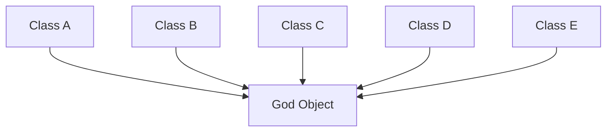

#### 해결 방법

- Single Responsibility Principle을 적용하여 책임을 분리합니다.

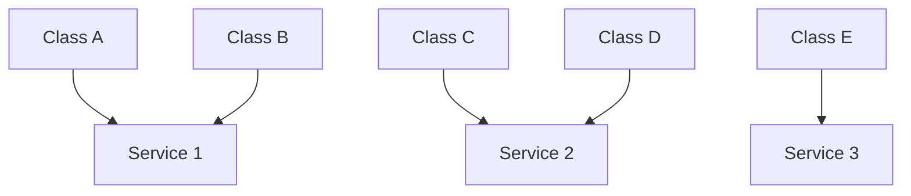


### Golden Hammer

- **익숙한 기술이나 pattern을 모든 문제에 적용하려는 경향**입니다.
    - "망치를 들면 모든 것이 못으로 보인다"는 속담과 같습니다.
    - 문제에 적합하지 않은 solution을 억지로 적용하게 됩니다.

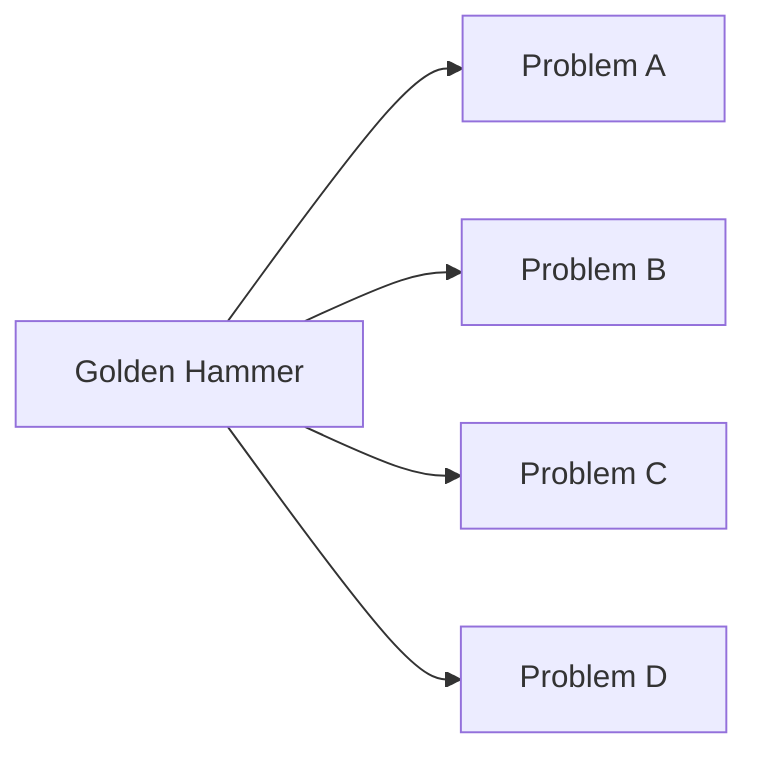

#### 해결 방법

- 문제의 특성을 먼저 분석하고, 적합한 도구와 기술을 선택합니다.

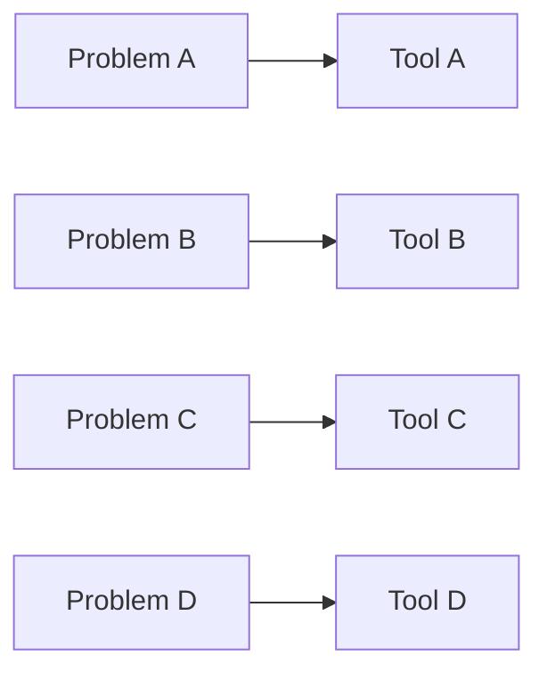


### Yo-yo Problem

- **과도한 상속 계층으로 인해 code를 이해하기 어려운 상태**입니다.
    - method 호출을 따라가려면 여러 class를 위아래로 오가야 합니다.
    - 상속 구조가 깊어질수록 이해와 수정이 어려워집니다.

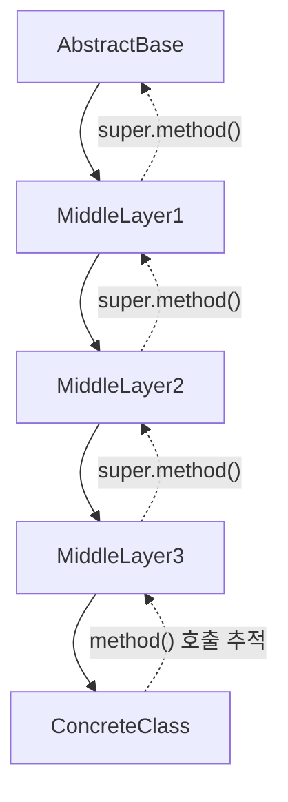

#### 해결 방법

- 상속보다 composition을 선호하고, 상속 계층을 얕게 유지합니다.

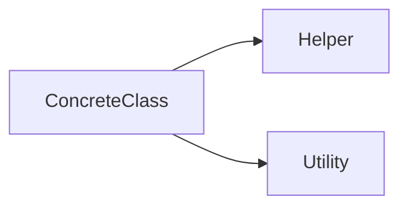


### Circular Dependency

- **module이나 class가 서로를 참조하는 순환 의존 관계**입니다.
    - A가 B를 참조하고, B가 다시 A를 참조합니다.
    - build 순서 문제, test 어려움, 변경 영향 범위 확대 등의 문제가 발생합니다.

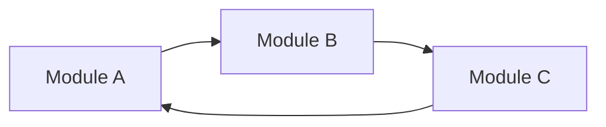

#### 해결 방법

- 의존성 방향을 단방향으로 정리하고, interface를 도입하여 의존성을 역전시킵니다.

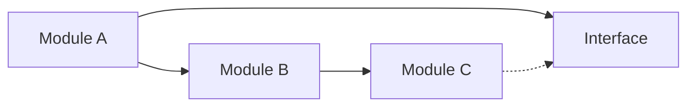


### Lava Flow

- **아무도 건드리지 않는 오래된 code가 남아있는 상태**입니다.
    - 왜 있는지, 삭제해도 되는지 아무도 모릅니다.
    - 용암처럼 굳어져서 제거하기 어렵습니다.

```java
public class LegacyProcessor {

    // TODO: 이거 뭐하는 코드지? - 2019.03.15
    public void mysteryMethod() {
        // 원래 개발자 퇴사함
        // 삭제하면 뭔가 안 될 것 같아서 남겨둠
    }

    // 아무도 이 flag가 뭔지 모름
    private boolean legacyFlag = true;

    public void process() {
        if (legacyFlag) {
            oldWay();  // 왜 필요한지 아무도 모름
        }
        newWay();
    }
}
```

#### 해결 방법

- code review, 문서화, test를 통해 code의 목적을 명확히 하고, 불필요한 code는 제거합니다.

```java
// 개선 : 목적이 명확하고 문서화된 code
public class Processor {

    /**
     * 주문을 처리합니다.
     * @see OrderService#complete
     */
    public void process() {
        validateOrder();
        executeOrder();
    }
}
```


---


## 관리 Anti Pattern

- 관리 Anti Pattern은 **project 진행과 team 운영 과정에서 발생하는 나쁜 관행**입니다.


### Analysis Paralysis

- **완벽한 분석을 추구하다가 실제 개발이 진행되지 않는 상태**입니다.
    - 모든 요구 사항을 미리 파악하려고 분석 단계에서 과도한 시간을 소비합니다.
    - 결정을 내리지 못하고 계속 분석만 반복합니다.

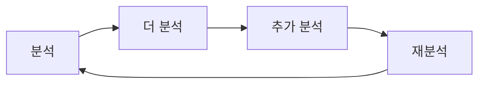

#### 해결 방법

- 적절한 수준에서 분석을 마무리하고, 반복적인 개발을 통해 점진적으로 개선합니다.

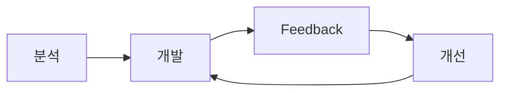


### Cargo Cult Programming

- **원리를 이해하지 않고 다른 곳에서 가져온 code나 방법론을 그대로 따라하는 것**입니다.
    - 성공한 project의 방식을 맥락 없이 복사합니다.
    - 왜 그렇게 하는지 모르면서 "원래 이렇게 한다"고 주장합니다.

```java
// Anti Pattern : 이유를 모르고 복사한 code
public void process() {
    Thread.sleep(100);  // StackOverflow에서 이렇게 하래서

    synchronized (this) {  // 다른 project에서 이렇게 했음
        // 사실 동기화가 필요 없는 logic
    }

    System.gc();  // 누가 성능 좋아진다고 해서
}
```

#### 해결 방법

- code와 방법론의 원리를 이해하고, 현재 상황에 맞게 적용합니다.

```java
// 개선 : 필요한 code만 이해하고 작성
public void process() {
    // Thread.sleep : 불필요하므로 제거
    // synchronized : 단일 thread 환경이므로 제거
    // System.gc : JVM이 알아서 관리하므로 제거

    doActualWork();
}
```


### Mushroom Management

- **개발자에게 정보를 제공하지 않고 일만 시키는 관리 방식**입니다.
    - "버섯처럼 어둠 속에 두고 비료만 주면 된다"는 비유입니다.
    - 개발자가 전체 맥락을 모르면 잘못된 결정을 내리기 쉽습니다.

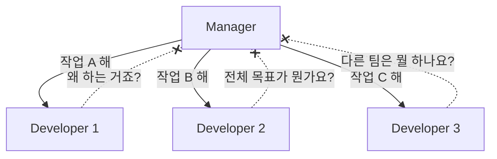

#### 해결 방법

- project 목표와 맥락을 공유하고, 투명한 communication을 유지합니다.

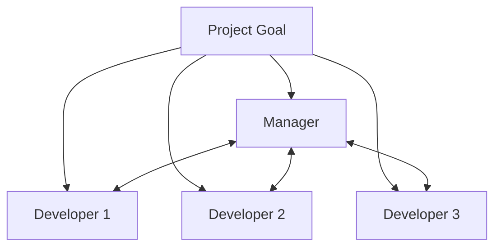


---


## Anti Pattern 예방 방법

- Anti Pattern은 인식하는 것만으로도 절반은 예방할 수 있습니다.

| 방법 | 설명 |
| --- | --- |
| **Code Review** | 동료의 눈으로 Anti Pattern을 조기에 발견 |
| **Refactoring** | 지속적인 개선으로 code 품질 유지 |
| **Test 작성** | test가 있으면 refactoring이 안전해짐 |
| **원칙 학습** | SOLID, DRY, KISS 등 설계 원칙 숙지 |
| **문서화** | code의 목적과 의도를 명확히 기록 |


## Reference

- <https://en.wikipedia.org/wiki/Anti-pattern>
- <https://sourcemaking.com/antipatterns>

