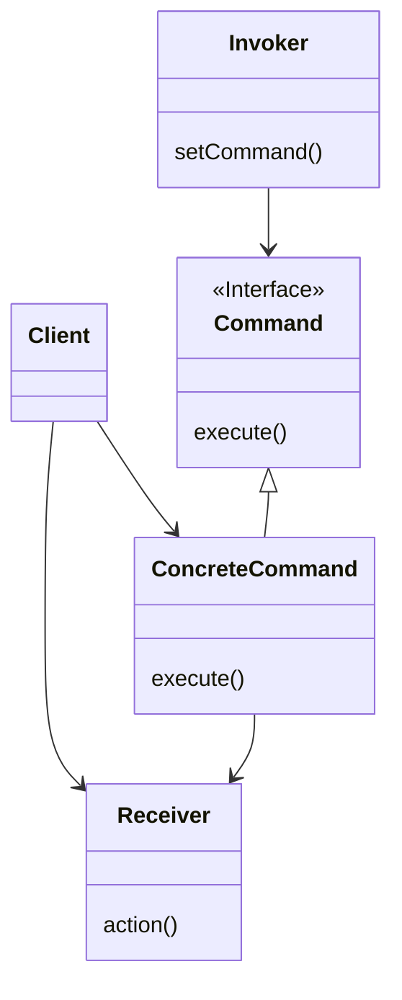
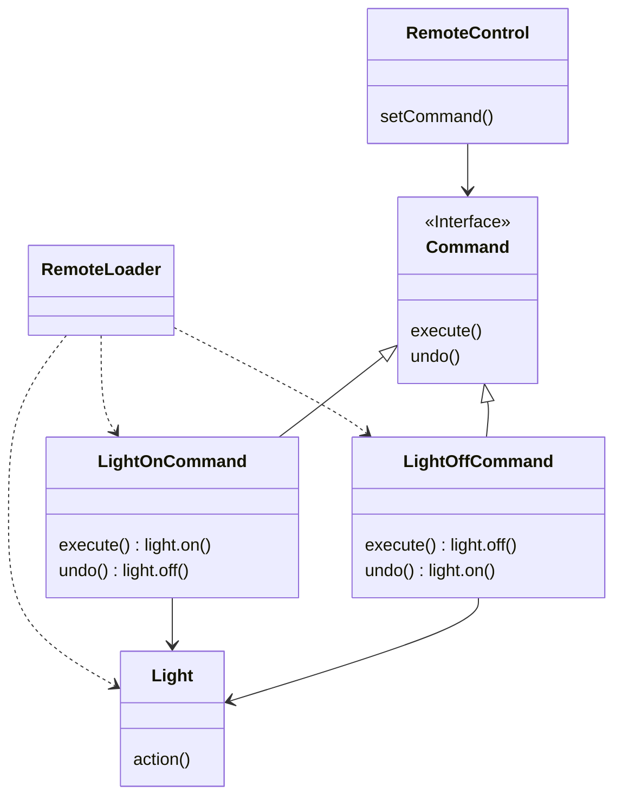
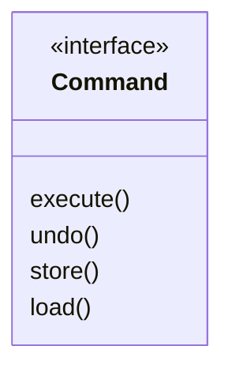

## Command Pattern : 요청을 객체로 만들어 유연하게 처리하기

- Command Pattern은 **요청(request)을 객체로 캡슐화**합니다.
    - method 호출을 객체로 감싸서 저장, 전달, 실행할 수 있습니다.
    - 요청을 보내는 객체(invoker)와 요청을 수행하는 객체(receiver)를 분리합니다.

- 요청을 객체로 만들면 **다양한 기능을 구현**할 수 있습니다.
    - 요청을 queue에 저장하여 순차적으로 실행할 수 있습니다.
    - 요청을 logging하여 나중에 재실행할 수 있습니다.
    - 실행한 요청을 취소(undo)하거나 다시 실행(redo)할 수 있습니다.


### Command Pattern의 장점

- **요청 발신자와 수신자를 분리합니다.**
    - invoker는 command interface만 알면 되고, 실제 수행 방법은 몰라도 됩니다.
    - receiver 변경이 invoker에 영향을 주지 않습니다.

- **요청을 일급 객체(first-class object)로 다룹니다.**
    - 요청을 parameter로 전달하거나 collection에 저장할 수 있습니다.
    - runtime에 동적으로 command를 교체할 수 있습니다.

- **undo/redo 기능 구현이 가능합니다.**
    - command 객체에 이전 상태를 저장하면 작업을 취소할 수 있습니다.
    - 실행된 command를 stack에 저장하여 여러 단계 undo를 지원할 수 있습니다.

- **macro command를 구현할 수 있습니다.**
    - 여러 command를 하나로 묶어서 한 번에 실행할 수 있습니다.


### Command Pattern의 단점

- **class 수가 증가합니다.**
    - 각 요청마다 별도의 command class가 필요합니다.
    - 단순한 요청에 적용하면 과도한 설계가 됩니다.

- **command와 receiver 간 결합이 필요합니다.**
    - command가 receiver의 method를 알아야 합니다.


---


## Command Pattern의 구성 요소

- Command Pattern은 **`Invoker`, `Command`, `Receiver`**로 구성됩니다.
    - `Invoker`는 command를 실행하는 역할을 합니다.
    - `Command`는 실행할 작업을 캡슐화합니다.
    - `Receiver`는 실제 작업을 수행합니다.

| 구성 요소 | 역할 |
| --- | --- |
| `Client` | `ConcreteCommand`를 생성하고 `Receiver`를 설정 |
| `Invoker` | 명령을 실행하고자 하는 객체, command 객체를 받아 실행 method 호출 |
| `Command` | 실행될 작업을 캡슐화하는 interface, receiver에 특정 작업 처리 지시 |
| `ConcreteCommand` | `Command` interface 구현, `execute()` 내에서 `receiver.action()` 실행 |
| `Receiver` | 요구 사항을 수행하기 위해 어떤 일을 처리해야 하는지 아는 객체 |


### Class Diagram

- Command Pattern의 구조는 **`Invoker`, `Command` interface, `ConcreteCommand`, `Receiver`**로 구성됩니다.




### 기본 구현 Code

- `Client`, `Invoker`, `Command`, `ConcreteCommand`, `Receiver`의 기본 구현입니다.

```java
public class Client {
    public static void main(String[] args) {
        Receiver receiver = new Receiver();

        Command command = new ConcreteCommand(receiver);
        Invoker invoker = new Invoker(command);
        invoker.invoke();

        // 다른 concreteCommand 객체를 set하여 동적으로 명령을 바꿔 수행할 수 있습니다.
        // Command otherCommand = new ConcreteCommand(receiver);
        // invoker.setCommand(otherCommand);
        // invoker.invoke();
    }
}
```

```java
public class Invoker {
    private Command command;

    public Invoker(Command command) {
        setCommand(command);
    }

    public void setCommand(Command command) {
        this.command = command;
    }

    public void invoke() {
        command.execute();
    }
}
```

```java
public interface Command {
    public abstract void execute();
}
```

```java
public class ConcreteCommand implements Command {
    private Receiver receiver;

    public ConcreteCommand(Receiver receiver) {
        this.receiver = receiver;
    }

    public void execute() {
        receiver.action();
    }
}
```

```java
public class Receiver {
    public void action() {
        System.out.println("Action");
    }
}
```


---


## 동작 순서

- Command Pattern은 **command 설정 단계와 command 실행 단계**로 동작합니다.


### 1. Client에서 Invoker에 Command 설정하기

1. client는 command 객체를 생성합니다.
    - command 객체는 receiver에 전달할 일련의 행동으로 구성됩니다.
    - `execute()`는 행동을 캡슐화하며, receiver에 있는 특정 행동을 처리하기 위한 method를 호출합니다.

```java
public void execute {
    reveiber.action1();
    reveiber.action2();
}
```

2. client는 invoker 객체에 command를 설정합니다.
    - invoker 객체의 `setCommand()`를 호출하면서 command 객체를 넘겨줍니다.
    - command 객체는 나중에 쓰이기 전까지 invoker 객체에 보관됩니다.


### 2. Client에서 Invoker에 설정된 Command 사용하기

1. client가 invoker에게 설정한 명령 실행을 요청합니다.
    - client에서 `Invoker.requestSomething();` 호출합니다.

2. invoker가 command에게 실행을 요청합니다.
    - invoker에서 `Command.execute();` 호출합니다.

3. command 객체가 `execute()` 실행합니다.
    - `execute()` method는 receiver의 method를 사용하여 행동을 처리합니다.
    - command에서 `Receiver.action1();`, `Receiver.action2();` 호출합니다.

4. receiver의 method 실행으로 명령이 최종 처리됩니다.


---


## Example : Remote Controller

- programming이 가능한 **remote controller**을 구현합니다.
    - 각 slot에 원하는 제품을 연결할 수 있습니다.
    - 각 slot에는 on/off button이 있으며, 이 button을 가지고 조작할 수 있습니다.
    - undo button을 눌러 마지막으로 누른 button에 대한 명령을 취소할 수 있습니다.

```plaintext
[remote controller]
    {slot1}
        (on button)
        (off button)
    {slot2}
        (on button)
        (off button)
    {slot3}
        (on button)
        (off button)
    ...

    {undo button}
```


### Class Diagram

- `RemoteLoader`(client)가 receiver와 command를 생성하고, `RemoteControl`(invoker)에 command를 설정합니다.
    - `Command` interface를 `LightOnCommand`, `LightOffCommand` 등의 `ConcreteCommand`가 구현합니다.
    - `Light`, `TV`, `Stereo` 등의 receiver가 실제 작업을 수행합니다.




### Client

- `RemoteLoader`는 receiver와 command를 생성하고, invoker에 command를 설정합니다.

```java
public class RemoteLoader {

    public static void main(String[] args) {
        RemoteControl remoteControl = new RemoteControl();

        Light livingRoomLight = new Light("Living Room");
        Light kitchenLight = new Light("Kitchen");
        Stereo stereo = new Stereo("Living Room");

        LightOnCommand livingRoomLightOn = new LightOnCommand(livingRoomLight);
        LightOffCommand livingRoomLightOff = new LightOffCommand(livingRoomLight);
        LightOnCommand kitchenLightOn = new LightOnCommand(kitchenLight);
        LightOffCommand kitchenLightOff = new LightOffCommand(kitchenLight);
        StereoOnWithCDCommand stereoOnWithCD = new StereoOnWithCDCommand(stereo);
        StereoOffCommand  stereoOff = new StereoOffCommand(stereo);

        remoteControl.setCommand(0, livingRoomLightOn, livingRoomLightOff);
        remoteControl.setCommand(1, kitchenLightOn, kitchenLightOff);
        remoteControl.setCommand(2, stereoOnWithCD, stereoOff);

        System.out.println(remoteControl);

        remoteControl.onButtonWasPushed(0);
        remoteControl.offButtonWasPushed(0);
        remoteControl.onButtonWasPushed(1);
        remoteControl.offButtonWasPushed(1);
        remoteControl.onButtonWasPushed(2);
        remoteControl.offButtonWasPushed(2);
    }
}
```


### Invoker

- `RemoteControl`은 command를 저장하고 button이 눌리면 해당 command를 실행합니다.

```java
public class RemoteControl {
    Command[] onCommands;
    Command[] offCommands;
    Command undoCommand;

    public RemoteControl() {
        onCommands = new Command[7];
        offCommands = new Command[7];

        Command noCommand = new NoCommand();
        for (int i = 0; i < 7; i++) {
            onCommands[i] = noCommand;
            offCommands[i] = noCommand;
        }
        undoCommand = noCommand;
    }

    public void setCommand(int slot, Command onCommand, Command offCommand) {
        onCommands[slot] = onCommand;
        offCommands[slot] = offCommand;
    }

    public void onButtonWasPushed(int slot) {
        onCommands[slot].execute();
        undoCommand = onCommands[slot];
    }

    public void offButtonWasPushed(int slot) {
        offCommands[slot].execute();
        undoCommand = offCommands[slot];
    }

    public void undoButtonWasPushed() {
        undoCommand.undo();
    }

    public String toString() {
        StringBuffer stringBuff = new StringBuffer();
        stringBuff.append("\n------ Remote Control -------\n");
        for (int i = 0; i < onCommands.length; i++) {
            stringBuff.append(
                "[slot " + i + "] "
                + onCommands[i].getClass().getName()
                + "    "
                + offCommands[i].getClass().getName()
                + "\n");
        }
        stringBuff.append(
            "[undo] "
            + undoCommand.getClass().getName()
            + "\n");
        return stringBuff.toString();
    }
}
```


### Command

- `Command` interface는 `execute()`와 `undo()` method를 정의합니다.

```java
public interface Command {
    public void execute();
    public void undo();
}
```


### ConcreteCommand

- 각 receiver에 대한 on/off command를 구현합니다.

```java
public class NoCommand implements Command {
    public void execute() { }
    public void undo() { }
}
```

```java
public class MacroCommand implements Command {
    Command[] commands;

    public MacroCommand(Command[] commands) {
        this.commands = commands;
    }

    public void execute() {
        for (int i = 0; i < commands.length; i++) {
            commands[i].execute();
        }
    }

    // NOTE : these commands have to be done backwards to ensure proper undo functionality
    public void undo() {
        for (int i = commands.length -1; i >= 0; i--) {
            commands[i].undo();
        }
    }
}
```

```java
public class LightOnCommand implements Command {
    Light light;

    public LightOnCommand(Light light) {
        this.light = light;
    }

    public void execute() {
        light.on();
    }

    public void undo() {
        light.off();
    }
}
```

```java
public class LightOffCommand implements Command {
    Light light;

    public LightOffCommand(Light light) {
        this.light = light;
    }

    public void execute() {
        light.off();
    }

    public void undo() {
        light.on();
    }
}
```

```java
public class LivingroomLightOnCommand implements Command {
    Light light;

    public LivingroomLightOnCommand(Light light) {
        this.light = light;
    }
    public void execute() {
        light.on();
    }
    public void undo() {
        light.off();
    }
}
```

```java
public class LivingroomLightOffCommand implements Command {
    Light light;

    public LivingroomLightOffCommand(Light light) {
        this.light = light;
    }
    public void execute() {
        light.off();
    }
    public void undo() {
        light.on();
    }
}
```

```java
public class TVOnCommand implements Command {
    TV tv;

    public TVOnCommand(TV tv) {
        this.tv= tv;
    }

    public void execute() {
        tv.on();
        tv.setInputChannel();
    }

    public void undo() {
        tv.off();
    }
}
```

```java
public class TVOffCommand implements Command {
    TV tv;

    public TVOffCommand(TV tv) {
        this.tv= tv;
    }

    public void execute() {
        tv.off();
    }

    public void undo() {
        tv.on();
    }
}
```

```java
public class StereoOnCommand implements Command {
    Stereo stereo;

    public StereoOnCommand(Stereo stereo) {
        this.stereo = stereo;
    }

    public void execute() {
        stereo.on();
    }

    public void undo() {
        stereo.off();
    }
}
```

```java
public class StereoOffCommand implements Command {
    Stereo stereo;

    public StereoOffCommand(Stereo stereo) {
        this.stereo = stereo;
    }

    public void execute() {
        stereo.off();
    }

    public void undo() {
        stereo.on();
    }
}
```

```java
public class StereoOnWithCDCommand implements Command {
    Stereo stereo;

    public StereoOnWithCDCommand(Stereo stereo) {
        this.stereo = stereo;
    }

    public void execute() {
        stereo.on();
        stereo.setCD();
        stereo.setVolume(11);
    }

    public void undo() {
        stereo.off();
    }
}
```

```java
public class HottubOnCommand implements Command {
    Hottub hottub;

    public HottubOnCommand(Hottub hottub) {
        this.hottub = hottub;
    }
    public void execute() {
        hottub.on();
        hottub.setTemperature(104);
        hottub.circulate();
    }
    public void undo() {
        hottub.off();
    }
}
```

```java
public class HottubOffCommand implements Command {
    Hottub hottub;

    public HottubOffCommand(Hottub hottub) {
        this.hottub = hottub;
    }

    public void execute() {
        hottub.setTemperature(98);
        hottub.off();
    }
    public void undo() {
        hottub.on();
    }
}
```

```java
public class CeilingFanHighCommand implements Command {
    CeilingFan ceilingFan;
    int prevSpeed;

    public CeilingFanHighCommand(CeilingFan ceilingFan) {
        this.ceilingFan = ceilingFan;
    }
    public void execute() {
        prevSpeed = ceilingFan.getSpeed();
        ceilingFan.high();
    }
    public void undo() {
        switch (prevSpeed) {
            case CeilingFan.HIGH: ceilingFan.high(); break;
            case CeilingFan.MEDIUM: ceilingFan.medium(); break;
            case CeilingFan.LOW: ceilingFan.low(); break;
            default: ceilingFan.off(); break;
        }
    }
}
```

```java
public class CeilingFanMediumCommand implements Command {
    CeilingFan ceilingFan;
    int prevSpeed;

    public CeilingFanMediumCommand(CeilingFan ceilingFan) {
        this.ceilingFan = ceilingFan;
    }
    public void execute() {
        prevSpeed = ceilingFan.getSpeed();
        ceilingFan.medium();
    }
    public void undo() {
        switch (prevSpeed) {
            case CeilingFan.HIGH: ceilingFan.high(); break;
            case CeilingFan.MEDIUM: ceilingFan.medium(); break;
            case CeilingFan.LOW: ceilingFan.low(); break;
            default: ceilingFan.off(); break;
        }
    }
}
```

```java
public class CeilingFanLowCommand implements Command {
    CeilingFan ceilingFan;
    int prevSpeed;

    public CeilingFanLowCommand(CeilingFan ceilingFan) {
        this.ceilingFan = ceilingFan;
    }
    public void execute() {
        prevSpeed = ceilingFan.getSpeed();
        ceilingFan.low();
    }
    public void undo() {
        switch (prevSpeed) {
            case CeilingFan.HIGH: ceilingFan.high(); break;
            case CeilingFan.MEDIUM: ceilingFan.medium(); break;
            case CeilingFan.LOW: ceilingFan.low(); break;
            default: ceilingFan.off(); break;
        }
    }
}
```

```java
public class CeilingFanOffCommand implements Command {
    CeilingFan ceilingFan;
    int prevSpeed;

    public CeilingFanOffCommand(CeilingFan ceilingFan) {
        this.ceilingFan = ceilingFan;
    }
    public void execute() {
        prevSpeed = ceilingFan.getSpeed();
        ceilingFan.off();
    }
    public void undo() {
        switch (prevSpeed) {
            case CeilingFan.HIGH: ceilingFan.high(); break;
            case CeilingFan.MEDIUM: ceilingFan.medium(); break;
            case CeilingFan.LOW: ceilingFan.low(); break;
            default: ceilingFan.off(); break;
        }
    }
}
```


### Receiver

- receiver는 실제 작업을 수행하는 객체로, `Light`, `TV`, `Stereo`, `Hottub`, `CeilingFan` 등이 있습니다.

```java
public class Light {
    String location;
    int level;

    public Light(String location) {
        this.location = location;
    }

    public void on() {
        level = 100;
        System.out.println("Light is on");
    }

    public void off() {
        level = 0;
        System.out.println("Light is off");
    }

    public void dim(int level) {
        this.level = level;
        if (level == 0) {
            off();
        }
        else {
            System.out.println("Light is dimmed to " + level + "%");
        }
    }

    public int getLevel() {
        return level;
    }
}
```

```java
public class TV {
    String location;
    int channel;

    public TV(String location) {
        this.location = location;
    }

    public void on() {
        System.out.println(location + " TV is on");
    }

    public void off() {
        System.out.println(location + " TV is off");
    }

    public void setInputChannel() {
        this.channel = 3;
        System.out.println(location + " TV channel is set for DVD");
    }
}
```

```java
public class Stereo {
    String location;

    public Stereo(String location) {
        this.location = location;
    }

    public void on() {
        System.out.println(location + " stereo is on");
    }

    public void off() {
        System.out.println(location + " stereo is off");
    }

    public void setCD() {
        System.out.println(location + " stereo is set for CD input");
    }

    public void setDVD() {
        System.out.println(location + " stereo is set for DVD input");
    }

    public void setRadio() {
        System.out.println(location + " stereo is set for Radio");
    }

    public void setVolume(int volume) {
        // code to set the volume
        // valid range: 1-11 (after all 11 is better than 10, right?)
        System.out.println(location + " Stereo volume set to " + volume);
    }
}
```

```java
public class Hottub {
    boolean on;
    int temperature;

    public Hottub() {
    }

    public void on() {
        on = true;
    }

    public void off() {
        on = false;
    }

    public void circulate() {
        if (on) {
            System.out.println("Hottub is bubbling!");
        }
    }

    public void jetsOn() {
        if (on) {
            System.out.println("Hottub jets are on");
        }
    }

    public void jetsOff() {
        if (on) {
            System.out.println("Hottub jets are off");
        }
    }

    public void setTemperature(int temperature) {
        if (temperature > this.temperature) {
            System.out.println("Hottub is heating to a steaming " + temperature + " degrees");
        }
        else {
            System.out.println("Hottub is cooling to " + temperature + " degrees");
        }
        this.temperature = temperature;
    }
}
```

```java
public class CeilingFan {
    public static final int HIGH = 3;
    public static final int MEDIUM = 2;
    public static final int LOW = 1;
    public static final int OFF = 0;
    String location;
    int speed;

    public CeilingFan(String location) {
        this.location = location;
    }

    public void high() {
        // turns the ceiling fan on to high
        speed = HIGH;
        System.out.println(location + " ceiling fan is on high");
    }

    public void medium() {
        // turns the ceiling fan on to medium
        speed = MEDIUM;
        System.out.println(location + " ceiling fan is on medium");
    }

    public void low() {
        // turns the ceiling fan on to low
        speed = LOW;
        System.out.println(location + " ceiling fan is on low");
    }

    public void off() {
        // turns the ceiling fan off
        speed = OFF;
        System.out.println(location + " ceiling fan is off");
    }

    public int getSpeed() {
        return speed;
    }
}
```


---


## Macro Command : 여러 Command 한 번에 실행

- **`MacroCommand`**는 여러 command를 하나로 묶어서 실행합니다.
    - button 하나로 여러 기기를 동시에 제어할 수 있습니다.
    - `MacroCommand`에서도 작업 취소 기능을 지원할 수 있습니다.

```java
public class RemoteLoader {

    public static void main(String[] args) {

        RemoteControl remoteControl = new RemoteControl();

        Light light = new Light("Living Room");
        TV tv = new TV("Living Room");
        Stereo stereo = new Stereo("Living Room");
        Hottub hottub = new Hottub();

        LightOnCommand lightOn = new LightOnCommand(light);
        StereoOnCommand stereoOn = new StereoOnCommand(stereo);
        TVOnCommand tvOn = new TVOnCommand(tv);
        HottubOnCommand hottubOn = new HottubOnCommand(hottub);
        LightOffCommand lightOff = new LightOffCommand(light);
        StereoOffCommand stereoOff = new StereoOffCommand(stereo);
        TVOffCommand tvOff = new TVOffCommand(tv);
        HottubOffCommand hottubOff = new HottubOffCommand(hottub);

        Command[] partyOn = {lightOn, stereoOn, tvOn, hottubOn};
        Command[] partyOff = {lightOff, stereoOff, tvOff, hottubOff};

        MacroCommand partyOnMacro = new MacroCommand(partyOn);
        MacroCommand partyOffMacro = new MacroCommand(partyOff);

        remoteControl.setCommand(0, partyOnMacro, partyOffMacro);

        System.out.println(remoteControl);
        System.out.println("--- Pushing Macro On---");
        remoteControl.onButtonWasPushed(0);
        System.out.println("--- Pushing Macro Off---");
        remoteControl.offButtonWasPushed(0);
    }
}
```


---


## Command Pattern 활용

- Command Pattern은 **queue, log, transaction** 등 다양한 기능 구현에 활용됩니다.


### 요청을 Queue에 저장하기

- command를 이용하면 client application에서 command 객체를 생성하고 나서 한참 후에도 computation을 호출할 수 있습니다.
    - computation의 한 부분(receiver와 일련의 행동)을 package로 묶어서 일급 객체 형태로 전달하는 것이 가능합니다.
    - 다른 thread에서 호출하는 것도 가능합니다.
    - scheduler, thread pool, 작업 queue 등에서 사용됩니다.


### 요청을 Log에 기록하기 (복구 기능)

- Command Pattern에 `store()`와 `load()`라는 method를 추가하여 복구 기능을 구현할 수 있습니다.



- data가 변경될 때마다 매번 저장할 수 없는 방대한 자료 구조를 다루는 application의 복구 방식입니다.
    - 명령을 실행하면서 checkpoint 이후의 실행 history를 disk에 기록합니다.
    - 마지막 checkpoint 이후로 한 모든 작업을 저장합니다.
    - system down 되었을 경우, checkpoint에 최근 수행한 작업을 다시 적용하면 복구할 수 있습니다.
    - spread sheet 등에서 사용됩니다.
    - 이 기술을 사용하여 transaction의 commit/rollback을 구현할 수 있습니다.


---


## Reference

- Head First Design Patterns - Eric Freeman, Elisabeth Robson, Bert Bates, Kathy Sierra

